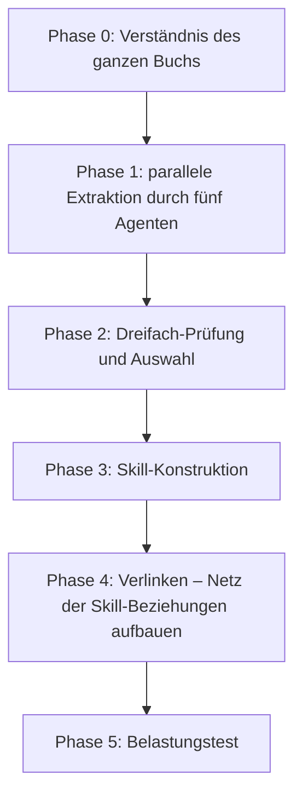

# Ein Buch schnell lesen und seine Methoden sofort beherrschen

> Szenario: Ein Buch zu kaufen ist leicht, durchzulesen auch – schwierig wird es, wenn man vor einem realen Problem steht, sich erinnert, dass das Buch etwas dazu sagte, aber in den Notizen nicht findet, wo man anfangen soll. Bleiben von einem Buch nur eine Zusammenfassung und ein paar Zitate, versinkt es schnell in den Notizen.

Der «Cangjie-Skill» will die Frameworks und Beurteilungsmethoden eines Buchs zu **immer wieder aufrufbaren Schritten** destillieren, sodass Doubao Work sie beim Auftauchen passender Fragen hervorholt.

## Was der Cangjie-Skill destilliert

Eine gewöhnliche Zusammenfassung will **kürzer** sein; der Cangjie-Skill will, dass es **später noch nutzbar** ist. Er versteht zunächst das ganze Buch und extrahiert dann aus fünf Richtungen Kandidaten: Frameworks, Prinzipien, Fallbeispiele, Gegenbeispiele und Begriffe. Jeder Kandidat muss drei Prüfungen bestehen:

1. Gibt es im Buch **mindestens zwei unabhängige Stellen**, die ihn stützen?
2. Hilft er, neue Fragen zu beantworten, die das Buch **nicht direkt behandelt**?
3. Liefert er eine eigene Methode, die **über Alltagswissen hinausgeht**?

Was die Prüfung besteht, wird als atomarer Skill geschrieben: wann er aufzurufen ist, welche Eingaben er braucht, wie er abläuft, wann er nicht passt – dazu Testfragen, die prüfen, ob er in falschen Kontexten blind auslöst. Eine vollständige Destillation hinterlässt üblicherweise: Buchüberblick, Skill-Index, Glossar, einen ausführlichen Kernartikel, mehrere atomare Skills, Testfragen und -ergebnisse – auch die verworfenen Kandidaten samt Gründen bleiben erhalten, für den Rückblick.



## Installation und Destillation

Am einfachsten: Doubao Work sagen, es soll «diesen Skill selbst installieren», oder ihn im Skill-Markt suchen und hinzufügen.

Vor der Destillation für das Buch ein **eigenes Projekt oder einen eigenen Arbeitsordner** anlegen, Rohmaterial und Erzeugnisse zusammen ablegen; beim ersten Mal nur ein Buch behandeln. Methodendichte Bücher mit vielen Fällen und Handlungsbezug eignen sich zur Destillation; Romane, Essays und Zitatensammlungen eher für eine Lese-Landkarte. Für E-Books bevorzugt Markdown oder TXT vorbereiten; ein normales PDF kann direkt übergeben werden (bei Scans zuerst prüfen, ob die OCR zuverlässig ist):

```text
Bitte nutze den Cangjie-Skill, um dieses Buch zu destillieren: Ordne die Methodik
des Buchs in eine Gruppe von Skills, die in realen Aufgaben aufgerufen werden können.
```

Im Test wurde «Wang Chuan Baodian» zu 7 atomaren Skills destilliert. Die Auslese erinnert auch daran: **Destillationsqualität misst sich nicht an der Zahl der Skills** – dass etwas im Buch steht, heißt nicht, dass jeder Abschnitt ein Werkzeug verdient.

## Das destillierte Wissen anwenden

Nach der Installation müssen Sie nicht zuerst alle Skill-Namen auswendig lernen. Geben Sie Doubao Work einfach das reale Problem, das Hintergrundmaterial und das Wunschergebnis – und verlangen Sie, dass es vorab angibt, welche Methoden es aufrufen wird:

```text
Antworte mit den Wang-Chuan-Baodian-Skills aus dem aktuellen Raum:
Ich habe im Moment nicht viel Geld, bin aber sehr zuversichtlich in die Entwicklung
von KI und verkörperte Intelligenz. Soll ich investieren? Wenn ja: wie, und mit
welcher Strategie?
```

Im Test lieferte es auf Basis des destillierten Wissens eine dreistufige Strategie: **In sich selbst investieren** (tägliche feste Lernzeit für KI-Fähigkeiten, wöchentlich ein wiederverwendbares Asset mit KI erstellen, das eigene Denken öffentlich schreiben); **kleine Finanz-Allokation nur mit Geld, das entbehrlich ist** (eine Grenze festlegen, «deren Totalverlust das Leben nicht berührt», breite ETFs statt Einzelaktien, kein Hebel, nicht auf kurzfristige Gewinne/Verluste ausrichten); **strategische Geduld** (jetzt keine schweren Wetten, aber langfristig dabei bleiben; erst wenn sich begründen lässt, womit ein Asset «seine Monopolstellung» trägt, die Position erhöhen).

## Wie der Wissensspeicher ergänzt

Der Wissensspeicher ist stark darin, **Originale zu bewahren und relevante Passagen wiederzufinden**; der Skill ist stark darin, beim Auftauchen passender Probleme **eine Methode auszuführen**. Für das Prüfen von Originalzitaten, Daten und Kontext zurück zum Buch oder in den Wissensspeicher; für Analyse, Urteil und Handlung den Skill aufrufen. Beide im selben Projekt zu halten erlaubt Quellen und Methoden gegenseitig zu prüfen.

So vollständig die Destillation auch ist: **Die endgültige Entscheidung bleibt beim Menschen** – bei Investitionen, Medizin und Recht sowieso. Ein Skill kann Prüfpunkte und Gegenbeispiele ergänzen, aber keine professionelle Beratung, keine Faktenprüfung und keine menschliche Verantwortung ersetzen.

## Wissensdestillation vs. RAG

| Dimension | RAG | Wissensdestillation (Skill) |
| --- | --- | --- |
| Wesen | Retrieval – die relevantesten Originalpassagen finden | Destillieren – aus dem Original ausführbare Methodik ziehen |
| Voraussetzung | Nutzer muss wissen, was zu fragen ist | Nutzer beschreibt das Problem, der Skill erkennt und aktiviert sich selbst |
| Qualitätskontrolle | keine – alles kann eingeladen werden | Dreifachprüfung filtert, Qualität vor Menge |
| Aufruf | wartet passiv auf Anfragen | erkennt Szenario aktiv und löst aus |
| Wissensform | speichert Originaltext (Wissen behalten) | gereinigt zu Ausführungsschritten (Wissen anwenden) |
| Grenzkontrolle | keine | Köder-Tests verhindern blindes Auslösen |
| Ressourcenaufwand | höher (Vektor-Index pflegen) | geringer (Skill-Datei genügt) |

RAG löst das Problem der «Wissensverwaltung» – Sie können nachschlagen, was im Buch steht; Wissensdestillation löst das Problem der «Wissensanwendung» – der Agent zieht im richtigen Moment den richtigen Rahmen hervor. **Wenn Sie nicht wissen, was Sie fragen sollen, hilft RAG nicht weiter; der Skill verlangt nicht, dass Sie sich an die Methoden des Buchs erinnern.**

Das stimmt mit Andrej Karpathys LLM-Wiki-Gedanke überein (Quellenmaterial als Verzeichnis indexieren → LLM kompiliert ein Wiki → Q&A über das Wiki → Ergebnisse zurückführen und verstärken) auf der ersten Hälfte des Wegs: erst tief lesen, strukturieren, indizieren. Der Unterschied liegt in den letzten Schritten: Das Produkt des LLM-Wiki sind **Wiki-Einträge**, die der Nutzer aktiv abfragt; das Produkt der Destillation ist eine **ausführbare Skill-Sammlung**, die der Agent nach Szenario-Erkennung aktiv aktiviert. Die Ansätze schließen sich nicht aus – nur die Ziele sind verschieden.

---

Ähnliches Szenario: [Sich selbst präsentieren: mit einer eleganten persönlichen Website →](/de/doubaowork/case-personal-site)
