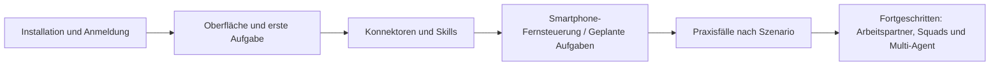

# Doubao Work Tutorial

**Doubao Work** (doubao.com/work) ist ein von ByteDance entwickelter KI-Assistent für echte Arbeitsaufgaben. Sie beschreiben Ihr Ziel in einem einzigen Satz auf natürliche Sprache – Doubao Work liest die von Ihnen freigegebenen Unterlagen, zerlegt die Aufgabe in Schritte, ruft Skills und Konnektoren auf und liefert Arbeitsergebnisse, die sich weiterbearbeiten lassen: Word, Excel, PPT, Research-Berichte und mehr – statt nur „Fragen zu beantworten". Es ist tief in Feishu integriert: Dokumente, Tabellen, Meeting-Protokolle, Gruppenchats und Bitable-Daten können direkt gelesen und auch zurückgeschrieben werden.

Dieser Bereich ist in fünf Gruppen gegliedert: „Erste Schritte → Erweiterung → Praxisfälle → Fortgeschritten → Nachschlagen". Der Praxisteil umfasst 35 Fallbeispiele aus sechs Szenarien: Büroalltag, persönliche Produktivität, Social-Media, Wissensmanagement, E-Commerce und Finanzen.

## Lernpfad

### Erste Schritte: Doubao Work zum Laufen bringen

| Kapitel | Was Sie daraus mitnehmen |
| --- | --- |
| [Was ist Doubao Work](/de/doubaowork/01-what-is) | Was es kann und wie es sich von Chat-KI unterscheidet |
| [Herunterladen, Installieren und Anmelden](/de/doubaowork/02-install) | Client installieren und die richtige Anmeldeart wählen |
| [Hauptoberfläche, Aufgaben und Projekte](/de/doubaowork/03-interface) | Die drei Bereiche der Oberfläche, Aufgabe oder Projekt? |
| [Erste Aufgabe: in fünf Minuten durchlaufen](/de/doubaowork/04-first-task) | Aufgabe anlegen → Material hinzufügen → Rechte steuern → Abnahme |
| [Konnektoren: zuerst eine kleine, abnehmbare Aufgabe](/de/doubaowork/05-connectors) | MCP verstehen und externe Tools sicher anbinden |
| [Skills: welchen wählen, wie einsetzen](/de/doubaowork/06-skills) | Prinzip der progressiven Offenlegung + vier Zwecke + Praxis |

### Erweiterung: Fähigkeiten anbinden

| Kapitel | Was Sie daraus mitnehmen |
| --- | --- |
| [Per Smartphone den PC fernsteuern: auch unterwegs erreichbar](/de/doubaowork/07-mobile-remote) | Fortschritt am Handy verfolgen, Anweisungen nachreichen |
| [API-Dienste oder Konnektoren – was wählen?](/de/doubaowork/08-api-vs-connector) | Eine Tabelle trennt zwei entgegengesetzte Funktionen |
| [Geplante Aufgaben richtig anlegen für stabile Ergebnisse](/de/doubaowork/09-automation) | Disziplin + komplette Praxis einer Nachrichten-Briefings |

### Praxisfälle: 35 Fallbeispiele aus sechs Szenarien

**Alltag und Büro** – aus einem Material drei Deliverables in einem Durchgang, tiefe Feishu-Integration, Desktop-Aufräumhilfe, Alltagsbesorgungen:

| Kapitel | Was Sie daraus mitnehmen |
| --- | --- |
| [Aus einem Material Word, Excel und PPT erstellen](/de/doubaowork/case-office) | Ein Prompt erzeugt das Trio mit konsistenten Zahlen |
| [Am besten passt Doubao Work zu Feishu](/de/doubaowork/case-feishu) | Nur Links übergeben, Feishu lesen und zurückschreiben |
| [Desktop aufräumen: erst den Plan sehen, dann Dateien anfassen](/de/doubaowork/case-desktop) | Nur-Lese-Scan → Plan bestätigen → dann ausführen |
| [Alltagsbesorgungen zuerst eine Version von Doubao Work machen lassen](/de/doubaowork/case-life) | Arztbericht verstehen, Angebote vergleichen, Reise planen |

**Persönliche Produktivität** – Posteingang, Meetings, Dokumente, Tabellen, Recherche, Tagesberichte, Lesen, persönliche Marke:

| Kapitel | Was Sie daraus mitnehmen |
| --- | --- |
| [Voller Posteingang: zuerst das finden, was heute dringend ist](/de/doubaowork/case-inbox) | E-Mail-Konnektor + fünf Arten von Tagesberichten |
| [Ein Meeting: von der Vorbereitung bis zu den To-dos](/de/doubaowork/case-meeting) | Transkript zu Protokoll + Aufgabenverfolgung über Wochen |
| [Ein Word-Dokument: von Korrektur und Feinschliff bis zur fertigen Formatierung](/de/doubaowork/case-word) | Verschönern, Versionsvergleich, Datenschutz-Schwärzung |
| [Excel nach Belieben – im Handumdrehen zum Datenanalyse-Profi](/de/doubaowork/case-excel) | Formatieren → Bereinigen → Zusammenführen → Formeln → Pivot → Dashboard |
| [Von der Ad-hoc-Recherche zum offiziellen Bericht](/de/doubaowork/case-research) | Tiefenrecherche als PPT + Faktenprüfung + Skill zum Aufpolieren |
| [Tagesbericht automatisch zusammenfassen und an Arbeitserinnerungen erinnern](/de/doubaowork/case-daily-report) | Gruppenchat-Nachrichten zu Bericht und Erinnerungen gebündelt |
| [Ein Buch schnell lesen und die Fähigkeiten daraus sofort beherrschen](/de/doubaowork/case-reading) | Cangjie-Skill destilliert das Buch in anwendbare Methoden |
| [Sich selbst mit einer eleganten persönlichen Website präsentieren](/de/doubaowork/case-personal-site) | Praxis mit design-led-website-builder |

**Social-Media** – von der Themenfindung zum fertigen Text, Multi-Plattform-Vertrieb, Audio/Video, Retrospektiven:

| Kapitel | Was Sie daraus mitnehmen |
| --- | --- |
| [Worum geht heute: von Trends und Wettbewerbern zur Wochenplanung](/de/doubaowork/case-topic-selection) | Trend-Frühbericht + Viral-Analysen + Kapazitätsplanung |
| [Vom Trend zum fertigen WeChat-Artikel](/de/doubaowork/case-wechat-article) | Faktenpaket → Text → Titel-Risikotabelle → Titelbild |
| [Inhalt einmal erstellen, pro Plattform die passende Version](/de/doubaowork/case-multi-platform) | Xiaohongshu/Wochenaufteilung/vier Plattformen/Check vor Veröffentlichung |
| [Vom Langtext zu sprachfertigem Skript und Storyboard](/de/doubaowork/case-script-storyboard) | Sprechskript + sekundengenaues Storyboard |
| [Lange Audio- und Videodateien transkribieren, Untertitel und Highlights](/de/doubaowork/case-av-transcription) | Zeitcodiertes Transkript + SRT + Clip-Kandidaten |
| [Aus den Kommentaren das nächste Thema finden und auswerten](/de/doubaowork/case-comments) | Kommentar-Insights + zwei Prozesse für die Nachbereitung |
| [GEO-Checkup für die persönliche Marke](/de/doubaowork/case-geo-checkup) | Der „Sichtbarkeits-Check" im KI-Zeitalter |
| [Viraler WeChat-Artikel wird Kurzvideo](/de/doubaowork/case-viral-to-video) | Drehbuch-Partner + kompletter Remotion-Schnitt-Workflow |

**Wissensmanagement** – Lesezeichen, Dateien, Projekte, Unternehmenswissen:

| Kapitel | Was Sie daraus mitnehmen |
| --- | --- |
| [Vom beiläufigen Speichern zum wirklich wieder Auffindbaren](/de/doubaowork/case-bookmarks) | Lesezeichen aufräumen + Ideen in Notizen verwandeln |
| [Duplikate und Versionskonflikte: erst die Unterschiede sehen, dann entscheiden](/de/doubaowork/case-duplicate-files) | Datei-Fingerabdrücke + vier Behandlungsarten + wiederherstellbares Archiv |
| [Projekt abgeschlossen: Dateien, Entscheidungen und Deliverables dauerhaft sichern](/de/doubaowork/case-project-archive) | Wissensbasis + Code zusammen betrachtete Projektplanung |
| [Erfahrung von Kollegen nicht brachliegen lassen: Wissensbasis wird zum Skill](/de/doubaowork/case-wiki-to-skill) | Feishu-Wissensbasis zu einem SOP-Skill destilliert |
| [Unternehmensrichtlinien mit einem Satz nachschlagen – inklusive Quellenangabe](/de/doubaowork/case-policy-search) | Richtliniensuche mit Version, Originaltext und zuständiger Abteilung |
| [541 Prompt-Beispiele neu kategorisiert](/de/doubaowork/case-prompt-library) | Vom Suchverhalten der Nutzer auf ein Klassifikationssystem rückgeschlossen |
| [Welches Wissen ist veraltet? Automatisch den Owner zur Bestätigung fragen](/de/doubaowork/case-knowledge-expiry) | Alte Erfahrung + neue Prüfung + Konflikte nicht still ersetzen |

**E-Commerce und Finanzen** – visuelle Produktion und kompletter Research-Workflow:

| Kapitel | Was Sie daraus mitnehmen |
| --- | --- |
| [Vom einzelnen Produktfoto zum ganzen Hauptbilderset](/de/doubaowork/case-product-images) | Referenzbild-Mechanismus übertragen + Fakten sperren |
| [Nach Börsenschluss: Marktveränderungen in eine Research-Liste verwandeln](/de/doubaowork/case-market-review) | Tagesrückblick + Watchlist-Bericht + geplante Zustellung |
| [Nach dem Quartalsbericht: erst das Wachstum, dann die Wachstumsqualität](/de/doubaowork/case-earnings-quality) | Zweistufiger Ergebnis-Workflow + Einheiten-Audit |
| [Ein Unternehmen zum ersten Mal analysieren](/de/doubaowork/case-first-company) | Geschäftsmodell-Zerlegung + acht Nachfrage-Vorlagen |
| [Von Screening bis Bewertung: einheitliche Kennzahlen, dann Preise vergleichen](/de/doubaowork/case-screening-valuation) | Zeilenweise belegtes Screening + konsistenter Vergleich + umgekehrte Bewertung |
| [Das Unternehmen ansehen – auch Aktionäre, Management und Governance](/de/doubaowork/case-governance) | Governance-Ereignislinie statt Personen-Schubladen |
| [Worum streitet der Markt? Bullen-und-Bären-Dissens und Research-Audit](/de/doubaowork/case-bull-bear-audit) | Gemeinsame Fakten + Dissens-Matrix + Quellen-Rating der Studien |
| [Mit einem Candlestick-Chart zur Investment-Review-Runde](/de/doubaowork/case-kline-review) | Chartlesen mit VLM + Vier-Berater-Privatrunde |

### Fortgeschritten: vom Bedienen zum Delegieren

| Kapitel | Was Sie daraus mitnehmen |
| --- | --- |
| [Arbeitspartner oder Arbeits-Squad?](/de/doubaowork/adv-buddy-or-squad) | Zwei echte Fälle für die Auswahl + komplette Prompts |
| [Multi-Agent (Arbeits-Squad) in der Praxis](/de/doubaowork/adv-multi-agent) | Squad-Mechanismus, verlorene Aufgaben wiederfinden, wann sich das Aufteilen lohnt |

### Nachschlagen

| Kapitel | Was Sie daraus mitnehmen |
| --- | --- |
| [Häufig genutzte Prompt-Vorlagen](/de/doubaowork/ref-templates) | Dateisortierung, Excel, PPT, Protokolle, Recherche, Briefings – sofort einsetzbar |
| [Szenarien-Schnellreferenz](/de/doubaowork/ref-scenarios) | Nach Zielgruppe und Bedarf schnell zum passenden Tutorial |

## Für wen ist das?

- **Berufseinsteiger**: möchten KI für Office-Aufgaben, Dateisortierung, Meeting-Protokolle, Tages- und Wochenberichte nutzen
- **Intensive Feishu-Nutzer**: möchten, dass KI Feishu-Dokumente, Tabellen, Wissensbasen und Gruppenchats direkt liest und schreibt – ohne Daten herumzukopieren
- **Content-Creator / Self-Media**: möchten eine KI-Produktionslinie von der Themenfindung über Text, Vertrieb bis zur Retrospektive
- **Research- und Datenrollen**: möchten nachvollziehbare, nachrechenbare, kennzahl-konsistente Workflows für Screening, Quartalszahlen und Bewertung

## Vollständige Inhalte gefällig?

Dieser Bereich ist eine kuratierte Bearbeitung des Open-Source-Projekts [AlephAITech/DoubaoWorkGuide](https://github.com/AlephAITech/DoubaoWorkGuide) („Doubao-Work-Handbuch", 49 Anleitungen und Fälle, 31 echte Aufgaben). Die Vollversion enthält weitere Screenshots und Videodemos – am besten online lesen unter [doubaowork.homes](https://doubaowork.homes/). Das Handbuch ist ein von der Community gepflegter, inoffizieller Praxisleitfaden; maßgeblich für Produktfunktionen und Oberfläche ist immer die aktuelle Version von Doubao Work.
