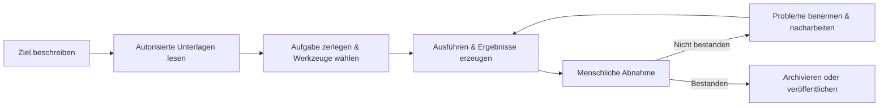

# Kapitel 1: WorkBuddy kennenlernen

**WorkBuddy** ist die neueste KI-Agenten-Arbeitsplattform von Tencent für alle Büro-Szenarien.

Sie richtet sich an unterschiedliche Berufsrollen – Personalwesen, Verwaltung, Betrieb, Vertrieb, Entwicklung und mehr – und ist eine KI-Büroanwendung, die wie ein echter Kollege denkt, Aufgaben ausführt und Ergebnisse liefert.

## Von „Fragen beantworten" zu „Ergebnisse liefern"

Anders als herkömmliche KI-Assistenten begleitet WorkBuddy die Nutzer nicht nur beim Plaudern, Beantworten von Fragen oder Geben von Ratschlägen.

Sie beschreiben Ihr Anliegen einfach in einem natürlichsprachlichen Satz – WorkBuddy versteht das Ziel der Aufgabe, plant eigenständig die Ausführungsschritte auf dem lokalen Rechner und erledigt komplexe multimodale Aufgaben.

Nach Freigabe durch den Nutzer kann WorkBuddy lokale Dateien lesen und verarbeiten und automatisch Aufgaben wie Batch-Dateiverarbeitung, Dokumenterstellung, Tabellenanalyse, PPT-Erstellung, multimodale Content-Erstellung, Branchenrecherche oder den Aufbau einer lokalen Wissensdatenbank erledigen.

Für noch komplexere Aufgaben zerlegt es die Schritte selbstständig und setzt mehrere Agenten parallel ein – das reduziert den Aufwand, zwischen verschiedenen Werkzeugen, Dateien und Aufgaben ständig hin- und herzuwechseln.

Sie können WorkBuddy zum Beispiel einfach sagen: Analysiere die Vertriebsdaten in diesem Ordner und erstelle daraus eine Berichts-Präsentation.

WorkBuddy liest selbstständig die relevanten Dateien, versteht die Inhalte, führt Analyse und Zusammenfassung durch und erzeugt ein finales Arbeitsergebnis, das Sie ansehen und bearbeiten können.

Während des gesamten Prozesses müssen Sie weder jede Datei manuell hochladen noch der KI Schritt für Schritt erklären, was als Nächstes zu tun ist.

WorkBuddy ist auf vollständige Arbeitsaufgaben ausgerichtet.

Seine Kernfähigkeiten lassen sich in drei Punkten zusammenfassen: **Es versteht klare Ansagen, kann eigenständig denken und planen – und es kann den Rechner tatsächlich bedienen, um Ergebnisse zu liefern.**

Für unterschiedliche Aufgabentypen bietet WorkBuddy außerdem Modellwechsel (Hunyuan/DeepSeek/GLM/Kimi/MiniMax u. a.), MCP-Server, Skills-Pakete und weitere Fähigkeiten.

Sie können je nach Aufgabe das passende Modell wählen und WorkBuddys Werkzeuge und Fachkompetenzen über MCP und Skills erweitern.

Zugleich stellt WorkBuddy für Szenarien wie lokale Dateioperationen oder Terminal-Ausführungen Mechanismen wie die Abfrage riskanter Befehle und Zugriffskontrolle bereit, um die Risiken der autonomen Ausführung durch die KI zu senken.

