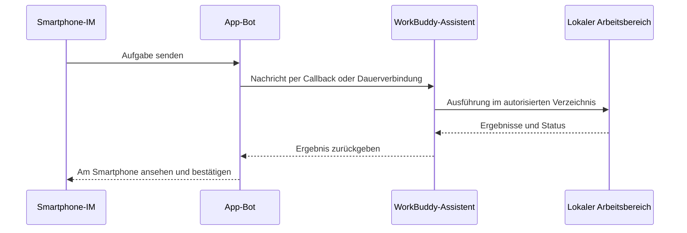

# Kapitel 8: WorkBuddy mit Mini-Programm und IM-Assistenten verbinden

Den Client zu installieren ist nur der erste Schritt. Dieses Kapitel verwandelt WorkBuddy von „nur am Schreibtisch nutzbar" zu „jederzeit vom Smartphone aus Aufgaben vergeben": Das Mini-Programm erlaubt entferntes Ansehen und Steuern, der IM-Assistent lässt Sie Aufgaben direkt in WeChat, Feishu und DingTalk stellen.

## Die zwei Modi des Mini-Programms

| Modus | Wo die Aufgabe läuft | Abhängig vom Online-PC | Geeignete Aufgaben |
| --- | --- | --- | --- |
| Lokaler Modus | Verbundener Rechner | Ja | Lokale Dateien, lokale Skills, bestehende Arbeitsbereiche |
| Cloud-Modus | Isolierte Cloud-Umgebung | Nein | Recherche, Schreiben, spontane Analysen, parallele Aufgaben |

**Erste Verwendung**: Öffnen Sie das WorkBuddy-Mini-Programm über den offiziellen Zugang und melden Sie sich an. Prüfen Sie, ob Sie sich im lokalen oder Cloud-Modus befinden; stellen Sie im lokalen Modus sicher, dass der Zielrechner online und korrekt verbunden ist.

## Der Arbeitsablauf des IM-Assistenten

## WeChat-Assistenten anbinden: einfach per QR-Code koppeln

1. Öffnen Sie WorkBuddy, klicken Sie in der linken Spalte „Assistent" auf das Zahnrad, um die „Assistenteneinstellungen" zu öffnen;

2. Suchen Sie „WeChat-Assistent-Integration" und klicken Sie auf „Konfigurieren";

3. Warten Sie, bis der Bindungs-QR-Code erzeugt wird, und scannen Sie ihn mit WeChat am Smartphone;

4. Sobald die Karte „Gebunden" anzeigt, senden Sie zuerst einen schreibgeschützten Testbefehl;

5. Zum Wechseln des WeChat-Kontos zuerst das aktuelle Konto entbinden und dann erneut den QR-Code scannen.

> Der QR-Code ist zeitlich begrenzt. Wenn es bei „Bindung läuft" bleibt, der Code abläuft oder das Scannen fehlschlägt, schließen Sie das Konfigurationsfenster und öffnen es erneut; starten Sie bei Bedarf WorkBuddy neu und lassen Sie einen neuen QR-Code erzeugen.

## Feishu anbinden

1. WorkBuddy → Einstellungen → Assistenteneinstellungen → Feishu auswählen;

2. Auf der Feishu Open Platform eine unternehmensinterne Eigenbau-App anlegen;

3. Der App Bot-Fähigkeiten hinzufügen;

4. Gemäß den Angaben der aktuellen WorkBuddy-Seite minimal benötigte Berechtigungen freischalten;

5. Unter „Zugangsdaten und Grundinformationen" App ID und App Secret abrufen;

6. Die Zugangsdaten in WorkBuddy eintragen und Callback-Informationen erzeugen bzw. kopieren;

7. In Feishu Event-Abos und Callbacks konfigurieren und Ereignisse wie Nachrichtenempfang oder Karteninteraktion hinzufügen;

8. Eine Version erstellen und die App veröffentlichen; danach dem Bot in Feishu eine schreibgeschützte Testaufgabe senden.

## DingTalk anbinden

1. Melden Sie sich mit dem Admin-Konto des Unternehmens am DingTalk-Entwicklerbackend an, gehen Sie zu „App-Entwicklung" und legen Sie eine App an;

2. Fügen Sie der App Bot-Fähigkeiten hinzu, tragen Sie Bot-Name, Beschreibung und Avatar ein und bestätigen Sie die Veröffentlichung;

3. Schalten Sie die benötigten Berechtigungen frei;

4. Rufen Sie die App-Zugangsdaten ab und tragen Sie sie in WorkBuddy ein. Verifizieren Sie vorzugsweise zuerst in einer Testorganisation oder Testgruppe.

---

> Nach dem Binden des IM-Assistenten lässt sich in Kombination mit [automatisierten Aufgaben](/de/workbuddy/10-automation/) eine Kette aus „zeitgesteuert ausführen + per IM pushen" aufbauen.
