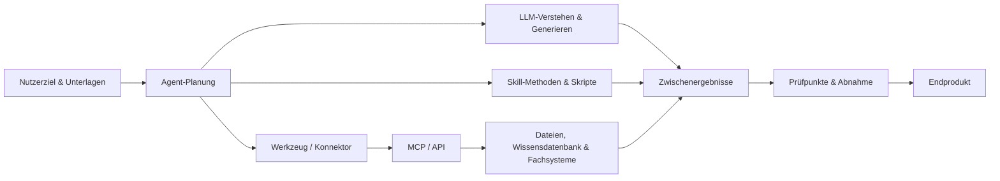
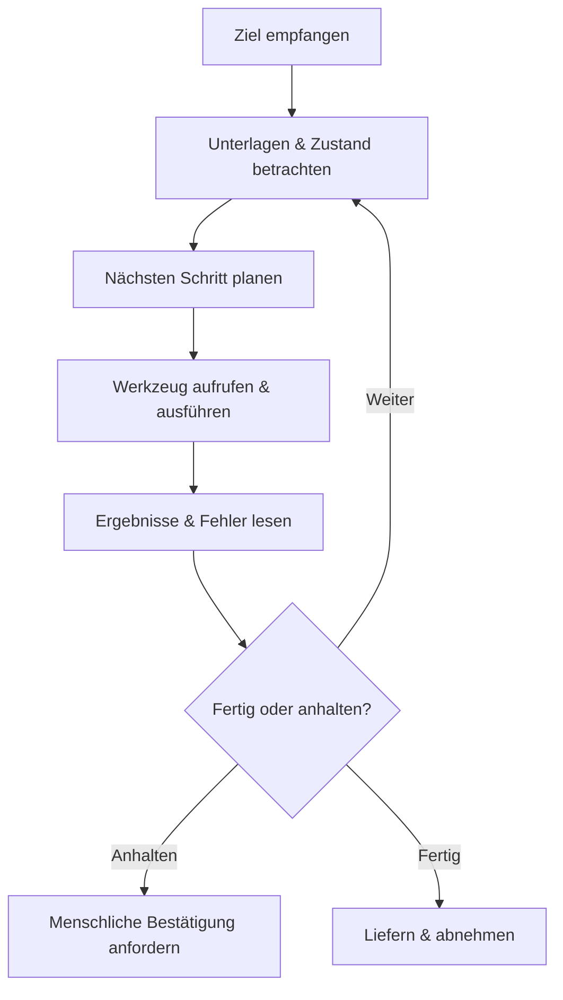

# Weiterführendes: Ein Kapitel zum Verständnis von KI-Arbeitssystemen

Die ersten zehn Kapitel behandelten das „Wie" von WorkBuddy. Dieses Kapitel erklärt das „Warum" des Designs – es bringt Begriffe wie LLM, Token, Prompt, Agent, Tool, Skill, MCP, Wissensdatenbank und Workflow in ein gemeinsames Bild und klärt, was jede Rolle kann und was nicht. Wer dieses Kapitel versteht, findet sich in jedem KI-Arbeitswerkzeug schneller zurecht.

## Zuerst das Gesamtbild: Was bei einer KI-Aufgabe passiert

In einem Satz: **Das Modell versteht und erzeugt, der Agent organisiert das Handeln rund ums Ziel, der Skill liefert Fachmethoden, Werkzeuge und MCP/API bringen das Handeln in die echte Welt – und der Mensch verantwortet Grenzen und Abnahme.** Von den fünf Rollen ist das Modell das Gehirn, der Agent der Dispatcher, der Skill das Expertenhandbuch, Werkzeuge und Schnittstellen sind Hände und Füße, der Mensch der Schiedsrichter.

## LLM: Das Basismodell, das aus Kontext Inhalte vorhersagt

Ein LLM (großes Sprachmodell) lernt aus riesigen Datenmengen Sprach- und Wissensmuster und erzeugt zur jeweiligen Eingabe den wahrscheinlichsten Folgeinhalt. Im Kern ist es eine „sage den nächsten Inhalt voraus"-Maschine – keine Datenbank und auch niemand, der Verantwortung für Sie übernimmt.

**Was es gut kann**: Texte verstehen und umformulieren, Strukturen aus Material extrahieren, Entwürfe und Code erzeugen, Formate und Stile imitieren.

**Was es nicht garantiert**: nicht die Richtigkeit jeder Tatsache; keine Kenntnis des aktuellen internen Unternehmenszustands (sofern keine Unterlagen geliefert oder Systeme angebunden sind); automatisch keine Datei-, Konto-, Datenbank- und Netzwerkrechte; keine Übernahme von Geschäfts- und Rechtshaftung.

**Warum es „Halluzinationen" gibt**: Das Modell will kohärente Inhalte erzeugen und ist keine eingebaute Fakten-Datenbank. Fehlen Unterlagen, ist die Frage vage oder verlangt man eine sichere Antwort, füllt es Lücken mit plausiblen, aber falschen Inhalten. Das ist kein Bug, sondern eine Nebenwirkung der „Wahrscheinlichkeits-Vervollständigung" – **Bestimmtheit und Richtigkeit sind zwei verschiedene Dinge.**

Halluzinationen reduzieren: verlässliche Unterlagen liefern; Zitierstellen verlangen; die Antwort „kann ich nicht bestätigen" zulassen; Faktextraktion und Vorschlagserzeugung trennen; wirkungsstarke Schlussfolgerungen menschlich gegenprüfen.

## Token und Kontextfenster: Wie viel das Modell vor Augen sieht

Token ist die Grundeinheit, in der Modelle Text verarbeiten – nicht identisch mit der Wortzahl. Das Kontextfenster ist die Gesamtmenge an Eingabe, Verlauf und Ausgabe, die das Modell in einem einzigen Schlussprozess verarbeiten kann – denken Sie daran als **Kurzzeitgedächtnis**: Was hineinpasst, wird gesehen; was nicht passt, muss fallen gelassen oder komprimiert werden.

Mehr Kontext ist nicht automatisch besser. Alle Dateien und monatelange Dialoge in eine Aufgabe zu stopfen kann dazu führen, dass alte und neue Anforderungen kollidieren, wichtiges Material in Irrelevantem untergeht und Kosten und Wartezeiten steigen. Solider: pro Projekt „aktuelle Regeln, bestätigte Fakten, Entscheidungsprotokolle und diesmalige Eingabe" bündeln und bei langen Projekten Dateien und Projektgedächtnis nutzen – **Dialogverläufe sind keine Datenbank.**

## Prompt: Eine Aufgabenbeschreibung, kein Zauberwort

Ein guter Prompt gewinnt nicht durch Länge, sondern dadurch, dass er genug Information zum Ausführen und Abnehmen enthält – einen Prompt zu schreiben heißt, ein Auftragsformular zu verfassen, das man einem Kollegen übergeben könnte.

| Element | Welche Frage zu beantworten ist |
| --- | --- |
| Ziel | Welches Problem am Ende gelöst wird |
| Eingabe | Welche Unterlagen oder Systeme verwendet werden |
| Aktion | Analysiert, sortiert, erzeugt oder geschrieben wird |
| Bedingungen | Was nicht getan werden darf, welche Regeln gelten |
| Ausgabe | Welche Dateien oder Strukturen geliefert werden |
| Abnahme | Wie Richtigkeit und Nutzbarkeit beurteilt wird |

Am leichtesten übersehen wird die **Abnahme**: Ohne Abnahmekriterien liefert das Modell nach eigenem Gutdünken ab.

Vom Einmal-Prompt zum Wiederverwendbaren ist ein schrittweiser Verfestigungsprozess: **Prompt** (wie es diesmal formuliert ist) → **Aufgabenkarte** (ausfüllbare Struktur für gleichartige Aufgaben) → **SOP** (feste Schritte und Prüfpunkte) → **Skill** (stabile SOP, Skripte und Ressourcen als ausführbare Fähigkeit verpacken). Achtung: Nicht jeder Prompt verdient es, ein Skill zu werden – erst Wiederholungserfolge, dann schrittweise Verfestigung.

## Agent: Der Ausführende, der zielgerichtet in Schleifen handelt

Ein Agent „antwortet" nicht nur einmal, sondern durchläuft fortlaufend eine Schleife: **Ziel verstehen, Umgebung beobachten, nächsten Schritt entscheiden, Werkzeuge aufrufen, Ergebnisse lesen, Plan korrigieren – bis zur Lieferung oder bis eine Stoppbedingung greift.**

| Dimension | Chat-Modell | Agent |
| --- | --- | --- |
| Kernhandlung | Antwort erzeugen | Planen, Werkzeuge aufrufen, ausführen und liefern |
| Ablauf | Meist eine einzige Generierung | Mehrere Runden Beobachten und Handeln |
| Risiko | Falsche Inhalte | Falsche Inhalte + reale Auswirkungen der Aktionen |
| Steuerung | Hinweise und Gegenprüfung | Rechte, Prüfpunkte, Logs und Rollback |

Der entscheidende Unterschied steht in der letzten Zeile: Irrt sich ein Chat-Modell, führt das höchstens in die Irre; handelt ein Agent falsch, kann er tatsächlich Dateien löschen, E-Mails senden oder Datenbanken ändern. Ein Agent braucht daher keinen schlaueren Prompt, sondern härtere Guardrails.

**Stoppbedingungen des Agenten**: Ein guter Agent sollte nicht „immer einen Weg weitermachen". Fehlen Schlüsselingaben, kollidieren Ziele, reichen die Rechte nicht, sprengt der Fall das Budget, sind Aktionen unumkehrbar oder ist das Ergebnis nicht abnehmbar, sollte er anhalten und einen Menschen bitten. Ein Agent, der nicht stoppen kann, ist gefährlicher als ein dummer Agent.

## Tool: Damit der Agent wirklich handeln kann

Ein Tool ist eine konkrete, vom Agenten aufrufbare Fähigkeit (Dateien lesen, Suchen ausführen, Tabellen erzeugen, Nachrichten senden); ein Connector ist meist eine vom Produkt fertig gekapselte Anbindung eines Drittdienstes, die nach Autorisierung direkt nutzbar ist.

Ein verbreitetes Missverständnis: **Dass ein Modell etwas „versteht", heißt nicht, dass es es „kann".** Das Modell kann erklären, „wie man eine E-Mail sendet" – aber erst mit E-Mail-Werkzeug und Kontorechten kann es tatsächlich senden. Schlägt eine Aufgabe fehl, fragen Sie zuerst „War das Werkzeug angebunden, wurden die Rechte erteilt?" – nicht „Ist das Modell etwa zu schwach?"

Zu jedem Werkzeug fünf Fragen: Mit wessen Identität arbeitet es; was kann es lesen; was kann es ändern; wohin gehen die Daten; wie wird bei Fehlern gestoppt und zurückgerollt.

## Skill: Wiederverwendbare professionelle Arbeitsmethoden

Ein Skill ist kein schlaueres Modell, sondern eine Zusammenstellung von Anweisungen, Skripten, Wissen und Vorlagen, die eine Aufgabenklasse braucht. Sein Wert liegt nicht darin, „das Modell stärker zu machen", sondern darin, **fehler- und vergessensanfällige Schritte zu fixieren** – die gleiche Rechnungsverarbeitung führt ein Modell, das sie jedes Mal neu schreibt, zehnmal in drei Varianten aus; als Skill läuft sie zehnmal denselben geprüften Weg.

Zwei Dinge merken: Ein Skill ist „eingepackte Methode", keine „Fähigkeitsgarantie". Ein Skill von Drittanbietern zu installieren ist wie eine Browser-Erweiterung – praktisch, aber prüfen Sie zuerst, welche Rechte er verlangt (welche Verzeichnisse er liest, ob Daten nach außen gehen, ob ein API-Key nötig ist, wie man ihn abschaltet), und testen Sie ihn zuerst in einem isolierten Verzeichnis.

## MCP: Die Standardschnittstelle, mit der KI Werkzeuge und Daten anbindet

MCP (Model Context Protocol) regelt, wie ein KI-Client externe Werkzeuge entdeckt und aufruft und Ressourcen liest – anschaulich der „USB-Anschluss der KI-Welt": Der Werkzeuganbieter legt seine Fähigkeiten nach einem Standard offen, der KI-Client nutzt sie nach demselben Standard – ohne erneute Anpassung für jeden Einzelnen.

**Was MCP löst**: Es senkt die Kosten wiederholter Anpassung – für eine CRM- und eine Datenbankanbindung muss nicht je ein Spezialkonnektor geschrieben werden.

**Was MCP nicht löst**: Es bewertet nicht automatisch die Compliance von Daten; es verwahrt keine Schlüssel für Sie; es garantiert nicht die Richtigkeit der Werkzeugergebnisse. Es löst das „Wie verbinde ich" – ob die Verbindung sicher ist, bleibt Ihre Verantwortung.

Wahl zwischen Nutzer- und Projektebene: Allgemeine Fähigkeiten auf Nutzerebene; sensible Verbindungen zu Kunden oder Datenbanken vorzugsweise isoliert auf Projektebene, um projektübergreifende Fehlaufrufe zu vermeiden.

## Das Verhältnis von API und MCP

Eine API ist die Schnittstelle, über die Software interagiert (per HTTP Daten abfragen, Datensätze anlegen); ein MCP-Server kann intern eine oder mehrere APIs aufrufen und die Werkzeuge in einer Form bereitstellen, die Agenten leichter nutzen. In einem Satz: **Die API ist das Fundament, MCP die darauf gebaute Tür, durch die der Agent direkt ein- und ausgeht.** Ein ausgereifter MCP-Server ist bequem – prüfen Sie trotzdem, welche Anfragen und Rechte er kapselt. Bequem heißt nicht prüfungsfrei.

## Wissensdatenbank, RAG und Gedächtnis

| Konzept | Was gespeichert wird | Hauptrisiko |
| --- | --- | --- |
| Dialogkontext | Austausch der aktuellen Aufgabe | Zu lang, konfliktbehaftet, veraltet |
| Wissensdatenbank / RAG | Durchsuchbare Fakten und Unterlagen | Schlechte Quellen, alte Versionen, nicht auffindbar |
| Gedächtnis | Präferenzen, langfristige Regeln, Projektstatus | Fehler werden lang weiterverwendet |

In einem Satz: **Der Kontext ist das Kurzzeitgedächtnis des aktuellen Chats, die Wissensdatenbank ist das jederzeit zugängliche Archiv, das Gedächtnis sind die über Aufgaben hinweg erhaltenen Dauereinstellungen.** Am gefährlichsten am Gedächtnis: „Es merkt selbst nicht, wenn es veraltet" – eine halbe Jahr alte falsche Regel wird vom Agenten wiederholt als Wahrheit benutzt.

## Der Unterschied zwischen Workflow und Agent

- **Ein Workflow ist eine standardisierte Fließband**: Die Schritte stehen beim Entwurf fest und werden der Reihe nach oder verzweigt ausgeführt;
- **Ein Agent ist ein denkender Ausführender mit eigenem Urteilsvermögen**: Er erhält nur das Ziel und entscheidet zur Laufzeit selbst über den nächsten Schritt.

| Dimension | Workflow | Agent |
| --- | --- | --- |
| Ist der Ablauf vorgegeben | Ja, beim Entwurf festgelegt | Nein, wird zur Laufzeit entschieden |
| Steuerbarkeit | Hoch, leicht vorhersehbar und rückrollbar | Geringer, der Weg kann sich ändern |
| Fehlersuche | Leicht, Schritte klar nachvollziehbar | Schwer, Logs und Zwischenzustände nötig |
| Passende Szenarien | Klare, wiederholbare Schritte, hohe Compliance-Anforderungen | Ungewisser Pfad, Umweltfeedback nötig, offene Ziele |
| Typisches Versagen | Bleibt an einem Schritt hängen, Verzweigung nicht abgedeckt | Vom Weg abkommt, Endlosschleife, Kompetenzüberschreitung |

Verbreitete Missverständnisse: „Ein Agent ist immer stärker als ein Workflow" – falsch, bei bestimmten Aufgaben ist ein Workflow stabiler und günstiger. „Ein Workflow darf keine Intelligenz enthalten" – auch falsch, Knoten können durchaus Modelle zum Zusammenfassen oder Klassifizieren aufrufen; nur der „Weg" wird vom Fluss bestimmt. „Volle Automatisierung des Agenten ist am besten" – übermäßige Autonomie macht Fehler schwerer lokalisierbar.

Wie beide zusammenwirken: Der Agent schreibt stabile Teilaufgaben als festen Ablauf (hinter einem Skill steckt genau das) und urteilt selbst nur an den ungewissen Stellen; umgekehrt kann ein Urteilsknoten auf der „Fließband" vom Agenten für unstrukturierte Eingaben übernommen werden.

---

> Setzen Sie dieses Wissen in die Praxis um: [Automatisierte Aufgaben](/de/workbuddy/10-automation/) sind Workflows, [Expertenteams](/de/workbuddy/06-experts/) sind Multi-Agent-Systeme, [Skills](/de/workbuddy/05-skills/) sind eingepackte Methoden – wer dieses Kapitel gelesen hat, sieht deren Struktur beim erneuten Blick viel klarer.
