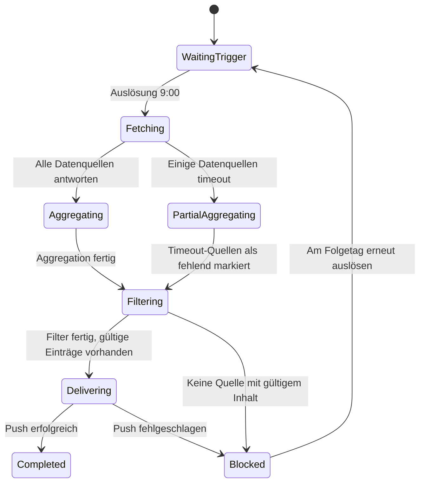

# Kapitel 25: Zuverlässigkeit automatisierter Workflows

Am durchgehenden Fall der „täglichen KI-Trend-Themenaggregation" zeigt dieses Kapitel, welche Fragen zu klären sind, wenn ein automatisierter Workflow vom manuellen Lauf zur zuverlässigen zeitgesteuerten Ausführung reifen soll.

## Fallhintergrund: Die tägliche Themen-Aufgabe eines Content-Bloggers

Das KI-Feld entwickelt sich schnell; jeden Tag müssen aus mehreren Quellen die lohnenden Themen des Tages gefiltert werden. Alles von Hand zu sichten kostet Zeit und lässt leicht etwas aus. Ein typisches Themenbedürfnis:

```text
Ich bin Blogger im KI-Bereich; meine Hauptthemen sind KI-Tutorials, KI-Werkzeuge,
AI Coding, KI-Reviews und Ähnliches.
Such mir die heutigen KI-Trends, damit ich die Themen des Tages auswählen kann.
Quellen:
- Aktuelle Viral-Artikel in WeChat Official Accounts (@wechat-article-search)
- Heutige trending KI-Projekte auf GitHub (@GitHub热门项目)
- Multi-Engine-KI-News-Aggregation (@多引擎搜索)
- KI-Trend-Tracking (@AIHOT)
```

Bei einem manuellen Lauf ruft WorkBuddy alle vier Datenquellen gleichzeitig auf und liefert eine integrierte Liste der KI-Trends des Tages. Nach dem erfolgreichen Lauf folgt als Nächstes die Einrichtung als zeitgesteuerte Aufgabe: täglich um 9:00 automatisch ausführen und das Ergebnis an die Zielstelle pushen.


## Drei Hürden vor der Automatisierung

Nicht jede Aufgabe eignet sich sofort für die Automatisierung:

1. **Derselbe Prompt lief mindestens dreimal manuell**, Qualität und Format der Ausgabe sind im Wesentlichen stabil;
2. **Auslösebedingung, Eingabequellen und Abnahmekriterien sind klar**: wann die Aufgabe läuft, von welchen Datenquellen sie abhängt, in welchem Format ausgegeben wird;
3. **Es gibt einen Owner, Alarmierung und eine Abschaltmethode**: Wer bei Fehlschlag reagiert und wie die Aufgabe vorübergehend deaktiviert wird, ohne andere Abläufe zu stören.

Aufgaben mit häufig geänderten Prompts oder noch instabilen Datenquellen zuerst manuell laufen lassen – nicht überstürzt automatisieren.

## Die automatisierte Aufgabe einrichten

Nachdem der manuelle Lauf das Ergebnis bestätigt hat, sagen Sie WorkBuddy einfach im selben Dialog:

```text
Richte diese Aufgabe als Automatisierung ein: jeden Tag um 9:00 ausführen,
das Ergebnis senden an [bestimmte Feishu-Gruppe / E-Mail / WeCom-Benachrichtigung].
```

WorkBuddy speichert den aktuellen Prompt und die Datenquellenkonfiguration als zeitgesteuerte Aufgabe und führt sie zur festgelegten Zeit automatisch aus.


## Die automatisierte Aufgabe als Zustandsmaschine entwerfen

Automatisierung heißt nicht „Hauptsache, es läuft". In der echten Umgebung kann jeder Lauf auf Datenquellen-Timeouts, leere Tagesergebnisse, API-Rate-Limits oder unerreichbare Push-Ziele stoßen. Entwerfen Sie die Aufgabe als Zustandsmaschine, in der jeder Zustand eine klare Erfolgbedingung und einen Fehlerausgang hat:



Kernprinzip: **Der Ausfall einzelner Datenquellen darf die Gesamtaufgabe nicht blockieren** – fehlende Quellen markieren und weiter aggregieren; bei gescheitertem Push das Ergebnis bewahren und alarmieren, damit bereits erzeugte Inhalte nicht verloren gehen.

## Bereitschaftsprüfung der Datenquellen

Eine zeitgesteuerte Auslösung heißt nicht, dass die Datenquellen bereit sind – prüfen Sie zu Beginn jedes Laufs die Verfügbarkeit:

| Datenquelle | Prüfpunkt | Behandlung bei Nichtverfügbarkeit |
| --- | --- | --- |
| @wechat-article-search | Such-API erreichbar, nicht-leeres Ergebnis | Als fehlend markieren, andere Quellen fortfahren |
| @GitHub热门项目 | GitHub-API nicht im Rate-Limit | Einmal mit Backoff wiederholen, sonst als fehlend markieren |
| @多引擎搜索 | Suchmaschinen erreichbar | Als fehlend markieren, andere Quellen fortfahren |
| @AIHOT | Trend-Tracking-Dienst normal | Als fehlend markieren, andere Quellen fortfahren |

Erst wenn mindestens drei der vier Quellen normal arbeiten, wird die vollständige Trendliste ausgegeben; schlagen alle fehl, folgt der Zustand Blocked mit Alarm und die Auslösung am Folgetag.

## Qualitätsschranken für Inhalte

Dass Datenquellen erreichbar sind, heißt nicht, dass die Inhalte gültig sind. Nach der Aggregation entlang vier Dimensionen filtern: **Relevanz** (wirklich KI-Bereich), **Aktualität** (Inhalte des Tages, abgelaufene Trends ausschließen), **Duplikate** (dasselbe Ereignis aus mehreren Quellen zusammenführen), **Mindestanzahl** (bei weniger als 5 gültigen Einträgen „zu wenige Trends heute" vermerken).

Die Qualität hat drei Stufen: **pass** normale Ausgabe; **warning** einzelne Quellen fehlen, Hinweis oben in der Ausgabe; **blocked** zu wenige gültige Einträge, kein Haupttext-Push, nur Erläuterung.

## Feste Ausgabestruktur

```text
📋 KI-Trend-Themen-Tagesbericht — 2026-07-10

[Überblick heute]
Gültige Einträge: 18 | Quellen: 4/4 | Laufzeit: 09:02

🔥 Hohe Dynamik (gut für schnelle Trend-Artikel)
1. [Modellname] veröffentlicht, [Kernfähigkeit] — Quelle: AIHOT + GitHub
   Trend-Index: ★★★★★ | Empfohlener Winkel: Funktions-Review / Tutorial

📈 Potenzialrichtungen (gut für Tiefenanalyse)
2. [Thema] löst Diskussion aus — Quelle: WeChat Official Account
   Trend-Index: ★★★ | Empfohlener Winkel: Meinungsanalyse / Fallzerlegung

⚠️ Hinweise zu den Datenquellen
GitHub: normal | WeChat: normal | Multi-Engine-Suche: normal | AIHOT: normal
```

Mit festem Format entscheidet der Blogger über die Themen in 5 Minuten, statt jedes Mal das Format neu zu bauen.

## Push-Ziele und Idempotenz

| Push-Ziel | Passendes Szenario | Beachten |
| --- | --- | --- |
| Feishu-Gruppennachricht | Themen im Team teilen | Message-ID protokollieren, keine Doppel-Pushes |
| Persönliche Benachrichtigung | Eigene Nutzung | Ebenso |
| Feishu-Dokument (anhängen) | Historie erhalten | Nach Datum anfügen, Historie nicht überschreiben |
| E-Mail | Plattformübergreifende Benachrichtigung | Sende-ID protokollieren |

**Idempotenzprinzip**: Wiederholt die Aufgabe einen Lauf wegen eines fehlgeschlagenen Pushes, darf sie bereits erfolgreich gepushte Inhalte nicht erneut senden. Jeder Lauf erzeugt eine eindeutige Batch-ID (z. B. `ai-hotspot-2026-07-10`); nach erfolgreichem Push wird der Status vermerkt, und der Wiederholungslauf prüft den Status und überspringt abgeschlossene Schritte.

## Timeout- und Wiederholungsstrategie

| Fehlerart | Wiederholen? | Strategie |
| --- | --- | --- |
| Datenquellen-API-Timeout | Ja | Nach 10 Sekunden einmal wiederholen, sonst als fehlend markieren |
| GitHub-API-Rate-Limit (429) | Ja | Gemäß Retry-After warten, höchstens 2-mal |
| Authentifizierung ungültig (401/403) | Nein | An Menschen übergeben, nicht automatisch wiederholen |
| Push-Ziel unerreichbar | Ja | 2-mal mit exponentiellem Backoff, bei Fehlschlag Alarm und Ergebnis bewahren |
| Aggregationsergebnis leer | Nein | In blocked übergehen, Erläuterung pushen, am Folgetag erneut auslösen |

Wiederholungen nur bei vorübergehenden Störungen – nicht bei Eingabe- oder Konfigurationsproblemen.

## Fortsetzen ab Haltepunkt und handlungsfähige Alarme

Jeder Lauf erzeugt eine Statusdatei, die abgeschlossene Schritte und Produkte vermerkt (Batch-ID, Status, Quellenstatus, Eintragszahl, letzter Fehler). Nach einem fehlgeschlagenen Push setzt der Wiederholungslauf beim Schritt `delivering` fort, ohne erneutes Sammeln und Aggregieren.

Alarme müssen sofort erkennen lassen, wie zu handeln ist – Batch, Status, Fehlerursache, Auswirkung, empfohlene Schritte, Wiederanlaufstelle. „Aufgabe fehlgeschlagen, bitte prüfen" trägt nicht.

## Degradation und Protokolle

Bei Ausfall einzelner Datenquellen sollte nicht auf alles gewartet werden: 3 oder mehr Quellen normal → Liste ausgeben, Fehlendes vermerken; 2 normal → vereinfachte Liste mit Unvollständigkeits-Hinweis; 1 oder 0 → keinen Haupttext ausgeben, nur Erläuterung und Alarm pushen. Ein degradiertes Ergebnis muss die Quellenabdeckung ausdrücklich kennzeichnen und **sich nicht als vollständiger Lauf ausgeben**.

Jeder Lauf protokolliert: Batch-ID und Auslöseart, Antwortstatus und Dauer jeder Datenquelle, Eintragszahlen nach Aggregation und Filterung, Push-Ergebnis, Gesamtdauer und Fehler, Laufkosten (Token, API-Aufrufe). Die Protokolle enthalten nicht den Inhalt der Trends.

## Generalprobe vor dem Livegang

| Szenario | Erwartetes Verhalten |
| --- | --- |
| Alle Datenquellen normal | Vollständige Liste ausgeben, Push erfolgreich |
| GitHub-API im Rate-Limit | Backoff-Wiederholung, bei bleibendem Fehler als fehlend markieren, weiter aggregieren |
| Keine KI-Trends am Tag | Zu wenige gültige Einträge, Erläuterung ausgeben, keine leere Liste pushen |
| Push-Ziel unerreichbar | 2-mal wiederholen, bei Fehlschlag Alarm und Ergebnis bewahren |
| Doppelte Auslösung (manuell und zeitgesteuert gleichzeitig) | Batch-ID erkennen, doppelte Ausführung überspringen |

## Vorlage für die Definition einer automatisierten Aufgabe

```text
Aufgabenname: KI-Trend-Themen-Tagesbericht
Auslösung: täglich 09:00 (Werktage)
Prompt: [Vollständiger Prompt-Text]
Datenquellen: @wechat-article-search / @GitHub热门项目 / @多引擎搜索 / @AIHOT
Qualitätsschranken: gültige KI-Einträge ≥ 5; verfügbare Datenquellen ≥ 3
Ausgabeformat: strukturierte Trendliste (mit Quelle, Dynamik, empfohlenem Winkel)
Push-Ziel: [Feishu-Gruppe / persönliche Benachrichtigung / Feishu-Dokument anhängen]
Idempotenz: Batch-ID = ai-hotspot-{date}, nach erfolgreichem Push markieren, nicht doppelt pushen
Wiederholungsstrategie: Datenquellen-Timeout 1× wiederholen; Push-Fehler 2× mit Backoff; anderes an Menschen
Alarmempfänger: [persönliche Feishu-Benachrichtigung]
Owner: [der Blogger selbst]
Abschaltung: WorkBuddy-Verwaltungsseite für Automatisierungen → Pause
```

## Von der persönlichen Automatisierung zum Teamdienst

| Dimension | Persönliche Nutzung | Teamdienst |
| --- | --- | --- |
| Push-Ziel | Persönliche Benachrichtigung | Feishu-Gruppe des Teams |
| Themenrichtung | Eine Richtung | Mehrere Richtungen, klassifiziert gepusht |
| Prüfprozess | Eigenes Urteil | Verteilung erst nach Bestätigung durch Redaktionsleitung |
| Störungsbearbeitung | Selbst erledigt | Owner und stellvertretende Bearbeiter |
| Kostenzuordnung | Persönliches Konto | Team-Budget |

Der Ausbau zum Teamdienst erfordert Ergänzungen: klaren Owner, ein Betriebshandbuch, Rechte (wer Prompt und Push-Konfiguration ändern darf) und einen Änderungsprozess.

**Die reife Form der Automatisierung ist nicht das völlige Fehlen von Menschen, sondern ein Normalweg, der Menschen selten stört, und ein Fehlerweg, der schnell den richtigen Menschen erreicht.** Nach dem Livegang wird die Aufgabe nach Nutzungsfeedback fortlaufend verbessert (Prompt-Optimierung, Quellenanpassung, Formatiteration, Zeitumstellung) – jede Änderung folgt dem Ablauf „ändern → manuell prüfen → neu speichern"; nicht direkt an der laufenden Zeitaufgabe experimentieren.
