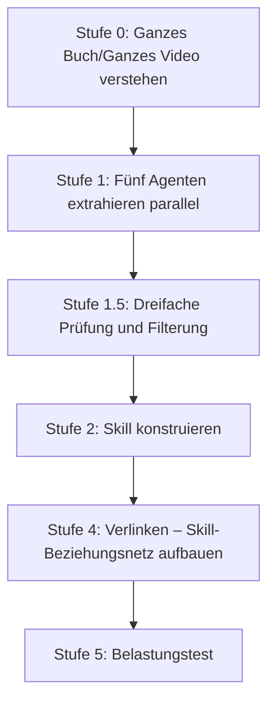
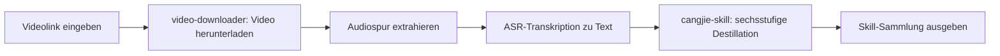

# Kapitel 22: Skills bauen: Bücher und Videos zu ausführbaren Skills destillieren

Neben dem Einspeisen eigener SOPs als Skill gibt es einen noch einfacheren Weg: mit [cangjie-skill](https://github.com/kangarooking/cangjie-skill) (Cangjie-Skill; v1 destilliert Bücher, v2 ergänzt Videodestillation) Wissen in Skills destillieren.


Dieses Kapitel beantwortet zwei Fragen: Wie verwandelt man die Methodik aus Büchern und Videos in Skills, die ein Agent automatisch aufrufen kann – und worin der wesentliche Unterschied zur RAG-Suche besteht.

## Ausgangsproblem: Wissen gelesen, aber nicht anwendbar

KI-Modelle haben beim Training bereits zahllose Klassiker aufgenommen, liefern im echten Frage-Antwort-Betrieb aber oft „korrektes Geschwafel" – jedes Wort stimmt, doch es fehlen umsetzbare Schritte für das konkrete Problem. Das ist kein Halluzinationsproblem, sondern ein **Abrufmechanismus-Problem**: Die KI weiß, was im Buch steht, weiß aber nicht, in welchem Szenario sie welches Framework aktiv herausholen soll.

Menschliche Leser kennen das ebenso: Nach dem Lesen eines Buches, mit Notizen und markierten Kernsätzen, greift man zwei Wochen später bei einem echten Problem ins Leere – das Wissen ist im Gedächtnis, aber der Aktivierungspfad ist unklar. Genau dieses Problem „gelernt, aber nicht nutzbar" löst die Wissensdestillation.

## Definition der Wissensdestillation

**Wissensdestillation (Knowledge Distillation for Skills)**: Aus Büchern oder Videos werden atomisierte Wissenseinheiten (Skills) mit eigenen Triggerbedingungen und Ausführungsschritten extrahiert, sodass der Agent beim passenden Szenario automatisch aktiviert wird und einen umsetzbaren Handlungspfad liefert.

Die chemische Destillation trennt Gemische nach Siedepunkten in reine Komponenten; die Wissensdestillation trennt Wissen nach den fünf Dimensionen „Framework / Prinzip / Fallbeispiel / Gegenbeispiel / Fachbegriff" und reinigt nur das wirklich Nützliche zu ausführbaren Skills.

Wissensdestillation ist **keine**: Zusammenfassung (den Originaltext verdichten), LeseNotizen (den Originaltext strukturieren), RAG-Index (Originaltextstellen für die Suche speichern). Sie verwandelt Methodik in Ausführungseinheiten, die der Agent in echten Szenarien automatisch aufrufen kann.

## Die sechsstufige Destillations-SOP



Am Beispiel der Destillation von „The Copywriter's Handbook":


### Stufe 0: Das ganze Buch / Video verstehen

Beginnen Sie nicht mit dem Herauspicken von Kernsätzen, sondern lesen Sie zuerst das Gerüst des ganzen Buches: Kernthese, zentrale Argumentationskette, Definition und Gebrauch der Schlüsselbegriffe sowie Grenzen und blinde Flecken des Autors. Dieser Schritt bestimmt die Obergrenze der Qualität der weiteren Extraktion – wer ihn überspringt, verwechselt schnell eine Ansicht, die der Autor ablehnt, mit einer Methode, die er vertritt.

### Stufe 1: Fünf Agenten extrahieren parallel

Fünf Agenten durchsuchen den Text gleichzeitig aus fünf Dimensionen – unabhängig voneinander, ohne gegenseitige Störung – und vermeiden so die Blickwinkel-Lücken einsträngigen Lesens:

| Agent | Extraktionsziel |
| --- | --- |
| Framework-Extraktion | Vom Autor gebaute Analyse- oder Entscheidungsframeworks |
| Prinzip-Extraktion | Übergreifend wiederverwendbare Handlungsprinzipien |
| Fallbeispiel-Extraktion | Positive Fälle und Erfolgspfade |
| Gegenbeispiel-Extraktion | Fehlschläge und Lehren daraus |
| Begriffswörterbuch | Fachbegriffe und ihre Definitionen |


### Stufe 1.5: Dreifache Prüfung und Filterung

Jede Kandidaten-Wissenseinheit muss drei Hürden überstehen; wer durchfällt, scheidet aus:

| Prüfung | Geprüfter Inhalt |
| --- | --- |
| Domänenübergreifende Prüfung | Die Methodik kommt im Buch in mindestens zwei unabhängigen Szenarien vor – kein Einzelfallbeleg |
| Vorhersagetest | Lässt sich damit eine Frage ableiten, die im Buch nicht direkt behandelt wird? |
| Besonderheitsprüfung | Ist es eine Binsenweisheit, die jeder sagen könnte? Gemeinplätze bilden keinen Skill |

Lieber weniger als zu viel: Ein Buch hat üblicherweise 50–100 Kandidateneinheiten; nach der dreifachen Prüfung bleiben nur 10–25 übrig.


### Stufe 2: Skill konstruieren

Kern ist das Design der **Triggerbedingungen**: In welchem Szenario automatisch aktiviert wird, welche Schritte nach der Aktivierung laufen, wann er nicht eingesetzt werden darf (Grenzen) und woran die Qualität gemessen wird. Ohne Triggerbedingungen kann der Agent einen Skill weder richtig erkennen noch aufrufen – das ist der schwierigste und wichtigste Schritt.

### Stufe 4: Verlinken

Erkennen Sie die Beziehungen zwischen Skills und bilden Sie ein Wissensnetz: **Abhängigkeit** (Ausführung von A braucht die Ausgabe von B), **Kontrast** (ähnliche Szenarien, aber entgegengesetzte Richtung), **Kombination** (gemeinsam eingesetzt wirksamer). Die Verlinkungsebene erlaubt dem Agenten, bei komplexen Problemen eine ganze Gruppe von Skills zu wählen statt nur eines einzelnen.

### Stufe 5: Belastungstest

- **Köder-Test**: Gezielt Szenarien geben, in denen nicht getriggert werden darf – ob der Skill die Aktivierung unterdrücken kann. Ein Skill ohne Grenzen, im falschen Szenario aufgerufen, schadet eher;
- **Ausführungsprüfung**: Ein echtes Problem geben und prüfen, ob umsetzbare Schritte herauskommen statt „korrektem Geschwafel".

## Struktur des Destillationsprodukts

```text
book-skill/
├── README.md               # Buchinformation, Destillationshinweise, Anwendungsszenarien
├── skills/
│   ├── skill-01.md         # Jeder Skill eine eigene Datei
│   └── ...
├── index.md                # Skill-Beziehungsnetz (Produkt der Verlinkungsebene)
└── tests/
    └── skill-01-test.md    # Testfälle für jeden Skill
```


Jede Skill-Datei enthält Triggerbedingungen, Ausführungsschritte, Ausgabeformat, Grenzen und Testfälle. Das Format ist mit darwin-skill (Werkzeug zur automatischen Skill-Evolution) kompatibel, sodass das Destillat laufend automatisch optimiert werden kann.


## Wissensdestillation vs. RAG

| Dimension | RAG | Wissensdestillation (Skill) |
| --- | --- | --- |
| Wesen | Suche – die relevantesten Originaltextstellen finden | Destillation – ausführbare Methodik aus dem Original extrahieren |
| Voraussetzung | Nutzer muss wissen, wonach er fragen soll | Nutzer beschreibt das Problem, der Skill erkennt und aktiviert sich automatisch |
| Qualitätskontrolle | Keine – jeder Inhalt darf in den Index | Dreifache Prüfung, lieber weniger als zu viel |
| Aufruf | Wartet passiv auf Anfragen | Ordnet Szenarien aktiv zu und löst aus |
| Wissensform | Speichert Originaltext (Wissen behalten) | Reinigt zu Ausführungsschritten (Wissen anwenden) |
| Grenzkontrolle | Keine | Köder-Tests verhindern Fehlaktivierung |

RAG löst das „Wissensmanagement" – Sie können nachschlagen, was im Buch steht; die Wissensdestillation löst die „Wissensanwendung" – der Agent holt im richtigen Moment das richtige Framework hervor. **Wenn Sie nicht wissen, was Sie fragen sollen, kann RAG Ihnen nicht helfen.**

## Videodestillations-Workflow (neu in v2)

cangjie-skill v2 ergänzt über den [video-downloader-Skill](https://github.com/kangarooking/kangarooking-skills/tree/main/video-downloader) die Videodestillation: Zuerst erfolgt die Umwandlung „Video → Text", danach beginnt die sechsstufige SOP.




- **Video-Download**: yt-dlp unterstützt YouTube, Bilibili und weitere gängige Plattformen (WeChat Channels sind wegen Plattformbeschränkungen derzeit nicht automatisierbar);
- **Audio-Transkription**: Lokales Whisper funktioniert, ist bei langen Videos aber zeitaufwendig (rund 48 Minuten pro Stunde Video); für den Massenverarbeitungsfall sind ASR-APIs zu empfehlen;
- **Destillation mehrerer Videos zusammen**: Mehrere Videos zum selben Thema lassen sich gemeinsam destillieren; der Agent dedupliziert und fusioniert die Wissenseinheiten automatisch;
- **Trennung der Zuständigkeiten**: Der Videoabruf ist im video-downloader gekapselt, cangjie-skill konzentriert sich auf die Textdestillation – beide entwickeln sich unabhängig weiter.

## Passende und unpassende Szenarien

| Typ | Eignung | Anmerkung |
| --- | --- | --- |
| Methodikdichte Bücher | ★★★★★ | Klare Frameworks, extrahierbare Prinzipien – am besten geeignet |
| Interviews / Kursvideos | ★★★★☆ | Relativ strukturiert, gut destillierbar |
| Lange Videos / Podcasts | ★★★☆☆ | Möglich, Wissensdichte hängt vom Inhalt ab |
| Aphorismen- und Essay-Bücher | ★★☆☆☆ | Wenig Methodik, begrenzte Produktqualität |
| Romane / erzählende Literatur | ★☆☆☆☆ | Fehlen extrahierbare methodische Frameworks |

Vor der Destillation sollten Sie das Ausgangsmaterial einmal gelesen oder gesehen haben: An Schlüsselstellen sind Urteile nötig (etwa Grenzfälle der dreifachen Prüfung); wer vorher gelesen hat, destilliert mit deutlich höherer Erfolgsquote. **Destillation ersetzt nicht das Lesen – sie ist ein Werkzeug der Wissensstrukturierung nach der Lektüre.**

## Ressourcenverbrauch und Modellwahl

Wissensdestillation ist token-intensiv (Ganzbuch-Verständnis + fünffache Parallel-Extraktion + mehrstufige Prüfung + Belastungstest). Größenordnung: ein normales Buch etwa 30–90 Minuten und einige Zehntausend bis über Hunderttausend Token; eine 26-teilige Kursvideoserie (4 Stunden) etwa 1 Stunde.

Modellwahl: Für Aufgabenzerlegung und Destillationskoordination ein Modell mit starker Schlusskraft; für parallele Extraktion und Prüfung genügt ein günstiges Modell mit gutem Preis-Leistungs-Verhältnis; für lange Kontexte ein Modell mit nativer Langkontext-Unterstützung, damit keine Abschneidung die Destillation unvollständig macht.

## Häufige Missverständnisse

1. **„Bücher, mit denen die KI trainiert wurde, brauchen keine Destillation"** – Selbst wenn die KI sich an das Buch erinnert, liegt der Wert der Destillation in den **Triggerbedingungen**: in welchem Szenario welches Framework hervorgeholt wird – nicht bloß „wissen, was drinsteht".
2. **„Nach der Destillation muss man das Buch nicht mehr lesen"** – Wer ohne Lektüre destilliert, dem fehlt bei den entscheidenden Urteilspunkten der Hintergrund, Wesentliches geht verloren.
3. **„Was die KI vorschlägt, kann man direkt ausführen"** – Ob die Richtung stimmt und ob es umsetzbar ist, bleibt menschliches Urteil. Die KI liefert Optionen und Analyse, die Entscheidung ist Verantwortung des Menschen.
4. **„Je mehr ein Skill abdeckt, desto besser"** – Zu breite Triggerbedingungen führen zu Fehlaktivierungen. Lieber schmaler abdecken als falsch auslösen.

## Beispiel eines Destillationsergebnisses

Am Beispiel von Andrew Ngs „KI-Einführungskurs für alle" (Version 2026, 26 Videos, rund 4 Stunden): Die Destillation dauerte etwa 1 Stunde, das Ergebnis sind 25 Skills – ausnahmslos zeitkritische Inhalte, die nach der Destillation vom Agenten direkt in den passenden Szenarien aufgerufen werden können.


## Fazit: Der Ort der Wissensdestillation im Skill-System

| Quelle | Passende Szenarien |
| --- | --- |
| Aus Geschäftsprozessen destillieren (SOP → Skill) | Interne Unternehmensstandards, wiederkehrende Geschäftsprozesse |
| Aus Büchern/Videos destillieren (Wissensdestillation) | Experten-Methodik, klassische Werke, hochwertige Kursinhalte |

Beide Produkte haben dasselbe Format – ausführbare Skills mit Triggerbedingungen – und lassen sich im selben Agent-Framework mischen. Dasselbe Buch muss nicht von jeder Person erneut destilliert werden: Was einer destilliert hat, kann als Open Source geteilt und von allen anderen direkt weiterverwendet werden.
