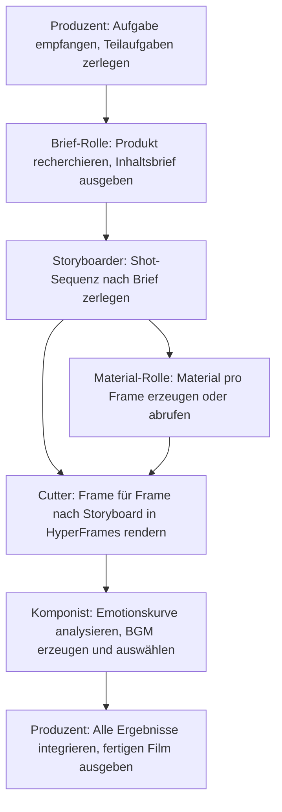

# Kapitel 24: Multi-Agent-Systeme entwerfen

Dieses Kapitel beantwortet anhand eines echten Falls – eines „Expertenteams für Produkt-Trailer" – drei Kernfragen von Multi-Agent-Systemen: Wie designt man die Aufgabenteilung, wie verknüpft man die Ergebnisse, wann lohnt sich die Aufteilung.


## Der echte Unterschied zwischen Einzel- und Multi-Agent

| Dimension | Einzel-Agent | Multi-Agent |
| --- | --- | --- |
| Kontext | Alle Informationen in einer Aufgabe | Rollen erhalten nur den nötigen Kontext |
| Aufgabenteilung | Ein Ausführender arbeitet sequenziell ab | Mehrere Rollen parallel oder im Staffellauf |
| Werkzeuge | Ein Satz Rechte | Werkzeuge und Rechte pro Rolle isolierbar |
| Qualität | Selbst erzeugt, selbst geprüft | Unabhängige Prüfer einrichtbar |
| Kosten | Geringer | Mehr Koordination, Modell- und Werkzeugaufrufe |
| Risiko | Ein Fehler wirkt aufs Ganze | Fehler können sich zwischen Rollen ausbreiten |

Der Mehrwert von Multi-Agent entsteht durch **Fachaufteilung, Parallelität, Rechteisolierung oder unabhängige Prüfung** – nicht durch die Zahl der Rollen.


## Lohnt sich die Aufteilung einer Aufgabe?

Je mehr zutrifft, desto eher eignet sich Multi-Agent:

- Mindestens zwei Teilaufgaben können unabhängig laufen;
- Die Teilaufgaben brauchen unterschiedliche Methoden, Unterlagen oder Werkzeuge;
- Für die Ergebnisse lässt sich ein klares Übergabeformat definieren;
- Parallelität verkürzt die Wartezeit spürbar;
- Es gibt eine klare Gesamtverantwortung und eine Endabnahme;
- Das Budget erlaubt mehrere Aufrufsrunden.

Nur eine E-Mail umformulieren, ein PDF zusammenfassen oder eine Tabelle formatieren – dafür braucht es kein Expertenteam.

## Fallbeispiel: Expertenteam für Produkt-Trailer

### Aufgabenhintergrund

HyperFrames ist ein von HeyGen offengelegtes Video-Rendering-Framework; sein Kernmerkmal ist KI-Agenten-Freundlichkeit: Agenten können HTML-basierte Videoframes automatisch erzeugen und rendern. Produkt-Trailer folgen einem relativ festen Muster – ohne Sprecher und Schauspieler, hauptsächlich Produktbilder, Konzept-Untertitel und BGM – und eignen sich gut für die Aufteilung in einem Agenten-Team.


### Prozessdesign



### Rollenverträge

| Rolle | Eingabe | Ausgabe | Verbotene Aktionen |
| --- | --- | --- | --- |
| Produzent | Aufgabenbeschreibung des Nutzers, Materialraum | Aufgabenzerlegung, Statusverfolgung, fertiger Film | Nicht ohne Abnahme der Teilaufgaben direkt liefern |
| Brief-Rolle | Produktwebsite, Einführungsdokumente | brief.md (Positionierung, Wert, Nutzer) | Nicht direkt das Skript schreiben |
| Storyboarder | brief.md | Storyboard (Timecodes, Bild, Untertitel, Übergänge) | Keine im Brief unbestätigten Informationen einführen |
| Material-Rolle | Storyboard | Produkt-Screenshots, Konzeptbilder, UI-Material | Kein Material aus Quellen ohne Lizenzrechte |
| Cutter | Material, Storyboard | MP4-Abschnitte Frame für Frame | Die Storyboard-Struktur nicht ändern |
| Komponist | Storyboard, Emotions-Markierungen | BGM-Kandidaten samt Begründung | Nicht nur eine Option ausgeben |

### Demo des Expertenteams

Vor dem Produkt-Trailer legen Sie die relevanten Materialien im Arbeitsbereich ab:

```text
Ich möchte, dass du einen Produkt-Trailer erstellst – konkret einen für das neueste
Expertenteam-Feature von Tencents WorkBuddy, mit Fokus auf OPC-Szenarien. Im aktuellen
Verzeichnis liegen einige Materialien; der Stil des fertigen Films darf an Apple angelehnt
sein, mit echten Software-Oberflächen. Der gesamte Prozess vollautomatisch.
```


Der Teamleiter zerlegt zuerst „einen Trailer drehen" in eine Kette von Teilaufgaben: zuerst klären, was das Produkt ist, an wen es verkauft wird und was der Kernwert ist; dann Erzählstruktur, Zahl der Shots und Rhythmus festlegen; danach getrennt Material, Schnitt und Musik erarbeiten.

Die Brief-Rolle beginnt: Sie geht Website und Produktvorstellung durch und liefert ein Briefing – was das Produkt ist, wer die Zielnutzer sind und welche Kernpunkte sich für 60 Sekunden lohnen. Der Storyboarder arbeitet auf Basis des Briefings und zerlegt die 60 Sekunden in 7 Shots, bis hinunter zu Timecodes, Bild, Text, Übergängen, Motion-Effekten und Materialtypen. Material-Rolle und Cutter legen los: Die eine erzeugt oder sammelt Produkt-Screenshots und Konzeptbilder, der andere füllt das Material nach dem Storyboard in HyperFrames und rendert Shot für Shot MP4.

Am interessantesten ist der Komponist: Er tippt nicht einfach einen „Tech-BGM"-Prompt ein, sondern liest zuerst das Storyboard und studiert die Emotionskurve jedes Shots – wo ein Drumhit den Produkt-Reveal markieren, wo es für Leere zurückgenommen, wo ein Hit Point die CTA schieben soll – und ruft erst dann das Musikmodell für Kandidaten auf. Am Ende integriert der Teamleiter alle Ergebnisse und dreht den finalen Schnitt.


Der Mensch ist dabei im Wesentlichen Zuschauer: gelegentlich entscheidet er an Schlüsselpunkten – Storyboard so oder anders, BGM gefällig, Untertiteltext ändern oder nicht.

## Gemeinsame Ergebnisebene

Mehrere Agenten sollten nicht jeweils eine eigene Version der „Produktfakten" pflegen; richten Sie einen einzigen Ergebnis-Pfad ein:

```text
project/
├── brief.md                  # Produkt-Briefing (von der Brief-Rolle, vom Produzenten bestätigt)
├── storyboard.md             # Storyboard (vom Storyboarder, vom Produzenten bestätigt)
├── assets/                   # Material (von der Material-Rolle)
│   ├── screenshots/
│   └── concepts/
├── clips/                    # Frame-Abschnitte (vom Cutter)
├── bgm/                      # BGM-Kandidaten (vom Komponisten)
└── output/final.mp4          # Fertiger Film (vom Produzenten integriert)
```

**Nachgelagerte Rollen lesen ausschließlich bestätigte Ergebnisse vorgelagerter Rollen.** Kritische inhaltliche Details werden nicht über Dialoge zwischen Rollen übermittelt.

## Parallel und sequenziell

- **Parallelisierbar**: Materialerzeugung und Schnittvorbereitung, Rendering verschiedener Shot-Abschnitte;
- **Zwingend sequenziell**: Storyboard erst nach Brief-Bestätigung, Material erst nach Storyboard-Bestätigung, Schnitt erst nach fertigen Materialien, Musikkomposition erst nach fertigem Film.

Ein Parallelplan muss die Zusammenführungspunkte ausweisen: Material und Schnitt können parallel vorbereitet werden, aber die finale Synthese muss warten, bis alles Material bereitsteht.

## Die Aufgaben des Produzenten

Der Produzent (Regisseur) ist die Workflow-Steuerung: Er interpretiert die Nutzeroberaufgabe und pflegt den Status der Teilaufgaben; verteilt minimal nötigen Kontext; prüft, ob Upstream-Ergebnisse das Übergabeformat erfüllen; entscheidet über Parallelität, Warten oder Wiederholung; holt an Schlüsselpunkten die Entscheidung des Nutzers ein; bündelt alle Ergebnisse zur finalen Synthese; prüft den fertigen Film auf Konsistenz.

**Drei Punkte, die der Mensch bestätigen muss**: Briefing-Bestätigung (stimmen Positionierung, Nutzer, Selling Points), Storyboard-Bestätigung (Erzählstruktur, Shot-Anzahl, Rhythmus), BGM-Wahl (passt der emotionale Stil zur Tonalität). Agenten erzeugen und führen aus – die Markenrichtung und Stilurteile können sie nicht ersetzen.

## Vom Selbstbau zum vorbereiteten Expertenteam

| Dimension | Selbst gebaute Skills | Vorbereitete Expertenteams |
| --- | --- | --- |
| Zielgruppe | Entwickler mit tiefem Anpassungsbedarf | Ein-Personen-Unternehmen, direkte Nutzung |
| Einstiegshürde | Hoch (Rollen definieren, Abläufe austesten) | Niedrig (Aufgabe beschreiben genügt) |
| Flexibilität | Hoch (jede Stelle änderbar) | Mittel (eigene Modell-Anbindung möglich) |
| Tempo | abhängig von Aufbauzeit | sofort einsatzbereit |

Ein eigenes Expertenteam anzulegen ist ebenfalls einfach: Experten → Meine Experten → Experten erstellen; Sie gelangen in den WorkBuddy-Dialog und legen es nach dem vorgegebenen Format schnell an.


Typische Szenarien der aktuellen Expertenteams:

| Szenariokategorie | Repräsentative Expertenteams |
| --- | --- |
| Content-Erstellung | Produkt-Trailer, Viral-Content, plattformübergreifende Verbreitung |
| Software-Entwicklung | Softwareentwicklung, Code-Tests |
| Business-Analyse | Tiefenrecherche, Investmentanalyse, Datenanalyse |
| Unternehmenssupport | SEO, Vertrieb, Marketing, Finanz- und Steuer-Compliance, HR |
| Recht & Compliance | Chinesisches Recht |


## Einflussfaktoren auf die Qualität

- **Basis-Modell des Agenten**: Befehlsfolge und Schlusskraft wirken direkt auf Storyboard-Qualität und Genauigkeit der Aufgabenzerlegung;
- **Bildgenerierungsmodell**: beeinflusst Schärfe der Produkt-Screenshots und visuelle Qualität der Konzeptbilder;
- **Vom Nutzer geliefertes Material**: Vorab im Materialraum abgelegtes Material hebt die Qualität des fertigen Films deutlich;
- **Browser-Werkzeuganbindung**: Kann der Agent einen Browser bedienen, holt er automatisch Screenshots der Website und der Produktoberfläche.

Der Vollautomatik-Weg passt für schnelle Ergebnisse; bei hohen Qualitätsansprüchen empfiehlt sich auf Basis der Agent-Ergebnisse eine zusätzliche manuelle Nachbearbeitung.

## Kontrolle der Fehlerausbreitung

| Rollen-Fehlschlag | Degradation |
| --- | --- |
| Brief-Rolle bekommt keine Produktinformationen | Nach Ergänzung der Grundinfos durch den Nutzer erneut versuchen |
| Materialerzeugung fehlgeschlagen | Vom Nutzer vorbereitetes Material verwenden oder Lücken markieren |
| Rendering-Timeout | Fertige Abschnitte und Storyboard liefern |
| BGM-Erzeugung fehlgeschlagen | Empfohlene BGM-Typbeschreibung liefern, Nutzer wählt selbst |
| Finale Synthese des Produzenten fehlgeschlagen | Liste aller Rollen-Ergebnisse liefern, Nutzer synthetisiert manuell |

Eine degradierte Lieferung muss fehlende Inhalte benennen und **sich nicht als vollständiges Ergebnis ausgeben**.

## Brief-Vorlage für Multi-Agent-Aufgaben

```text
Ziel: Für [Produktname] einen Produkt-Trailer von [Länge] erstellen.
Stil: [Referenzstil, z. B. Apple-artig, minimalistisch].
Material: [Pfad zum Materialraum oder bereits gelieferte Bilder/Videos].
Rollen: Produzent, Brief, Storyboarder, Material-Rolle, Cutter, Komponist.
Bestätigungspunkte: Nach Briefing, nach Storyboard, bei der BGM-Wahl – Weiterlauf erst nach Nutzerbestätigung.
Modelle: Agent-Modell [festlegen]; Bildgenerierungsmodell [festlegen].
Voll-/halbautomatisch: [Angeben, ob an Zwischenpunkten menschliches Eingreifen nötig ist].
```
