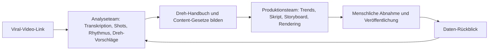

# Kapitel 19: Ein KI-Videoteam mit einem Satz herbeirufen

In WorkBuddy lässt sich die Kurzvideo-Arbeit in zwei KI-Expertenteams aufteilen: eines produziert automatisch Videos, eines zerlegt virale Videos.

| Team | Zuständig | Passende Aufgaben |
| --- | --- | --- |
| **Video-Produktionsteam** | Vom Thema aus: Trend-Sammlung, Themenwahl, Skript, Storyboard, Sprecher, Rendering, Untertitel und Veröffentlichung | KI-Wochenbericht, Produkt-Updates, Wissens-Snacks, Branchenanalysen, Produkt-Reviews |
| **Viral-Video-Analyseteam** | Vom Videolink aus: Video herunterladen, Audio extrahieren, Text transkribieren, Bildsprache analysieren, Analysebericht und Dreh-Vorschläge erzeugen | Virale Strukturen lernen, Wettbewerber-Videos nachbereiten, ein Dreh-Handbuch aufbauen |

Die beiden Teams ersetzen einander nicht: Das Produktionsteam beantwortet „wie ich heute ein Video fertig bekomme", das Analyseteam „warum das Video der anderen viral ging und was ich daraus lerne". Eines produziert, eines lernt – erst die Kombination erlaubt dauerhafte Verbesserung.


## So ruft man es: mit einem Satz beginnen – aber nicht bei einem Satz bleiben

```text
Rufe das Video-Produktionsteam und erstell ein 46-Sekunden-Kurzvideo als KI-Wochenbericht.
```

## Erstes Team: Video-Produktionsteam

Vier Kernrollen: der Produzent **Ling Dao**, der Informationssammler **Ling Yue**, der Content-Planer **Ling Shu** und der Videoproduzent **Ling Ying**. Das sind keine vier umbenannten Chat-Fenster, sondern eine Video-Produktionslinie mit Upstream- und Downstream-Übergaben.


| Rolle | Position | Ergebnisse |
| --- | --- | --- |
| Ling Dao | Produzent / Teamleiter | Aufgaben zerlegen, parallele und sequenzielle Abläufe planen, Ergebnisse bündeln, Prüfpunkte bearbeiten |
| Ling Yue | Informationssammler | Trend-Pool, Quellentabelle, deduplizierte strukturierte Zusammenfassungen, Themen-Kandidaten |
| Ling Shu | Content-Planer | Themenurteil, Skript, Storyboard, Voice-over, Übergänge, Materialliste, BGM- und Untertitel-Rhythmus |
| Ling Ying | Videoproduzent | HTML-Videoprojekt, Sprecherstimme, Untertitel-Sync, Übergangsanimationen, Materialzusammenschnitt, gerenderter Film |

Genau das ist der Kern von Multi-Agent: **Nicht je mehr Rollen, desto besser – sondern jede Rolle hat klare Eingaben und Ausgaben.** Der Sammler schreibt nicht selbst das Skript, der Planer erfindet keine Trends neu, der Produzent schreibt keine Fakten um, und der Teamleiter sorgt dafür, dass der Ablauf nie abreißt.

### Produktionsmotor: HyperFrames

Diese Pipeline beruht auf HyperFrames (offenes Video-Rendering-Framework): Videos werden per HTML gerendert – ideal für Agenten, die strukturierte Projekte erzeugen, die dann das Rendering-Werkzeug als MP4 ausgibt; mitgeliefert werden CLI-Werkzeugkette, TTS, Untertitel, Hintergrundentfernung und Videokomponenten-Vorlagen.

### Schritt 1: Der Sammler gibt den Trends zuerst Quellen

Am zeitraubendsten beim Videomachen ist selten der Schnitt, sondern „was drehe ich heute eigentlich". Ling Yue ruft RSS ab, sucht Nachrichten, scannt Social Media, bündelt KI-Trends und dedupliziert. Die Ergebnisse dieser Phase enthalten mindestens: Titel, Quelle, Veröffentlichungszeit, Ereigniszeit, Originallink, Dynamik-Hinweise und warum es lohnt. **Dynamik hilft nur beim Sortieren – sie ersetzt keine Faktenprüfung.**


### Schritt 2: Der Content-Planer macht aus dem Thema Shots

Steht das Thema, beginnt das eigentliche Kopfarbeit-Stück: „Wie erzähle ich dieses Video?" Ling Shu verantwortet Themeneinschätzung, Skript, Storyboard, Voice-over, Shot-Rhythmus, BGM-Rhythmus und Emotionspunkte.


Hier empfiehlt sich die **erste manuelle Prüfung**: Hat der Anfang in 3 Sekunden einen Haken, stecken in 46 Sekunden zu viele Infos, stimmt das Voice-over, tragen die Bilder wirklich die Aussage? Ein nicht bestandenes Skript geht nicht in Vertonung und Rendering.

### Schritt 3: Der Videoproduzent macht aus dem Storyboard den fertigen Film

Ling Ying übersetzt das bestätigte Skript in HTML, ruft HyperFrames zum MP4-Rendering und erledigt automatisch Azure-TTS-Vertonung, Whisper-Untertitel-Sync, Animations- und Übergangserzeugung, Materialzusammenschnitt und Video-Rendering.


Die Abnahme des fertigen Films heißt nicht nur „läuft er ab": Stimmen Voice-over und Untertitel überein, passen die Shot-Längen, verdeckt Text das Motiv, ist der BGM nutzbar, hat das Material Lizenzrisiken, passt das Bild in die Sicherheitszone der Zielplattform?

### Schritt 4: Veröffentlichen lässt sich automatisieren – aber standardmäßig mit menschlicher Bestätigung

Der Veröffentlichungs-Agent erzeugt automatisch Titel, setzt Tags, lädt das Cover hoch und veröffentlicht über Cloud-Smartphones auf Douyin, WeChat Channels und Bilibili. Sehr mächtig – aber **standardmäßig nicht direkt automatisch veröffentlichen**, es sei denn, Konto, Material, Titel und Compliance-Grenzen sind von Menschen geprüft.


## Zweites Team: Viral-Video-Analyseteam

Erzeugen allein genügt nicht. Content-Erzeugern hilft wirklich das Verstehen von „warum die anderen viral gehen": Video extrahieren, Text transkribieren, Bildgröße und Kameraführung, Schnitt-Rhythmus und Farbstil analysieren und Dreh-Vorschläge erhalten.


| Rolle | Zuständigkeit | Werkzeug / Technik |
| --- | --- | --- |
| A Bao | Teamleiter / Analyse-Kontrolle | Aufgabensteuerung, Ablauforchestrierung, Ergebniszusammenfassung |
| Xiao Kai | Audiobearbeitung und Transkription | ffmpeg, ASR – Video-Audio in vollständiges Sprechermanuskript |
| Xiao Miao | Video-Verstehen und Shot-Zuschnitt | Video-Verstehens-API, ffmpeg – Bildsprache analysieren und Segmente schneiden |

### Analyse-Schritt 1: Video-Download braucht eine Degradationsstrategie

Der komplexeste Schritt ist das Erlangen des Videos; im Design drei Degradationsstufen: offizielle API → Playwright → yt-dlp – es reicht, wenn eine Stufe Erfolg hat, damit der Ablauf weiterläuft.


> Grenze: Video-Download und Analyse müssen die Plattformbedingungen, Urheberrechte und den Rahmen der fairen Nutzung respektieren. Ziel der Zerlegung ist das Lernen von Struktur und Methode – nicht das Weiterverbreiten des Originalvideos.

### Analyse-Schritt 2: Audioextraktion und Text-Transkription

Xiao Kai wandelt mit ffmpeg video.mp4 in audio.mp3 und ruft dann eine Spracherkennungs-API, die das vollständige Sprechermanuskript automatisch transkribiert. Was früher Satz für Satz Abhören und Abtippen war, lässt sich jetzt stabil automatisieren.

### Analyse-Schritt 3: Video-Verstehen und Analyse der Bildsprache

Der spannendste Schritt: Xiao Miao analysiert Bildgrößen, Kameraführung, Übergänge, Schnitt-Rhythmus, Farbstil und Shot-Längen des ganzen Videos. Hinter vielen „gefühlten" Viral-Videos stecken tatsächlich stabile Shot-Gesetzmäßigkeiten.


## Wie beide Teams den Kreislauf schließen



Zuerst mit dem Analyseteam Bildsprache und Rhythmus lernen, dann das Produktionsteam neue Videos erzeugen lassen, nach dem Veröffentlichen weiter die Daten analysieren und damit die nächste Version optimieren. Genau das macht Expertenteams sinnvoller als Einzelwerkzeuge: Sie helfen nicht nur bei einem Video, sondern machen „Lernen, Produzieren, Veröffentlichen, Rückblicken" zu einem wiederholt drehbaren System.

---

> Die allgemeine Entwurfsmethode für Multi-Agent-Aufgabenteilung findet sich im Fortgeschrittenen-Teil unter [Multi-Agent-Systeme entwerfen](/de/workbuddy/adv-multi-agent/).
