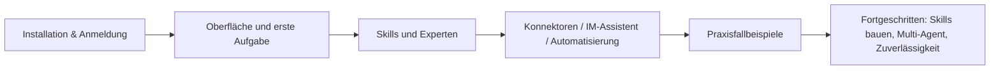

# WorkBuddy Tutorial

**WorkBuddy** ist ein von Tencent entwickelter KI-Agenten-Arbeitsplatz für alle Büro-Szenarien. Sie beschreiben Ihr Ziel in einem natürlichsprachlichen Satz – WorkBuddy plant dann eigenständig die einzelnen Schritte, liest und schreibt Dateien auf Ihrem lokalen Rechner und liefert echte Ergebnisse wie Präsentationen, Tabellenanalysen, Dokumente oder Research-Berichte – statt nur „Fragen zu beantworten".

Dieser Bereich ist in fünf Gruppen gegliedert: „Loslegen → Erweitern → Fallbeispiele → Fortgeschritten → Nachschlagen". Er führt Sie von der Installation bis zum Aufbau Ihres eigenen KI-Arbeitssystems.

## Lernpfad

### Einstieg: WorkBuddy erst einmal in Betrieb nehmen

| Kapitel | Was Sie davon haben |
| --- | --- |
| [WorkBuddy kennenlernen](/de/workbuddy/01-intro/) | Was es kann und wie es sich von Chat-KI unterscheidet |
| [Herunterladen, installieren, anmelden und aktualisieren](/de/workbuddy/02-install/) | Client installieren und sich anmelden |
| [Hauptoberfläche, Aufgaben und Arbeitsbereiche](/de/workbuddy/03-interface/) | Die Oberfläche verstehen und den ersten Arbeitsbereich anlegen |
| [Die erste Aufgabe schnell erledigen](/de/workbuddy/04-first-task/) | Vom einen Satz zum fertigen Ergebnis |
| [Einen wirklich nützlichen Skill laden](/de/workbuddy/05-skills/) | Die KI mit „bewährten Vorgehensweisen" arbeiten lassen |

### Erweiterung: Fähigkeiten anbinden

| Kapitel | Was Sie davon haben |
| --- | --- |
| [Experten und Expertenteams](/de/workbuddy/06-experts/) | Die KI mit „Rollenkompetenzen" arbeiten lassen |
| [Konnektoren verwenden](/de/workbuddy/07-connectors/) | Externe Dienste und Datenquellen anbinden |
| [Mini-Programme und IM-Assistenten einbinden](/de/workbuddy/08-im-assistant/) | Aufgaben direkt in WeChat / Feishu / DingTalk vergeben |
| [Externe APIs anbinden](/de/workbuddy/09-external-api/) | Eigene LLM-API oder lokale Modelle nutzen |
| [Automatisierte Aufgaben](/de/workbuddy/10-automation/) | Zeitgesteuerte Aufgaben – die KI arbeitet von selbst |
| [Weiterführendes: KI-Arbeitssysteme verstehen](/de/workbuddy/11-ai-work-system/) | LLM / Agent / Skill / MCP – alles in einem Kapitel erklärt |

### Fallbeispiele: Von einer Aufgabe zu einem KI-Team

| Kapitel | Was Sie davon haben |
| --- | --- |
| [Das Büro-Trio: Word, Excel, PPT](/de/workbuddy/case-office/) | Die komplette Strategie aus Prompts + Skill-Kombinationen |
| [Wissensmanagement: Sammlungen wirklich nutzbar machen](/de/workbuddy/case-knowledge/) | Die Aufgabenteilung von WPS / ima / Obsidian / WeChat-Favoriten |
| [Investmentanalyse zum Alltag machen](/de/workbuddy/case-investment/) | Acht Research-Prompts + die Stock-Advisor-Pipeline |
| [Ein KI-Videoteam mit einem Satz herbeirufen](/de/workbuddy/case-video-team/) | Zwei Expertenteams für Videogenerierung und Viral-Analysen |
| [Wachstumsschleife für Self-Media](/de/workbuddy/case-self-media/) | Thema → Titel → Cover → Veröffentlichen → Rückblick |

### Fortgeschritten: Aus Fallbeispielen ein eigenes Arbeitssystem machen

| Kapitel | Was Sie davon haben |
| --- | --- |
| [Skills bauen: Wissensdestillation](/de/workbuddy/adv-build-skill/) | Bücher und Videos in ausführbare Skills destillieren |
| [Design von Multi-Agent-Systemen](/de/workbuddy/adv-multi-agent/) | Aufgabenteilung, Übergabeformate, wann sich Aufteilung lohnt |
| [Zuverlässigkeit automatisierter Workflows](/de/workbuddy/adv-automation-reliability/) | Zustandsmaschinen, Idempotenz, Degradation, Alarmierung |

### Nachschlagebereich

| Kapitel | Was Sie davon haben |
| --- | --- |
| [Häufig genutzte Prompt-Vorlagen](/de/workbuddy/ref-prompt-templates/) | 12 sofort einsatzbereite Aufgabenvorlagen |
| [Szenario-Übersichtstabelle](/de/workbuddy/ref-scenarios/) | Ein nach Zielgruppen und Szenarien geordnetes Nachschlagewerk |

## Für wen ist das?

- **Berufseinsteiger**: wollen mit KI Word/Excel/PPT, Dateisortierung, Nachrichtenzusammenfassungen und andere Alltagsaufgaben erledigen
- **Effizienz-Fans**: wollen einen automatisierten Workflow für die Zusammenarbeit von Mensch und KI aufbauen
- **Teamleiter**: möchten Multi-Agent-Zusammenarbeit und die Einführung im Team verstehen

## Sie möchten den kompletten Inhalt?

Dieser Bereich ist eine kuratierte Adaption des Open-Source-Projekts [WorkBuddy Praxis-Handbuch](https://github.com/AlephAITech/WorkBuddyGuide) (MIT-Lizenz, 27 Kapitel plus 9 Beiträge). Die Vollversion enthält weitere Fallbeispiele und branchen- und rollenspezifische Umsetzungen – empfehlenswert zum Online-Lesen auf [workbuddy.homes](https://workbuddy.homes/).
