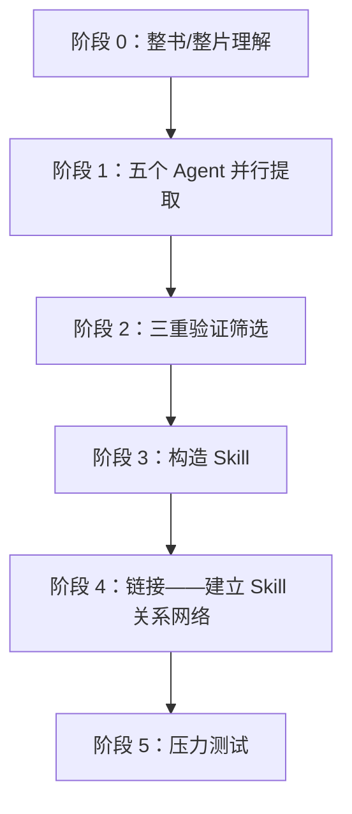

# 一本书读完就忘？用仓颉 Skill 把书里的真方法蒸馏成能反复调用的技能

你买书容易，读完也不难，难的是真遇到问题时，明明记得书里讲过类似方法，翻遍笔记却找不到该从哪一步开始。你如果一本书只留下摘要和几句金句，它很快就会沉进笔记里。这篇讲怎么用「仓颉 Skill」把书里的框架和判断方法，整理成可以反复调用的步骤。

> 场景：买书容易读完也不难，难的是真遇到问题时，明明记得书里讲过类似方法，翻遍笔记却找不到该从哪一步开始。如果一本书只能留下摘要和几句金句，它很快就会沉进笔记里。

## 仓颉 Skill 蒸馏的是什么

你想让书真正能用起来，普通摘要追求更短，仓颉 Skill 追求以后还能用。它先理解全书，再从框架、原则、案例、反例和术语五个方向提取候选内容；你拿到的候选内容还要经过三项检查：

1. 书中是否有至少两处独立内容支持它；
2. 它能否帮助回答书中没有直接讨论的新问题；
3. 它是否提供了超出常识的独特方法。

通过检查的方法会被写成原子 Skill：说明什么情况下调用、需要什么输入、怎样执行、什么时候不适用，还配上测试题检查它会不会在错误场景中乱触发。你一轮完整蒸馏通常会留下全书概览、Skill 索引、术语表、精华长文、多个原子 Skill、测试题和测试结果——原始候选与淘汰原因也保留，方便你回看。



## 安装与蒸馏

你最简单的方式：直接告诉豆包工作「自己安装这个 Skill」，或到技能市场搜索添加。

你跑蒸馏时，先为这本书建一个独立项目或工作文件夹，把原始材料和产物放在一起；你第一次只处理一本书。方法论密度高、案例较多、能指导行动的书更适合蒸馏；小说、散文和金句集更适合做阅读地图。你电子书优先准备 Markdown 或 TXT，普通 PDF 也可以直接交给它（扫描版要先确认 OCR 是否准确）：

```text
请使用仓颉 Skill 蒸馏这本书，把书中的方法论整理成一组可以在真实任务中调用的 Skill。
```

你实测蒸馏《王川宝典》得到 7 个原子 Skill。这个筛选过程也提醒你：蒸馏质量不能用 Skill 数量衡量——书里有内容，不等于每一段都值得变成工具。

## 把蒸馏后的知识用起来

你安装完成后，不必先背下全部 Skill 名称。你直接把真实问题、背景材料和期望结果交给豆包工作，并要求它在开始前说明将调用哪些方法：

```text
用当下空间中的王川宝典 Skill 回答我：
我现在并没有多少钱，但是我很看好 AI 的发展和具身智能的发展。
我需要去投资吗？如果要投资，应该怎么投？以什么策略去做？
```

你实测它按蒸馏出的知识给出三层策略：投自己（每天固定时间学 AI 相关技能、每周用 AI 做一个可复用资产、把思考公开写出去）；小额金融配置只用闲钱（定一个「亏光也不影响生活」的上限、用宽基 ETF 替代个股、不加杠杆、拒绝以短期盈亏为导向）；战略耐心（现在不重注但长期在场，能说清标的「靠什么垄断」时才考虑加大仓位）。

## 知识库怎样配合

你知识库擅长保存原文和找回相关段落，Skill 擅长在合适的问题出现时执行一套方法。你需要核对作者原话、数据和上下文时回到原书或知识库；需要分析、判断和行动时调用 Skill。你把两者放在同一个项目里，来源和方法可以互相校验。

无论蒸馏得多完整，你最终判断仍由人负责——投资、医疗、法律一类高风险内容尤其如此。Skill 可以补检查项和反例，不能替代专业意见、事实核验和人的责任。

## 知识精馏 vs RAG

| 维度 | RAG | 知识精馏（Skill） |
| --- | --- | --- |
| 本质 | 检索——找出最相关的原文片段 | 提炼——从原文提取可执行的方法论 |
| 使用前提 | 用户需要知道该问什么 | 用户描述问题，Skill 自动识别并激活 |
| 质量控制 | 无——任何内容都可以入库 | 三重验证过滤，宁缺毋滥 |
| 调用方式 | 被动等待查询 | 主动匹配场景并触发 |
| 知识形态 | 存储原文（记住知识） | 提纯为执行步骤（运用知识） |
| 边界控制 | 无 | 诱饵测试确保不乱激活 |
| 资源消耗 | 较重（需维护向量索引） | 较轻（Skill 文件即可） |

你用 RAG 解决「知识管理」问题——让你能查到书里有什么；用知识精馏解决「知识运用」问题——让 Agent 在对的时刻主动拿出对的框架。你不知道该问什么时，RAG 帮不了你；Skill 不需要你记得书里有哪些方法论。

这与 Andrej Karpathy 提出的 LLM Wiki 思路（原始资料索引成目录 → LLM 编译成 Wiki → 对 Wiki 做 Q&A → 结果回填增强）在前半程一致：先让 AI 深度阅读、结构化整理、建立索引。你差别在最后几步：LLM Wiki 的产物是 Wiki 条目、用户主动查询；知识精馏的产物是可执行的 Skill 集合、Agent 识别场景后主动激活。两种方案不互斥，但目标不同。

---

同类场景：[用一个精美的个人网站包装你自己 →](/doubaowork/case-personal-site)

## 常见问题

**蒸馏出来的 Skill 越多越好吗？**
不是。你实测蒸馏《王川宝典》得到 7 个原子 Skill，但质量不靠数量——书里有内容，不等于每一段都值得变成工具。

**我不会写 Skill 也能用吗？**
能。你安装完成后，直接把真实问题和材料交给豆包工作，让它先说明会调用哪些方法，再回答。

**蒸馏要准备什么格式的书？**
你电子书优先准备 Markdown 或 TXT，普通 PDF 也可以。扫描版要先确认 OCR 是否准确，否则提取会出错。

**RAG 和知识精馏该选哪个？**
你查书里有什么用 RAG；你让 Agent 主动用方法用知识精馏。你不知道该问什么时，RAG 帮不了，Skill 反而能主动激活。

**高风险内容能全交给 Skill 吗？**
不能。你最终判断仍由人负责，投资、医疗、法律尤其如此。Skill 补检查项和反例，不替代专业意见和人的责任。
