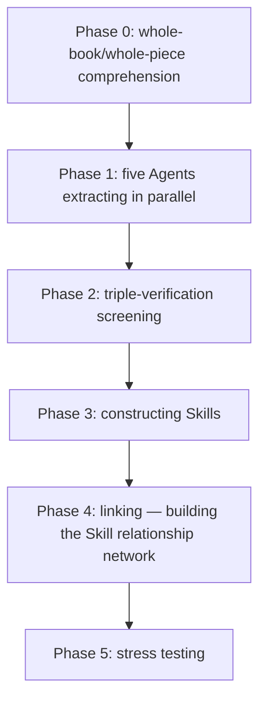

# Read a Book Fast and Actually Master Its Skills

> Scenario: Buying books is easy, finishing them isn't hard either—the hard part is that when a real problem shows up, you remember the book covered a similar method, yet after flipping through all your notes you still can't find where to start. If a book leaves behind only a summary and a few quotable lines, it will quickly sink to the bottom of your notes.

What the "Cangjie Skill" does is distill a book's frameworks and judgment methods into **steps you can call on again and again**, so Doubao Work can pull them out when a suitable problem appears.

## What the Cangjie Skill Distills

An ordinary summary aims to be **shorter**; the Cangjie Skill aims to be **usable later**. It first understands the whole book, then extracts candidate content along five tracks: frameworks, principles, cases, counterexamples, and terminology. Each candidate must also pass three checks:

1. Does the book contain **at least two independent passages** supporting it?
2. Can it help answer new questions the book **never directly discusses**?
3. Does it offer a distinctive method **beyond common sense**?

Methods that pass are written as atomic Skills: when to invoke them, what inputs they need, how they run, and when they don't apply—plus test questions that check whether they misfire in the wrong scenarios. One full distillation typically yields a book overview, a Skill index, a glossary, a long-form digest, multiple atomic Skills, test questions and results—the raw candidates and rejection reasons are kept too, for later review.



## Installation and Distillation

The simplest way: just tell Doubao Work to "install this Skill yourself," or search for it in the Skill marketplace.

When running a distillation, first create a **dedicated project or work folder** for the book so raw material and outputs live together; process only one book at a time. Books dense with methodology, rich in cases, and action-guiding distill best; novels, essays, and quote collections are better suited to a reading map. For e-books, Markdown or TXT is ideal, but a regular PDF can go straight in too (for scanned versions, verify the OCR accuracy first):

```text
Use the Cangjie skill to distill this book, and turn its methodology into a set of skills I can invoke on real tasks.
```

In testing, distilling "The Wang Chuan Compendium" produced 7 atomic Skills. The screening is also a reminder: **distillation quality can't be measured by Skill count**—a book having content doesn't mean every section deserves to become a tool.

## Putting the Distilled Knowledge to Work

Once installed, there's no need to memorize all the Skill names. Just hand Doubao Work your real question, background material, and desired outcome, and ask it to state up front which methods it will invoke:

```text
Answer me using the Wang Chuan Compendium skills in the current space:
I don't have much money right now, but I'm very bullish on the development of AI and embodied intelligence.
Should I invest? If so, how should I invest, and with what strategy?
```

In testing it produced a three-layer strategy from the distilled knowledge: **invest in yourself** (a fixed daily slot for learning AI skills, one reusable AI-built asset per week, publishing your thinking publicly); **small financial allocations from spare money only** (set a cap where "losing it all wouldn't affect your life," use broad-based ETFs instead of individual stocks, no leverage, refuse short-term P&L-driven decisions); and **strategic patience** (no heavy bets now but stay in the game long-term; only consider a bigger position when you can articulate what gives the asset "its moat").

## How the Knowledge Base Complements It

Knowledge bases are good at **preserving original text and retrieving relevant passages**; Skills are good at **executing a method** when the right problem shows up. Go back to the book or knowledge base to verify the author's exact words, data, and context; invoke Skills to analyze, judge, and act. Keep both in the same project so sources and methods can cross-check each other.

No matter how complete the distillation, **final judgment stays a human responsibility**—especially for high-stakes areas like investing, medicine, and law. A Skill can add checklist items and counterexamples, but it can't replace professional advice, fact verification, or human accountability.

## Knowledge Distillation vs. RAG

| Dimension | RAG | Knowledge Distillation (Skill) |
| --- | --- | --- |
| Essence | Retrieval—find the most relevant passages of original text | Distillation—extract executable methodology from the text |
| Prerequisite for use | Users must know what to ask | Users describe the problem; the Skill recognizes and activates on its own |
| Quality control | None—anything can enter the store | Triple-verified filtering; quality over quantity |
| Invocation | Passively waits for a query | Actively matches scenarios and triggers |
| Knowledge form | Stores original text (remembering knowledge) | Purified into execution steps (applying knowledge) |
| Boundary control | None | Decoy tests prevent false activation |
| Resource cost | Heavier (vector index maintenance) | Lighter (just Skill files) |

RAG solves the "knowledge management" problem—it lets you look up what's in the book; knowledge distillation solves the "knowledge application" problem—it lets the Agent proactively produce the right framework at the right moment. **When you don't know what to ask, RAG can't help you; a Skill doesn't require you to remember which methods the book contains.**

This aligns with Andrej Karpathy's LLM Wiki idea (raw material indexed into a catalog → LLM compiles a Wiki → Q&A over the Wiki → results written back to enrich it) through the first half: let AI read deeply, structure, and index first. The difference lies in the last steps: LLM Wiki's product is **Wiki entries** queried by the user; knowledge distillation's product is **an executable set of Skills** activated by the Agent when it recognizes a scenario. The two approaches aren't mutually exclusive—they just aim at different goals.

---

Related scenario: [Package Yourself with a Polished Personal Website →](/en/doubaowork/case-personal-site)
