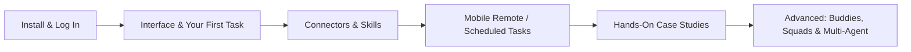

# Doubao Work Tutorial

**Doubao Work** (doubao.com/work) is an AI assistant from ByteDance built for real work tasks. Describe your goal in one plain sentence, and it can read the materials you authorize, break the work into steps, invoke Skills and connectors, and deliver editable work products—Word documents, Excel spreadsheets, PPT decks, research reports—rather than just "answering questions." It integrates deeply with Feishu: documents, sheets, meeting notes, group chats, and Base tables can all be read and written back directly.

This section is organized into five groups—Getting Started, Extending, Case Studies, Advanced, and Quick Reference. The case-study track covers six scenarios (everyday office work, personal productivity, content creation, knowledge management, e-commerce, and finance) across 35 hands-on walkthroughs.

## Learning Path

### Getting Started: Get Doubao Work Up and Running

| Chapter | What You'll Get |
| --- | --- |
| [What Is Doubao Work](/en/doubaowork/01-what-is) | What it can do and how it differs from chat AI |
| [Download, Install, and Log In](/en/doubaowork/02-install) | Get the client set up and pick the right login method |
| [Main Interface, Tasks, and Projects](/en/doubaowork/03-interface) | The three-pane interface; choosing between tasks and projects |
| [Your First Task: Up and Running in Five Minutes](/en/doubaowork/04-first-task) | Create a task → add materials → set permissions → review |
| [Connectors: Start with a Small, Verifiable Task](/en/doubaowork/05-connectors) | Understand MCP and connect external tools safely |
| [How to Choose and Use Skills](/en/doubaowork/06-skills) | How progressive disclosure works + four purposes + practice |

### Extending: Bring in More Capabilities

| Chapter | What You'll Get |
| --- | --- |
| [Remote Control Your Computer from Your Phone: Stay Connected on the Go](/en/doubaowork/07-mobile-remote) | Check progress and send instructions from your phone; tasks never stall |
| [API Services vs. Connectors: Which to Choose](/en/doubaowork/08-api-vs-connector) | One table to tell apart two features that work in opposite directions |
| [How to Build Scheduled Tasks That Deliver Consistently](/en/doubaowork/09-automation) | Disciplined practices + a full news-briefing walkthrough |

### Case Studies: 35 Walkthroughs Across Six Scenarios

**Everyday Office Work**—generate a full document suite from one set of materials, deep Feishu integration, desktop cleanup, life admin:

| Chapter | What You'll Get |
| --- | --- |
| [One Set of Materials, Three Deliverables: Word, Excel, and PPT](/en/doubaowork/case-office) | One prompt generates all three, with numbers that reconcile |
| [Doubao Work's Best Match Is Still Feishu](/en/doubaowork/case-feishu) | Just share a link—read from Feishu and write back to Feishu |
| [Desktop Cleanup: Review the Plan Before Touching Files](/en/doubaowork/case-desktop) | Read-only scan → confirm plan → then execute |
| [Hand Life Admin Over to Doubao Work for a First Draft](/en/doubaowork/case-life) | Health report interpretation, purchase comparisons, travel planning |

**Personal Productivity**—inbox, meetings, documents, spreadsheets, research, daily reports, reading, personal brand:

| Chapter | What You'll Get |
| --- | --- |
| [Inbox Overload: Find What Actually Needs Handling Today](/en/doubaowork/case-inbox) | Email connector + five types of daily digests |
| [One Meeting, from Prep to Actionable Follow-Ups](/en/doubaowork/case-meeting) | Transcript-to-minutes + cross-week task tracking |
| [One Word Doc, from Proofreading to Polished Delivery](/en/doubaowork/case-word) | Beautification, version comparison, privacy redaction |
| [Handle Excel Like a Data Analysis Pro](/en/doubaowork/case-excel) | Beautify → clean → merge → formulas → pivot → dashboard |
| [From Quick Research to a Formal Report](/en/doubaowork/case-research) | Deep-dive research PPT + fact-checking + a Skill for polish |
| [Auto-Summarize Your Daily Report and Get Work Reminders](/en/doubaowork/case-daily-report) | Group messages condensed into digests and reminders |
| [Read a Book Fast and Actually Master Its Skills](/en/doubaowork/case-reading) | The Cangjie Skill distills books into reusable methods |
| [Package Yourself with a Beautiful Personal Website](/en/doubaowork/case-personal-site) | A design-led-website-builder walkthrough |

**Content Creation**—from topic selection to publishing, multi-platform distribution, audio/video, retrospectives:

| Chapter | What You'll Get |
| --- | --- |
| [What to Write Today: From Trending Topics to This Week's Slate](/en/doubaowork/case-topic-selection) | Trending-topic morning brief + hit-article teardown + capacity planning |
| [From Trending Topic to a Finished WeChat Official Article](/en/doubaowork/case-wechat-article) | Fact pack → draft → headline risk table → cover image |
| [One Piece of Content, Tailored for Each Platform](/en/doubaowork/case-multi-platform) | Xiaohongshu / weekly split / four platforms / pre-publish review |
| [Turn a Long Article into a Filmable Script and Storyboard](/en/doubaowork/case-script-storyboard) | Spoken script + second-by-second storyboard sheet |
| [Transcribe Long Audio/Video with Subtitles and Highlight Clips](/en/doubaowork/case-av-transcription) | Timestamped transcript + SRT + clip candidates |
| [Find Your Next Topic in the Comments—and Follow Up](/en/doubaowork/case-comments) | Comment insights + post-publish retrospective workflows |
| [Give Your Personal Brand a GEO Checkup](/en/doubaowork/case-geo-checkup) | An AI-era "being seen" audit |
| [Turn a Hit WeChat Article into a Short Video](/en/doubaowork/case-viral-to-video) | Screenwriter buddy + a full Remotion editing pipeline |

**Knowledge Management**—bookmarks, files, projects, organizational knowledge:

| Chapter | What You'll Get |
| --- | --- |
| [From Random Bookmarks to Actually Searchable Later](/en/doubaowork/case-bookmarks) | Bookmark cleanup + sparks turned into notes |
| [Duplicate Files and Conflicting Versions: Diff First, Decide Later](/en/doubaowork/case-duplicate-files) | File fingerprinting + four handling options + recoverable archive |
| [When a Project Ends, Archive Files, Decisions, and Deliverables Together](/en/doubaowork/case-project-archive) | Project planning with knowledge base and code side by side |
| [Don't Let a Veteran's Expertise Sit Idle: Turn a Knowledge Base into a Skill](/en/doubaowork/case-wiki-to-skill) | A Feishu wiki distilled into an operations SOP Skill |
| [Look Up Company Policy in One Sentence, with Sources](/en/doubaowork/case-policy-search) | Policy search with versions, original text, and owning department |
| [Re-Categorize 541 Prompt Examples](/en/doubaowork/case-prompt-library) | Deriving a taxonomy from real user search queries |
| [Find Stale Knowledge Automatically and Ask the Owner to Confirm](/en/doubaowork/case-knowledge-expiry) | Old knowledge + fresh verification + no silent overwrites on conflict |

**E-Commerce and Finance**—visual production and full investment research workflows:

| Chapter | What You'll Get |
| --- | --- |
| [From One Product Photo to a Full Set of Hero Images](/en/doubaowork/case-product-images) | Transferring the reference-image mechanism + fact locking |
| [After the Close, Turn Market Moves into a Research Checklist](/en/doubaowork/case-market-review) | Post-market review + watchlist digest + scheduled delivery |
| [When Earnings Drop, Check Growth First, Then Growth Quality](/en/doubaowork/case-earnings-quality) | Two-layer earnings workflow + per-unit audit |
| [Researching a Company for the First Time](/en/doubaowork/case-first-company) | Business model breakdown + eight follow-up question templates |
| [From Screening to Valuation: Compare Pricing on a Consistent Basis](/en/doubaowork/case-screening-valuation) | Line-by-line evidence screening + apples-to-apples comparison + reverse valuation |
| [Study the Company, but Also Its Shareholders, Management, and Governance](/en/doubaowork/case-governance) | A governance event timeline instead of personality labels |
| [What Is the Market Actually Arguing About: Bull-Bear Debates and Sell-Side Audit](/en/doubaowork/case-bull-bear-audit) | Shared facts + disagreement matrix + source-graded research reports |
| [From One Candlestick Chart to a Full Investment Review Meeting](/en/doubaowork/case-kline-review) | VLM chart reading + a four-advisor private board |

### Advanced: From Using It to Directing It

| Chapter | What You'll Get |
| --- | --- |
| [Work Buddy or Work Squad?](/en/doubaowork/adv-buddy-or-squad) | Two real tasks to nail the decision + complete prompts |
| [Multi-Agent (Work Squad) in Practice](/en/doubaowork/adv-multi-agent) | How squads work, finding your way back to tasks, when splitting is worth it |

### Quick Reference

| Chapter | What You'll Get |
| --- | --- |
| [Common Prompt Templates](/en/doubaowork/ref-templates) | Ready-to-use prompts for file cleanup, Excel, PPT, minutes, research, briefings, and more |
| [Scenario Lookup Table](/en/doubaowork/ref-scenarios) | Quickly find the right tutorial by role and need |

## Who Is This For

- **Office newcomers**: want to use AI for everyday chores like Office documents, file cleanup, meeting notes, and daily or weekly reports
- **Heavy Feishu users**: want AI to read and write Feishu docs, sheets, wikis, and group chats directly, instead of shuffling data around
- **Content creators**: want an AI production line that runs from topic selection through drafting, distribution, and retrospective
- **Investment research and data roles**: want traceable, reproducible screening, earnings, and valuation workflows on a consistent basis

## Want the Full Version?

This section is a curated adaptation of the open-source project [AlephAITech/DoubaoWorkGuide](https://github.com/AlephAITech/DoubaoWorkGuide), the "Doubao Work Guide" (49 guides and case studies, 31 real tasks). The full version includes more screenshots and video demos—we recommend reading it online at [doubaowork.homes](https://doubaowork.homes/). That guide is a community-maintained, unofficial practice guide; product features and interfaces are subject to the current version of Doubao Work.
