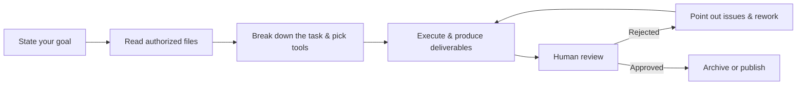

# Chapter 1: Meet WorkBuddy — What Is It, and Why It Works Instead of Just Chatting

If your day is mostly files, spreadsheets, and reports — HR, administration, operations, sales, engineering — here's the plain-language version: WorkBuddy is Tencent's all-scenario workplace AI agent workbench, and it's built for you.

There's one fundamental difference from the AI you've chatted with in a browser. Chat AI is "you ask, it answers," and when it's done answering, the work is still yours. With WorkBuddy, you say "analyze the sales data in this folder and turn it into a reporting deck," and it plans the steps on your own machine, reads the files, runs the analysis, and produces the deliverable. You go from being the person asking questions to the person assigning work and signing off on it.

## From "Answering Questions" to "Delivering Results"

To be concrete: once you grant permission, WorkBuddy can read and process local files directly and take on work like this:

- Batch file processing, document generation, spreadsheet analysis, PPT creation
- Multimodal content creation, industry research, local knowledge base building

When a task gets more complex, it breaks the work down itself and runs multiple agents in parallel. The time you'd spend switching between tools, files, and tasks is the time it saves you.

Throughout the whole process, you never have to upload files one by one, nor walk the AI through every next step. Here's what one full task looks like:

Note that "human review" step: reviewing is always your job. It does the work, you check the work — build that split starting from your very first task.

For example, you can simply tell WorkBuddy: analyze the sales data in this folder and generate a presentation for the report. WorkBuddy is built for complete work tasks. It will read the relevant files on its own, understand the data, complete the analysis and summary, and produce a final deliverable you can view and edit.

## Three Core Capabilities

**It understands plain language.** One natural-language sentence is enough to make your need clear. There's no command syntax to learn.

**It can figure out how to do the job.** It plans the execution steps when it receives the task, instead of waiting for you to feed it one instruction at a time.

**It can actually operate your computer.** It reads and writes files and delivers results, landing them on your machine.

To handle different kinds of work, it also ships a few extensions: multi-model switching (Hunyuan / DeepSeek / GLM / Kimi / MiniMax, and more) so you can pick the right model per task, plus MCP Servers and Skills to extend its toolbox and professional expertise. Don't worry if those terms look unfamiliar right now — the [Skills](/en/workbuddy/05-skills/) and [Connectors](/en/workbuddy/07-connectors/) chapters break them down one at a time.

## Will It Wreck My Computer?

Handing your machine over to an AI for the first time, you're going to wonder. For high-risk scenarios like local file operations and terminal execution, WorkBuddy ships high-risk command interception and permission controls. In practice there's also folder-level authorization — it can only touch directories you've authorized. Even so, before you point it at real business data, practice in a scratch directory first.

## FAQ

**Do I need to know how to code?**
No. It's built for people who aren't programmers, and everything runs in natural language.

**How is it different from a browser-based chat AI, in one line?**
Chat AI delivers "text answers." WorkBuddy delivers "finished work" — decks, spreadsheets, reports you can keep using and keep editing.

**Is it free?**
You can use it as soon as it's installed. Running tasks consumes credits, and different models consume them at different rates. You can see the cost and switch models in the task view.

**Would it be useful for my role?**
HR, administration, operations, sales, and engineering all have matching scenarios. The test is simple: does your work include a step where someone reads a pile of materials and produces one thing?

---

Next up: get it installed—[Download, Install, Sign In & Update →](/en/workbuddy/02-install/)
