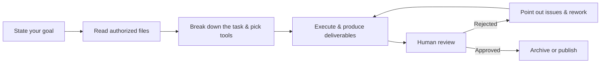

# Chapter 1: Meet WorkBuddy

**WorkBuddy** is the latest all-scenario workplace AI agent workbench from Tencent.

It serves a wide range of workplace roles — HR, administration, operations, sales, engineering, and more — and is an AI office application that can think, execute tasks, and deliver results just like a real colleague.

## From "Answering Questions" to "Delivering Results"

Unlike traditional AI assistants, WorkBuddy doesn't just chat, answer questions, or offer suggestions.

Describe your need in one plain sentence, and it understands the goal, autonomously plans the execution steps on your local computer, and completes complex multimodal tasks.

Once you grant permission, WorkBuddy can read and process local files, automatically handling batch file processing, document generation, spreadsheet analysis, PPT creation, multimodal content creation, industry research, local knowledge base building, and more.

For more complex tasks, it can break the work down on its own and run multiple agents in parallel, cutting out the cost of manually switching between tools, files, and tasks.

For example, you can simply tell WorkBuddy: analyze the sales data in this folder and generate a presentation for the report.

WorkBuddy will read the relevant files on its own, understand the data, complete the analysis and summary, and produce a final deliverable you can view and edit.

Throughout the whole process, you never have to upload files one by one, nor walk the AI through every next step.

WorkBuddy is built for complete work tasks.

Its core capability comes down to three things: **it understands plain language, it can think and plan on its own, and it can actually operate your computer to deliver results.**

To handle different types of tasks, WorkBuddy also offers multi-model switching (Hunyuan / DeepSeek / GLM / Kimi / MiniMax, and more), MCP Servers, Skills, and other capabilities.

You can pick the right model for each task, and extend WorkBuddy's tools and professional expertise through MCP and Skills.

For scenarios like local file operations and terminal execution, WorkBuddy also provides high-risk command interception and permission controls to reduce the risks of autonomous AI execution.

Want to rate WorkBuddy? Head over to [GuanCha](https://watcha.cn/) and share your honest review~

