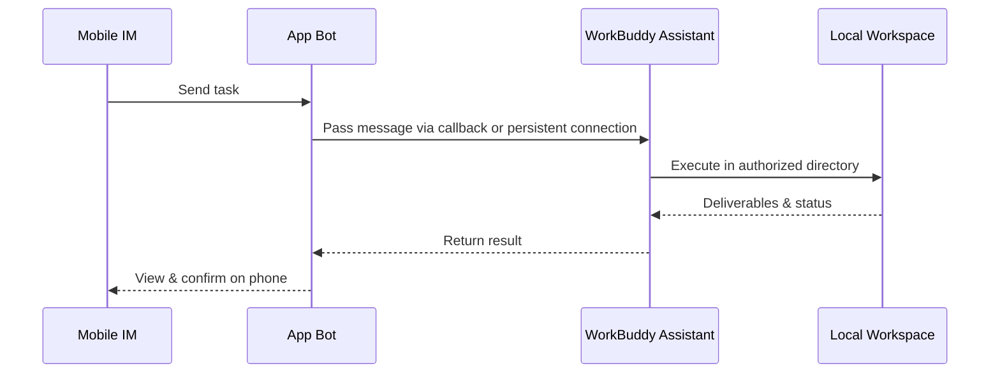

# Chapter 8: Connecting the Mini Program and IM Assistant in WorkBuddy

Installing the client is just the first step. This chapter takes WorkBuddy from "only usable at your desk" to "assigning tasks from your phone anytime": the Mini Program lets you monitor and dispatch remotely, and the IM Assistant lets you hand out tasks right inside WeChat, Feishu, or DingTalk.

## The Mini Program's Two Modes

| Mode | Where tasks run | Depends on your computer being online | Best for |
| --- | --- | --- | --- |
| Local mode | Your connected computer | Yes | Local files, local Skills, existing workspaces |
| Cloud mode | An isolated cloud environment | No | Research, writing, ad-hoc analysis, parallel tasks |

**First use**: open the WorkBuddy Mini Program through the official entry point and sign in. Check whether you're in local or cloud mode; in local mode, confirm the target computer is online and connected correctly.

## How the IM Assistant Works

## Connecting the WeChat Assistant: Just Scan a QR Code

1. Open WorkBuddy, click the gear icon under "Assistant" on the left, and go to "Assistant Settings";

2. Find "WeChat Assistant Integration" and click "Configure";

3. Wait for the binding QR code to appear, then scan it with WeChat on your phone;

4. Once the card shows "Bound," start by sending a read-only test command;

5. To switch WeChat accounts, unbind the current account first, then scan again.

> The QR code expires after a while. If it stays stuck on "Binding," the code has expired, or the scan fails, close the configuration window and re-enter it; if needed, restart WorkBuddy and generate a new QR code.

## Connecting Feishu

1. WorkBuddy → Settings → Assistant Settings → select Feishu;

2. Create a custom enterprise app on the Feishu Open Platform;

3. Add bot capabilities to the app;

4. Grant the minimum permissions required by the current WorkBuddy page;

5. Under "Credentials & Basic Info," get the App ID and App Secret;

6. Enter the credentials in WorkBuddy, and generate or copy the callback information;

7. In Feishu, configure event subscriptions and callbacks, adding events such as receiving messages and card interactions;

8. Create a version and publish the app, then send the bot a read-only test task in Feishu.

## Connecting DingTalk

1. Sign in to the DingTalk Developer Console with an enterprise admin account, go to "App Development," and create an app;

2. Add bot capabilities to the app, fill in the bot's name, description, and avatar, and confirm publication;

3. Grant the required permissions;

4. Get the app credentials and paste them back into WorkBuddy. Preferably validate everything in a test organization or test group first.

---

> Once your IM Assistant is bound, pair it with [Automated Tasks](/en/workbuddy/10-automation/) to chain "scheduled runs + IM push" into a single pipeline.
