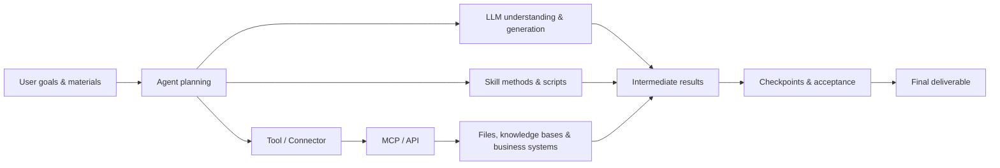
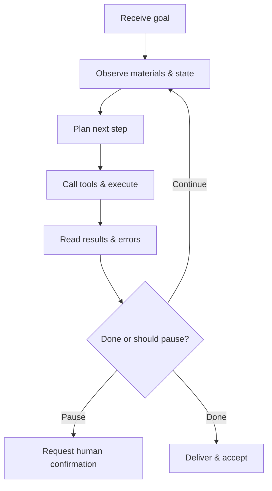

# Further Reading: How Does an AI Work System Actually Run? One Chapter on What LLM, Agent, and Skill Each Do

You've worked through the first ten chapters, and they were all about "how to use WorkBuddy." This chapter is about "why it's designed this way" — putting LLM, Token, Prompt, Agent, Tool, Skill, MCP, knowledge base, and workflow into a single picture, and making clear what each role can and cannot do. Read this one and you'll get up to speed much faster with any AI work tool you pick up later.

## The Big Picture: What Happens in an AI Task

In one sentence: **the model handles understanding and generation, the Agent organizes action around the goal, the Skill supplies professional methods, tools and MCP/API let the action reach the real world, and the human owns boundaries and acceptance.** Among the five roles, the model is the brain, the Agent is the dispatcher, the Skill is the expert manual, the tools and interfaces are the hands and feet, and you are the judge.

## LLM: A Base Model That Predicts Content from Context

An LLM (Large Language Model) learns language and knowledge patterns from massive amounts of data, and generates the most likely continuation given the current input. At its core it's a "predict the next thing" engine — not a database, and not someone who takes responsibility on your behalf.

**What it's good at**: understanding and rewriting text, extracting structure from materials, generating drafts and code, mimicking formats and styles.

**What it doesn't guarantee by default**: it doesn't guarantee every fact is correct; it doesn't know your company's latest internal state (unless you provide materials or connect systems); it doesn't automatically have file, account, database, or network permissions; and it doesn't bear business or legal responsibility — you can't hand the blame to it.

**Why it "hallucinates"**: the model's goal is to generate coherent content, not to serve as a built-in fact database. When material is missing, the question is vague, or you push it for a definite answer, it may fill the gap with plausible but untrue content. That's not a bug — it's a side effect of "probabilistic completion." **Being confident and being correct are two different things.**

Ways to reduce hallucination: you provide reliable materials; you require it to cite where things came from; you allow the answer "cannot confirm"; you separate fact extraction from recommendation generation; and you review high-impact conclusions yourself. Ask it for the latest data and it can't produce it — unless you've connected a system.

## Tokens and the Context Window: How Much the Model Can See

A token is the basic unit a model processes text in — not exactly the same as a word count. The context window is the total input, history, and output a model can handle in a single inference — think of it as the model's **short-term memory capacity**: what fits is visible; what doesn't fit gets dropped or compressed.

More context isn't always better. Stuff every file and months of conversation into one task and you may get new and old requirements conflicting, key materials drowning in irrelevant content, and longer waits at higher cost. A sounder approach: organize "current rules, confirmed facts, decision records, and this run's inputs" per project, and use files and project memory for long-running work — **don't treat your chat history as a database**.

## Prompt: A Task Description, Not a Magic Spell

A good Prompt doesn't win by length; it wins by having enough information to execute and verify — writing a Prompt means writing a task sheet you could hand to a colleague.

| Element | Question it answers |
| --- | --- |
| Goal | What problem gets solved in the end |
| Input | Which materials or systems to use |
| Actions | Analyze, organize, generate, or write |
| Constraints | What must not be done, which rules to follow |
| Output | What files or structures to deliver |
| Acceptance | How to judge correctness and usability |

The most overlooked of the six elements is **acceptance**: without acceptance criteria, the model can only deliver according to its own interpretation.

Going from one-off to reusable is a step-by-step process of consolidation: **Prompt** (how you say it this time) → **task card** (a fillable structure for similar tasks) → **SOP** (fixed steps and checkpoints) → **Skill** (packaging a stable SOP, scripts, and resources into an executable capability). Note: not every Prompt deserves to become a Skill — let it succeed repeatedly first, then consolidate gradually.

## Agent: An Executor That Loops Around a Goal

An Agent doesn't just "answer once" — it keeps running a loop: **understand the goal, observe the environment, decide the next step, call tools, read results, adjust the plan, until delivery or a stop condition is hit.**

| Dimension | Chat model | Agent |
| --- | --- | --- |
| Core action | Generate an answer | Plan, call tools, execute, and deliver |
| Process | Usually one-shot generation | Multiple rounds of observation and action |
| Risk | Wrong content | Wrong content + real-world side effects |
| Control | Prompting and review | Permissions, checkpoints, logs, and rollback |

The key difference is the last row: when a chat model is wrong, at worst it misleads you; when an Agent is wrong, it may actually delete your files, send your email, or change your database. So what an Agent needs isn't a smarter prompt — it's harder guardrails. You hand it the goal and the boundaries; the guardrails are yours to set.

**An Agent's stop conditions**: a good Agent shouldn't "always find a way to keep going." You want it to stop when it should. When key inputs are missing, goals conflict, permissions are insufficient, costs exceed budget, an action is irreversible, or results can't be verified, it should pause and ask you. An Agent that never stops is more dangerous than a dumb one.

## Tool: Letting the Agent Actually Do Things

A Tool is a specific capability the Agent can call (read a file, run a search, generate a spreadsheet, send a message); a Connector is usually a third-party service connection the product has already wrapped up — you authorize it and use it directly.

The most common misunderstanding among everyday users: **a model "understanding" something doesn't mean it "can" do it.** The model can explain "how to send an email," but it can only actually send one after it's been given a mail tool and account permission. When a task fails, ask first "was the tool connected, was permission granted" — not "is the model just not good enough."

For every tool, ask yourself five questions: whose identity does it use; what can it read; what can it modify; where does the data go; and how to stop and roll back on failure.

## Skill: Reusable Professional Working Methods

A Skill isn't a smarter model — it organizes the instructions, scripts, knowledge, and templates a class of tasks needs. Its value isn't "making the model stronger" but **locking in the steps that are easy to get wrong or skip** — have the model write invoice handling from scratch each time, and ten runs may produce three different approaches; write it as a Skill, and ten runs take the same proven path.

Remember two things: a Skill is "packaged method," not a "capability guarantee"; and installing a third-party Skill is just like installing a browser extension — convenient, but check first what permissions it wants (which directories it reads, whether it sends data out, whether it needs an API Key, how to disable it), and test it in an isolated directory first.

## MCP: The Standard Interface That Lets AI Connect to Tools and Data

MCP (Model Context Protocol) defines how an AI client discovers and calls external tools and reads resources. Think of it as "the USB port of the AI world" and you've got it: tool providers expose capabilities under one standard, AI clients use them under the same standard, and nobody re-adapts per vendor.

**What MCP solves**: reducing repeated integration cost — connecting a CRM or a database no longer requires a bespoke connector for each.

**What MCP doesn't solve**: it doesn't automatically judge whether data use is compliant; it doesn't safeguard your keys for you; it doesn't guarantee tool results are correct. It solves "how to connect" — "is it safe once connected" is still your responsibility.

User-level vs. project-level: put shared capabilities at the user level; keep sensitive connections like customer and database access at the project level, isolated, to avoid accidental cross-project calls.

## How API and MCP Relate

An API is an interface between pieces of software (query data over HTTP, create a record); an MCP Server can call one or more APIs internally and then expose the tools in a form that's easier for Agents to use. In one sentence: **APIs are the foundation, and MCP is a door built on that foundation that Agents can walk right through.** Using a mature MCP is more convenient, but you still need to review what requests and permissions it wraps — convenience doesn't mean exemption from review.

## Knowledge Bases, RAG, and Memory

| Concept | What it stores | Main risk |
| --- | --- | --- |
| Conversation context | The current task's exchanges | Too long, conflicting, stale |
| Knowledge base / RAG | Searchable facts and materials | Poor sources, outdated versions, unretrievable |
| Memory | Preferences, long-term rules, project state | Mistakes carried forward for a long time |

To distinguish them in one sentence: **context is the short-term memory of this conversation, the knowledge base is a reference room you can consult anytime, and memory is the long-term settings kept across tasks.** The most dangerous thing about memory is that "it never notices its own expiration" — a rule you wrote wrong six months ago will be applied as gospel by the Agent, over and over. Write one rule into memory and it remembers it, so you have to be careful about what you put there.

## Workflow vs. Agent

- **A Workflow is the standardized production line you already know**: steps are fixed at design time and executed in sequence or by branch;
- **An Agent is a thinking executor that makes its own calls**: you give it only the goal, and it decides each next step at runtime.

| Dimension | Workflow | Agent |
| --- | --- | --- |
| Is the path preset? | Yes, fixed at design time | No, decided at runtime |
| Controllability | High, easy to predict and roll back | Lower, the path may change |
| Debugging difficulty | Low, steps are clear and traceable | High, requires logs and intermediate state |
| Best for | Clear, repeatable steps with high compliance needs | Uncertain paths, environment feedback, open-ended goals |
| Typical failure | Stuck at a step, an uncovered branch | Going off track, infinite loops, unauthorized actions |

Common misconceptions: "Agents are always better than Workflows" — no, deterministic tasks are more stable and cheaper as Workflows; "Workflows can't contain intelligence" — wrong, a node can absolutely call a model for summarizing or classifying; it's just that "which path to take" is decided by the flow; "fully autonomous Agents are best" — over-delegating makes failures much harder to pinpoint.

How the two work together: the Agent writes stable subtasks into fixed flows (there's a Workflow behind every Skill) and only exercises judgment where things are uncertain; and a judgment node on the production line can likewise be handed to an Agent to handle unstructured input. You decide, based on the nature of the work, which part goes to a Workflow and which part goes to an Agent.

## FAQ

**I keep losing track of who does what among LLM, Agent, and Skill. Help?**
Memorize this line: the model is the brain (understanding and generation), the Agent is the dispatcher (organizing action around the goal), the Skill is the expert manual (supplying professional methods), tools and interfaces are the hands and feet (reaching the real world), and you are the judge (boundaries and acceptance).

**Why does AI state nonsense so confidently?**
Because its goal is to produce coherent content, not to look things up in a fact database. When material is missing, the question is vague, or you push it for a definite answer, it fills the gap with plausible but untrue content. The fix: give it reliable material, allow it to say "cannot confirm," and review high-impact conclusions yourself.

**My tasks keep going off track — is the model just weak?**
Don't blame the model yet. When a task fails, ask first "was the tool connected, was permission granted" — the model *understanding* how to send email doesn't mean it has a mail tool and an account. Sorting out tools and permissions usually beats switching models.

**Where should I start among Prompt, Skill, and Workflow?**
Write good Prompts first (materials, result, and boundaries stated clearly). Once you catch yourself repeating the same instructions for the same kind of work, consolidate it into a Skill. For work with clear, repeatable steps, build a Workflow. Not every Prompt deserves to become a Skill — succeed repeatedly first, then solidify.

---

Next up: back to something you can use right away — [Loading a Skill You'll Actually Use in WorkBuddy →](/en/workbuddy/05-skills/)

> Put this knowledge to work: [Automated Tasks](/en/workbuddy/10-automation/) are Workflows, [Expert Teams](/en/workbuddy/06-experts/) are multi-agent systems, and [Skills](/en/workbuddy/05-skills/) are packaged methods — look back at them after this chapter and the structure will be much clearer.
