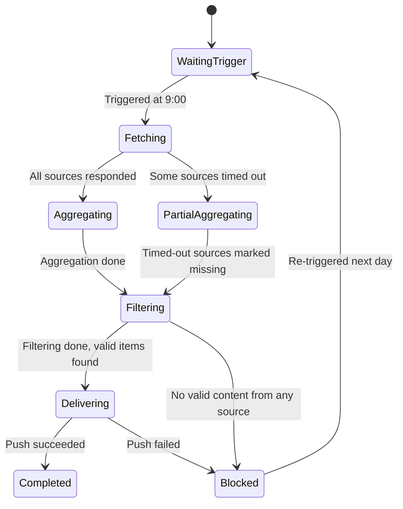

# Chapter 25: Scheduled Task Fell Apart on Day Three? Make Automation Actually Reliable

You take a task that ran fine by hand, turn it into a scheduled job, and assume you're done for good — then one day a data source misbehaves and pushes out a pile of half-finished content, or a retry sends the same message three times. The hard part of automation isn't getting it to run; it's keeping it running. This chapter uses "daily AI hotspot topic aggregation" as a running case to walk through everything you have to handle on the path from manual to scheduled. Follow it and your scheduled tasks will misbehave a lot less.

## Case Background: A Content Blogger's Daily Topic Task

The AI field moves fast, and every day you need to sift through multiple information sources to find today's worthiest topics. Doing it manually by hand is slow and easy to miss things. A typical topic request:

```text
I'm a blogger in the AI field, focusing on AI tutorials, AI tools, AI coding, AI reviews, and the like.
Find today's AI hotspots for me so I can pick the day's topics.
Sources:
- Recent viral WeChat Official Account articles (@wechat-article-search)
- Today's trending AI projects on GitHub (@GitHub热门项目)
- Multi-engine AI news aggregation (@多引擎搜索)
- AI hotspot tracking (@AIHOT)
```

Run it once manually and WorkBuddy calls all four data sources in parallel and produces a consolidated list of the day's AI hotspots. Once that works, the next step is turning it into a scheduled task: run automatically at 9:00 every morning and push the results to a designated destination.


## Three Thresholds Before Automating

Not every task is ready for immediate automation. Check it against these three first:

1. **The same Prompt has run manually at least three times**, with output quality and format basically stable;
2. **Trigger conditions, input sources, and acceptance criteria are clear**: when it runs, which data sources it depends on, what format the output takes;
3. **It has an owner, alerts, and a way to disable it**: who handles failures, and how to pause it temporarily without affecting other flows.

If you're still tweaking the Prompt frequently or the data sources aren't stable, keep running it manually — don't rush to automate.

## Setting Up the Automated Task

Once manual runs confirm the results, just tell WorkBuddy in the same conversation:

```text
Turn this task into an automation that runs every morning at 9:00,
and send the results to [a designated Feishu group / email / WeCom notification].
```

WorkBuddy saves the current Prompt and data source configuration as a scheduled task and runs it automatically at the set time.


## Designing the Automated Task as a State Machine

Automation isn't "just get it running." In the real world, every run can hit data source timeouts, no relevant items that day, API rate limits, or an unreachable push target. Design the task as a state machine, where every state has explicit success conditions and failure exits:



Remember the key principle: **a partial data source failure should not block the whole task** — mark it missing and keep aggregating; on a push failure, preserve the results and raise an alert, never losing content that was already generated.

## Data Source Readiness Checks

A scheduled trigger doesn't mean the data sources are ready — check availability at the start of every run:

| Data source | What to check | If unavailable |
| --- | --- | --- |
| @wechat-article-search | Search API reachable, returns non-empty results | Mark missing, continue with other sources |
| @GitHub热门项目 | GitHub API not rate-limited | One backoff retry, then mark missing if it fails |
| @多引擎搜索 | Search engines reachable | Mark missing, continue with other sources |
| @AIHOT | Hotspot tracking service healthy | Mark missing, continue with other sources |

Only output the full hotspot list when at least three of the four sources are healthy; if all fail, enter the Blocked state, push an alert, and re-trigger the next day.

## Content Quality Gates

Reachable data sources don't guarantee valid content. After aggregation, filter along four dimensions: **relevance** (genuinely AI-related), **timeliness** (same-day content, excluding stale hotspots), **deduplication** (the same event from multiple sources merged into one entry), and **minimum volume** (fewer than 5 valid items gets flagged as "not enough hotspots today").

Quality has three tiers: **pass** — output as normal; **warning** — some sources missing, noted at the top of the output; **blocked** — too few valid items, so push only an explanation instead of the body.

## A Fixed Output Structure

```text
📋 AI Hotspot Topic Daily — 2026-07-10

[Today at a glance]
Valid items: 18 | Sources: 4/4 | Run time: 09:02

🔥 High heat (good for quick trend-jacking)
1. [Model name] released, [core capability] — Sources: AIHOT + GitHub
   Heat index: ★★★★★ | Suggested angle: feature review / usage tutorial

📈 Rising topics (good for deep analysis)
2. [Topic] sparks discussion — Source: WeChat Official Accounts
   Heat index: ★★★ | Suggested angle: opinion analysis / case breakdown

⚠️ Data source notes
GitHub: OK | WeChat: OK | Multi-engine search: OK | AIHOT: OK
```

With the format fixed, you can finish your topic decisions in 5 minutes instead of reformatting everything each time.

## Push Targets and Idempotency

| Push target | Best for | Notes |
| --- | --- | --- |
| Feishu group message | Sharing topics with a team | Record the message ID to avoid duplicate pushes |
| Personal notification | Individual use | Same as above |
| Feishu document (append) | Keeping history | Append by date, never overwrite history |
| Email | Cross-platform notification | Record the sent message ID |

Remember the **idempotency principle**: when a task retries after a push failure, it must not re-send content that was already pushed successfully. Give each run a unique batch ID (e.g. `ai-hotspot-2026-07-10`), record the state after a successful push, and on retry check that state and skip completed steps.

## Timeout and Retry Strategy

| Failure type | Retry? | Strategy |
| --- | --- | --- |
| Data source API timeout | Yes | Wait 10 seconds, retry once; mark missing if it still fails |
| GitHub API rate limit (429) | Yes | Wait per Retry-After, at most 2 times |
| Auth failure (401/403) | No | Escalate to a human, no auto-retry |
| Push target unreachable | Yes | 2 retries with exponential backoff, then alert and keep the results |
| Empty aggregation result | No | Enter blocked, push an explanation, re-trigger next day |

Retry only transient faults — never retry on input or configuration problems.

## Resumable Runs and Actionable Alerts

Have each run generate a state file recording completed steps and outputs (batch ID, status, per-source status, item counts, last error). After a push failure, resume from the `delivering` step instead of re-fetching and re-aggregating.

Make the alert content something a person can act on immediately — batch, status, failure reason, impact, suggested handling steps, and a recovery entry point. "Task failed, please check" doesn't tell you enough to do anything.

## Degraded Delivery and Logging

When some data sources fail, don't wait for everything to be ready: 3+ sources healthy → output the list with missing sources flagged; 2 healthy → output a simplified list marked incomplete; 1 or 0 → skip the body and push only an explanation and alert. Degraded results must explicitly state source coverage — **never masquerade as a complete run**.

Log each run: batch ID and trigger type, per-source response status and latency, item counts after aggregation and filtering, push result, total duration and errors, and run cost (tokens, API calls). Don't log the body of the hotspot content.

## Pre-Launch Drills

Before going live, walk through this table scenario by scenario:

| Scenario | Expected behavior |
| --- | --- |
| All data sources healthy | Full list output, push succeeds |
| GitHub API rate-limited | Backoff retry; if still failing, mark missing and continue aggregating |
| No AI hotspots today | Too few valid items; output an explanation, don't push an empty list |
| Push target unreachable | 2 retries, then alert and keep the results |
| Duplicate trigger (manual and scheduled at once) | Detect the batch ID and skip the duplicate run |

## Automated Task Definition Template

Write the task out using this template and maintenance gets much easier later:

```text
Task name: AI Hotspot Topic Daily
Trigger: Every day at 09:00 (weekdays)
Prompt: [full Prompt text]
Data sources: @wechat-article-search / @GitHub热门项目 / @多引擎搜索 / @AIHOT
Quality gates: ≥ 5 valid AI-related items; ≥ 3 available data sources
Output format: structured hotspot list (with source, heat, suggested angle)
Push target: [Feishu group / personal notification / Feishu document append]
Idempotency: batch ID = ai-hotspot-{date}; mark after successful push, never re-push
Retry strategy: retry data source timeouts once; 2 backoff retries for push failures; escalate everything else to a human
Alerts go to: [personal Feishu notification]
Owner: [the blogger]
Disable via: WorkBuddy automation task management page → Pause
```

## From Personal Automation to a Team Service

| Dimension | Personal use | Team service |
| --- | --- | --- |
| Push target | Personal notification | Team Feishu group |
| Topic direction | A single direction | Multiple directions, categorized pushes |
| Review process | Personal judgment | Distributed after editor confirmation |
| Failure handling | Handle it yourself | Named owner and backup handler |
| Cost attribution | Personal account | Team budget |

Expanding into a team service means adding: a clear owner, a runbook, permissions (who can change the Prompt and push configuration), and a change management process.

**The advanced form of automation isn't having zero humans — it's that the happy path rarely disturbs people, while the failure path quickly reaches the right person.** After launch, keep iterating based on how it's actually used (Prompt tuning, data source changes, format updates, schedule adjustments), and follow the "change → verify manually → re-save" flow for every adjustment — never experiment directly on a scheduled task.

## FAQ

**A task ran fine once — can I schedule it right away?**
Run it manually at least three times and get the output stable first. A task with unclear trigger conditions, data sources, or acceptance criteria will only have its instability amplified by a schedule.

**If one data source goes down, does the whole task fail?**
No — if you've designed it as a state machine. When some sources time out or go missing, you mark them and keep aggregating. Only a total failure puts it into Blocked with an alert, and it re-runs the next day.

**Will retries send the same message several times?**
Not if you handle idempotency. Give each run a unique batch ID, record the state after a successful push, and skip completed steps on retry — then nothing gets sent twice.

**Is content lost when a push fails?**
It shouldn't be. Have the task preserve what it generated and raise an alert, then resume from the `delivering` step instead of re-fetching and re-aggregating.

**What changes when a team uses it instead of one person?**
Owner, review, and permissions. When you expand into a team service, decide who can edit the Prompt, who confirms distribution, and who picks up failures — then add a runbook and a change process.
