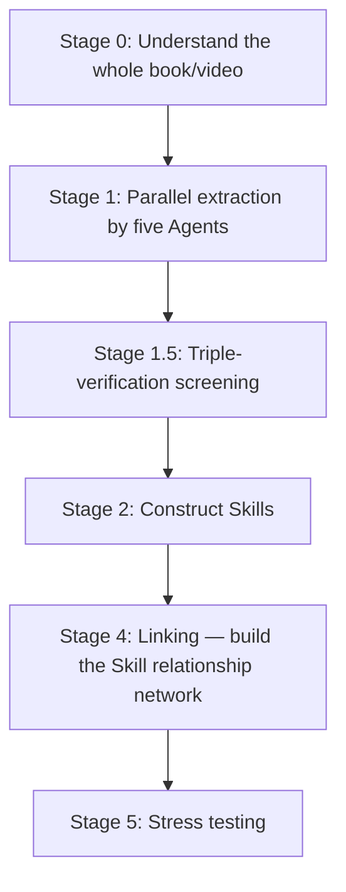
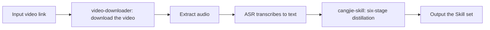

# Chapter 22: Read the Whole Book and Still Can't Use It? Distill It Into a Skill That Actually Runs

You finish a book, take notes, highlight the good lines — and two weeks later a real problem shows up and not one of them is any use. You know the answer is in there somewhere, but you can't pull it out. The knowledge is sitting in your head; the activation path isn't. Besides distilling your own SOPs into Skills, there's a less laborious route: use [cangjie-skill](https://github.com/kangarooking/cangjie-skill) (the Cangjie skill; v1 distills books, v2 adds video distillation) to distill knowledge into Skills. This chapter answers two questions: how a methodology from a book or a video becomes a Skill an Agent can invoke automatically, and how that differs fundamentally from RAG retrieval.


## The Starting Problem: Knowledge You've Read but Can't Use

AI models have already ingested plenty of classic books during training, yet in actual Q&A they often produce "correct platitudes" — every word accurate, but no actionable steps for the specific problem. This isn't a hallucination problem; it's an **invocation problem**: the AI knows what's in the book, but doesn't know which framework to proactively pull out in which situation.

You hit the same wall as a human reader: you finish a book and can't get a grip on the methodology — the knowledge is in memory, but the activation path is unclear. With books you've read, you often can't recall where they're supposed to apply. Knowledge distillation exists to solve exactly this "learned it, can't use it" gap.

## Defining Knowledge Distillation

**Knowledge Distillation for Skills**: extracting atomic units of knowledge from books or videos — units with independent trigger conditions and execution steps (Skills) — so that an Agent automatically activates them in matching scenarios and produces an actionable path forward.

In chemistry, distillation separates a mixture into pure components by boiling point; knowledge distillation separates knowledge along five dimensions — "frameworks / principles / cases / counterexamples / terminology" — purifying only what's genuinely useful into executable Skills. Think of it as compressing a book into something you can call.

Knowledge distillation is **not**: summarization (compressing the original), reading notes (structuring the original), or a RAG index (storing passages for retrieval). It converts methodology into execution units an Agent can automatically invoke in real scenarios.

## The Six-Stage Distillation SOP

Work these six steps in order and the book turns into Skills you can use:



Take distilling "The Copywriter's Handbook" as an example:


### Stage 0: Understand the Whole Book / Video

Don't start by pulling out golden quotes — first grasp the skeleton of the entire book: its central thesis, the core chain of argument, how key terms are defined and used, and the author's own limitations and blind spots. This step sets the quality ceiling for everything extracted later — skip it and you can easily mistake a view the author opposes for a method they advocate.

### Stage 1: Parallel Extraction by Five Agents

Five Agents scan the full text simultaneously across five dimensions, working independently without interference, to avoid the blind spots of a single reading perspective:

| Agent | Extraction target |
| --- | --- |
| Framework extractor | The author's analytical or decision-making frameworks |
| Principle extractor | Behavioral principles reusable across scenarios |
| Case extractor | Positive cases and success paths |
| Counterexample extractor | Failure cases and cautionary lessons |
| Terminology glossary | Specialist terms and their definitions |


Running five Agents in parallel is faster than you reading it five times. Give each one a single dimension to scan and you get the full picture.

### Stage 1.5: Triple-Verification Screening

Every candidate knowledge unit must pass three gates; anything that fails is eliminated outright:

| Verification type | What it checks |
| --- | --- |
| Cross-domain verification | The method appears in at least two independent scenarios in the book — not a one-off |
| Predictive power test | Can it derive answers to problems the book never directly discusses? |
| Uniqueness check | Is it common sense anyone could state? Common sense doesn't make a Skill |

Quality over quantity: a book typically yields 50–100 candidate units, of which only 10–25 survive triple verification. Don't be reluctant to cut.


### Stage 2: Construct the Skills

The core is designing the **trigger conditions**: in which scenarios the Skill auto-activates, what steps it executes once activated, when it should not be used (boundaries), and what the quality criteria are. Without trigger conditions, an Agent can't correctly identify and invoke the Skill — this is the hardest and most critical step. It's where you spend the most thought, and where the most value sits.

### Stage 4: Linking

Identify the relationships between Skills to form a knowledge network: **dependencies** (executing A requires B's output), **contrasts** (similar scenarios but opposite directions), **combinations** (better used together). The linking layer lets an Agent pick a *set* of Skills for complex problems, not just a single one. Sort out the relationships and your Skills stop contradicting each other.

### Stage 5: Stress Testing

- **Decoy testing**: deliberately feed scenarios that should NOT trigger the Skill and check whether it can hold back — a Skill without boundaries ends up hurting when invoked in the wrong context;
- **Execution verification**: give it real problems and verify it outputs actionable steps rather than "correct platitudes."

Test it on real problems, and you'll know whether it's substance or filler.

## Structure of the Distilled Output

```text
book-skill/
├── README.md               # Book info, distillation notes, applicable scenarios
├── skills/
│   ├── skill-01.md         # One file per Skill
│   └── ...
├── index.md                # Skill relationship network (linking layer output)
└── tests/
    └── skill-01-test.md    # Test cases for each Skill
```


Each Skill file contains trigger conditions, execution steps, output format, boundary constraints, and test cases, in a format compatible with darwin-skill (an automated Skill evolution tool), so the distilled output can keep improving automatically. Store it using this directory structure and the Skills stay reusable. Ship a test case with every Skill and you can let them run unsupervised.


## Knowledge Distillation vs. RAG

| Dimension | RAG | Knowledge distillation (Skill) |
| --- | --- | --- |
| Essence | Retrieval — find the most relevant passages | Refinement — extract executable methodology from the text |
| Prerequisite for use | The user must know what to ask | The user describes the problem; the Skill recognizes and activates on its own |
| Quality control | None — anything can go into the store | Triple-verification filtering, quality over quantity |
| Invocation | Passively waits for a query | Actively matches scenarios and triggers |
| Knowledge form | Stores the original text (remembering knowledge) | Purified into execution steps (applying knowledge) |
| Boundary control | None | Decoy testing prevents false activation |

RAG solves "knowledge management" — letting you look up what's in a book; knowledge distillation solves "knowledge application" — letting the Agent proactively produce the right framework at the right moment. When you can't decide which to use, remember: RAG for looking things up, distillation for putting them to work. When you don't know what to ask, RAG can't help you.

## Video Distillation Workflow (New in v2)

cangjie-skill v2 adds video distillation via the [video-downloader skill](https://github.com/kangarooking/kangarooking-skills/tree/main/video-downloader): first convert "video → text," then enter the six-stage SOP.




- **Video download**: yt-dlp supports YouTube, Bilibili, and other mainstream platforms (WeChat Channels can't be automated due to platform restrictions, for now);
- **Audio transcription**: local Whisper works but is slow for long videos (about 48 minutes for a one-hour video); an ASR API for batch processing is recommended;
- **Multi-video merged distillation**: multiple videos on the same topic can be distilled together, with the Agent automatically deduplicating and merging knowledge units;
- **Separation of concerns**: video acquisition is encapsulated in video-downloader while cangjie-skill focuses on text distillation, so the two evolve independently.

If you have video courses on hand, take this route. The more video you feed in, the harder you have to filter for knowledge density.

## What It Works For — and What It Doesn't

| Type | Suitability | Notes |
| --- | --- | --- |
| Books dense with methodology | ★★★★★ | Clear frameworks, extractable principles — the best fit |
| Interviews / course videos | ★★★★☆ | Fairly structured, good for distillation |
| Long videos / podcasts | ★★★☆☆ | Workable; knowledge density varies by content |
| Books of quotable essays | ★★☆☆☆ | Little methodology; limited output quality |
| Novels / narrative literature | ★☆☆☆☆ | No extractable methodological frameworks |

Ideally, read or watch the source material before distilling: judgment calls are needed at key points (like edge cases in triple verification), and absorption is markedly higher when you distill after reading. Don't point this at a novel — there's too little method in it. **Distillation doesn't replace reading — it's a tool for structuring knowledge after you've read.**

## Resource Consumption and Model Choice

Knowledge distillation is token-intensive (whole-book comprehension + five parallel extractions + multiple verification rounds + stress testing). Ballpark figures: distilling an average book takes about 30–90 minutes and tens of thousands to over a hundred thousand tokens; a 26-episode course (4 hours) takes about 1 hour.

On model choice: use a strong reasoning model for task decomposition and distillation coordination; cost-effective models are fine for parallel extraction and verification; for long-context scenarios, pick a model with native long-context support to avoid truncation producing an incomplete distillation. If your budget is tight, run fewer verification rounds.

## Common Misconceptions

1. **"The AI was trained on this book, no need to distill it"** — even if the AI remembers the book, the value of distillation is establishing the **trigger conditions**: which framework to invoke in which scenario, not merely "knowing what's in the book."
2. **"Once distilled, I never need to read the book"** — distilling without reading leaves you without background at key judgment points, and important things get missed.
3. **"If the AI gives advice, I can execute it directly"** — whether the direction is right and whether it's executable still needs human judgment. The AI offers options and analysis; the decision is your responsibility.
4. **"The more a Skill covers, the better"** — overly broad trigger conditions cause false activations. Better a narrower scope than misfiring. Don't chase coverage; narrow and accurate is the steadier bet.

## Sample Distillation Result

Take Andrew Ng's "AI for Everyone" course (2026 edition, 26 videos, about 4 hours): distillation took roughly 1 hour and produced 25 Skills, all current, ready for the Agent to invoke in their matching scenarios right after distillation. One hour of a course like Ng's, and you walk away with 25 Skills. Seeing the output is how you judge whether it was worth it.


## Summary: Where Knowledge Distillation Fits in the Skill System

| Source | Best for |
| --- | --- |
| Distilled from business processes (SOP → Skill) | Internal operating standards, repetitive business workflows |
| Distilled from books / videos (knowledge distillation) | Expert methodologies, classic works, high-value course content |

Both produce the same output format — executable Skills with trigger conditions — and can be mixed freely within the same Agent framework. The same book doesn't need to be distilled separately by everyone: anyone's distilled output can be open-sourced, and you can reuse it directly. Reusing someone else's distillation saves you the time.

Before you start distilling, get clear on three things: is the book's methodology dense enough, have you read it once, and is your budget big enough to run verification. Pass those three and the output will hold up. Don't throw an essay collection in on your first run.

## FAQ

**The book is already in the model's training data — why distill it?**
The value of distillation isn't remembering the content; it's building the trigger conditions — which framework to pull out in which scenario. The model knows what's in the book, but not when to reach for it on its own.

**After distilling, do I still need to read the book?**
Yes. Distill something you haven't read and you'll lack background at the key judgment points and miss the important parts. Distillation is a structuring tool for after reading, not a replacement for it.

**Is broader Skill coverage better?**
It's the reverse. Make the trigger conditions too broad and it gets invoked in the wrong scenarios and becomes a liability. Narrower is better than misfiring.

**Can video be distilled, and which platforms are supported?**
Yes, in v2. Downloading uses yt-dlp, so YouTube, Bilibili, and other mainstream platforms work; WeChat Channels can't be automated due to platform restrictions. Transcribing long videos takes time, so use an ASR API for batch processing.

**What does distilling an average book cost?**
Ballpark: roughly 30–90 minutes and tens of thousands to over a hundred thousand tokens. Use a strong reasoning model for task decomposition, cost-effective models for parallel extraction, and a native long-context model where the context is long, to avoid truncation.
