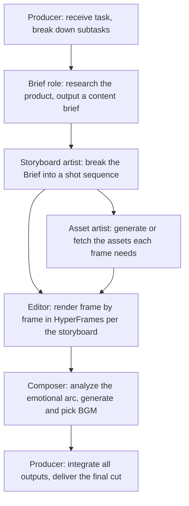

# Chapter 24: One Agent Flailing on a Big Job? Here's How to Split It Across a Team

You want AI to finish a big piece of work in one go, and it swings at everything at once while the quality bounces all over the place. The problem usually isn't the model — it's that nobody divided the work. Before you reach for multi-agent, read this on how to split. Using a real "product promo video expert team" case, this chapter answers the three core questions of multi-agent systems: how to design the division of labor, how to chain the outputs together, and when splitting is worth it.


## The Real Difference Between Single-Agent and Multi-Agent

Read this table first — multi-agent is valuable for the *division*, not the *multi*:

| Dimension | Single Agent | Multi-Agent |
| --- | --- | --- |
| Context | All information in one task | Each role receives only the context it needs |
| Division of labor | One executor, serial completion | Multiple roles working in parallel or relay |
| Tools | One shared set of permissions | Tools and permissions can be isolated per role |
| Quality | Generates and checks its own work | Independent reviewers can be added |
| Cost | Lower | More coordination, model, and tool calls |
| Risk | One error affects the whole task | Errors can propagate between roles |

The value of multi-agent comes from **specialized division of labor, parallelism, permission isolation, or independent review** — not from the number of roles. Check your work against this table: if one executor running straight through can finish it, don't split it.


## Is the Task Worth Splitting

The more of these your job satisfies, the better a fit it is for multi-agent:

- At least two subtasks can proceed independently;
- The subtasks need different methods, materials, or tools;
- The outputs can be defined with a clear handoff format;
- Parallelism meaningfully cuts wait time;
- There's a clear overall owner and final acceptance step;
- The budget allows for multiple rounds of calls.

Editing one email, summarizing one PDF, or formatting one spreadsheet doesn't need an expert team. Run your job past these six — hit three or more before you split.

## Case Study: The Product Promo Video Expert Team

### Task Background

HyperFrames is HeyGen's open-source video rendering framework. Its defining trait is being AI-Agent-friendly: an Agent can automatically generate HTML-based video frames and render them out. Product promos follow a fairly fixed formula — no narration or actors needed, mostly product demos, conceptual captions, and BGM — which makes them a good fit for a team of Agents to divide up. Know what HyperFrames is first, then look at how the cut gets split.


### Pipeline Design

Look at this pipeline diagram first — it breaks one promo video into six stages:



Every stage in that diagram has an explicit handoff artifact.

### Role Contracts

Pin down "input, output, forbidden actions" for each role and they won't step on each other:

| Role | Input | Output | Forbidden actions |
| --- | --- | --- | --- |
| Producer | User's task description, asset space | Task breakdown, status tracking, final cut | Never deliver while skipping subtask acceptance |
| Brief role | Product website, intro docs | brief.md (positioning, value, users) | Never write the script directly |
| Storyboard artist | brief.md | Storyboard (timecodes, visuals, captions, transitions) | Never introduce information not confirmed in the Brief |
| Asset artist | Storyboard | Product screenshots, concept art, UI assets | Never use assets from unlicensed sources |
| Editor | Assets, storyboard | Frame-by-frame MP4 clips | Never alter the storyboard structure |
| Composer | Storyboard, emotion annotations | BGM candidates with recommendations | Never output just one option |

Define roles against this contract table; the clearer it is, the less chaos you get.

### Expert Team Demo

Before making the promo, put the relevant materials into the workspace:

```text
I'd like you to make a product promo video — specifically, one promoting Tencent's
latest WorkBuddy Expert Teams, focused on OPC scenarios. I've placed some materials
in the current space. The finished video can lean Apple-style, with real software
UI. The whole process should be fully automatic.
```


The team lead first breaks "make a promo video" into a chain of subtasks: figure out what the product is, who it's for, and its core value; then decide the narrative structure, shot count, and pacing; then split up assets, editing, and music. You hand out the job and watch how the lead decomposes it.

The Brief role starts first, going through the website and product intro to output a brief: what this product is, who the target users are, and the few core points most worth fitting into 60 seconds. The storyboard artist then works off the brief, splitting the 60 seconds into 7 shots, down to timecodes, visuals, text, transitions, motion effects, and asset types. The asset artist and editor get to work: one generates/fetches product screenshots and concept art, while the other feeds the assets into HyperFrames per the storyboard, rendering an MP4 shot by shot.

The most interesting one is the composer: it doesn't just fire off a "tech-style BGM" prompt and call it done. It first reads the storyboard, studying the emotional arc of each shot — where the drums should punch on the product reveal, where to pull back and leave space, where a hit point should push the CTA — and only then calls the music model to generate candidates. Finally the team lead integrates all the outputs and runs the last editing pass to produce the finished video.


Here you're mostly hands-off: you assign the work, watch the key checkpoints, then make the calls — whether the storyboard should run this way, whether you like the BGM, whether the caption copy needs changing.

## The Shared Artifact Layer

Multiple Agents shouldn't each keep their own copy of "product facts." Establish a single artifact path, and downstream roles read only files that upstream has confirmed:

```text
project/
├── brief.md                  # Product brief (from the Brief role, confirmed by the Producer)
├── storyboard.md             # Storyboard (from the storyboard artist, confirmed by the Producer)
├── assets/                   # Assets (from the asset artist)
│   ├── screenshots/
│   └── concepts/
├── clips/                    # Frame-by-frame clips (from the editor)
├── bgm/                      # BGM candidates (from the composer)
└── output/final.mp4          # Final cut (integrated by the Producer)
```

Make the artifact layer the single source of truth — don't let each role keep its own copy. Downstream roles read only upstream artifacts that have been confirmed. Roles do not pass key content details to each other through conversation.

## Parallel vs. Serial

- **Can run in parallel**: asset generation and edit preparation; rendering of different shot segments;
- **Must be serial**: storyboards only after the Brief is confirmed; assets only after the storyboard is confirmed; editing only after assets are ready; music sync only after the cut is done.

A parallel plan must mark its convergence points: assets and edit prep can proceed in parallel, but the final assembly must wait until all assets are in place. When you lay out parallelism, mark the convergence points first.

## The Producer's Responsibilities

The Producer is the workflow controller: interpreting the user's task and tracking subtask status; distributing the minimum necessary context; checking that upstream artifacts meet the handoff format; deciding to parallelize, wait, or retry; bringing the user in for decisions at key points; assembling all outputs for final synthesis; and running a consistency check on the finished cut.

**Three points that must be confirmed by you**: Brief sign-off (are the positioning, users, and selling points right), storyboard sign-off (narrative structure, shot count, pacing), and BGM selection (does the mood match the tone). The Agents handle generation and execution — they can't replace your judgment on brand direction and style.

## From Self-Built to Prebuilt Expert Teams

| Dimension | Self-built Skills | Prebuilt expert teams |
| --- | --- | --- |
| Audience | Developers who need deep customization | One-person companies, ready to use |
| Barrier to entry | High (define roles, debug the pipeline) | Low (just describe the task) |
| Flexibility | High (modify any step) | Medium (custom model integration supported) |
| Speed | Depends on build time | Works out of the box |

Creating your own expert team is simple too: Experts → My Experts → Create Expert. You'll jump to the WorkBuddy conversation box, where the given format lets you create one quickly. Whether you build or take a prebuilt one comes down to whether you're comfortable writing roles yourself.


Typical scenarios the current expert teams cover:

| Scenario category | Representative expert teams |
| --- | --- |
| Content creation | Product promo videos, viral content creation, omni-channel distribution |
| Software development | Software development, code testing |
| Business analysis | Deep research, investment analysis, data analysis |
| Business support | SEO, sales, marketing, tax & finance compliance, HR |
| Legal & compliance | Chinese law |


## Factors That Affect Quality

- **The Agent's base model**: instruction-following and reasoning ability directly affect storyboard quality and task-breakdown accuracy;
- **The image generation model**: affects the clarity of product screenshots and the visual quality of concept art;
- **User-provided materials**: place materials into the asset space in advance and the final cut stays close to your real product, instead of the Agent padding it with generic material;
- **Browser tool integration**: when the Agent can operate a browser, it can automatically capture website screenshots and product UI.

A fully automatic pipeline suits quick turnarounds; for quality-critical work, treat the Agent's output as a base and do an extra round of human editing. The more complete your materials, the more real the cut looks.

## Containing Failure Propagation

| Role failure | Degraded approach |
| --- | --- |
| Brief role can't get product info | User supplies the basics, then retry |
| Asset generation fails | Use user-provided assets or mark the gaps |
| Edit rendering times out | Deliver the completed clips and the storyboard |
| BGM generation fails | Provide recommended BGM style descriptions for the user to pick from |
| Producer's final assembly fails | Deliver each role's artifact list for manual assembly |

Have degraded delivery spell out what's missing — **never masquerade as a complete result**.

## Multi-Agent Task Brief Template

Describe the task using this template and the expert team will know how to break it down:

```text
Goal: Produce a [duration] product promo video for [product name].
Style: [reference style, e.g. Apple-style, minimalist].
Assets: [asset space path, or provided images/videos].
Roles: Producer, Brief, storyboard artist, asset artist, editor, composer.
Confirmation points: after the Brief, after the storyboard, and at BGM selection — wait for user confirmation before continuing.
Models: Agent model [specify]; image generation model [specify].
Automatic/semi-automatic: [state whether human intervention is needed at intermediate points].
```

Fill it in as written, and the team can actually split the work.

## FAQ

**What kind of task is worth splitting into multiple Agents?**
When several of these hold: at least two subtasks can run independently, different tools or materials are needed, the output can be given a clear handoff format, parallelism saves real time, and there's a named person accepting the result. Polishing an email or summarizing a PDF is single-Agent work.

**Is more roles always better in a multi-agent setup?**
No. The value comes from division of labor, parallelism, permission isolation, and independent review — not from headcount. Pile on too many roles and coordination cost and failure surface both grow.

**Which checkpoints must I sign off personally?**
Three: the Brief (are positioning, users, and selling points right), the storyboard (structure and pacing), and the BGM (does the mood fit). Agents can generate and execute, but brand direction is your call.

**What is the shared artifact layer for?**
It gives you one artifact path where downstream roles read only files upstream has confirmed, instead of passing key details around in conversation. When one role changes something, nobody else picks up a stale version.

**What happens if the expert team fails partway?**
Follow the failure-propagation table: if the Brief role can't get product info, you supply the basics; if asset generation fails, mark the gaps or use your own assets; if editing times out, take the completed clips. Degraded delivery has to say what's missing — it can't pretend to be finished.
