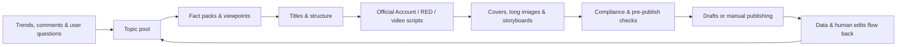

# Chapter 20: Writing Alone and Nobody Clicks? Build the Loop From Topic to Review

Running a self-media account solo, the easiest thing to waste time on is polishing content to a perfect score before you start: you write it deep, research it thoroughly, restructure it three times — and it goes out to single-digit views. What you actually need to solve in the early days isn't "is it good enough," it's "will anyone want to click in." This chapter walks the whole line from topic selection to titles, covers, publishing, and review, so you can build your own growth loop by following along.

## The Workflow at a Glance

Look at this diagram first so you have the shape in your head: trends and comments come in, go to the topic pool, the fact pack, the title structure, then become per-platform content, covers and storyboards, pass a compliance check, and after publishing the data flows back into the topic pool — it's a loop that turns, not a straight line. Follow the loop and you stop doing a bit of this and a bit of that. The scenes below show how.



Skills fill in individual steps in this loop — they don't take over the judgment for your account. The following scenes from real work show how.

## Scene 1: Scrolling Hot Topics Every Day, Still Not Knowing What to Write

Trending lists tell you "what everyone is watching," not "why this account should write about it." Chase trends alone and you blend into the crowd; go purely on gut feel and you can't tell whether users actually care.

Useful Skills: [WeChat Official Account Hot Article Finder](https://skillhub.cn/skills/gzh-explosive-content-detector), [RED Viral Notes Finder](https://skillhub.cn/skills/xhs-hotnotes), [RED Comment Insights](https://skillhub.cn/skills/xhs-comment-insights), [Inspiration Hunter](https://skillhub.cn/skills/inspiration-hunter-skill).

```text
Build this week's topic pool around "AI office automation" — do not write the articles yet.
Collect high-engagement content from the past 30 days on both WeChat Official Accounts and RED,
recording titles, publish dates, core promises, content structure, engagement signals, and original links.
Then extract from the comments: repeated questions, objections, failure stories, and user quotes.
Factor in my account positioning: non-technical office workers, emphasizing real workflows and verified results.
Output 12 candidate topics, each with: target reader, the real problem, the gap in existing content,
the new evidence I can offer, the fitting platform, production cost, and timeliness.
Do not treat high view counts as proof a topic suits me.
```


Have WorkBuddy generate a cross-platform sample table first, then cluster the comments into question groups, then score each topic on "heat, account fit, added value, evidence strength, production cost" — and deliver a topic board you can prune by hand.


### Also Learn to Spot "Low-Follower Viral Hits"

When starting an account, hunt for low-follower viral hits and copy the *topic* — the topic, not the content verbatim. You can also try the [viral-topic](https://github.com/kangarooking/kangarooking-skills/tree/main/viral-topic) skill: it pulls recent low-follower viral content in a given field across platforms — e.g. "low-follower viral AI articles on Official Accounts in the last 7 days" — and supports X and YouTube too.


## Scene 2: Wanting Viral Titles Without Being Clickbait

"Give me 20 viral titles" easily gets you numbers, suspense, and exaggerated promises — and not a single title the body can actually deliver on. **A title isn't standalone copy; it's a promise between the reader and the article.** Any title you use has to have a landing point inside the body.

Useful Skills: [Official Account Title Generator & Scorer](https://skillhub.cn/skills/gzh-official-account-title-generator), [RED Viral Notes Auto-Writer](https://skillhub.cn/skills/redbook-writer), [Short Video Hook Generator](https://skillhub.cn/skills/bozo-video-gz); for Official Account titles you can also try [viral-title](https://github.com/kangarooking/kangarooking-skills/tree/main/viral-title).

```text
Read approved-article.md and generate titles using only facts that appear in the body.
Generate: 8 WeChat Official Account titles, 8 RED titles, and 5 short-video opening hooks.
For each candidate, output:
1. Who it targets; 2. What it promises; 3. Which paragraph of the body delivers on it;
4. The angle used — question / result / list / case / counterintuitive;
5. Scores for credibility, specificity, platform fit, and exaggeration risk.
Remove unverifiable numbers, absolute promises, fake scarcity, and conclusions inconsistent with the body.
Do not auto-pick the final title; let me confirm the content promise first.
```


**How to verify**: show the title alone to someone who hasn't read the article, ask them to write down "what I expect to get when I click in," then check against the body — if expectation and reality don't match, no title score matters. In A/B testing, change only one main variable at a time, or the data can't be interpreted.

## Scene 3: Starting the Official Account Cover from a Blank Canvas Every Time

Just saying "make a classy cover" usually gets you decoration unrelated to the article, garbled text, or a distorted logo. Start your cover from a brief and think the composition through first.

```text
Create an Official Account cover brief for the article "Bookmarks Aren't Knowledge Management —
Putting Them Back to Work Is."
Target readers: knowledge workers; core message: from hoarding bookmarks to a reusable knowledge flow.
Brand colors: #1677FF, white, black; no purple gradients, exaggerated tech glows, or fictional product UI.
First output 3 composition directions, each with: subject, hierarchy, cover copy, colors, whitespace,
crop risk at small sizes, and the matching paragraph in the article. Generate the images only after I confirm.
After generating, check: is the text accurate, is the logo distorted, does the subject get cropped out at small sizes.
Do not upload to the Official Account directly.
```


## Scene 4: RED Isn't Just "Cutting a Long Article into Nine Cards"

The common way to adapt an Official Account article for RED — shortening paragraphs, adding emojis, spreading across nine cards — yields lots of information but a cover with no hook, a second page with no follow-through, and a final page with no call to action. Do it the right way: pull the fact pack first, then design the swipe rhythm.

1. Extract a platform-neutral fact pack from the long article;
2. Pick one core question and cut the tangents unrelated to it;
3. Design a swipe rhythm of "cover promise → problem resonance → method → example → pitfalls → checklist";
4. Output per-page wireframes and word counts first, then generate images;
5. Check font sizes, line breaks, and margins at real phone width;
6. Verify every number and proper noun across titles, body, tags, and images.

```text
Adapt approved-article.md into an 8-page RED post — add no new facts.
Page 1 carries a single promise; page 2 describes the problem the reader is living through;
pages 3–6 each teach one action with one example; page 7 covers common mistakes;
page 8 gives a save-able checklist.
First return the per-page copy, visual hierarchy, and estimated word counts; after I confirm, call the cover and long-image Skills.
```


## Scene 5: Turning a Long Article into a Shootable Short Video

"Turn it into a 60-second voiceover" usually just compresses the article into a faster read-aloud script — no shots, no pacing, no evidence footage, no pauses. Turn it into a real on-camera timeline instead, and don't let AI take the lazy way out.

```text
Adapt this article into a 60-second on-camera script, aimed at making first-time WorkBuddy users
understand "why a task brief matters more than one vague sentence of requirements."
Output a timeline table: duration, shot type, visuals, voiceover, on-screen text, footage sources, transitions.
The first 3 seconds must pose a real problem — don't exaggerate the payoff; show process evidence of the product
before the 20-second mark; end with one instruction viewers can try immediately, no fake engagement promises.
Also list which shots must be filmed live, which can use product screenshots, and which AI can generate —
fabricating user testimonials is forbidden.
```


## Scene 6: Before Publishing, Don't Let Automation Cross the Line of Responsibility

Useful Skills: [Official Account Banned-Word Checker](https://skillhub.cn/skills/gzh-prohibited-word), [Official Account Layout](https://skillhub.cn/skills/md-to-wechat), [De-AI Article Tool](https://skillhub.cn/skills/unclecheng-reduce-ai-perception-v2).

```text
Check this Official Account article for banned words; flag any that appear, with a fix suggestion for each.
Check the overall content for AI flavor and reduce it, then lay out the article.
```

Keep your publishing chain parked at the drafts box: fact check → citations & copyright → brand & compliance → link check → mobile preview → you confirm the account → publish. Auto-liking, bulk DMs, comment flooding, and bypassing platform risk controls are not recommended "efficiency" scenarios. When you're unsure, remember: none of those are in scope.

## Scene 7: No Post-Mortem After Publishing, and the Next Piece Starts from Zero Again

The heart of a post-mortem is comparing the AI's draft with your edited final version, letting the Skill evolve automatically so it writes closer to your expectations next time. Use [Official Account Writing Self-Iteration](https://skillhub.cn/skills/skill-article-evolution) or a RED operations copilot to write your edits and performance data back into the style library:

```text
Read this issue's content data, the published version, and the record of human edits, then generate a review.
State the data facts first, then list at most 3 verifiable hypotheses — don't write correlation as causation.
Break performance down by topic, title, cover, opening, structure, publish time, and channel.
Design 2 single-variable experiments for the next round, stating success metrics and stop conditions.
Write durably valid editing rules into style-guide.md; one-off trends should not become permanent rules.
```


## A Good-Enough Self-Media Skill Stack

Add gear according to the stage you're in — you don't need the full kit at once:

| Level | Install first | Add more when |
| --- | --- | --- |
| Starter | Hot content finder, title scorer, image generation | You can reliably finish one piece of content |
| Stable | Comment insights, covers, layout drafts, banned-word checks | Your account positioning and reviewer are settled |
| Multi-platform | RED cards, short-video scripts, platform adaptation | You have a unified fact pack |
| Advanced | Data feedback, style iteration, scheduled topic radar | Your manual process has run smoothly for 4 straight weeks |

## FAQ

**Where should my energy go in the early days?**
Solve "will someone click in" first — that means topics and titles. Polishing content to a perfect score that nobody opens is the worst trade you can make early on. Once clicks are stable, work on depth.

**Can I just copy low-follower viral hits?**
You can copy the *angle*, not the content verbatim. Tools like viral-topic pull low-follower hits so you can see "what topics break out even on a small account" — not so you can lift someone else's draft.

**How do I know a title isn't clickbait?**
Have the generator work only from facts already in the body, and make it mark "which paragraph delivers this" for every title. If it can't be delivered, don't use it no matter how high it scores.

**Is a nine-card RED post just a long article cut into nine images?**
No. Follow the six steps in Scene 4: pull the fact pack first, then design the swipe rhythm — cover promise, problem resonance, method, example, pitfalls, checklist — and only generate images at the end. Otherwise it's dense with information and nobody finishes it.

**Can I automate publishing entirely?**
Keep it at the drafts box. Confirm facts, copyright, compliance, links, and the mobile preview yourself, then publish. Auto-liking, comment flooding, and evading risk controls are out of scope.
