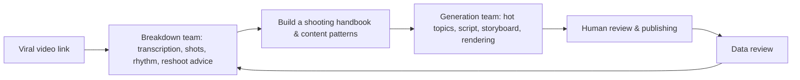

# Chapter 19: Short Video Eating Your Week? Summon Two AI Teams With One Sentence

You want to make short videos and you're stuck on two things: either one video takes forever from topic to finished cut, or someone else's goes viral and you can't tell what actually won. Inside WorkBuddy, split the job into two AI expert teams: one produces videos automatically, the other tears down viral ones.

| Team | What it owns | What tasks suit it |
| --- | --- | --- |
| **Video generation team** | Starting from a topic: hot-topic collection, topic selection, scripting, storyboarding, voiceover, rendering, subtitles, and publishing | AI weekly reports, product updates, knowledge explainers, industry analysis, product reviews |
| **Viral video breakdown team** | Starting from a video link: download the video, extract audio, transcribe the script, analyze the camera language, and produce a breakdown report with reshoot suggestions | Learning viral structures, reviewing competitor videos, building a shooting handbook |

The two teams don't replace each other: the generation team solves "how do I make one today," while the breakdown team solves "why did theirs go viral, and what can I learn." One produces, one learns — only together do you get continuous iteration.


## How to Summon: Start with One Sentence, but Don't Stop There

One sentence is enough to start — but don't actually stop at one sentence. Let the team break it down from there:

```text
Summon the video generation team and make a 46-second AI weekly report short video.
```

## Team One: The Video Generation Team

Four core roles: the producer **Ling Dao**, information scout **Ling Yue**, content planner **Ling Shu**, and video producer **Ling Ying**. They aren't four renamed chat windows — they're a video production line with clear upstream and downstream handoffs.


| Role | Position | Deliverables |
| --- | --- | --- |
| Ling Dao | Producer / team lead | Task breakdown, parallel/serial scheduling, output consolidation, checkpoint handling |
| Ling Yue | Information scout | Hot-topic pool, source lists, deduplicated structured summaries, topic candidates |
| Ling Shu | Content planner | Topic judgment, script, storyboard, narration, transitions, asset lists, BGM, and subtitle rhythm |
| Ling Ying | Video producer | HTML video engineering, voiceover, subtitle sync, transition animations, asset assembly, rendered final cut |

This is the key to multi-agent: **it's not the more roles the better — it's that every role has clear inputs and outputs.** The scout doesn't write the final script, the planner doesn't invent hot topics, the producer doesn't rewrite facts, and the team lead keeps the pipeline from breaking.

### The Production Engine: HyperFrames

Understand how this pipeline turns before you start assigning work. It's built on HyperFrames (an open-source video rendering framework): videos render from HTML, which naturally suits Agents generating structured projects that rendering tools output as MP4 — with a bundled CLI toolchain, TTS, subtitles, background removal, and video component templates. Treat it as a standard production line where every stage has a deliverable.

### Step 1: The Scout Gives Hot Topics Their Sources

Get the sources straight before you shoot anything. The most time-consuming part of making videos usually isn't editing — it's "what do we even shoot today." Have Ling Yue pull RSS feeds, search news, scan social media, aggregate and deduplicate AI hot topics. This stage's output includes at minimum: title, source, publish time, event time, original link, heat signals, and why it deserves attention. **Heat helps ranking; it never replaces fact-checking.**


### Step 2: The Planner Turns the Topic into Shots

Turn the topic into shots here, and stop if the script stalls. Once topics are in hand, the real brain work is "how do we tell it." Ling Shu handles topic evaluation, script, storyboard, narration, shot pacing, BGM rhythm, and emotional beats.


We recommend setting the **first human check** here: does the opening 3 seconds have a hook, does 46 seconds cram in too much, is the narration accurate, do the visuals actually support the point? If the script doesn't pass, don't move on to voiceover and rendering.

### Step 3: The Producer Turns the Storyboard into a Finished Video

Only come here once the script has passed. Ling Ying converts the confirmed script into HTML, then calls HyperFrames to render the MP4, automatically handling Azure TTS voiceover, Whisper subtitle alignment, animation and transition generation, asset assembly, and video rendering.


When accepting the final cut, don't just check "does it play": check narration-subtitle consistency, shot durations, whether text blocks the subject, whether the BGM is usable, copyright risk in the assets, and whether the visuals fit the target platform's safe area.

### Step 4: Publishing Can Be Automated, but Human Confirmation by Default

Treat publishing as an optional action and leave human confirmation on by default. The publishing Agent auto-generates titles, tags, uploads the cover, and publishes to Douyin, WeChat Channels, and Bilibili via a cloud phone. Powerful — but **do not auto-publish by default**, unless the account, assets, titles, and compliance boundaries have all been confirmed by you.


## Team Two: The Viral Video Breakdown Team

Being able to generate isn't enough — you need to know why someone else's blew up. What you really need is to understand "why theirs went viral": extract the video, transcribe the script, analyze shot types and camera moves, editing rhythm, and color style, then get reshoot suggestions.


| Role | Responsibility | Tools / tech |
| --- | --- | --- |
| A Bao | Team lead / breakdown controller | Task scheduling, pipeline orchestration, result consolidation |
| Xiao Kai | Audio processing & transcription | ffmpeg, ASR — turn the video's audio into the full voiceover script |
| Xiao Miao | Video understanding & shot cutting | Video understanding API, ffmpeg — analyze camera language and cut segments |

### Breakdown Step 1: Video Downloads Need a Fallback Strategy

Have a fallback strategy for downloads so you don't stall on step one. Getting the video is the trickiest step; the design uses three fallback layers: official API → Playwright → yt-dlp. As soon as one layer succeeds, the pipeline continues.


> Boundary: video downloads and analysis must respect platform terms, copyright licenses, and fair use. The purpose of breakdown is to learn structure and method, not to re-upload the original video.

### Breakdown Step 2: Audio Extraction and Script Transcription

Have Xiao Kai use ffmpeg to convert video.mp4 to audio.mp3, then call a speech recognition API to transcribe the full voiceover script automatically. Work that used to mean listening and typing line by line can now be reliably automated.

### Breakdown Step 3: Video Understanding and Camera-Language Analysis

The most fascinating step: Xiao Miao analyzes the whole video's shot types, camera moves, transitions, editing rhythm, color grading, and shot durations. Many viral videos that "just feel right" actually rest on stable patterns of cinematography.


## How the Two Teams Close the Loop



Use the breakdown team first to learn camera language and rhythm, then let the generation team produce new videos, keep analyzing data after publishing, and feed it back to optimize the next round. That's what makes expert teams more meaningful than a single tool: it doesn't just help you make one video — it turns "learn, produce, publish, review" into a system that runs on repeat.

---

> For a general method of dividing labor in multi-agent design, see the advanced chapter [Multi-Agent System Design](/en/workbuddy/adv-multi-agent/).

## FAQ

**Can one sentence really summon a whole team?**
It can start one — but don't stop at a single sentence. Give it a topic (say, "46-second AI weekly report") and the team breaks it into collection, planning, production, and publishing on its own. You just make the calls at the key checkpoints.

**Do I need both the generation and breakdown teams?**
Depends on the stage. Start with the generation team and get one video out the door. When you want to keep improving, bring in the breakdown team to study viral structure and feed it back into production. The two lines together are what closes the loop.

**Why do I need to step in at the script stage?**
Because the script decides whether the video makes any sense. Check whether the first 3 seconds have a hook, whether 46 seconds is overstuffed, whether the narration is accurate — if the script doesn't pass, don't go to voiceover and rendering, because rework costs more.

**Can publishing be fully automated?**
Technically yes, but leave auto-publish off by default. Confirm the account, assets, title, and compliance boundaries yourself, then let it send. Auto-liking, comment flooding, and evading risk controls are out of scope.

**Does breaking down videos risk copyright trouble?**
It does if you go too far. Use breakdown only to study structure and method; keep downloads and analysis within platform terms and fair use, and never re-upload the original video.
