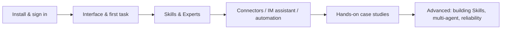

# WorkBuddy Tutorial

**WorkBuddy** is an all-scenario workplace AI agent workbench from Tencent. Describe your goal in one plain sentence, and it autonomously plans the steps, reads and writes files on your local computer, and delivers real work products — presentations, spreadsheet analyses, documents, research reports, and more — instead of just "answering questions."

This section is organized into five groups — Getting Started → Extending → Case Studies → Advanced → Reference — taking you all the way from installation to building your own AI work system.

## Learning Path

### Getting Started: Put WorkBuddy to Work

| Chapter | What you'll get |
| --- | --- |
| [Meet WorkBuddy](/en/workbuddy/01-intro/) | What it can do, and how it differs from chat-style AI |
| [Download, Install, Sign In & Update](/en/workbuddy/02-install/) | Get the client installed and signed in |
| [Main Interface, Tasks & Workspaces](/en/workbuddy/03-interface/) | Understand the UI and create your first workspace |
| [Complete Your First Task Quickly](/en/workbuddy/04-first-task/) | From one sentence to a finished deliverable |
| [Load a Skill You'll Actually Use](/en/workbuddy/05-skills/) | Let the AI work with "best practices" built in |

### Extending: Bring Capabilities In

| Chapter | What you'll get |
| --- | --- |
| [Experts and Expert Teams](/en/workbuddy/06-experts/) | Let the AI work with "job-specific skills" |
| [Using Connectors](/en/workbuddy/07-connectors/) | Connect external services and data sources |
| [Mini Programs and the IM Assistant](/en/workbuddy/08-im-assistant/) | Assign tasks right inside WeChat / Feishu / DingTalk |
| [Connecting External APIs](/en/workbuddy/09-external-api/) | Use your own LLM API or a local model |
| [Automated Tasks](/en/workbuddy/10-automation/) | Scheduled tasks that let the AI work on its own |
| [Further Reading: Understanding AI Work Systems](/en/workbuddy/11-ai-work-system/) | LLM / Agent / Skill / MCP explained in one chapter |

### Case Studies: From One Task to an AI Team

| Chapter | What you'll get |
| --- | --- |
| [The Office Trio: Word, Excel, PPT](/en/workbuddy/case-office/) | A complete playbook of prompts + Skills |
| [Knowledge Management: Put Your Bookmarks to Work](/en/workbuddy/case-knowledge/) | How WPS / ima / Obsidian / WeChat Favorites split the work |
| [Making Investment Analysis a Daily Habit](/en/workbuddy/case-investment/) | Eight research prompts + the stock-advisor pipeline |
| [Summon an AI Video Team with One Sentence](/en/workbuddy/case-video-team/) | Two expert teams: video generation and hit-content breakdown |
| [The Self-Media Growth Loop](/en/workbuddy/case-self-media/) | Topic → title → cover → publish → review |

### Advanced: Turn Case Studies into Your Own Work System

| Chapter | What you'll get |
| --- | --- |
| [Building Skills: Knowledge Distillation](/en/workbuddy/adv-build-skill/) | Distill books and videos into executable Skills |
| [Multi-Agent System Design](/en/workbuddy/adv-multi-agent/) | Division of labor, handoff formats, when to split |
| [Reliability of Automated Workflows](/en/workbuddy/adv-automation-reliability/) | State machines, idempotency, fallbacks, alerting |

### Quick Reference

| Chapter | What you'll get |
| --- | --- |
| [Prompt Templates](/en/workbuddy/ref-prompt-templates/) | 12 ready-to-use task templates |
| [Scenario Cheat Sheet](/en/workbuddy/ref-scenarios/) | A dictionary-style index by role and scenario |

## Who It's For

- **Workplace newcomers**: use AI to handle daily chores like Word/Excel/PPT work, file organization, and news digests
- **Productivity enthusiasts**: build human-AI collaborative automated workflows
- **Team leads**: learn how multi-agent collaboration works and how to roll it out in your team

## Want the Full Content?

This section is a curated adaptation of the open-source project [The WorkBuddy Practical Blueprint](https://github.com/AlephAITech/WorkBuddyGuide) (MIT license, 27 chapters and 9 articles in full). The complete edition includes more case studies and role- and industry-specific guidance — we recommend reading it online at [workbuddy.homes](https://workbuddy.homes/).
