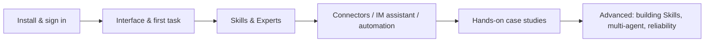

# What Is WorkBuddy and How Do You Learn It? Five Groups, from Install to Your Own System

You clicked into this page either having already installed WorkBuddy, or still wondering what it could actually do for you. Here's the one line that settles it: it's Tencent's all-scenario workplace AI agent workbench. State your goal in one plain sentence and it plans the steps itself on this machine, reads and writes files, and hands back work you can keep building on — presentations, spreadsheet analyses, documents, research reports. The difference from a chatbot fits in one line: it doesn't just "answer questions," it gets the job done.

This section is organized into five groups — Getting Started → Extending → Case Studies → Advanced → Reference — taking you all the way from installation to building your own AI work system. You don't need to read it front to back. Follow the route below and pick what you need.

## Learning Path

Scan this diagram first so you have the whole picture: from installing and signing in, to learning Skills and Experts, to connecting connectors, running case studies, and finally building your own Skills and multi-agent setups.

### Getting Started: Put WorkBuddy to Work

| Chapter | What you'll get |
| --- | --- |
| [Meet WorkBuddy](/en/workbuddy/01-intro/) | What it can do, and how it differs from chat-style AI |
| [Download, Install, Sign In & Update](/en/workbuddy/02-install/) | Get the client installed and signed in |
| [Main Interface, Tasks & Workspaces](/en/workbuddy/03-interface/) | Understand the UI and create your first workspace |
| [Complete Your First Task Quickly](/en/workbuddy/04-first-task/) | From one sentence to a finished deliverable |
| [Load a Skill You'll Actually Use](/en/workbuddy/05-skills/) | Let the AI work with "best practices" built in |

### Extending: Bring Capabilities In

| Chapter | What you'll get |
| --- | --- |
| [Experts and Expert Teams](/en/workbuddy/06-experts/) | Let the AI work with "job-specific skills" |
| [Using Connectors](/en/workbuddy/07-connectors/) | Connect external services and data sources |
| [Mini Programs and the IM Assistant](/en/workbuddy/08-im-assistant/) | Assign tasks right inside WeChat / Feishu / DingTalk |
| [Connecting External APIs](/en/workbuddy/09-external-api/) | Use your own LLM API or a local model |
| [Automated Tasks](/en/workbuddy/10-automation/) | Scheduled tasks that let the AI work on its own |
| [Further Reading: Understanding AI Work Systems](/en/workbuddy/11-ai-work-system/) | LLM / Agent / Skill / MCP explained in one chapter |

### Case Studies: From One Task to an AI Team

| Chapter | What you'll get |
| --- | --- |
| [The Office Trio: Word, Excel, PPT](/en/workbuddy/case-office/) | A complete playbook of prompts + Skills |
| [Knowledge Management: Put Your Bookmarks to Work](/en/workbuddy/case-knowledge/) | How WPS / ima / Obsidian / WeChat Favorites split the work |
| [Making Investment Analysis a Daily Habit](/en/workbuddy/case-investment/) | Eight research prompts + the stock-advisor pipeline |
| [Summon an AI Video Team with One Sentence](/en/workbuddy/case-video-team/) | Two expert teams: video generation and hit-content breakdown |
| [The Self-Media Growth Loop](/en/workbuddy/case-self-media/) | Topic → title → cover → publish → review |

### Advanced: Turn Case Studies into Your Own Work System

| Chapter | What you'll get |
| --- | --- |
| [Building Skills: Knowledge Distillation](/en/workbuddy/adv-build-skill/) | Distill books and videos into executable Skills |
| [Multi-Agent System Design](/en/workbuddy/adv-multi-agent/) | Division of labor, handoff formats, when to split |
| [Reliability of Automated Workflows](/en/workbuddy/adv-automation-reliability/) | State machines, idempotency, fallbacks, alerting |

### Quick Reference

| Chapter | What you'll get |
| --- | --- |
| [Prompt Templates](/en/workbuddy/ref-prompt-templates/) | 12 ready-to-use task templates |
| [Scenario Cheat Sheet](/en/workbuddy/ref-scenarios/) | A dictionary-style index by role and scenario |
| WorkBuddy Skin Studio | 12 ready-made theme skins to download, plus a build-your-own guide |

## Who It's For

Whichever of these you are, you'll find a starting point here:

- **Workplace newcomers**: you want AI to handle daily chores like Word/Excel/PPT work, file organization, and news digests
- **Productivity enthusiasts**: you want to build automated workflows where you and the AI split the work
- **Team leads**: you want to know how multi-agent collaboration works and how to roll it out with your team

## FAQ

**I've never used a tool like this. Where do I start?**
Just follow Getting Started in order: install and sign in, then the main interface and your first task, then load a Skill you'll actually use. Five pages in, you'll be assigning work on your own.

**What's the real difference between WorkBuddy and a chatbot?**
A chatbot gives you an answer, and the work is still yours. WorkBuddy reads and writes files on your machine, plans the steps itself, and hands back something you can keep editing. The difference is that it finishes the job.

**I'm a team lead. What should I focus on?**
Read the case studies first to get a feel for the full playbook, then go to Multi-Agent System Design and the reliability chapter in Advanced — those two cover how a team collaborates and how to keep scheduled tasks running steadily.

**Who is the reference section for?**
You — if you don't want to read everything and just want to find the right feature now. Look it up by role and scenario, jump to that chapter, and skip the rest.
