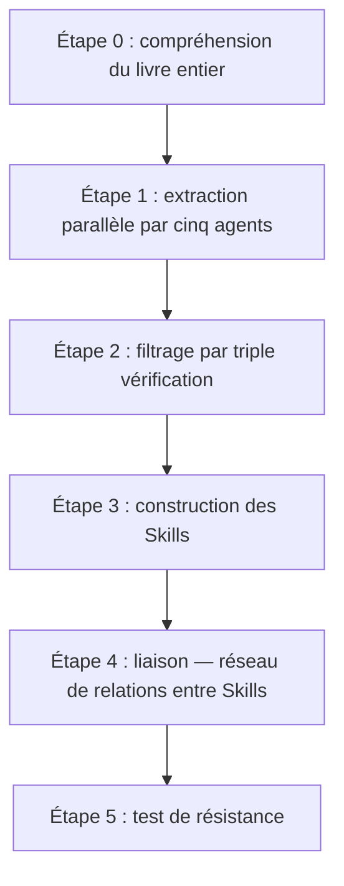

# Lire vite un livre et maîtriser rapidement ses méthodes

> Contexte : acheter un livre est facile, le finir aussi ; le difficile, c'est qu'au moment du vrai problème, on se souvient que le livre parlait d'une méthode approchante, mais après avoir épluché ses notes, on ne sait plus par quelle étape commencer. Si un livre ne laisse qu'un résumé et quelques citations, il s'enfonce vite dans les notes.

Le « Skill Cangjie » vise à transformer les cadres et méthodes de jugement d'un livre en **étapes réutilisables à volonté**, que Doubao Work saura ressortir face au bon problème.

## Ce que le Skill Cangjie distille

Un résumé classique cherche **plus court** ; le Skill Cangjie cherche **réutilisable**. Il comprend d'abord tout le livre, puis extrait des candidats selon cinq axes : cadres, principes, cas, contre-exemples et terminologie ; chaque candidat passe ensuite trois contrôles :

1. au moins **deux passages indépendants** du livre le soutiennent ;
2. il aide à répondre à un problème nouveau que le livre **n'aborde pas directement** ;
3. il apporte une méthode spécifique **au-delà du sens commun**.

Les méthodes validées deviennent des Skills atomiques : quand l'appeler, avec quelles entrées, comment s'exécuter, quand il ne s'applique pas — avec en plus des questions-test pour vérifier qu'il ne se déclenche pas hors de son domaine. Une distillation complète laisse généralement : vue d'ensemble du livre, index des Skills, glossaire, longue synthèse, plusieurs Skills atomiques, questions-test et résultats — candidats écartés et motifs conservés pour relecture.



## Installation et distillation

Le plus simple : demander à Doubao Work d'« installer ce Skill lui-même », ou l'ajouter depuis le marché des compétences.

Pour la distillation, créez d'abord un **projet ou dossier de travail dédié** au livre, matériau brut et livrables ensemble ; première fois, un seul livre. Les livres denses en méthodologie, riches en cas et orientés action se prêtent bien à la distillation ; romans, essais et recueils de citations appellent plutôt une carte de lecture. Pour un livre numérique, privilégiez Markdown ou TXT ; un PDF courant peut aussi lui être confié directement (pour un scan, vérifiez d'abord la qualité de l'OCR) :

```text
Utilise le Skill Cangjie pour distiller ce livre : transforme ses méthodes en un ensemble de
Skills appelables dans de vraies tâches.
```

En test réel, la distillation du « Wang Chuan Bao Dian » a produit 7 Skills atomiques. Le tri rappelle une chose : **la qualité d'une distillation ne se mesure pas au nombre de Skills** — du contenu dans un livre ne veut pas dire que chaque passage mérite de devenir un outil.

## Mettre en œuvre les connaissances distillées

Une fois installé, inutile d'apprendre par cœur tous les noms de Skills. Confiez directement le problème réel, le contexte et le résultat attendu à Doubao Work, en lui demandant d'annoncer d'abord quelles méthodes il mobilisera :

```text
Réponds-moi avec les Skills du Wang Chuan Bao Dian présents dans l'espace courant :
je n'ai pas beaucoup d'argent, mais je crois beaucoup au développement de l'IA et de
l'intelligence incarnée. Dois-je investir ? Si oui, comment, et avec quelle stratégie ?
```

En test, il a répondu selon les connaissances distillées avec une stratégie en trois étages : **s'investir soi-même** (apprendre des compétences IA à heure fixe chaque jour, produire chaque semaine un actif réutilisable avec l'IA, publier ses réflexions) ; **une allocation financière modeste, uniquement avec de l'argent dormant** (plafond « une perte totale ne change pas ma vie », ETF larges plutôt qu'actions individuelles, pas de levier, refuser le pilotage par les gains et pertes courts terme) ; **patience stratégique** (pas de grosse mise maintenant mais présent sur la durée ; n'augmenter la position que lorsqu'on sait expliquer « à quoi tient la position dominante » de l'actif).

## Comment la base documentaire s'y inscrit

Une base documentaire excelle à **conserver l'original et retrouver les passages pertinents** ; un Skill excelle à **exécuter une méthode** quand le bon problème se présente. Pour vérifier les mots exacts de l'auteur, des données ou un contexte, retournez au livre ou à la base ; pour analyser, juger et agir, appelez le Skill. Placés dans un même projet, source et méthode se contre-vérifient.

Aussi complète soit la distillation, **le jugement final reste humain** — encore plus pour l'investissement, la santé ou le droit. Un Skill ajoute des points de contrôle et des contre-exemples ; il ne remplace ni l'avis professionnel, ni la vérification des faits, ni la responsabilité de la personne.

## Distillation des connaissances vs RAG

| Dimension | RAG | Distillation (Skill) |
| --- | --- | --- |
| Nature | Recherche — retrouver les passages originaux pertinents | Extraction — tirer de l'original des méthodes exécutables |
| Prérequis d'usage | L'utilisateur doit savoir quoi demander | L'utilisateur décrit son problème, le Skill s'identifie et s'active seul |
| Contrôle qualité | Aucun — tout peut entrer en base | Triple vérification, plutôt moins que trop |
| Mode d'appel | Attend passivement la requête | Reconnaît activement le contexte et se déclenche |
| Forme du savoir | Stocke l'original (mémoriser) | Purifié en étapes d'exécution (appliquer) |
| Maîtrise des bords | Aucune | Tests pièges pour éviter les déclenchements intempestifs |
| Coût de ressources | Lourd (index vectoriel à maintenir) | Léger (un simple fichier de Skill) |

Le RAG résout la « gestion des connaissances » — savoir ce que contient le livre ; la distillation résout « l'application des connaissances » — l'agent sort le bon cadre au bon moment, de lui-même. **Quand vous ne savez pas quoi demander, le RAG ne peut rien pour vous ; le Skill, lui, n'exige pas de vous rappeler quelles méthodes contient le livre.**

Cela rejoint la démarche LLM Wiki d'Andrej Karpathy (indexer les sources en sommaire → compiler un Wiki par le LLM → questions-réponses sur le Wiki → réinjection des résultats) sur la première moitié : faire lire profondément l'IA, structurer, indexer. La différence est dans les dernières étapes : le produit du LLM Wiki est un **ensemble d'entrées de Wiki** consultées activement ; le produit de la distillation est un **ensemble de Skills exécutables** activés par l'agent après reconnaissance du contexte. Les deux approches ne s'excluent pas, mais leurs objectifs diffèrent.

---

Scénario similaire : [Vous présenter avec un site personnel soigné →](/fr/doubaowork/case-personal-site)
