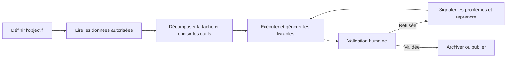

# Chapitre 1 : Découvrir WorkBuddy

**WorkBuddy** est le tout nouveau poste de travail IA à agents de Tencent,

destiné aux différents métiers de l'entreprise — ressources humaines, administration, opérations, ventes, R&D. C'est une application de bureautique IA capable de réfléchir, d'exécuter des tâches et de livrer des résultats comme un vrai collègue.

## De « répondre aux questions » à « livrer des résultats »

Contrairement aux assistants IA traditionnels, WorkBuddy ne se contente pas de discuter, de répondre ou de conseiller.

Il suffit de décrire votre besoin en une phrase en langage naturel : il comprend l'objectif de la tâche, planifie lui-même les étapes d'exécution sur votre ordinateur local et accomplit des tâches multimodales complexes.

Une fois autorisé par l'utilisateur, WorkBuddy peut lire et traiter les fichiers locaux, et réaliser automatiquement des traitements par lots, de la génération de documents, des analyses de tableaux, des présentations PPT, de la création de contenus multimodaux, des études sectorielles ou encore la construction d'une base de connaissances locale.

Pour les tâches plus complexes, il sait également décomposer les étapes et faire travailler plusieurs agents en parallèle, réduisant ainsi le coût des allers-retours de l'humain entre outils, fichiers et tâches.

Par exemple, vous pouvez simplement demander à WorkBuddy d'analyser les données de vente d'un dossier et de générer un PPT de reporting.

WorkBuddy lit les fichiers concernés de façon autonome, comprend le contenu des données, réalise l'analyse et la synthèse, puis produit un livrable final que vous pouvez consulter et modifier.

Pendant tout le processus, vous n'avez ni à téléverser chaque fichier manuellement, ni à indiquer à l'IA, étape par étape, ce qu'elle doit faire ensuite.

WorkBuddy est conçu pour des tâches de travail complètes.

Ses capacités clés tiennent en trois points : **il comprend le langage naturel, il sait planifier et réfléchir de façon autonome, et il est réellement capable d'agir sur l'ordinateur pour livrer des résultats.**

Pour accomplir différents types de tâches, WorkBuddy propose aussi le changement de modèle (Hunyuan / DeepSeek / GLM / Kimi / MiniMax, etc.), les MCP Servers, les Skills et d'autres capacités.

Vous pouvez choisir le modèle adapté à chaque tâche, et étendre les outils et l'expertise de WorkBuddy grâce à MCP et aux Skills.

Par ailleurs, pour les opérations sur fichiers locaux ou l'exécution dans le terminal, WorkBuddy intègre un blocage des commandes à risque et des mécanismes de contrôle des permissions, afin de limiter les risques liés à l'exécution autonome de l'IA.

