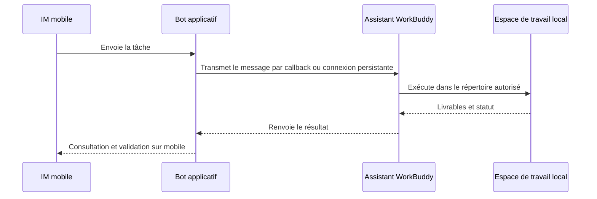

# Chapitre 8 : Intégrer le Mini-programme et l'assistant IM dans WorkBuddy

Installer le client n'est que la première étape. Ce chapitre fait passer WorkBuddy de « réservé au bureau devant l'ordinateur » à « pilotable depuis le téléphone à tout moment » : le Mini-programme permet de suivre et de piloter à distance, l'assistant IM permet de lancer des tâches directement depuis WeChat, Feishu ou DingTalk.

## Les deux modes du Mini-programme

| Mode | Où s'exécute la tâche | Ordinateur requis en ligne | Tâches adaptées |
| --- | --- | --- | --- |
| Mode local | L'ordinateur connecté | Oui | Fichiers locaux, Skills locaux, espaces de travail existants |
| Mode cloud | Environnement cloud isolé | Non | Études, rédaction, analyses ponctuelles, tâches en parallèle |

**Première utilisation** : ouvrez le Mini-programme WorkBuddy depuis l'entrée officielle et connectez-vous, puis vérifiez si vous êtes en mode local ou cloud ; en mode local, assurez-vous que l'ordinateur cible est en ligne et correctement connecté.

## La chaîne de travail de l'assistant IM

## Intégrer l'assistant WeChat : une simple association par QR code

1. Ouvrez WorkBuddy, cliquez sur l'engrenage de la rubrique « Assistant » à gauche, puis entrez dans « Paramètres de l'assistant » ;

2. Repérez « Intégration de l'assistant WeChat » et cliquez sur « Configurer » ;

3. Attendez la génération du QR code d'association, puis scannez-le avec WeChat sur votre téléphone ;

4. Quand la carte affiche « Associé », envoyez d'abord une instruction de test en lecture seule ;

5. Pour changer de compte WeChat, dissociez d'abord le compte actuel, puis scansez à nouveau.

> Le QR code a une durée de validité limitée. Si l'état reste bloqué sur « Association en cours », si le code expire ou si le scan échoue, fermez la fenêtre de configuration et rouvrez-la ; au besoin, redémarrez WorkBuddy et regénérez le QR code.

## Intégrer Feishu

1. WorkBuddy → Paramètres → Paramètres de l'assistant → choisissez Feishu ;

2. Créez une application d'entreprise dédiée sur la plateforme ouverte Feishu ;

3. Ajoutez la capacité bot à l'application ;

4. Activez les permissions minimales exigées par la page WorkBuddy en cours ;

5. Dans « Identifiants et informations de base », récupérez l'App ID et l'App Secret ;

6. Saisissez ces identifiants dans WorkBuddy, puis générez ou copiez les informations de callback ;

7. Dans Feishu, configurez l'abonnement aux événements et le callback, en ajoutant les événements de réception de messages, d'interactions avec les cartes, etc. ;

8. Créez une version, publiez l'application, puis envoyez au bot dans Feishu une tâche de test en lecture seule.

## Intégrer DingTalk

1. Connectez-vous au portail développeur DingTalk avec un compte d'administrateur d'entreprise, allez dans « Développement d'applications » et créez une application ;

2. Ajoutez la capacité bot à l'application, renseignez son nom, sa description et son avatar, puis confirmez la publication ;

3. Activez les permissions nécessaires ;

4. Récupérez les identifiants de l'application et reportez-les dans WorkBuddy. Effectuez de préférence la validation dans une organisation ou un groupe de test.

---

> Une fois l'assistant IM associé, combiné aux [tâches automatisées](/fr/workbuddy/10-automation/), vous pouvez chaîner « exécution planifiée + notification IM » en une seule ligne.
