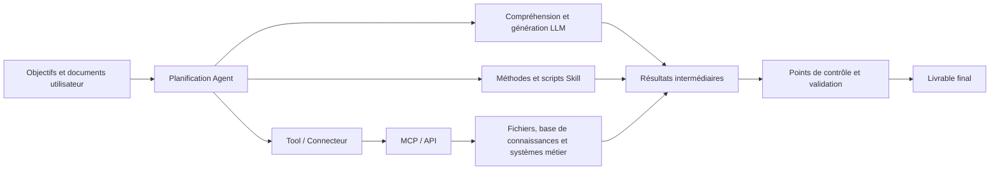
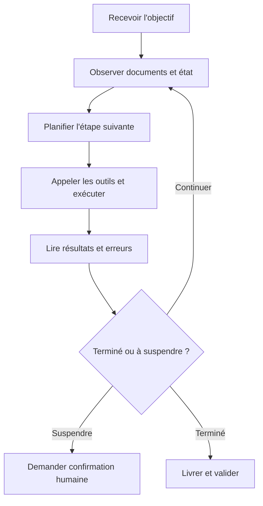

# Pour aller plus loin : comprendre le système de travail IA en un chapitre

Les dix premiers chapitres expliquaient « comment utiliser WorkBuddy ». Celui-ci explique « pourquoi il est conçu ainsi » — en plaçant LLM, Token, Prompt, Agent, Tool, Skill, MCP, base de connaissances et workflow dans une même image, pour clarifier ce que chaque rôle peut et ne peut pas faire. Une fois ce chapitre assimilé, vous prendrez en main n'importe quel outil de travail IA plus vite.

## D'abord la vue d'ensemble : que se passe-t-il dans une tâche IA ?

En une phrase : **le modèle comprend et génère, l'Agent organise l'action autour de l'objectif, le Skill apporte la méthode experte, les outils et MCP/API font toucher le monde réel à l'action, et l'humain tranche les limites et valide.** Parmi les cinq rôles : le modèle est le cerveau, l'Agent le répartiteur, le Skill le manuel de l'expert, les outils et interfaces les bras et jambes, l'humain l'arbitre.

## LLM : un modèle de base qui prédit du contenu selon le contexte

Un LLM (grand modèle de langage) apprend les régularités du langage et du savoir à partir de masses de données, puis génère la suite la plus probable de l'entrée courante. C'est fondamentalement un moteur de « prédiction du contenu suivant » — ni une base de données, ni une personne qui répond à votre place.

**Ce qu'il fait bien** : comprendre et réécrire du texte, extraire des structures de documents, générer des brouillons et du code, imiter un format et un style.

**Ce qu'il ne garantit pas d'office** : l'exactitude de chaque fait ; la connaissance du dernier état interne de l'entreprise (sauf documents fournis ou systèmes connectés) ; l'accès automatique aux fichiers, comptes, bases de données et au réseau ; l'engagement métier ou juridique.

**Pourquoi les « hallucinations »** : le modèle vise la cohérence du texte, pas l'exactitude factuelle. En cas de documents manquants, de question floue ou d'exigence de réponse certaine, il peut combler les blancs par un contenu plausible mais faux. Ce n'est pas un bug, c'est un effet du « complètement probabiliste » — **le sûr de soi et le juste sont deux choses différentes**.

Pour réduire les hallucinations : fournir des sources fiables ; exiger des références précises ; autoriser la réponse « impossible à confirmer » ; séparer l'extraction des faits de la génération de recommandations ; faire relire humainement les conclusions à fort impact.

## Token et fenêtre de contexte : combien le modèle voit-il devant lui

Le token est l'unité de base du traitement du texte par le modèle, sans équivalence exacte avec le nombre de mots. La fenêtre de contexte est le volume total d'entrées, d'historique et de sorties traitable en une inférence — imaginez la **capacité de mémoire à court terme** du modèle : ce qui tient dedans est visible, ce qui déborde est perdu ou compressé.

Plus de contexte n'est pas forcément mieux. Entasser tous les fichiers et des mois de conversations dans une tâche peut créer des conflits entre exigences anciennes et nouvelles, noyer les documents clés dans le bruit, et augmenter coûts et temps d'attente. Mieux vaut organiser par projet « règles courantes, faits confirmés, relevés de décisions et entrées du jour », et s'appuyer sur les fichiers et la mémoire de projet pour le long terme — **n'utilisez pas l'historique de chat comme base de données**.

## Prompt : une note de tâche, pas une formule magique

Un bon prompt ne l'emporte pas par sa longueur, mais par la suffisance de ses informations pour exécuter et valider — rédiger un prompt, c'est rédiger une note de tâche confiable à un collègue.

| Élément | Question à trancher |
| --- | --- |
| Objectif | Quel problème résoudre au final |
| Entrées | Quels documents ou systèmes utiliser |
| Actions | Analyser, organiser, générer ou écrire |
| Contraintes | Ce qui est interdit, quelles règles suivre |
| Sortie | Quel fichier ou quelle structure livrer |
| Validation | Comment juger l'exactitude et l'usage |

Parmi les six éléments, la **validation** est la plus négligée : sans critère d'acceptation, le modèle rend sa copie selon sa propre interprétation.

Du ponctuel au réutilisable, c'est une consolidation par paliers : **Prompt** (comment formuler cette fois) → **fiche de tâche** (structure réutilisable pour des tâches similaires) → **SOP** (étapes et points de contrôle figés) → **Skill** (SOP stabilisé, scripts et ressources encapsulés en capacité exécutable). Attention : tout prompt ne mérite pas de devenir un Skill — répétez d'abord le succès, consolidez ensuite.

## Agent : un exécutant capable de boucler autour d'un objectif

Un Agent ne se contente pas de « répondre une fois » : il exécute en continu une boucle — **comprendre l'objectif, observer l'environnement, décider de l'étape suivante, appeler des outils, lire les résultats, corriger le plan, jusqu'à la livraison ou au déclenchement d'un arrêt**.

| Dimension | Modèle conversationnel | Agent |
| --- | --- | --- |
| Action centrale | Générer une réponse | Planifier, appeler des outils, exécuter et livrer |
| Déroulement | Généralement en une fois | Observation et action sur plusieurs tours |
| Risque | Contenu erroné | Contenu erroné + effets d'opérations réelles |
| Contrôle | Prompt et relecture | Permissions, points de contrôle, journaux et retour arrière |

La différence décisive est sur la dernière ligne : un modèle conversationnel qui se trompe vous induit au pire en erreur ; un Agent qui se trompe peut vraiment supprimer des fichiers, envoyer des courriels, modifier une base. L'Agent n'a donc pas besoin de prompts plus astucieux, mais de garde-fous plus solides.

**Conditions d'arrêt d'un Agent** : un bon Agent ne doit pas « toujours trouver moyen de continuer ». Entrée clé manquante, objectifs contradictoires, permissions insuffisantes, budget dépassé, action irréversible, résultat invérifiable : il doit suspendre et demander l'arbitrage humain. Un Agent qui ne sait pas s'arrêter est plus dangereux qu'un Agent maladroit.

## Tool : rendre l'Agent réellement capable d'agir

Un Tool est une capacité concrète que l'Agent peut appeler (lire un fichier, lancer une recherche, générer un tableau, envoyer un message) ; un Connector est généralement une connexion à un service tiers déjà encapsulée par le produit, utilisable telle quelle après autorisation.

Le contresens le plus fréquent : **le modèle « comprend » une chose ne signifie pas qu'il « peut » la faire.** Le modèle peut expliquer « comment envoyer un courriel », mais il ne peut l'envoyer réellement qu'avec l'outil de messagerie et les permissions de compte. Face à une tâche qui échoue, demandez d'abord « l'outil est-il connecté, la permission est-elle accordée », et non « le modèle est-il nul ».

Cinq questions à poser pour chaque outil : sous l'identité de qui il agit ; ce qu'il peut lire ; ce qu'il peut modifier ; où vont les données ; comment l'arrêter et revenir en arrière en cas d'échec.

## Skill : une méthode de travail professionnel réutilisable

Un Skill n'est pas un modèle plus intelligent : il organise les instructions, scripts, connaissances et modèles nécessaires à un type de tâches. Sa valeur n'est pas de « renforcer le modèle », mais de **figer les étapes sujettes aux erreurs et aux oublis** — pour le même traitement de factures, un modèle qui improvise à chaque fois donnera trois variantes en dix essais ; sous forme de Skill, les dix essais suivent la même éprouvée.

Deux points à retenir : un Skill est une « encapsulation de méthode », pas une « garantie de capacité » ; installer un Skill tiers relève de l'installation d'une extension de navigateur — pratique, mais vérifiez d'abord ses permissions (répertoires lus, données envoyées ou non vers l'extérieur, clé API exigée, procédure de désactivation) et testez-le dans un répertoire isolé.

## MCP : l'interface standard qui connecte l'IA aux outils et aux données

MCP (Model Context Protocol) définit comment un client IA découvre et appelle des outils externes et lit des ressources — imaginez « le port USB du monde de l'IA » : les fournisseurs d'outils exposent leurs capacités selon un standard, les clients IA les consomment selon le même standard, sans adaptation au cas par cas.

**Ce que MCP résout** : le coût d'adaptation répétée — connecter un CRM ou une base de données n'exige plus une intégration dédiée à chaque fois.

**Ce que MCP ne résout pas** : il ne juge pas de la conformité des données ; il ne garde pas vos clés ; il ne garantit pas l'exactitude des résultats d'outils. Il répond du « comment se connecter » ; la sécurité « une fois connecté » reste votre responsabilité.

Choix entre niveau utilisateur et niveau projet : les capacités communes au niveau utilisateur ; les connexions sensibles (clients, bases de données) privilégient l'isolement au niveau projet, pour éviter les appels erronés entre projets.

## Le lien entre API et MCP

Une API est l'interface d'interaction entre logiciels (requête HTTP pour lire des données, créer un enregistrement) ; un MCP Server peut appeler en interne une ou plusieurs API, puis exposer des outils sous une forme plus directement utilisable par l'Agent. En une phrase : **l'API est la fondation, MCP est la porte construite dessus par laquelle l'Agent entre et sort directement.** Utiliser un MCP mature est plus commode, mais examinez quand même les requêtes et permissions qu'il encapsule — la commodité ne dispense pas de l'audit.

## Base de connaissances, RAG et mémoire

| Concept | Ce qui est conservé | Risque principal |
| --- | --- | --- |
| Contexte de conversation | Échanges de la tâche en cours | Trop long, contradictoire, périmé |
| Base de connaissances / RAG | Faits et documents interrogeables | Sources médiocres, versions anciennes, introuvables à la recherche |
| Mémoire | Préférences, règles durables, état de projet | Erreurs reconduites longtemps |

Pour distinguer en une phrase : **le contexte est la mémoire courte de la conversation en cours, la base de connaissances est le centre de documentation consultable à tout moment, la mémoire est le réglage durable conservé d'une tâche à l'autre.** Le danger de la mémoire est qu'« elle ne s'aperçoit pas elle-même de sa péremption » — une règle erron vieille de six mois sera réutilisée par l'Agent comme une vérité.

## Workflow et Agent : la différence

- **Le Workflow est une ligne de production standardisée** : les étapes sont fixées dès la conception, exécutées en séquence ou en branches ;
- **L'Agent est un exécutant qui réfléchit et décide** : on ne lui donne que l'objectif, et il détermine au fil de l'exécution l'étape suivante.

| Dimension | Workflow | Agent |
| --- | --- | --- |
| Chemin prédéfini | Oui, fixé à la conception | Non, décidé à l'exécution |
| Maîtrise | Élevée, facile à prévoir et annuler | Plus faible, le chemin peut varier |
| Difficulté de débogage | Faible, étapes traçables | Élevée, il faut journaux et états intermédiaires |
| Cas d'usage | Étapes claires, répétables, fortes exigences de conformité | Chemin incertain, retour de l'environnement, objectif ouvert |
| Échec typique | Bloqué à une étape, branche non couverte | Dérive, boucle infinie, action hors périmètre |

Idées reçues : « un Agent est forcément meilleur qu'un Workflow » — faux, pour une tâche déterminée le Workflow est plus stable et plus économe ; « un Workflow ne peut contenir d'intelligence » — faux, un nœud peut parfaitement appeler un modèle pour résumer ou classer, seule la route est fixée par le processus ; « l'Agent totalement autonome est l'idéal » — une délégation excessive rend les échecs plus difficiles à localiser.

Comment ils coopèrent : l'Agent fige les sous-tâches stables en processus fixes (un Skill cache un Workflow) et ne juge par lui-même que dans les zones d'incertitude ; symétriquement, un nœud de jugement de la ligne de production peut être confié à un Agent pour traiter des entrées non structurées.

---

> Mettez cette grille en pratique : les [tâches automatisées](/fr/workbuddy/10-automation/) sont des Workflows, les [équipes d'experts](/fr/workbuddy/06-experts/) sont du multi-agents, les [Skills](/fr/workbuddy/05-skills/) sont des méthodes encapsulées — relisez-les après ce chapitre, leur structure apparaîtra bien plus clairement.
