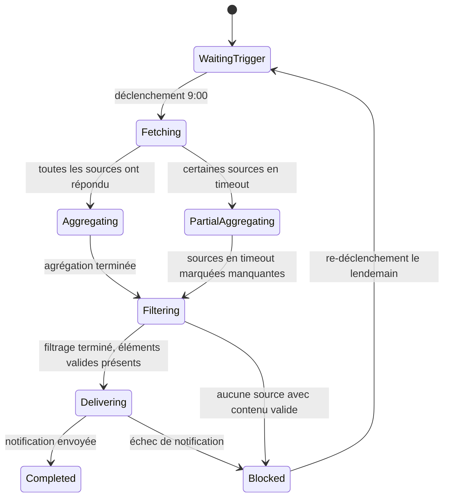

# Chapitre 25 : Fiabilité des workflows automatisés

Autour d'un fil rouge — « l'agrégation quotidienne des sujets chauds IA » — ce chapitre montre ce qu'il faut traiter pour faire passer un workflow d'une exécution manuelle à une exécution planifiée fiable.

## Contexte : la quête quotidienne de sujets d'un créateur de contenu

L'IA évolue vite ; chaque jour, il faut filtrer de multiples sources pour repérer ce qui mérite un article. La consultation manuelle une à une prend du temps et laisse passer des sujets. Un besoin typique :

```text
Je suis un créateur spécialisé en IA : tutoriels IA, outils IA, AI Coding, tests IA, etc.
Trouve-moi les sujets chauds IA du jour, pour m'aider à sélectionner les contenus de la journée.
Sources :
- Articles récents viraux du Compte officiel WeChat (@wechat-article-search)
- Projets IA tendance du jour sur GitHub (@GitHub热门项目)
- Agrégation d'actualités IA multi-moteurs (@多引擎搜索)
- Suivi des tendances IA (@AIHOT)
```

Lancée manuellement, la tâche fait appeler par WorkBuddy aux quatre sources en même temps et produit une liste des sujets IA du jour. Une fois au point, l'étape suivante est la planification : exécution automatique chaque matin à 9 h, résultat poussé vers l'emplacement choisi.


## Trois seuils avant d'automatiser

Toutes les tâches ne s'automatisent pas d'emblée :

1. **Le même prompt a déjà été exécuté au moins trois fois**, avec qualité et format globalement stables ;
2. **Déclencheur, sources d'entrée et critères d'acceptation sont clairs** : quand exécuter, quelles sources, quel format de sortie ;
3. **Il y a un responsable, une alerte et une procédure d'arrêt** : qui traite un échec, comment suspendre sans affecter les autres processus.

Une tâche dont le prompt change sans cesse ou dont les sources sont instables reste d'abord manuelle ; l'automatisation peut attendre.

## Créer la tâche automatisée

L'effet validé manuellement, dites-le simplement à WorkBuddy dans la même conversation :

```text
Automatise cette tâche : exécution chaque matin à 9:00,
résultat envoyé vers [groupe Feishu désigné / courriel / notification WeCom].
```

WorkBuddy enregistre le prompt et la configuration des sources comme tâche planifiée, exécutée automatiquement à l'heure définie.


## Concevoir la tâche automatisée comme une machine à états

Automatiser, ce n'est pas « ça tourne, c'est bon ». En conditions réelles, chaque exécution peut rencontrer : source en timeout, aucun élément pertinent du jour, quota API atteint, destination de notification injoignable. Modélisez la tâche en machine à états, chaque état doté d'une condition de succès et d'une sortie d'échec explicites :



Principe clé : **l'échec de certaines sources ne doit pas bloquer la tâche entière** — marquer le manque et poursuivre l'agrégation ; en cas d'échec de notification, conserver le résultat et alerter, sans perdre le contenu généré.

## Contrôle de disponibilité des sources

Un déclenchement planifié ne garantit pas que les sources sont prêtes ; commencez chaque exécution par un contrôle de disponibilité :

| Source | Points contrôlés | Traitement si indisponible |
| --- | --- | --- |
| @wechat-article-search | API de recherche joignable, résultats non vides | Marquer manquant, poursuivre avec les autres |
| @GitHub热门项目 | API GitHub hors limitation | Une relance avec temporisation, sinon marquer manquant |
| @多引擎搜索 | Moteurs de recherche joignables | Marquer manquant, poursuivre avec les autres |
| @AIHOT | Service de suivi opérationnel | Marquer manquant, poursuivre avec les autres |

Sur les quatre sources, au moins trois doivent fonctionner pour produire la liste complète ; en cas d'échec total, passage en état Bloqué avec alerte, et re-déclenchement le lendemain.

## Garde-fous de qualité du contenu

Joignabilité ne vaut pas validité. Après agrégation, filtrez sur quatre dimensions : **pertinence** (réellement lié à l'IA), **fraîcheur** (contenus du jour, tendances périmées exclues), **doublons** (fusion des multiples sources d'un même événement), **seuil minimal** (moins de 5 éléments valables : signaler « tendances insuffisantes aujourd'hui »).

Trois niveaux de qualité : **pass**, sortie normale ; **warning**, sources partiellement manquantes, mention en tête de sortie ; **blocked**, éléments valables insuffisants — pas de corps envoyé, seulement l'explication.

## Structure de sortie figée

```text
📋 Quotidien des sujets chauds IA — 2026-07-10

[Aperçu du jour]
Éléments valables : 18 | Sources : 4/4 | Exécution : 09:02

🔥 Forte audience (idéal pour surfer sur la vague)
1. [Nom du modèle] publié, [capacité clé] — Sources : AIHOT + GitHub
   Indice : ★★★★★ | Angle suggéré : test de fonctionnalités / tutoriel

📈 Pistes à potentiel (idéal pour une analyse approfondie)
2. [Sujet] suscite le débat — Source : Compte officiel WeChat
   Indice : ★★★ | Angle suggéré : analyse d'opinion / décryptage de cas

⚠️ État des sources
GitHub : normal | WeChat : normal | Recherche multi-moteurs : normal | AIHOT : normal
```

Une fois le format figé, le créateur tranche ses sujets en 5 minutes, au lieu de remettre la forme en ordre à chaque fois.

## Destinations de notification et idempotence

| Destination | Scénario | Précaution |
| --- | --- | --- |
| Message de groupe Feishu | Partage d'équipe des sujets | Noter le message ID pour éviter les doublons |
| Notification personnelle | Usage individuel | Idem |
| Document Feishu (ajout) | Conservation de l'historique | Ajouter par date, sans écraser l'historique |
| Courriel | Notification inter-plateformes | Noter l'identifiant d'envoi |

**Principe d'idempotence** : une tâche relancée après un échec d'envoi ne doit pas renvoyer ce qui a déjà été délivré. Chaque exécution génère un identifiant de lot unique (ex. `ai-hotspot-2026-07-10`) ; après notification réussie, l'état est enregistré ; à la relance, l'état est vérifié et les étapes accomplies sont sautées.

## Stratégies de timeout et de relance

| Type d'échec | Relance ? | Stratégie |
| --- | --- | --- |
| Timeout d'API de source | Oui | Attendre 10 secondes, une relance ; sinon marquer manquant |
| Quota GitHub atteint (429) | Oui | Attendre selon Retry-After, 2 fois maximum |
| Authentification expirée (401/403) | Non | Passer à un humain, pas de relance automatique |
| Destination de notification injoignable | Oui | Retrait exponentiel, 2 relances ; sinon alerte et conservation du résultat |
| Résultat d'agrégation vide | Non | Passer en bloqué, envoyer l'explication, re-déclencher le lendemain |

Les relances ne visent que les pannes passagères — pas les problèmes d'entrée ou de configuration.

## Reprise sur incident et alertes actionnables

Chaque exécution produit un fichier d'état consignant les étapes et livrables accomplis (ID de lot, état, état de chaque source, nombre d'éléments, dernière erreur). Après un échec de notification, la relance reprend à l'étape `delivering`, sans re-collecte ni réagrégation.

Une alerte doit permettre d'agir immédiatement — lot, état, cause de l'échec, impact, étapes conseillées, point de reprise. « Tâche échouée, voyez » ne suffit pas.

## Livraison dégradée et journaux

Face à des sources défaillantes, n'attendez pas la complétude : 3 sources ou plus opérationnelles → liste complète avec manques signalés ; 2 → liste simplifiée signalée incomplète ; 1 ou 0 → pas de corps, seulement explication et alerte. Tout résultat dégradé doit afficher explicitement la couverture des sources — **sans se déguiser en exécution complète**.

Chaque exécution journalise : ID de lot et mode de déclenchement, état et temps de réponse de chaque source, nombre d'éléments après agrégation et filtrage, résultat de notification, durée totale et erreurs, coût d'exécution (tokens, appels API). Le corps des contenus n'est pas journalisé.

## Répétition générale avant mise en service

| Scénario | Comportement attendu |
| --- | --- |
| Toutes les sources opérationnelles | Liste complète, notification réussie |
| Quota GitHub atteint | Retrait puis relance ; sinon marquer manquant et poursuivre |
| Aucune tendance IA du jour | Éléments valables insuffisants ; explication envoyée, pas de liste vide |
| Destination injoignable | 2 relances ; sinon alerte et conservation du résultat |
| Déclenchement double (manuel + planifié) | Détection de l'ID de lot, exécution dupliquée sautée |

## Gabarit de définition d'une tâche automatisée

```text
Nom de la tâche : Quotidien des sujets chauds IA
Déclenchement : tous les jours à 09:00 (jours ouvrés)
Prompt : [texte intégral du prompt]
Sources : @wechat-article-search / @GitHub热门项目 / @多引擎搜索 / @AIHOT
Garde-fous qualité : éléments IA pertinents ≥ 5 ; sources disponibles ≥ 3
Format de sortie : liste structurée (source, audience, angle suggéré)
Destination : [groupe Feishu / notification personnelle / ajout à un document Feishu]
Idempotence : ID de lot = ai-hotspot-{date}, marqué après notification réussie, pas de renvoi
Relances : timeout de source, 1 relance ; échec de notification, 2 relances avec retrait ; autres échecs → humain
Alertes : [notification Feishu personnelle]
Responsable : [le créateur lui-même]
Arrêt : page de gestion des automatisations WorkBuddy → suspendre
```

## De l'automatisation personnelle au service d'équipe

| Dimension | Usage personnel | Service d'équipe |
| --- | --- | --- |
| Destination | Notification personnelle | Groupe Feishu d'équipe |
| Orientation des sujets | Direction unique | Notification classée par direction |
| Validation | Jugement individuel | Diffusion après validation de la rédaction en chef |
| Traitement des pannes | On gère soi-même | Responsable et suppléant identifiés |
| Imputation des coûts | Compte personnel | Budget d'équipe |

L'extension en service d'équipe exige : un responsable clair, un manuel d'exploitation, des permissions (qui peut modifier prompt et notification), une procédure de changement.

**La forme aboutie de l'automatisation n'est pas l'absence totale d'humains, mais un chemin nominal qui dérange peu, et un chemin d'exception qui trouve vite la bonne personne.** Après mise en service, itérez selon les retours (prompt, sources, format, horaires) ; chaque ajustement suit « modifier → vérifier manuellement → réenregistrer », jamais d'expérimentation directe sur la tâche planifiée.
