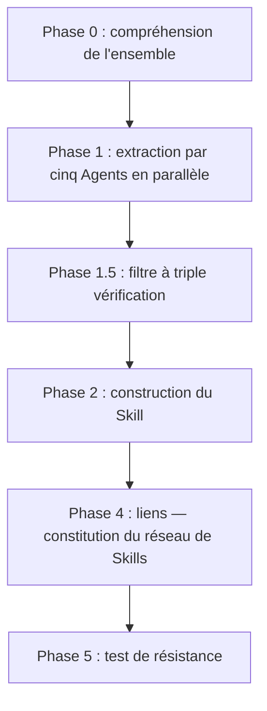
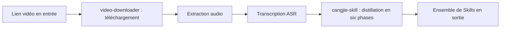

# Chapitre 22 : Créer un Skill : distiller livres et vidéos en Skills exécutables

Au-delà de la conversion de vos propres SOP en Skills, il existe une voie plus simple : [cangjie-skill](https://github.com/kangarooking/cangjie-skill) (skill Cangjie ; v1 distille les livres, la v2 ajoute la distillation vidéo) pour distiller la connaissance en Skills.


Ce chapitre répond à deux questions : comment transformer les méthodes contenues dans les livres et vidéos en Skills que l'Agent peut appeler automatiquement, et en quoi cela diffère fondamentalement de la recherche RAG.

## Le point de départ : une connaissance lue mais inutilisable

L'IA a ingéré quantité d'ouvrages de référence à l'entraînement, mais en pratique elle produit souvent des « banalités correctes » — chaque mot est juste, sans étapes applicables au problème posé. Ce n'est pas un problème d'hallucination, mais de **mécanisme d'appel** : l'IA sait ce que contient le livre, mais ne sait pas quel cadre mobiliser, dans quel scénario, de sa propre initiative.

Le lecteur humain connaît le même écueil : livre terminé, notes prises, citations surlignées… deux semaines plus tard, face à un vrai problème, les méthodes restent hors de portée — la connaissance est en mémoire, mais le chemin d'activation est flou. La distillation de connaissances s'attaque précisément à ce « j'ai appris mais je n'arrive pas à m'en servir ».

## Définition de la distillation de connaissances

**Distillation de connaissances (Knowledge Distillation for Skills)** : extraire de livres ou de vidéos des unités de connaissance atomiques (Skills) dotées de conditions de déclenchement et d'étapes d'exécution propres, afin que l'Agent, confronté au scénario correspondant, les active automatiquement et propose un plan d'action concret.

En chimie, la distillation sépare un mélange en composants purs selon les points d'ébullition ; la distillation de connaissances sépare le savoir selon cinq dimensions — « cadres / principes / cas / contre-exemples / terminologie » — et ne purifie en Skills exécutables que l'utile.

La distillation de connaissances **n'est pas** : un résumé (compression du texte original), des notes de lecture (structuration du texte original), un index RAG (stockage d'extraits pour recherche). Elle convertit les méthodes en unités d'exécution que l'Agent peut appeler automatiquement en situation réelle.

## La SOP de distillation en six phases



Prenons la distillation de « The Copywriter's Handbook » :


### Phase 0 : comprendre l'ensemble du livre ou de la vidéo

Ne commencez pas par extraire des citations : lisez d'abord la charpente de l'ouvrage — thèse centrale, chaîne d'argumentation, définition et usage des termes clés, limites et angles morts de l'auteur. Cette phase plafonne la qualité de l'extraction qui suivra — la sauter, c'est risquer de prendre pour une méthode approuvée une idée que l'auteur combat.

### Phase 1 : extraction par cinq Agents en parallèle

Cinq Agents balaient simultanément le texte selon cinq dimensions, indépendamment, sans se gêner, pour éviter les angles morts d'une lecture linéaire unique :

| Agent | Cible d'extraction |
| --- | --- |
| Cadres | Cadres d'analyse ou de décision construits par l'auteur |
| Principes | Principes d'action réutilisables d'un scénario à l'autre |
| Cas | Cas positifs et trajectoires de succès |
| Contre-exemples | Échecs et leçons inverses |
| Terminologie | Termes spécialisés et leurs définitions |


### Phase 1.5 : filtre à triple vérification

Chaque unité candidate doit franchir trois portes ; hors-jeu immédiat en cas d'échec :

| Vérification | Contenu du contrôle |
| --- | --- |
| Inter-domaines | La méthode apparaît dans au moins deux scénarios indépendants du livre, pas un fait isolé |
| Pouvoir prédictif | Permet-elle de déduire des questions que le livre n'aborde pas directement |
| Originalité | Est-ce une banalité que n'importe qui énoncerait ? Le bon sens ne fait pas un Skill |

Privilégier la qualité à la quantité : un livre donne généralement 50 à 100 unités candidates, la triple vérification n'en retient que 10 à 25.


### Phase 2 : construire le Skill

Le cœur est de concevoir les **conditions de déclenchement** : dans quel scénario s'activer, quelles étapes exécuter ensuite, quand ne pas l'utiliser (limites), et selon quels critères de qualité. Un Skill sans condition de déclenchement ne peut être ni identifié ni appelé correctement par l'Agent — l'étape la plus difficile et la plus décisive.

### Phase 4 : les liens

Repérer les relations entre Skills pour former un réseau : **dépendance** (l'exécution de A requiert la sortie de B), **contraste** (scénarios proches, orientations opposées), **combinaison** (plus efficaces ensemble). Cette couche de liens permet à l'Agent, devant un problème complexe, de choisir un ensemble de Skills, et non un seul.

### Phase 5 : test de résistance

- **Test d'appât** : soumettre volontairement des scénarios qui ne doivent pas déclencher, pour vérifier que le Skill sait s'abstenir — un Skill sans limites, appelé hors de propos, dessert plus qu'il sert ;
- **Vérification d'exécution** : poser un problème réel et vérifier la production d'étapes applicables, et non de « banalités correctes ».

## Structure du produit de distillation

```text
book-skill/
├── README.md               # Informations sur le livre, note de distillation, scénarios applicables
├── skills/
│   ├── skill-01.md         # Un fichier par Skill
│   └── ...
├── index.md                # Réseau de relations entre Skills (produit de la couche de liens)
└── tests/
    └── skill-01-test.md    # Cas de test de chaque Skill
```


Chaque fichier de Skill contient conditions de déclenchement, étapes d'exécution, format de sortie, limites et cas de test ; le format est compatible avec darwin-skill (outil d'évolution automatique des Skills), si bien que le produit peut s'améliorer en continu.


## Distillation de connaissances vs RAG

| Dimension | RAG | Distillation de connaissances (Skill) |
| --- | --- | --- |
| Nature | Recherche — trouver les extraits les plus pertinents | Extraction — tirer du texte des méthodes exécutables |
| Prérequis d'usage | L'utilisateur doit savoir quoi demander | L'utilisateur décrit son problème, le Skill identifie et s'active |
| Contrôle qualité | Aucun — tout contenu peut entrer en base | Triple vérification, la qualité prime sur la quantité |
| Mode d'appel | Attend passivement la requête | Fait correspondre le scénario et se déclenche activement |
| Forme du savoir | Stocke le texte original (retenir) | Purifie en étapes exécutables (appliquer) |
| Maîtrise des limites | Aucune | Test d'appât contre les activations intempestives |

Le RAG rèle la « gestion des connaissances » — retrouver ce que contient le livre ; la distillation règle « l'application » — l'Agent sort le bon cadre au bon moment. **Quand vous ne savez pas quoi demander, le RAG ne peut rien pour vous.**

## Workflow de distillation vidéo (nouveauté v2)

cangjie-skill v2 s'appuie sur le skill [video-downloader](https://github.com/kangarooking/kangarooking-skills/tree/main/video-downloader) pour ajouter la distillation vidéo : d'abord la conversion « vidéo → texte », puis la SOP en six phases.




- **Téléchargement vidéo** : yt-dlp prend en charge YouTube, Bilibili et les grandes plateformes (WeChat Channels non automatisable pour l'instant, restriction de plateforme) ;
- **Transcription audio** : Whisper local possible mais lent sur les longues vidéos (environ 48 minutes pour une heure) ; recommandé : API ASR en traitement par lots ;
- **Distillation multi-vidéos fusionnées** : plusieurs vidéos d'un même thème peuvent être fusionnées, l'Agent déduplique et consolide les unités de connaissance ;
- **Séparation des responsabilités** : l'acquisition vidéo est encapsulée dans video-downloader, cangjie-skill se concentre sur la distillation textuelle ; les deux évoluent indépendamment.

## Cas adaptés et inadaptés

| Type | Adéquation | Remarque |
| --- | --- | --- |
| Livres à forte densité de méthodes | ★★★★★ | Cadres clairs, principes extractibles ; idéal |
| Entretiens / vidéos de cours | ★★★★☆ | Bonne structuration, se prête à la distillation |
| Longues vidéos / podcasts | ★★★☆☆ | Possible, densité variable selon le contenu |
| Recueils de citations et essais | ★★☆☆☆ | Peu de méthodes, qualité limitée |
| Romans / littérature narrative | ★☆☆☆☆ | Sans cadres méthodologiques extractibles |

Mieux vaut avoir lu ou vu la source avant distillation : des arbitrages sont nécessaires aux nœuds clés (cas limites de la triple vérification), et distiller après lecture accroît nettement l'assimilation. **La distillation ne remplace pas la lecture ; c'est un outil de structuration post-lecture.**

## Consommation de ressources et choix du modèle

La distillation consomme beaucoup de tokens (compréhension de l'ouvrage + extraction en cinq voies + vérifications multiples + test de résistance). Ordres de grandeur : 30 à 90 minutes et de quelques dizaines à une centaine de milliers de tokens pour un livre courant ; environ 1 heure pour 26 épisodes de cours (4 heures).

Choix du modèle : décomposition de la tâche et coordination pour un modèle à forte puissance de raisonnement ; extraction et vérification parallèles pour un modèle économique ; en contexte long, choisir un modèle nativement long-contexte pour éviter toute troncature qui amputerait la distillation.

## Idées reçues

1. **« Un livre déjà vu à l'entraînement n'a pas besoin d'être distillé »** — même si l'IA s'en souvient, la valeur de la distillation tient aux **conditions de déclenchement** : quel cadre sortir dans quel scénario, et pas seulement « savoir ce que dit le livre ».
2. **« Une fois distillé, plus besoin de lire »** — distiller sans avoir lu prive des repères aux nœuds d'arbitrage et fait manquer l'essentiel.
3. **« Si l'IA propose, on exécute »** — la pertinence de la direction et la faisabilité restent un jugement humain. L'IA donne options et analyses ; la décision est une responsabilité humaine.
4. **« Plus un Skill couvre, mieux c'est »** — des conditions de déclenchement trop larges provoquent des activations erronées. Mieux vaut une couverture étroite que des déclenchements intempestifs.

## Exemple de résultat

Avec « AI for Everyone » d'Andrew Ng (édition 2026, 26 vidéos, environ 4 heures) : distillation en environ 1 heure, 25 Skills produits, tous d'actualité, directement mobilisables par l'Agent dans leurs scénarios respectifs.


## En résumé : la place de la distillation dans l'écosystème des Skills

| Source | Scénarios adaptés |
| --- | --- |
| À partir des processus métier (SOP → Skill) | Règles opérationnelles internes, processus métier répétitifs |
| À partir de livres / vidéos (distillation de connaissances) | Méthodes d'experts, ouvrages de référence, contenus de formation à forte valeur |

Les deux produisent le même format : des Skills exécutables à conditions de déclenchement, utilisables ensemble dans le même framework d'Agent. Un même livre n'a pas besoin d'être distillé par chacun — le travail de n'importe qui peut être publié en open source et réutilisé par tous.
