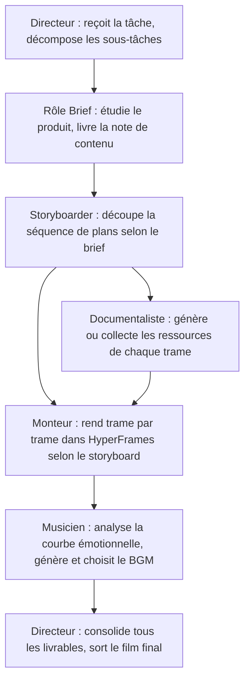

# Chapitre 24 : Concevoir un système multi-agents

À travers un cas réel — une « équipe d'experts pour film promotionnel produit » — ce chapitre répond aux trois questions clés du multi-agents : comment concevoir la répartition du travail, comment enchaîner les livrables, et quand vaut-il la peine de fractionner.


## La vraie différence entre mono-Agent et multi-agents

| Dimension | Agent unique | Multi-agents |
| --- | --- | --- |
| Contexte | Toute l'information dans une tâche | Chaque rôle ne reçoit que le nécessaire |
| Répartition | Un exécutant traite en série | Plusieurs rôles en parallèle ou en relais |
| Outils | Un même jeu de permissions | Outils et permissions isolables par rôle |
| Qualité | Se génère et se contrôle soi-même | Relecteur indépendant possible |
| Coût | Plus faible | Coordination, modèle et appels d'outils plus nombreux |
| Risque | Une erreur affecte l'ensemble | Les erreurs peuvent se propager entre rôles |

La valeur du multi-agents vient de la **spécialisation, du parallélisme, de l'isolement des permissions ou de la relecture indépendante** — pas du nombre de rôles.


## La tâche mérite-t-elle d'être fractionnée

Plus ces critères sont remplis, plus le multi-agents s'impose :

- au moins deux sous-tâches peuvent avancer indépendamment ;
- les sous-tâches exigent méthodes, documents ou outils différents ;
- les sorties se prêtent à un format de passation clairement défini ;
- le parallélisme raccourcit sensiblement l'attente ;
- il existe un responsable global identifié et une validation finale ;
- le budget autorise plusieurs tours d'appels.

Retoucher un courriel, résumer un PDF ou mettre en forme un tableau n'exige pas d'équipe d'experts.

## Cas d'étude : l'équipe d'experts du film promotionnel produit

### Contexte de la tâche

HyperFrames est le framework open source de rendu vidéo de HeyGen ; sa caractéristique centrale est sa convivialité pour les Agents IA : l'Agent génère automatiquement des trames vidéo fondées sur HTML et les rend. Le film promotionnel produit suit un canevas assez fixe — ni voix off ni comédiens, essentiellement démonstrations produit, sous-titres de concept et BGM — qui se prête à une répartition en équipe d'Agents.


### Conception des étapes



### Contrats de rôles

| Rôle | Entrées | Sorties | Actions interdites |
| --- | --- | --- | --- |
| Directeur | Description de tâche utilisateur, espace de ressources | Décomposition, suivi d'état, film final | Ne livre pas sans validation des sous-tâches |
| Rôle Brief | Site produit, documents de présentation | brief.md (positionnement, valeur, utilisateurs) | N'écrit pas le script directement |
| Storyboarder | brief.md | Storyboard (codes temps, images, sous-titres, transitions) | N'introduit rien que le brief n'a pas confirmé |
| Documentaliste | Storyboard | Captures produit, concept arts, ressources d'interface | N'utilise aucune ressource sans droits |
| Monteur | Ressources, storyboard | Fragments MP4 trame par trame | Ne modifie pas la structure du storyboard |
| Musicien | Storyboard, annotations d'émotion | Candidats BGM et motifs du choix | Ne propose pas une seule option |

### Démonstration de l'équipe d'experts

Avant de produire le film, placez les ressources pertinentes dans l'espace de travail :

```text
Je souhaite que tu produises un film promotionnel — plus précisément pour la nouvelle équipe d'experts WorkBuddy de Tencent,
en mettant en avant le scénario OPC. J'ai placé des ressources dans l'espace courant ; le style final peut tendre Apple,
avec de véritables interfaces logicielles. Processus entièrement automatique.
```


Le chef d'équipe décompose d'abord « faire un film » en une chaîne de sous-tâches : comprendre le produit, sa cible, sa valeur centrale ; puis fixer structure narrative, nombre de plans, rythme ; ensuite produire en parallèle ressources, montage et musique.

Le rôle Brief ouvre le bal : passe au crible site et documentation, et livre une note — quel produit, quels utilisateurs cibles, les quelques points clés méritant les 60 secondes. Le storyboarder enchaîne sur le brief : 60 secondes découpées en 7 plans, jusqu'au code temps, à l'image, au texte, aux transitions, aux animations et au type de ressource. Documentaliste et monteur s'activent : l'un génère/collecte captures et concept arts, l'autre injecte les ressources dans HyperFrames selon le storyboard et rend le MP4 plan par plan.

Le plus intéressant est le musicien : au lieu d'un simple prompt « BGM tech » expédié, il lit d'abord le storyboard et étudie la courbe émotionnelle de chaque plan — où un coup de batterie doit caler la révélation produit, où retomber pour ménager un blanc, où placer un hit point pour pousser le CTA — et seulement alors appelle le modèle musical pour générer des candidats. Enfin, le chef d'équipe consolide le tout et exécute le dernier montage.


Pendant tout le processus, l'humain est quasiment spectateur : il arbitre aux nœuds clés — ce storyboard convient-il, ce BGM plaît-il, ce sous-titre faut-il le changer.

## La couche de livrables partagés

Plusieurs Agents ne doivent pas chacun entretenir leur « vérité produit » ; établissez un chemin de livrables unique :

```text
project/
├── brief.md                  # Note produit (rôle Brief, validée par le directeur)
├── storyboard.md             # Storyboard (storyboarder, validé par le directeur)
├── assets/                   # Ressources (documentaliste)
│   ├── screenshots/
│   └── concepts/
├── clips/                    # Fragments trame par trame (monteur)
├── bgm/                      # Candidats BGM (musicien)
└── output/final.mp4          # Film final (consolidation par le directeur)
```

**Les rôles en aval ne lisent que les livrables validés en amont.** Les détails essentiels ne transitent pas par la conversation entre rôles.

## Parallèle et série

- **Parallélisables** : génération des ressources et préparation du montage, rendu de segments de plans différents ;
- **Impérativement en série** : storyboard seulement après validation du brief, ressources seulement après validation du storyboard, montage seulement après disponibilité des ressources, synthèse musicale seulement après le film final.

Tout plan parallèle doit expliciter ses points de jonction : ressources et montage peuvent se préparer en parallèle, mais la synthèse finale attend que toutes les ressources soient en place.

## Les responsabilités du directeur

Le directeur (producteur) est le contrôleur du workflow : il interprète la tâche utilisateur et suit l'état des sous-tâches ; distribue le contexte minimal nécessaire ; vérifie que les livrables amont respectent le format de passation ; décide du parallélisme, de l'attente ou de la relance ; sollicite l'arbitrage humain aux nœuds clés ; consolide tous les livrables pour la synthèse finale ; contrôle la cohérence du film final.

**Trois points exigeant la validation humaine** : validation du brief (positionnement, utilisateurs, arguments), validation du storyboard (structure narrative, nombre de plans, rythme), choix du BGM (le style émotionnel colle-t-il au ton). L'Agent génère et exécute ; il ne remplace ni la direction de marque ni le jugement stylistique.

## De l'équipe maison à l'équipe préconfigurée

| Dimension | Skills maison | Équipes préconfigurées |
| --- | --- | --- |
| Public | Développeurs exigeant une personnalisation poussée | Entreprises solo, usage immédiat |
| Seuil d'entrée | Élevé (définir les rôles, régler le processus) | Faible (décrire la tâche suffit) |
| Souplesse | Élevée (chaque maillon modifiable) | Moyenne (modèles personnalisés acceptés) |
| Rapidité | Selon le temps de montage | Prête à l'emploi |

Créer sa propre équipe d'experts est simple : Experts → Mes experts → Créer un expert ; la boîte de dialogue WorkBuddy s'ouvre, et le format guide permet une création rapide.


Scénarios typiques couverts par les équipes actuelles :

| Catégorie | Équipes représentatives |
| --- | --- |
| Création de contenu | Film promotionnel produit, création de contenus viraux, diffusion omnicanale |
| Développement logiciel | Développement, tests de code |
| Analyse d'affaires | Recherche approfondie, analyse d'investissement, analyse de données |
| Support opérationnel | SEO, ventes, marketing, conformité fiscale et comptable, RH |
| Conformité juridique | Droit chinois |


## Facteurs de qualité

- **Modèle sous-jacent de l'Agent** : le suivi d'instructions et le raisonnement pèsent directement sur la qualité du storyboard et l'exactitude de la décomposition ;
- **Modèle de génération d'images** : influe sur la netteté des captures produit et la qualité visuelle des concept arts ;
- **Ressources fournies par l'utilisateur** : les placer à l'avance dans l'espace de ressources améliore nettement le film final ;
- **Connectivité navigateur** : avec des capacités de navigation, l'Agent capture automatiquement les captures du site et des interfaces produit.

La solution tout-automatique convient à une production rapide ; pour les exigences élevées de qualité, mieux vaut partir des livrables de l'Agent pour un second montage humain.

## Maîtrise de la propagation des échecs

| Échec d'un rôle | Mode de repli |
| --- | --- |
| Le rôle Brief n'obtient pas les informations produit | Réessayer après complément d'informations par l'utilisateur |
| Échec de génération des ressources | Utiliser les ressources préposées ou marquer les emplacements manquants |
| Dépassement du temps de rendu | Livrer les fragments achevés et le storyboard |
| Échec de génération du BGM | Fournir une description du type de BGM recommandé, l'utilisateur choisit |
| Échec de synthèse par le directeur | Livrer la liste des livrables de chaque rôle, l'utilisateur synthétise manuellement |

Toute livraison dégradée doit signaler ses manques — **sans se déguiser en résultat complet**.

## Gabarit de brief pour tâche multi-agents

```text
Objectif : produire un film promotionnel de [durée] pour [nom du produit].
Style : [référence, ex. style Apple, minimaliste].
Ressources : [chemin de l'espace de ressources ou images/vidéos fournies].
Rôles : directeur, Brief, storyboarder, documentaliste, monteur, musicien.
Points de validation : après le brief, après le storyboard, au choix du BGM — poursuivre après validation utilisateur.
Modèles : modèle Agent [préciser] ; modèle de génération d'images [préciser].
Tout-automatique / semi-automatique : [préciser si une intervention humaine intermédiaire est requise].
```
