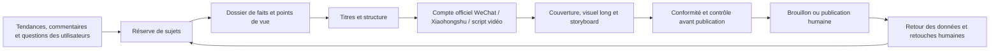

# Chapitre 20 : Médias personnels — pas seulement une question d'efforts, mais une boucle de croissance

## Personne ne lit vos contenus ? Ce n'est souvent pas faute d'efforts

En créant seul ses contenus, la plus grande perte de temps est de polir un contenu à la perfection d'entrée de jeu : article très fouillé, documentation exhaustive, structure remaniée trois fois… et quelques lectures à la publication. En phase de lancement, la vraie question n'est pas « est-ce assez bien écrit », mais « quelqu'un a-t-il envie de cliquer ».

## Vue d'ensemble du workflow



Le rôle d'un Skill est de suppléer un maillon de cette chaîne, pas de remplacer le jugement de l'éditeur du compte. Voyons cela sur quelques situations concrètes.

## Scénario 1 : survoler les tendances chaque jour sans savoir quoi écrire

Les classements vous disent « ce que tout le monde regarde », pas « pourquoi ce compte devrait en parler ». Suivre uniquement les tendances mène au même contenu que tout le monde ; suivre uniquement son intuition empêche de savoir si le public s'en soucie vraiment.

Skills utiles : [Recherche d'articles populaires du Compte officiel WeChat](https://skillhub.cn/skills/gzh-explosive-content-detector), [Recherche de notes virales Xiaohongshu](https://skillhub.cn/skills/xhs-hotnotes), [Analyse des commentaires Xiaohongshu](https://skillhub.cn/skills/xhs-comment-insights), [Inspiration Hunter](https://skillhub.cn/skills/inspiration-hunter-skill).

```text
Constitue une réserve de sujets hebdomadaire autour de « l'automatisation bureautique par l'IA », sans rédiger d'article.
Collecte séparément les contenus à forte interaction des 30 derniers jours du Compte officiel WeChat et de Xiaohongshu ; note titre, date de publication,
promesse centrale, structure, signaux d'interaction et lien d'origine.
Extrais ensuite des commentaires : questions récurrentes, objections, échecs vécus et mots exacts des utilisateurs.
Tiens compte de mon positionnement : public professionnel non technique, accent sur processus réels et validation des résultats.
Livre 12 sujets candidats, chacun avec : lecteur cible, problème réel, manque dans les contenus existants,
les nouvelles preuves que j'apporte, plateforme adaptée, coût de production et actualité.
Ne déduis pas qu'un sujet me convient simplement parce que son lectorat est élevé.
```


WorkBuddy génère d'abord un tableau d'échantillons multi-plateformes, agrège ensuite les commentaires en grappes de questions, puis note séparément « popularité, adéquation avec le compte, valeur ajoutée, solidité des preuves, coût de production », pour livrer un tableau de sujets que l'humain peut trier.


### Savoir repérer les « contenus viraux à petit compte »

Au lancement, cherchez les contenus viraux publiés par de petits comptes pour **s'inspirer du sujet** (du sujet, pas d'une copie mot à mot). Recommandé : le skill [viral-topic](https://github.com/kangarooking/kangarooking-skills/tree/main/viral-topic) : récupère les contenus viraux à petit compte d'un domaine donné, par exemple « les articles IA viraux à petit compte du Compte officiel WeChat des 7 derniers jours » ; fonctionne aussi pour X et YouTube.


## Scénario 2 : un titre accrocheur, sans simplement faire du clickbait

« Donne-moi 20 titres viraux » livre facilement chiffres, suspense et promesses enflées — mais aucun titre que le corps du texte puisse tenir. **Un titre n'est pas un texte autonome : c'est une promesse entre le lecteur et l'article.**

Skills utiles : [Génération et notation de titres pour Compte officiel WeChat](https://skillhub.cn/skills/gzh-official-account-title-generator), [Générateur automatique de notes virales Xiaohongshu](https://skillhub.cn/skills/redbook-writer), [Génération d'accroches vidéo courte](https://skillhub.cn/skills/bozo-video-gz) ; pour les titres du Compte officiel, essayez aussi [viral-title](https://github.com/kangarooking/kangarooking-skills/tree/main/viral-title).

```text
Lis approved-article.md et ne génère des titres qu'à partir des faits présents dans le texte.
Produis séparément : 8 titres pour le Compte officiel WeChat, 8 titres Xiaohongshu, 5 accroches d'ouverture vidéo.
Pour chaque candidat, indique :
1. à qui il s'adresse ; 2. la promesse ; 3. quel passage du texte la tient ;
4. l'angle retenu (question/résultat/liste/cas/contre-intuition) ;
5. les notes de crédibilité, précision, adéquation à la plateforme et risque d'exagération.
Supprime les chiffres invérifiables, promesses absolues, rareté factice et conclusions incohérentes avec le texte.
Ne choisis pas le titre final automatiquement : laisse-moi valider la promesse de contenu.
```


**Méthode de validation** : montrez le titre seul à quelqu'un qui ne connaît pas l'article et demandez-lui d'écrire « ce que je m'attends à trouver en cliquant », puis comparez au texte — si l'attente ne colle pas, le titre est inutilisable, si bien noté soit-il. En test A/B, ne modifiez qu'une variable principale à la fois, sinon les données deviennent inexplicables.

## Scénario 3 : chaque couverture du Compte officiel repart d'une toile vierge

Demander simplement « une couverture haut de gamme » donne en général une image décorative sans rapport avec le texte, des textes erronés ou un logo déformé.

```text
Prépare un brief de couverture du Compte officiel WeChat pour l'article « Des favoris à la gestion des connaissances — l'essentiel est de s'en resservir ».
Lecteur cible : travailleurs du savoir ; message clé : passer des favoris à un flux de connaissances réutilisable.
Couleurs de marque : #1677FF, blanc, noir ; interdits : dégradés violets, effets techno spectaculaires, interfaces produit fictives.
Propose d'abord 3 directions de composition, chacune avec : sujet, hiérarchie, texte de couverture, couleurs, espaces blancs,
risque de recadrage petit format et passage correspondant de l'article. Génère les images après ma validation.
Après génération, vérifie : exactitude du texte, logo non déformé, sujet non rogné au petit format.
Ne téléverse pas directement vers le Compte officiel WeChat.
```


## Scénario 4 : Xiaohongshu, ce n'est pas « découper un long texte en neuf images »

Adapter un article du Compte officiel à Xiaohongshu se résume souvent à raccourcir les paragraphes, ajouter des émojis et étaler sur neuf cartes — beaucoup d'informations, mais une couverture sans crochet, une deuxième page sans relais, une dernière sans appel à l'action. Le bon workflow :

1. Extraire du long texte un dossier de faits débarrassé du ton de la plateforme ;
2. Choisir une question centrale et supprimer les digressions ;
3. Concevoir le rythme de balayage « promesse de couverture → résonance du problème → méthode → exemple → pièges → liste » ;
4. Livrer d'abord les maquettes page par page et le nombre de mots, puis générer les images ;
5. Vérifier corps de texte, retours à la ligne et marges à la largeur réelle d'un téléphone ;
6. Contrôler un à un chiffres et noms propres dans titre, corps, tags et images.

```text
Transforme approved-article.md en un carrousel Xiaohongshu de 8 pages, sans ajouter de faits.
Page 1 : une seule promesse ; page 2 : le problème que vit le lecteur ;
pages 3-6 : une action et un exemple par page ; page 7 : les erreurs fréquentes ;
page 8 : une liste de contrôle à conserver.
Rends d'abord le texte page par page, la hiérarchie visuelle et le nombre de mots prévu ; j'approuve avant l'appel des Skills de couverture et de visuel long.
```


## Scénario 5 : transformer un long texte en vidéo tournable

« Adapte en 60 secondes de voix off » aboutit souvent à une lecture accélérée de l'article — sans plans, sans rythme, sans images de preuve, sans respirations.

```text
Adapte cet article en une vidéo de 60 secondes en voix off réelle, pour faire comprendre aux débutants de WorkBuddy
« pourquoi un brief de tâche compte plus qu'une demande vague ».
Livres un tableau chronologique : durée, cadrage, image, voix off, texte à l'écran, source des ressources, transitions.
Les 3 premières secondes posent un problème réel, sans exagérer les bénéfices ; avant 20 secondes, montre une preuve du produit en action ;
termine par une instruction que le spectateur peut essayer immédiatement, sans promesse d'interaction factice.
Liste à part ce qui doit être tourné en réel, ce qui peut être une capture produit, ce que l'IA peut générer ; interdiction de fabriquer des retours d'utilisateurs.
```


## Scénario 6 : avant publication, ne laissez pas l'automatisation franchir la ligne de responsabilité

Skills utiles : [Détection de mots interdits pour Compte officiel WeChat](https://skillhub.cn/skills/gzh-prohibited-word), [Mise en page Compte officiel WeChat](https://skillhub.cn/skills/md-to-wechat), [Outil anti style IA pour articles](https://skillhub.cn/skills/unclecheng-reduce-ai-perception-v2).

```text
Vérifie si cet article du Compte officiel contient des mots interdits ; le cas échéant, signale-les et propose une correction pour chacun.
Contrôle le style « trop IA » du contenu, réduis-le, puis mets l'article en page.
```

Pour la chaîne de publication, mieux vaut s'arrêter aux brouillons : vérification des faits → citations et droits → marque et conformité → contrôle des liens → aperçu mobile → validation humaine du compte → publication. Likes automatiques, messages privés en masse, faux commentaires ou contournement de la modération de la plateforme ne relèvent pas des gains d'efficacité recommandés.

## Scénario 7 : sans bilan post-publication, chaque nouvel article repart de zéro

L'essentiel du bilan est de comparer le brouillon IA et la version finale retouchée à la main, pour laisser le Skill évoluer et se rapprocher de vos attentes. Utilisez [Auto-amélioration de l'écriture pour Compte officiel WeChat](https://skillhub.cn/skills/skill-article-evolution) ou un copilote Xiaohongshu, pour réécrire les retouches humaines et les données dans la bibliothèque de style :

```text
Lis les données de ce contenu, la version publiée et l'historique des retouches humaines, puis produis le bilan.
Commence par les faits chiffrés, puis liste au plus 3 hypothèses vérifiables, sans transformer corrélation en causalité.
Décompose la performance selon : sujet, titre, couverture, ouverture, structure, date de publication et canal.
Conçois 2 expériences à variable unique pour le prochain cycle, avec indicateur de succès et condition d'arrêt.
Écris dans style-guide.md les règles durables ; les tendances ponctuelles ne deviennent pas des règles permanentes.
```


## Une pile de Skills suffisante pour un créateur

| Niveau | Par quoi commencer | Quand ajouter la suite |
| --- | --- | --- |
| Débutant | Recherche de contenus populaires, notation de titres, génération d'images | Quand un contenu complet est produit de façon stable |
| Stable | Analyse des commentaires, couverture, brouillon mis en page, détection de mots interdits | Quand le positionnement du compte et le relecteur sont définis |
| Multi-plateformes | Cartes Xiaohongshu, scripts vidéo courte, adaptation par plateforme | Quand un dossier de faits unifié existe |
| Avancé | Retour des données, itération du style, radar de sujets planifié | Quand le processus humain tourne sans faille depuis 4 semaines |
