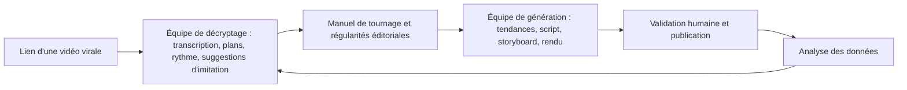

# Chapitre 19 : Une équipe vidéo IA à portée de phrase

Dans WorkBuddy, découpez le travail vidéo court en deux équipes d'experts IA : l'une produit automatiquement des vidéos, l'autre décortique les vidéos qui cartonnent.

| Équipe | Sa mission | Tâches adaptées |
| --- | --- | --- |
| **Équipe de génération vidéo** | À partir d'un thème : collecte des tendances, sélection du sujet, script, storyboard, voix off, rendu, sous-titres et publication | Hebdo IA, mises à jour produit, vulgarisation, analyses sectorielles, tests de produits |
| **Équipe de décryptage des vidéos virales** | À partir d'un lien : téléchargement, extraction audio, transcription, analyse du langage visuel, rapport de décryptage et suggestions d'imitation | Apprendre les structures virales, débriefer les vidéos concurrentes, capitaliser un manuel de tournage |

Ces deux équipes ne se remplacent pas : la génération répond à « comment produire une vidéo aujourd'hui », le décryptage répond à « pourquoi celle des autres a marché, et qu'en retenir ». L'une produit, l'autre apprend ; combinées, elles rendent l'itération continue possible.


## Comment faire appel : partez d'une phrase, mais ne vous arrêtez pas là

```text
Fais appel à l'équipe de génération vidéo pour produire une vidéo hebdo IA de 46 secondes.
```

## Première équipe : la génération vidéo

Quatre rôles clés : le directeur artistique **Ling Dao**, la documentaliste **Ling Yue**, la planningeuse de contenu **Ling Shu** et le monteur **Ling Ying**. Ce ne sont pas quatre fenêtres de chat renommées, mais une ligne de production vidéo avec des passerelles en amont et en aval.


| Rôle | Position | Livrables |
| --- | --- | --- |
| Ling Dao | Directeur / chef d'équipe | Décomposition de la tâche, enchaînement parallèle et séquentiel, consolidation, gestion des points de contrôle |
| Ling Yue | Documentaliste | Réserve de tendances, tableau des sources, résumés structurés dédupliqués, sujets candidats |
| Ling Shu | Planningeuse de contenu | Choix du sujet, script, storyboard, voix off, transitions, liste des ressources, BGM et rythme des sous-titres |
| Ling Ying | Monteur vidéo | Projet vidéo HTML, voix off, alignement des sous-titres, animations de transition, assemblage, rendu final |

C'est là l'essentiel du multi-agents : **ce n'est pas le nombre de rôles qui compte, mais la clarté des entrées et sorties de chacun**. La documentaliste n'écrit pas le script final, la planningeuse n'invente pas les tendances, le monteur ne réécrit pas les faits, et le chef d'équipe veille à ce que la chaîne ne se rompe jamais.

### Le moteur de production : HyperFrames

Cette chaîne repose sur HyperFrames (framework de rendu vidéo open source) : la vidéo est rendue en HTML, format qui convient naturellement aux projets structurés générés par l'Agent, avant que l'outil de rendu n'exporte le MP4 ; il embarque une chaîne d'outils CLI, du TTS, les sous-titres, le détourage et des modèles de composants vidéo.

### Étape 1 : la documentaliste donne d'abord une source aux tendances

Le plus chronophage d'une vidéo n'est souvent pas le montage, mais « quoi tourner aujourd'hui ». Ling Yue agrège les RSS, actualités, réseaux sociaux et tendances IA, puis déduplique. Les livrables de cette étape comprennent au minimum : titre, source, dates de publication et de l'événement, lien d'origine, indices de popularité, et pourquoi cela mérite attention. **La popularité sert à trier, pas à remplacer la vérification des faits.**


### Étape 2 : la planningeuse transforme le thème en plans

Une fois le sujet retenu, la vraie réflexion porte sur « comment raconter cette vidéo ». Ling Shu gère l'évaluation du sujet, le script, le storyboard, la voix off, le rythme des plans, celui du BGM et les points d'émotion.


Placez ici le **premier contrôle humain** : les 3 premières secondes ont-elles un crochet ? 46 secondes n'enferment-elles pas trop d'informations ? La voix off est-elle exacte ? Les images soutiennent-elles vraiment le propos ? Un script non conforme ne passe pas en voix off ni en rendu.

### Étape 3 : le monteur transforme le storyboard en vidéo finale

Ling Ying convertit le script validé en HTML, puis appelle HyperFrames pour rendre le MP4, en enchaînant automatiquement voix off Azure TTS, alignement des sous-titres Whisper, animations et transitions, assemblage des ressources et rendu.


La validation finale ne se limite pas à « ça se lit » : vérifiez la cohérence voix off/sous-titres, la durée des plans, le texte ne masquant pas le sujet, l'exploitabilité du BGM, les droits des ressources, et la compatibilité avec la zone de sécurité de la plateforme cible.

### Étape 4 : la publication peut être automatisée, mais avec confirmation humaine par défaut

L'Agent de publication génère automatiquement titres et tags, téléverse la couverture et publie via un smartphone cloud vers Douyin, WeChat Channels et Bilibili. Très capable, mais **ne publiez pas automatiquement par défaut**, tant que compte, ressources, titres et limites de conformité n'ont pas été validés par un humain.


## Seconde équipe : le décryptage des vidéos virales

Savoir générer ne suffit pas. Le créateur a surtout besoin de comprendre « pourquoi les autres cartonnent » : extraire la vidéo, transcrire le texte, analyser cadrages et mouvements de caméra, rythme de montage, palette visuelle, et formuler des suggestions d'imitation.


| Rôle | Mission | Outils / technologies |
| --- | --- | --- |
| A Bao | Chef d'équipe / pilotage du décryptage | Ordonnancement, orchestration, consolidation des résultats |
| Xiao Kai | Traitement audio et transcription | ffmpeg, ASR : transforme l'audio vidéo en texte intégral |
| Xiao Miao | Compréhension vidéo et découpage des plans | API de compréhension vidéo, ffmpeg : analyse du langage visuel et découpe de segments |

### Décryptage, étape 1 : une stratégie de repli pour le téléchargement

L'étape la plus délicate est d'obtenir la vidéo ; la conception prévoit trois niveaux de repli : API officielle → Playwright → yt-dlp ; dès qu'un niveau réussit, le processus continue.


> Limite : le téléchargement et l'analyse doivent respecter les conditions des plateformes, les droits d'auteur et l'usage raisonnable. Le décryptage vise à apprendre structures et méthodes, pas à rediffuser la vidéo d'origine.

### Décryptage, étape 2 : extraction audio et transcription

Xiao Kai convertit video.mp4 en audio.mp3 avec ffmpeg, puis appelle une API de reconnaissance vocale pour transcrire automatiquement le texte intégral. Le travail d'écoute et de frappe phrase par phrase est désormais automatisé de façon fiable.

### Décryptage, étape 3 : compréhension vidéo et analyse du langage visuel

L'étape la plus intéressante : Xiao Miao analyse cadrages, mouvements de caméra, transitions, rythme de montage, palette, durées de plans. Beaucoup de vidéos virales au « feeling » indéfinissable reposent en réalité sur des régularités visuelles stables.


## Comment les deux équipes bouclent la boucle



Commencez par apprendre le langage visuel et les rythmes avec l'équipe de décryptage, puis laissez l'équipe de génération produire de nouvelles vidéos ; après publication, analysez les données pour optimiser la prochaine itération. C'est ce qui rend une équipe d'experts plus précieuse qu'un outil isolé : elle ne se contente pas de faire une vidéo, elle transforme « apprendre, produire, publier, débriefer » en système qui tourne en boucle.

---

> Pour la méthode générale de conception multi-agents, voir la section perfectionnement [Concevoir un système multi-agents](/fr/workbuddy/adv-multi-agent/).
