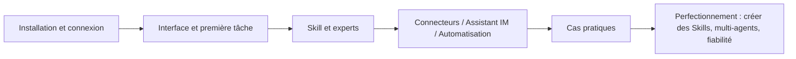

# Tutoriel WorkBuddy

**WorkBuddy** est un poste de travail IA à agents, conçu par Tencent pour couvrir tous les scénarios professionnels. Décrivez votre objectif en une phrase en langage naturel : il planifie ensuite lui-même les étapes sur votre ordinateur local, lit et écrit des fichiers, et livre de véritables livrables — PPT, analyses de tableaux, documents, rapports d'étude — au lieu de se contenter de « répondre à des questions ».

Cette section est organisée en cinq parties — « Démarrage → Extensions → Cas pratiques → Perfectionnement → Référence » — et vous accompagne de l'installation jusqu'à la construction de votre propre système de travail IA.

## Parcours d'apprentissage

### Démarrage : mettez WorkBuddy en service

| Chapitre | Ce que vous y gagnerez |
| --- | --- |
| [Découvrir WorkBuddy](/fr/workbuddy/01-intro/) | Ce qu'il sait faire, et ce qui le distingue d'une IA conversationnelle |
| [Télécharger, installer, se connecter et mettre à jour](/fr/workbuddy/02-install/) | Un client installé et connecté |
| [Interface principale, tâches et espaces de travail](/fr/workbuddy/03-interface/) | Comprendre l'interface et créer votre premier espace de travail |
| [Réussir sa première tâche rapidement](/fr/workbuddy/04-first-task/) | D'une simple phrase à un livrable complet |
| [Charger un Skill vraiment utile](/fr/workbuddy/05-skills/) | Laisser l'IA travailler avec les « bonnes pratiques » |

### Extensions : connectez les capacités

| Chapitre | Ce que vous y gagnerez |
| --- | --- |
| [Experts et équipes d'experts](/fr/workbuddy/06-experts/) | Laisser l'IA travailler avec des « compétences métier » |
| [Utiliser les connecteurs](/fr/workbuddy/07-connectors/) | Connecter services externes et sources de données |
| [Intégrer le Mini-programme et l'assistant IM](/fr/workbuddy/08-im-assistant/) | Déléguer des tâches directement depuis WeChat / Feishu / DingTalk |
| [Se connecter à des API externes](/fr/workbuddy/09-external-api/) | Utiliser votre propre API LLM ou un modèle local |
| [Tâches automatisées](/fr/workbuddy/10-automation/) | Tâches planifiées : l'IA travaille en autonomie |
| [Pour aller plus loin : comprendre le système de travail IA](/fr/workbuddy/11-ai-work-system/) | LLM / Agent / Skill / MCP expliqués en un seul chapitre |

### Cas pratiques : d'une tâche isolée à une équipe IA

| Chapitre | Ce que vous y gagnerez |
| --- | --- |
| [La trilogie bureautique : Word, Excel, PPT](/fr/workbuddy/case-office/) | La méthode complète combinant prompts et Skills |
| [Gestion des connaissances : des favoris qui servent vraiment](/fr/workbuddy/case-knowledge/) | Répartition des rôles entre WPS / ima / Obsidian / favoris WeChat |
| [Faire de l'analyse d'investissement un rituel quotidien](/fr/workbuddy/case-investment/) | Huit prompts de recherche + le pipeline stock-advisor |
| [Une équipe vidéo IA à portée de phrase](/fr/workbuddy/case-video-team/) | Deux équipes d'experts : génération vidéo et décryptage des contenus viraux |
| [Boucle de croissance pour créateurs de contenu](/fr/workbuddy/case-self-media/) | Sujet → titre → couverture → publication → bilan |

### Perfectionnement : transformez les cas en votre propre système de travail

| Chapitre | Ce que vous y gagnerez |
| --- | --- |
| [Créer un Skill : distillation de connaissances](/fr/workbuddy/adv-build-skill/) | Distiller livres et vidéos en Skills exécutables |
| [Concevoir un système multi-agents](/fr/workbuddy/adv-multi-agent/) | Répartition du travail, formats de passation, quand fractionner |
| [Fiabilité des workflows automatisés](/fr/workbuddy/adv-automation-reliability/) | Machines à états, idempotence, dégradation, alertes |

### Référence rapide

| Chapitre | Ce que vous y gagnerez |
| --- | --- |
| [Modèles de prompts courants](/fr/workbuddy/ref-prompt-templates/) | 12 modèles de tâches prêts à l'emploi |
| [Aide-mémoire par scénario](/fr/workbuddy/ref-scenarios/) | Index de type dictionnaire par profil et par usage |

## À qui s'adresse ce tutoriel

- **Débutants en entreprise** : utiliser l'IA pour Word/Excel/PPT, le tri de fichiers, la veille et autres tâches du quotidien
- **Passionnés d'efficacité** : construire un workflow automatisé de « collaboration homme-machine »
- **Responsables d'équipe** : comprendre la collaboration multi-agents et son déploiement en équipe
