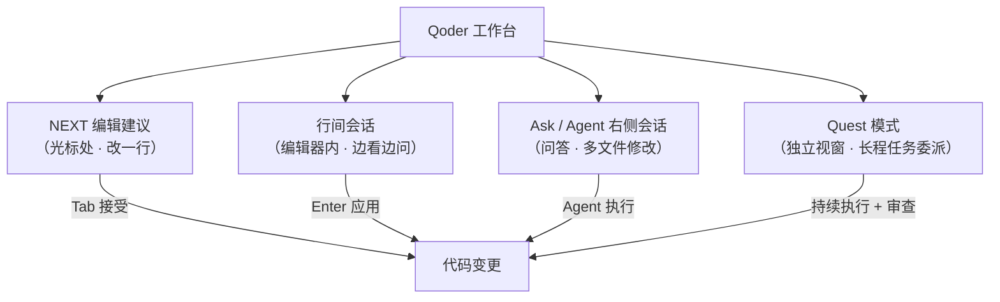

# 核心功能速览

Qoder 的功能可以按"交互粒度"从轻到重排成四层：改一行 → 问上下文 → 改多个文件 → 委派整个任务。按场景选对层级，效率差别很大。

## 一图看懂

## 四层功能对照

### 1. NEXT：下一条编辑建议

光标处基于上下文给出编辑建议，支持多行。

| 操作 | macOS | Windows |
| --- | --- | --- |
| 唤出 NEXT | `⌥ P` | `Alt P` |
| 接受建议 | `Tab` | `Tab` |

适合：连续小改动的"手感和速度"场景，比如改字段名、补样板代码。

### 2. 行间会话：在代码里直接问

在编辑器的代码上下文中直接对话，AI 看得见你光标附近的代码。

| 操作 | macOS | Windows |
| --- | --- | --- |
| 打开行间会话 | `⌘ I` | `Ctrl I` |
| 应用生成的代码 | `⌘ Enter` | `Ctrl Enter` |

适合："这段代码什么意思""把这个函数改成异步"——不用跳去别的面板。

### 3. Ask / Agent：右侧会话面板

| 操作 | macOS | Windows |
| --- | --- | --- |
| 打开 Chat 面板 | `⌘ L` | `Ctrl L` |

两种模式按需切换：

- **Ask**：偏问答——解释代码、查方案、定位问题，不动你的文件
- **Agent**：偏执行——多文件修改、实现功能，改完给你看 diff

经验法则：**先 Ask 弄清方案，再 Agent 动手实现**，能显著减少返工。

### 4. Quest：长程任务委派

在独立视窗中发起长程、多步骤任务，由 Agent 持续执行。你可以随时回到这个工作台查看**看板、进度与产物**，对交付结果进行审查。

适合：需求明确但步骤多的任务——"把这个项目从 JS 迁移到 TS""给博客加标签系统并写好测试"。这是 Qoder 区别于补全类工具的核心能力，单独一篇讲：[第一次 Quest 实战](/qoder/04-first-quest)。

## 快捷键速查表

| 功能 | macOS | Windows |
| --- | --- | --- |
| NEXT 编辑建议 | `⌥ P` | `Alt P` |
| 行间会话 | `⌘ I` | `Ctrl I` |
| Chat 面板（Ask/Agent） | `⌘ L` | `Ctrl L` |
| 账号/设置入口 | `⌘ ⇧ ,` | `Ctrl + Shift + ,` |
| 打开本地项目 | `⌘ O` | `Ctrl O` |
| 接受建议 / 应用行间生成 | `Tab` / `⌘ Enter` | `Tab` / `Ctrl Enter` |

> 快捷键以[官方快速入门](https://docs.qoder.com/zh/quick-start)最新版本为准。

---

下一步：[第一次 Quest 实战 →](/qoder/04-first-quest)
