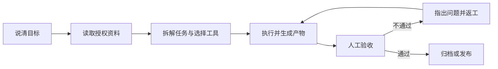

# 第 1 章 初识 WorkBuddy：它是干活的，不是聊天的

先说人话版定义：**WorkBuddy** 是腾讯推出的全场景职场 AI 智能体工作台，面向 HR、行政、运营、销售、研发这些每天要跟文件、表格、报告打交道的人。

它和你在网页里聊过的 AI 有个根本区别：聊天 AI 是「你问它答」，答完活还是你自己干；WorkBuddy 是你说一句「分析这个文件夹里的销售数据，做成汇报 PPT」，它在你的本地电脑上自己规划步骤、读文件、做分析、出成果。你从「提问的人」变成「派活和验收的人」。

## 从「回答问题」到「交付结果」

具体一点。获得你授权之后，WorkBuddy 能直接读取和处理本地文件，接这些活：

- 批量文件处理、文档生成、表格分析、PPT 制作
- 多模态内容创作、行业调研、本地知识库构建

任务更复杂时，它自己拆解步骤，派多个智能体（Agents）并行干——你在不同工具、文件、任务之间来回切换的时间，就是它省下来的时间。

整个过程你不用一个个手动上传文件，也不用一步步教它「接下来该干什么」。一个任务的完整流转长这样：

注意「人工验收」那一步：验收永远是你。它负责干，你负责查，这套分工从第一个任务开始就要养成。

## 三个核心能力

**听得懂人话。** 一句自然语言把需求说清就行，不用学什么命令格式。

**能自己想怎么干。** 拿到任务先规划执行步骤，而不是等你一步步喂。

**真能操作你的电脑。** 读写文件、交付成果，落在本机。

为了干好不同类型的活，它还提供几样扩展：多模型切换（混元 / DeepSeek / GLM / Kimi / MiniMax 等），按任务选合适的；MCP Server 和 Skills 技能包，扩展工具箱和专业能力。这些词第一次看着陌生没关系，后面的[技能](/workbuddy/05-skills/)、[连接器](/workbuddy/07-connectors/)章节会一个个拆开讲。

## 它会不会把我电脑搞坏

第一次把电脑交给 AI，你肯定会想这个问题。WorkBuddy 针对本地文件操作、终端执行这类高危场景，配了高危指令拦截和权限控制机制；实际使用中还有文件夹级授权——它只能碰你授权过的目录。即便如此，处理真实业务数据之前，建议先拿演练目录练手。

## 新手常见问题

**要会编程吗？**
不用。它就是给非程序员做的，全程自然语言。

**和网页版聊天 AI 的区别，一句话说清？**
聊天 AI 交付「文字回答」，WorkBuddy 交付「工作成果」——PPT、表格、报告，能接着用、接着改的那种。

**免费吗？**
装好就能用，跑任务消耗积分，不同模型的积分消耗不同，任务界面里能看到、也能换。

**我这种岗位用得上吗？**
HR、行政、运营、销售、研发都有对应场景。判断方法很朴素：你的活里有没有「读一堆材料、产出一份东西」的环节。

---

下一步：把它装上——[下载、安装、登录与更新 →](/workbuddy/02-install/)
