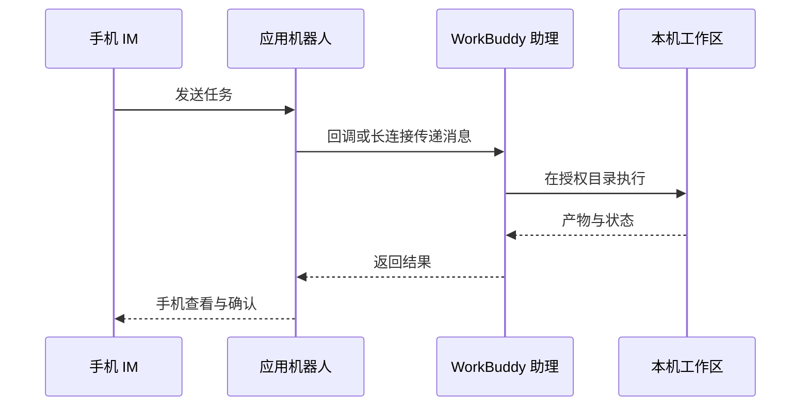

# WorkBuddy 能装进微信和手机吗？接上 IM 助理随时远程派活

你装好了 WorkBuddy 客户端，可人一离开工位，电脑一锁屏，活就派不出去了。你想在地铁上让它在家里那台电脑上跑个分析，或者直接在微信里丢一句「帮我建明天的会」，不用再开电脑。这一章就是把 WorkBuddy 从「坐在电脑前才能用」变成「手机上随时派活」：小程序让你远程查看与调度，IM 助理让你在微信、飞书、钉钉里直接下任务。

## 小程序的两种模式

| 模式 | 任务在哪里运行 | 是否依赖电脑在线 | 适合任务 |
| --- | --- | --- | --- |
| 本机模式 | 已连接的电脑 | 是 | 本地文件、本地 Skill、已有工作区 |
| 云端模式 | 隔离的云端环境 | 否 | 调研、写作、临时分析、并行任务 |

首次使用：你通过官方入口打开 WorkBuddy 小程序并登录，你查看当前处于本机还是云端模式；本机模式下确认目标电脑在线且连接正确。

## IM 助理的工作链路

你发一条消息过去，背后链路是这样的：

## 接入微信助理：扫码绑定即可

你按这五步来：

1. 打开 WorkBuddy，在左侧「助理」栏点齿轮，进入「助理设置」；

2. 找到「微信助理集成」，点「配置」；

3. 等待绑定二维码生成，用手机微信扫码；

4. 卡片显示「已绑定」后，先发一条只读测试指令；

5. 要换微信账号时，先解绑当前账号，再重新扫码。

五步走完，你在微信里就能直接给 WorkBuddy 下任务了。

> 二维码有时效限制。停留在「绑定中」、二维码过期或扫码失败时，你关闭配置窗口后重新进入，必要时重启 WorkBuddy 重新生成二维码。

## 接入飞书

你走飞书的话，步骤比微信多些，你照着走：

1. 走 WorkBuddy → 设置 → 助理设置 → 选择飞书；

2. 在飞书开放平台创建企业自建应用；

3. 为应用添加机器人能力；

4. 按 WorkBuddy 当前页面要求开通最小权限；

5. 在「凭证与基础信息」拿到 App ID 和 App Secret；

6. 把凭证填回 WorkBuddy，生成或复制回调信息；

7. 在飞书配置事件订阅与回调，添加接收消息、卡片交互等事件；

8. 创建版本并发布应用，然后在飞书内向机器人发一条只读测试任务。

## 接入钉钉

1. 你用企业管理员账号登录钉钉开发者后台，进「应用开发」，创建应用；

2. 为应用添加机器人能力，填机器人名称、描述和头像并确认发布；

3. 开通所需权限；

4. 获取应用凭证，填回 WorkBuddy。优先在测试组织或测试群完成验证。

## 新手常见问题

**小程序本机模式和云端模式怎么选？**
你手头的活要用本地文件、本地 Skill 或已有工作区，就选本机模式，但它依赖那台电脑在线。你做调研、写作、临时分析这类不挑机器的活，选云端模式，断网离开电脑也能跑。

**微信助理绑定失败、二维码过期怎么办？**
二维码有时效。你停留在「绑定中」、过期或扫码失败时，关掉配置窗口重新进，必要时重启 WorkBuddy 重新生成二维码。你绑定后先发一条只读测试指令，确认它只读取不乱动。

**飞书、钉钉接入为什么比微信麻烦？**
微信是扫码绑定，几步就好。飞书和钉钉要在开放平台建应用、配权限和回调，步骤多，但换来的是公司账号体系下的稳定接入。你按页面引导一步步填，优先在测试群验证。

**IM 助理能直接替我发消息吗？**
能，但要看你授权了什么。它只在授权范围内动作——建会议、读文档、回消息。第一次用，你先在小事上试，确认它只干了你吩咐的，再放开更多权限。

---
下一步：让任务定时自动跑——[WorkBuddy 自动化任务 →](/workbuddy/10-automation/)

> 绑定 IM 助理后，配合[自动化任务](/workbuddy/10-automation/)可以把「定时跑 + 推送到 IM」串成一条线。
