# 第 8 章 WorkBuddy 接入小程序与 IM 助理

装好客户端只是第一步。这一章把 WorkBuddy 从"坐在电脑前才能用"变成"手机上随时派活"：小程序让你远程查看与调度，IM 助理让你在微信、飞书、钉钉里直接下任务。

## 小程序的两种模式

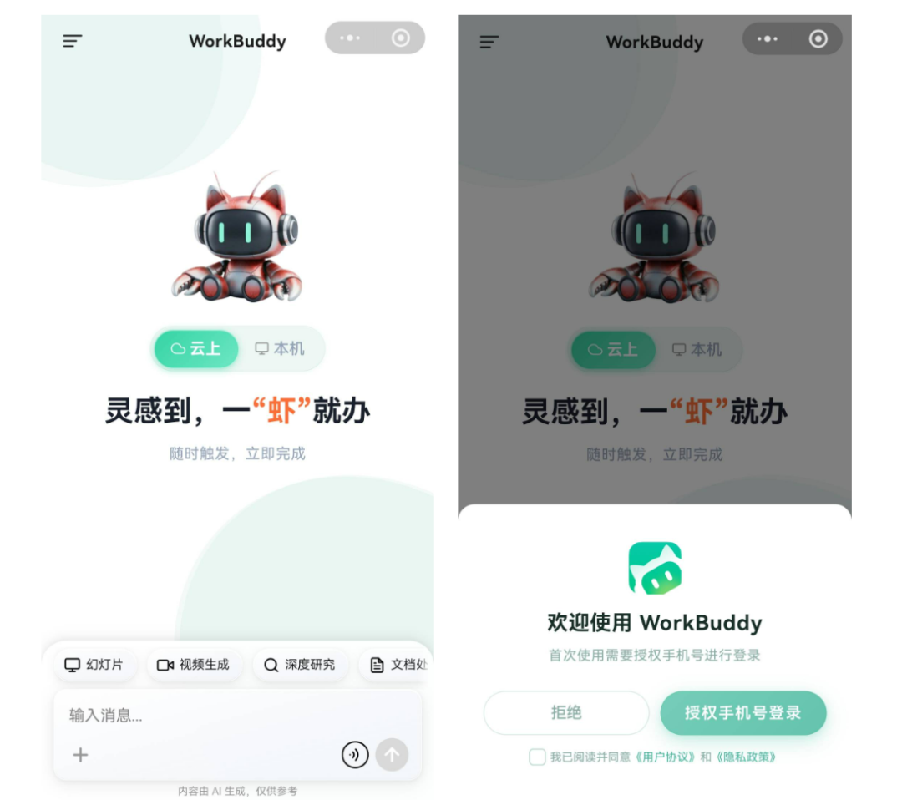

| 模式 | 任务在哪里运行 | 是否依赖电脑在线 | 适合任务 |
| --- | --- | --- | --- |
| 本机模式 | 已连接的电脑 | 是 | 本地文件、本地 Skill、已有工作区 |
| 云端模式 | 隔离的云端环境 | 否 | 调研、写作、临时分析、并行任务 |

**首次使用**：通过官方入口打开 WorkBuddy 小程序并登录，查看当前处于本机还是云端模式；本机模式下确认目标电脑在线且连接正确。

## IM 助理的工作链路

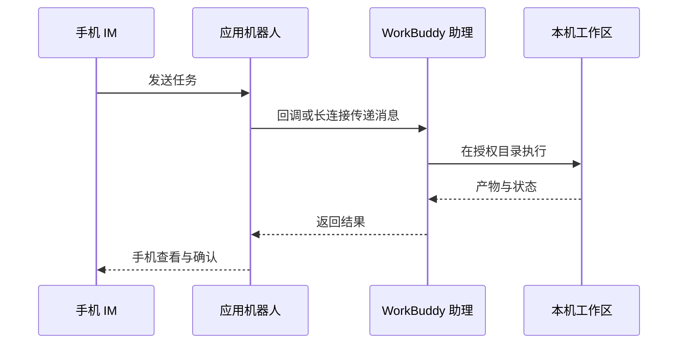

## 接入微信助理：扫码绑定即可

1. 打开 WorkBuddy，在左侧"助理"栏点击齿轮，进入"助理设置"；

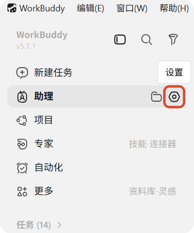

2. 找到"微信助理集成"，点击"配置"；

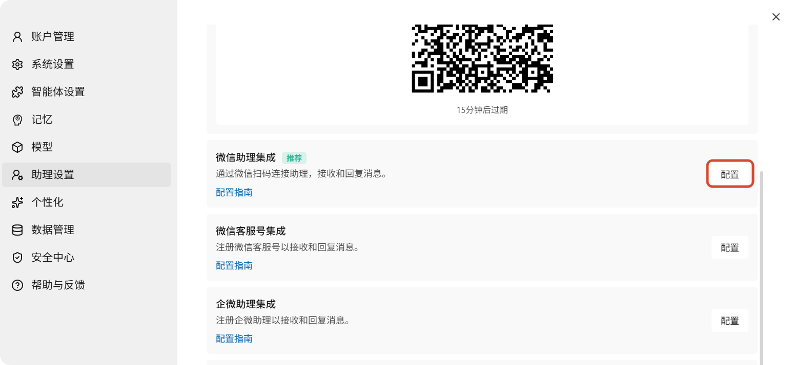

3. 等待绑定二维码生成，用手机微信扫码；

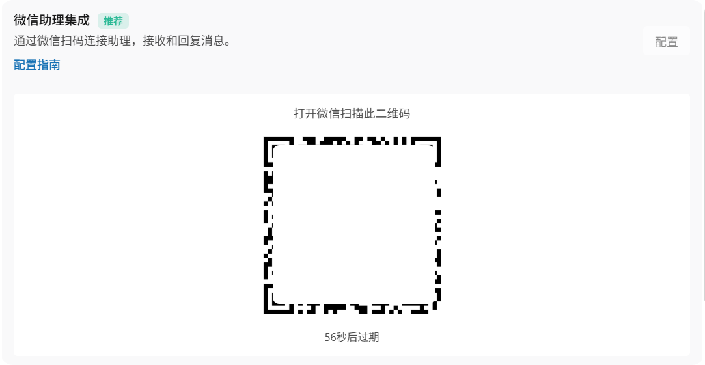

4. 卡片显示"已绑定"后，先发送一条只读测试指令；

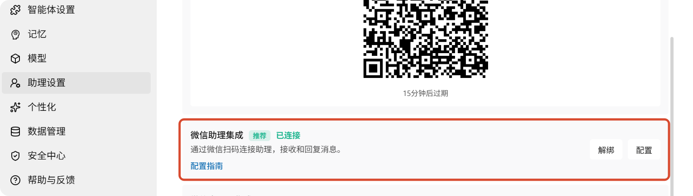

5. 需要切换微信账号时，先解绑当前账号，再重新扫码。

> 二维码有时效限制。停留在"绑定中"、二维码过期或扫码失败时，关闭配置窗口后重新进入，必要时重启 WorkBuddy 并重新生成二维码。

## 接入飞书

1. WorkBuddy → 设置 → 助理设置 → 选择飞书；

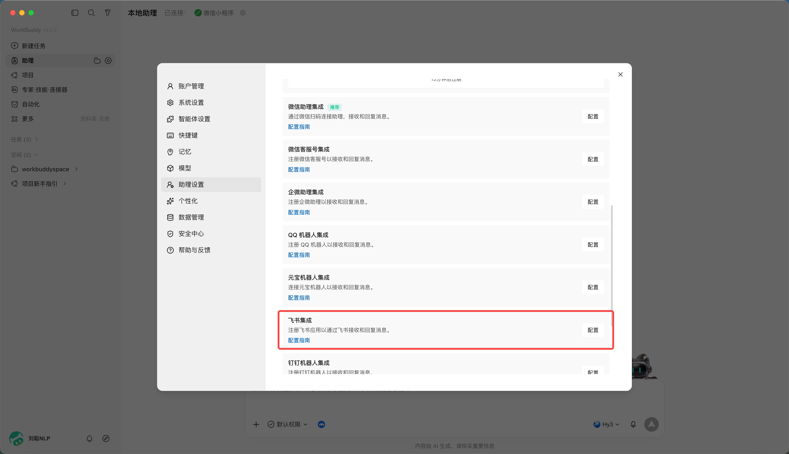

2. 在飞书开放平台创建企业自建应用；

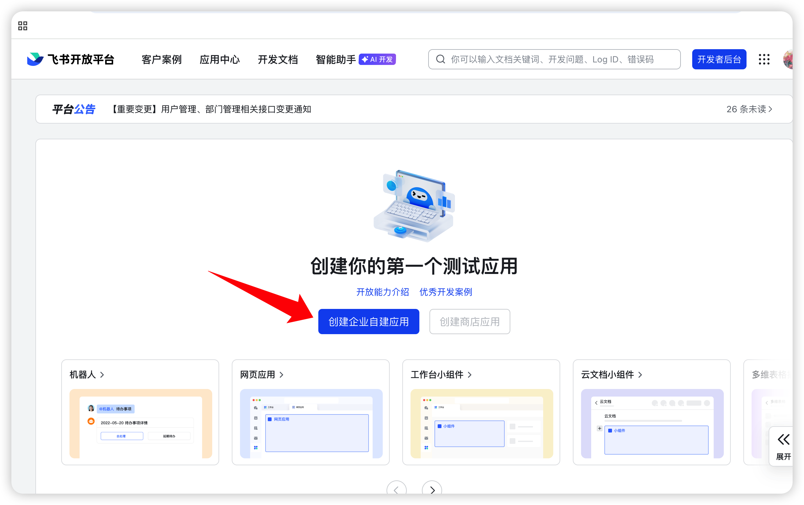

3. 为应用添加机器人能力；

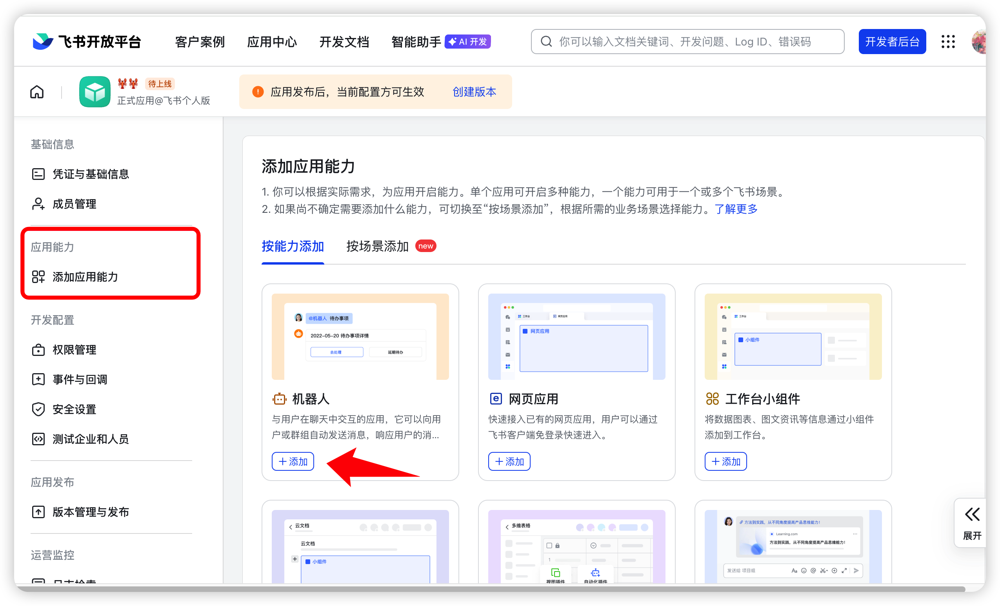

4. 按 WorkBuddy 当前页面要求开通最小权限；

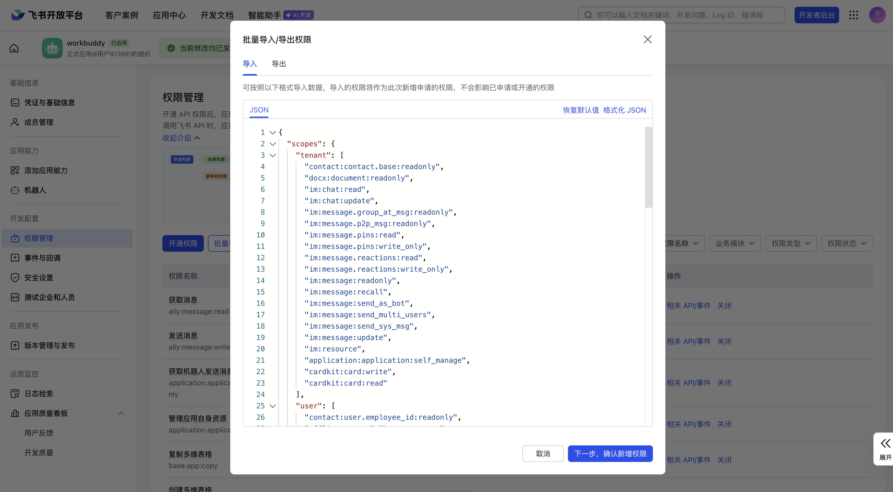

5. 在"凭证与基础信息"获取 App ID 和 App Secret；

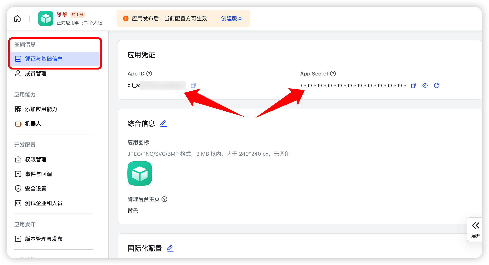

6. 将凭证填写到 WorkBuddy，生成或复制回调信息；

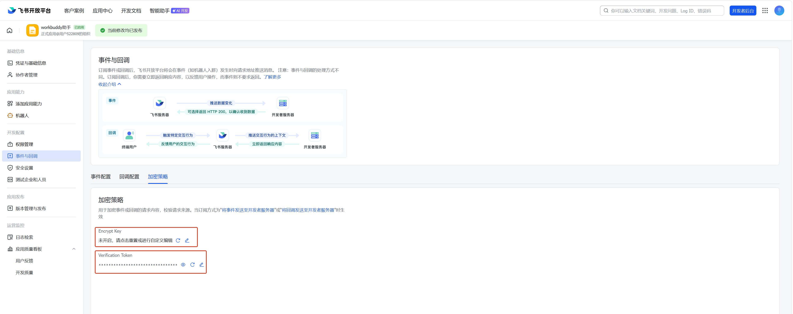

7. 在飞书配置事件订阅与回调，添加接收消息、卡片交互等事件；

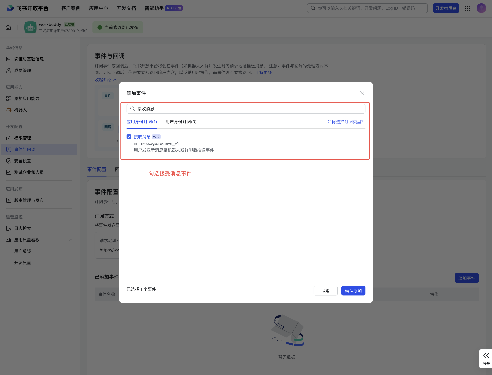

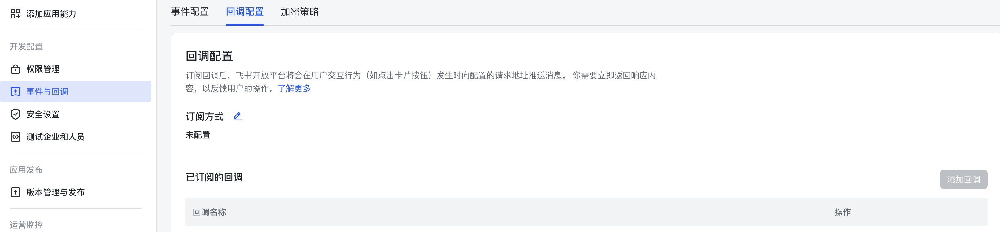

8. 创建版本并发布应用，然后在飞书内向机器人发送只读测试任务。

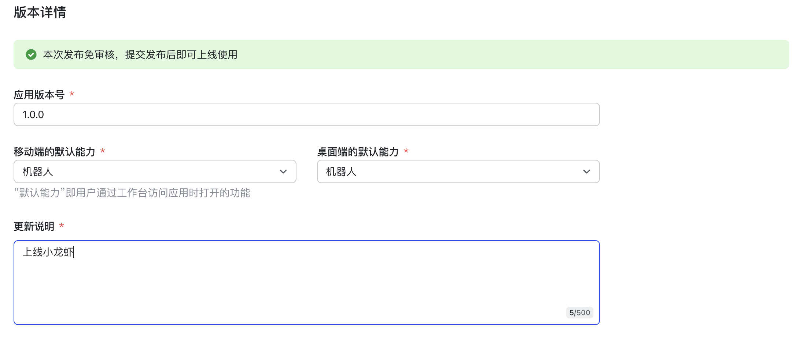

## 接入钉钉

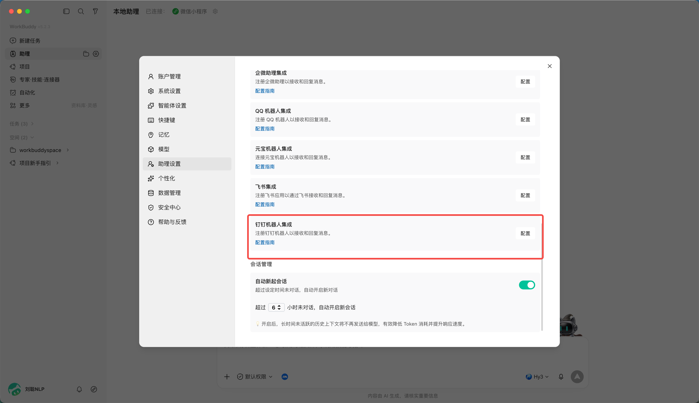

1. 使用企业管理员账号登录钉钉开发者后台，进入"应用开发"，创建应用；

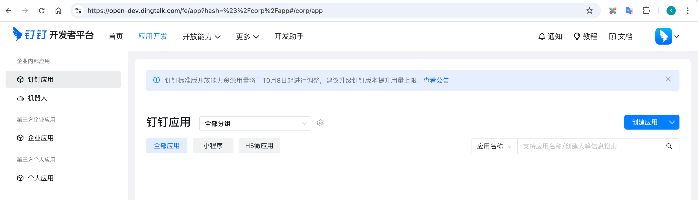

2. 为应用添加机器人能力，填写机器人名称、描述和头像并确认发布；

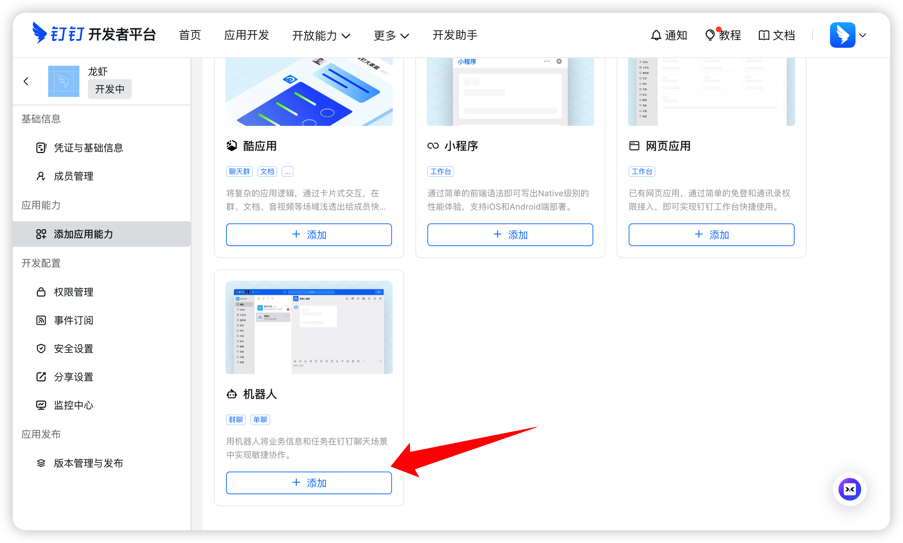

3. 开通所需权限；

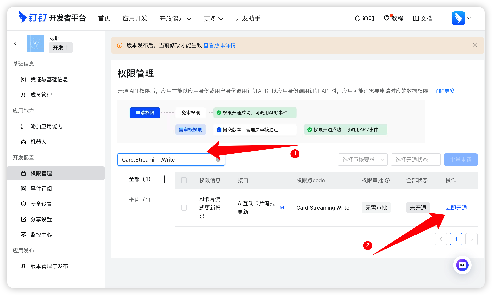

4. 获取应用凭证，填回 WorkBuddy。优先在测试组织或测试群完成验证。

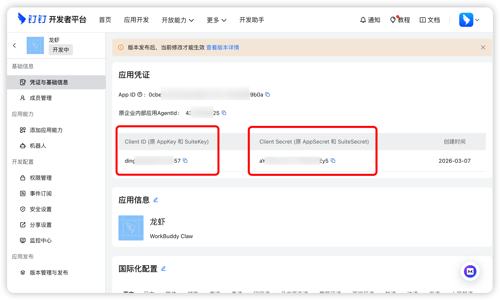

---

> 绑定 IM 助理后，配合[自动化任务](/workbuddy/10-automation/)可以把"定时跑 + 推送到 IM"串成一条线。
