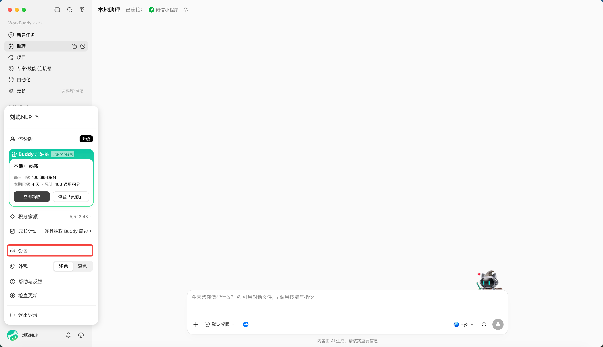
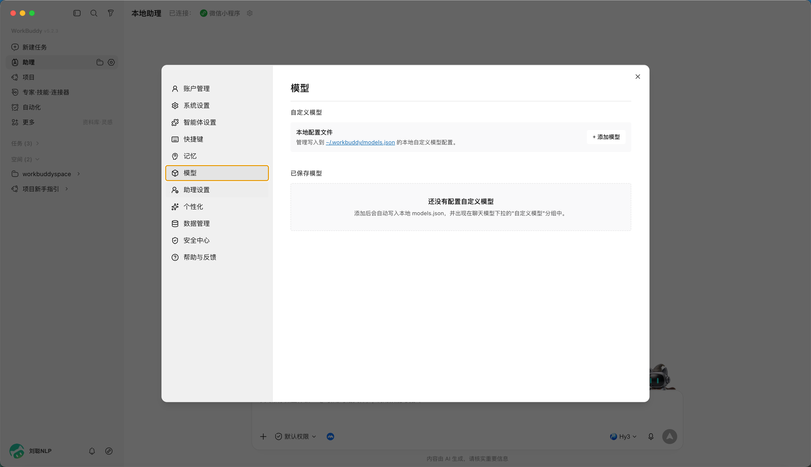
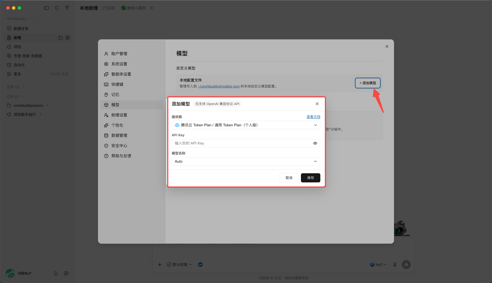
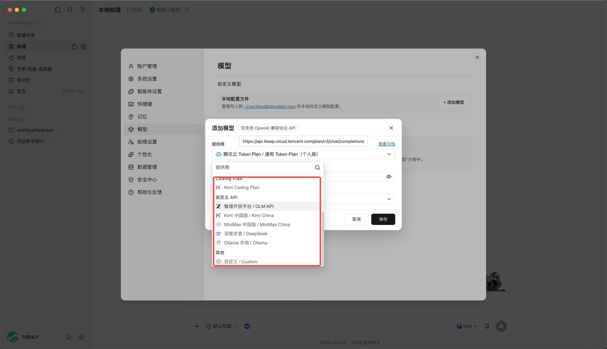
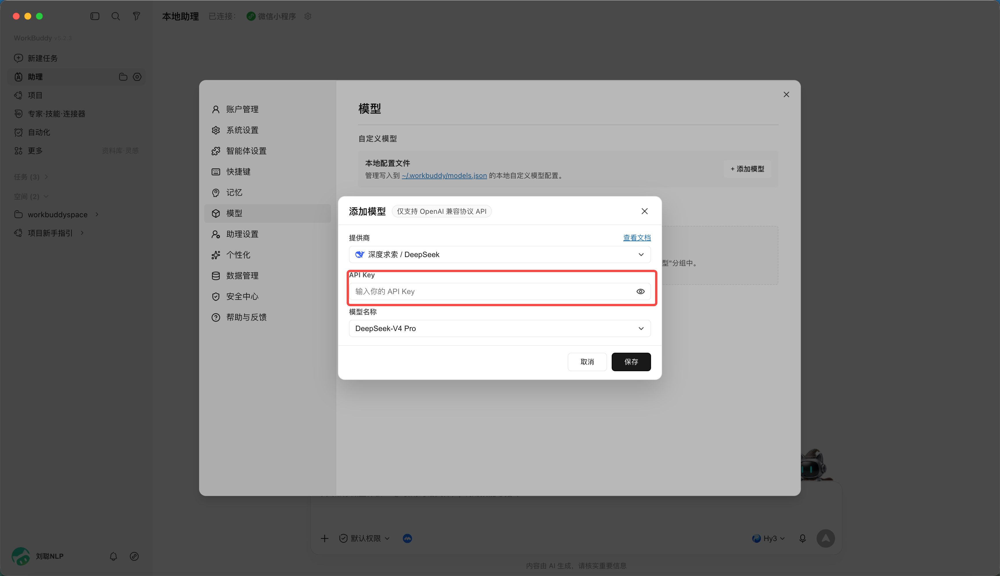
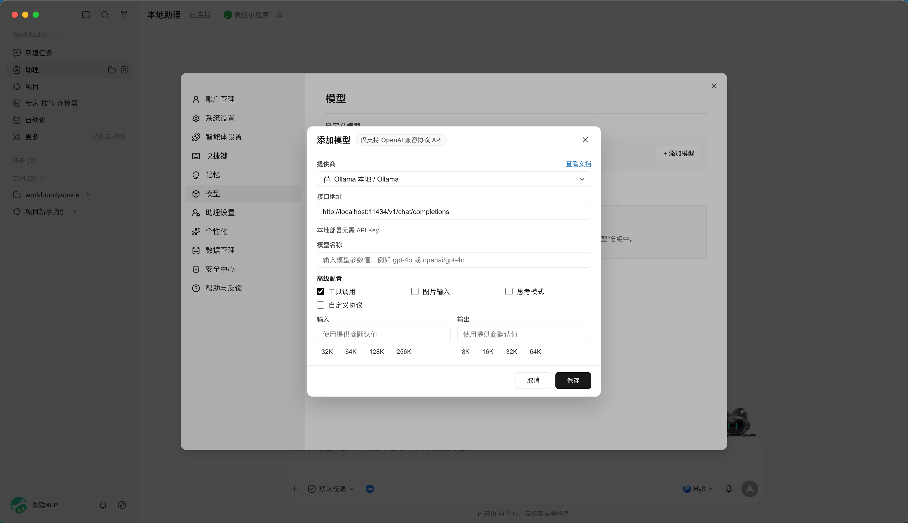

# 第 9 章 如何接入外部 API

你也许没有积分，但是有自己的 LLM API——WorkBuddy 支持接入其他 LLM 的 API，以及 Coding Plan、Token Plan 等套餐。

直接从设置中进入：

选择模型选项：

点击添加模型：

可以选择各种 Coding Plan 或者自定义的 API：

比如 DeepSeek，你只需要输入 API Key 即可：

也可以接入本地 Ollama 模型（需先本地启动 Ollama，默认端口 11434，OpenAI 兼容接口）。本地模型的优势：**数据不出本机、可离线、零 Token 成本**。

> API Key 属于敏感凭证，只填在客户端设置里，不要写进任务说明或分享的文件中。
