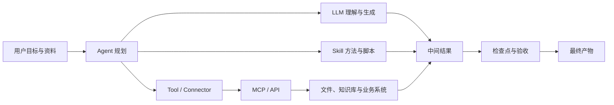
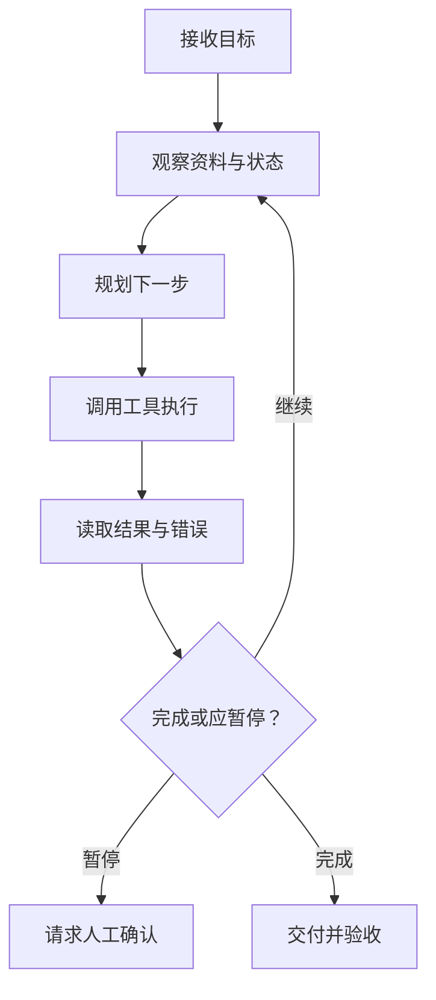

# 课外阅读：一章看懂 AI 工作系统

前面十章讲的是"怎么用 WorkBuddy"。这一章讲"为什么这样设计"——把 LLM、Token、Prompt、Agent、Tool、Skill、MCP、知识库、工作流这些词放进同一张图里，讲清每个角色能做什么、不能做什么。读懂这一章，你用任何 AI 工作工具都会更快上手。

## 先看全景：一次 AI 任务里发生了什么

一句话解释：**模型负责理解和生成，Agent 负责围绕目标组织行动，Skill 提供专业方法，工具与 MCP/API 让行动触达真实世界，人负责边界与验收。** 五类角色里，模型是大脑，Agent 是调度员，Skill 是专家手册，工具与接口是手脚，人是裁判。

## LLM：会根据上下文预测内容的基础模型

LLM（大语言模型）从大量数据中学习语言和知识模式，根据当前输入生成最可能的后续内容。它本质是个"预测下一个内容"的引擎，不是数据库，也不是会替你负责的人。

**它擅长什么**：理解和改写文本、从材料中提取结构、生成草稿和代码、模仿格式与风格。

**它不天然保证什么**：不保证每个事实都正确；不知道企业最新内部状态（除非提供资料或连接系统）；不自动拥有文件、账号、数据库和网络权限；不承担业务和法律责任。

**为什么会"幻觉"**：模型的目标是生成连贯内容，不是内置事实数据库。当资料缺失、问题含糊或要求它给出确定答案时，它可能用合理但不真实的内容填补空白。这不是 bug，是"按概率补全"的副作用——**肯定和正确是两件事**。

降低幻觉的办法：提供可靠资料；要求引用位置；允许回答"无法确认"；把事实提取与建议生成分开；对高影响结论人工复核。

## Token 与上下文窗口：模型眼前能看到多少

Token 是模型处理文本的基本单位，不完全等于字数。上下文窗口是一次推理中模型能处理的输入、历史和输出总量——把它想成模型的**短期记忆容量**：装得下才看得见，装不下就得丢或压缩。

上下文不是越长越好。把所有文件和几个月对话都塞进一个任务，可能导致新旧要求冲突、关键资料被无关内容淹没、成本和等待时间增加。更稳妥的做法：按项目整理"当前规则、已确认事实、决策记录和本次输入"，长项目使用文件和项目记忆——**别把所有聊天记录当数据库用**。

## Prompt：任务说明，不是神秘咒语

好的 Prompt 不以长度取胜，而以信息是否足够执行和验收取胜——写 Prompt 是在写一份能交给同事执行的任务单。

| 要素 | 要回答的问题 |
| --- | --- |
| 目标 | 最终解决什么问题 |
| 输入 | 使用哪些资料或系统 |
| 动作 | 分析、整理、生成还是写入 |
| 约束 | 不能做什么，采用什么规则 |
| 输出 | 交付什么文件或结构 |
| 验收 | 怎样判断正确和可用 |

六要素里最容易被忽略的是**验收**：没有验收标准，模型只能按自己的理解交差。

从一次性到可复用，是一个逐级固化的过程：**Prompt**（本次怎么说）→ **任务卡**（同类任务可填的结构）→ **SOP**（固定步骤和检查点）→ **Skill**（把稳定 SOP、脚本和资源封装成可执行能力）。注意：不是每个 Prompt 都值得变成 Skill——先重复成功，再逐步固化。

## Agent：能围绕目标循环行动的执行体

Agent 不只是"回答一次"，而是持续执行一个循环：**理解目标、观察环境、决定下一步、调用工具、读取结果、修正计划，直到交付或触发停止条件。**

| 维度 | 聊天模型 | Agent |
| --- | --- | --- |
| 核心动作 | 生成回答 | 规划、调用工具、执行和交付 |
| 过程 | 通常一次生成 | 多轮观察与行动 |
| 风险 | 内容错误 | 内容错误 + 真实操作影响 |
| 控制 | 提示与复核 | 权限、检查点、日志和回滚 |

关键差异在最后一行：聊天模型说错了最多误导你；Agent 做错了，可能真的删了文件、发了邮件、改了数据库。所以 Agent 需要的不是更聪明的提示，而是更硬的护栏。

**Agent 的停止条件**：好的 Agent 不应"永远想办法继续"。关键输入缺失、目标冲突、权限不足、成本超预算、动作不可逆、结果无法验收时，应暂停并请求人处理。一个不会停的 Agent，比一个笨 Agent 更危险。

## Tool：让 Agent 真的能做事

Tool 是 Agent 可以调用的具体能力（读文件、执行搜索、生成表格、发消息）；Connector 通常是产品已经封装好的第三方服务连接，授权后直接使用。

普通用户最容易误解的一点：**模型"懂"一件事，不代表它"能"做这件事。** 模型可以解释"如何发送邮件"，但只有获得邮件工具和账号权限后才能实际发送。任务失败时，先问"工具通没通、权限给没给"，而不是"模型是不是不行"。

每个工具要问五件事：使用谁的身份；能读取什么；能修改什么；数据会发到哪里；失败后如何停止和回退。

## Skill：可复用的专业工作方法

Skill 不是更聪明的模型，而是把某类任务需要的说明、脚本、知识和模板组织起来。它的价值不在"让模型变强"，而在**把容易做错、容易遗漏的环节固定下来**——同样的发票处理，让模型每次现写，十次可能有三种写法；写成 Skill，十次走同一条被验证过的路。

记住两点：Skill 是"方法封装"，不是"能力保证"；装了第三方 Skill 和装浏览器插件一个道理——方便，但要先看它要什么权限（读哪些目录、是否外发数据、要不要 API Key、怎么停用），并先在隔离目录测试。

## MCP：让 AI 接入工具与数据的标准接口

MCP（Model Context Protocol）规定 AI 客户端如何发现和调用外部工具、读取资源，可以理解为"AI 世界的 USB 接口"：工具提供方按一套标准暴露能力，AI 客户端按同一套标准去用，不用每家重新适配。

**MCP 解决什么**：降低重复适配成本——接一个 CRM、一个数据库不用各写一套专用连接。

**MCP 不解决什么**：不自动判断数据是否合规；不替你保管密钥；不保证工具结果正确。它解决"怎么连"，"连了之后安不安全"仍然是你的责任。

用户级与项目级的选择：公共能力放用户级；客户、数据库等敏感连接优先项目级隔离，避免跨项目误调用。

## API 与 MCP 的关系

API 是软件之间交互的接口（HTTP 查数据、创建记录）；MCP Server 可以在内部调用一个或多个 API，再以 Agent 更容易使用的方式暴露工具。一句话：**API 是地基，MCP 是在地基上盖的、Agent 能直接进出的门。** 用成熟 MCP 更方便，但仍要审查它封装了什么请求和权限——方便不等于免审。

## 知识库、RAG 与记忆

| 概念 | 保存什么 | 主要风险 |
| --- | --- | --- |
| 对话上下文 | 当前任务交流 | 太长、冲突、过期 |
| 知识库 / RAG | 可检索事实与资料 | 来源差、版本旧、检索不到 |
| 记忆 | 偏好、长期规则、项目状态 | 错误被长期沿用 |

一句话区分：**上下文是这次聊天的短期记忆，知识库是随时可查的资料室，记忆是跨任务保留的长期设定。** 记忆最危险的地方是"它自己不会发现过期"——一条半年前的错误规则，会被 Agent 当真理反复用。

## Workflow 与 Agent 的区别

- **Workflow 是标准化的生产线**：步骤在设计时就定好，按顺序或分支执行；
- **Agent 是会思考、能自己拿主意的执行者**：只给目标，运行时自己决定下一步怎么走。

| 维度 | Workflow | Agent |
| --- | --- | --- |
| 路径是否预设 | 是，设计时定好 | 否，运行时决定 |
| 可控性 | 高，容易预测和回滚 | 较低，路径可能变化 |
| 调试难度 | 低，步骤清晰可追 | 高，需看日志和中间状态 |
| 适用场景 | 步骤明确、可重复、合规要求高 | 路径不确定、需环境反馈、开放目标 |
| 典型失败 | 卡在某步、分支没覆盖 | 跑偏、无限循环、越权操作 |

常见误区：「Agent 一定比 Workflow 强」——不对，确定任务用 Workflow 更稳更省；「Workflow 不能含智能」——错，节点完全可以调用模型做摘要、分类，只是"走哪条路"由流程定；「Agent 全自动就最好」——过度放权会让失败更难定位。

两者如何协同：Agent 把稳定的子任务写成固定流程（Skill 背后就是 Workflow），只在不确定处自己判断；生产线上某个判断节点，也可以交给 Agent 处理非结构化输入。

---

> 把这套认知用起来：[自动化任务](/workbuddy/10-automation/)是 Workflow，[专家团](/workbuddy/06-experts/)是多 Agent，[Skill](/workbuddy/05-skills/) 是方法封装——读完这一章再回头看它们，结构会清晰得多。
