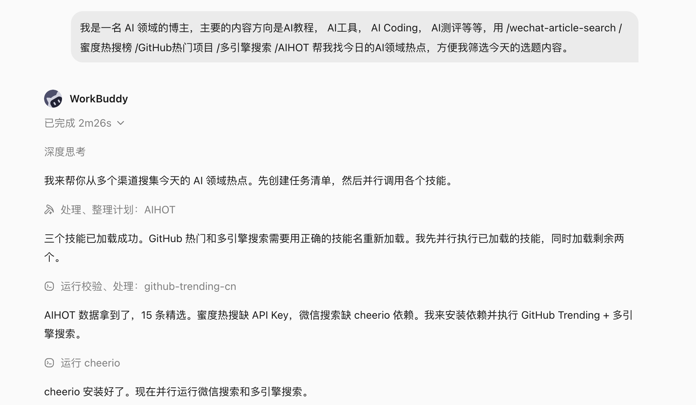
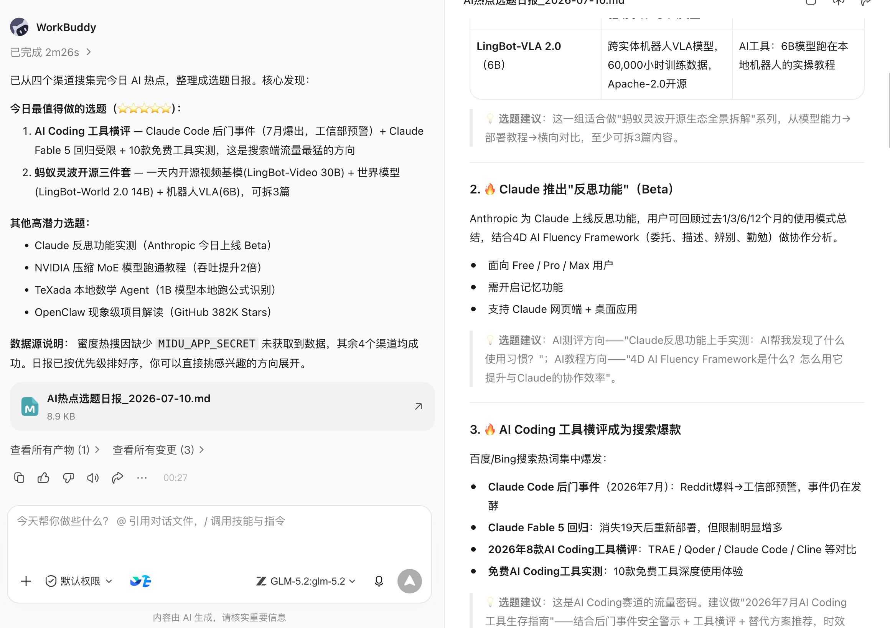
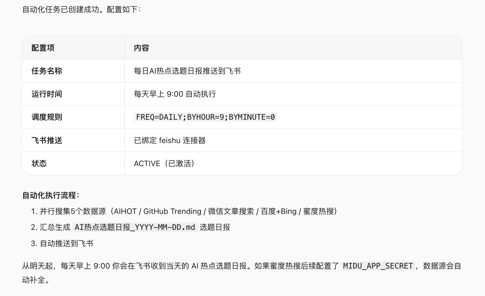
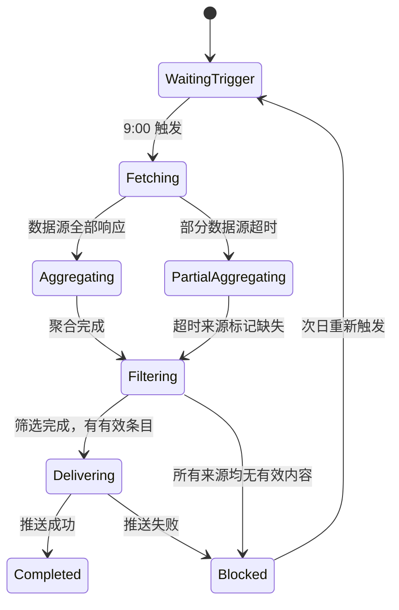

# 第 25 章 自动化工作流的可靠性

以"每日 AI 热点选题聚合"为贯穿案例，说明自动化工作流从手动运行到定时可靠执行，需要处理哪些问题。

## 案例背景：内容博主的每日选题任务

AI 领域更新快，每天需要从多个信息源筛选当日值得写的选题。手动逐一翻阅耗时且容易遗漏。一个典型的选题需求：

```text
我是一名 AI 领域的博主，主要内容方向是 AI 教程、AI 工具、AI Coding、AI 测评等。
帮我找今日的 AI 领域热点，方便筛选当天的选题内容。
来源：
- 微信公众号近期爆款文章（@wechat-article-search）
- GitHub 今日热门 AI 项目（@GitHub热门项目）
- 多引擎 AI 新闻聚合（@多引擎搜索）
- AI 热点追踪（@AIHOT）
```

手动运行一次，WorkBuddy 会同时调用四个数据源，整合输出一份当日 AI 热点清单。跑通后，下一步就是设置为定时任务：每天早上 9:00 自动运行，结果推送到指定位置。





## 自动化前的三个门槛

不是所有任务都适合立即自动化：

1. **同一 Prompt 已手动运行至少三次**，输出质量和格式基本稳定；
2. **触发条件、输入来源和验收标准清楚**：什么时候运行、依赖哪些数据源、输出什么格式；
3. **有 owner、有告警、有停用方法**：任务失败时谁处理，如何临时停用不影响其他流程。

频繁改 Prompt 或数据源还不稳定的任务，先手动运行，不急于自动化。

## 设置自动化任务

手动运行确认效果后，在同一对话框中直接告诉 WorkBuddy：

```text
把这个任务设置为自动化，每天早上 9:00 运行，
结果发送到 [指定飞书群 / 邮件 / 企微通知]。
```

WorkBuddy 会将当前 Prompt 和数据源配置保存为定时任务，按设定时间自动执行。




## 把自动化任务设计成状态机

自动化不是"跑起来就行"。真实环境中每次运行都可能遇到：数据源超时、当日无相关条目、API 限流、推送目标不可达。将任务设计成状态机，每个状态都有明确的成功条件和失败出口：



关键原则：**部分数据源失败不应阻断整体任务**，标记缺失后继续聚合；推送失败应保留结果并告警，不丢失已生成的内容。

## 数据源就绪检查

定时触发不等于数据源已就绪，每次运行开始时先检查可用性：

| 数据源 | 检查项 | 不可用时的处理 |
| --- | --- | --- |
| @wechat-article-search | 搜索 API 可达，返回非空结果 | 标记缺失，继续其他来源 |
| @GitHub热门项目 | GitHub API 未限流 | 退避重试一次，失败则标记缺失 |
| @多引擎搜索 | 搜索引擎可达 | 标记缺失，继续其他来源 |
| @AIHOT | 热点追踪服务正常 | 标记缺失，继续其他来源 |

四个来源中至少三个正常，才输出完整热点清单；全部失败时进入 Blocked 状态并推送告警，次日重新触发。

## 内容质量门禁

数据源可达不代表内容有效。聚合后过滤四个维度：**相关性**（真属于 AI 领域）、**时效性**（当日内容，排除过期热点）、**重复性**（同一事件多来源合并展示）、**最低数量**（有效条目少于 5 条时标注"当日热点不足"）。

质量分三档：**pass** 正常输出；**warning** 部分来源缺失，输出顶部说明；**blocked** 有效条目不足，不推送正文只推送说明。

## 输出结构固定

```text
📋 AI 热点选题日报 — 2026-07-10

【今日概况】
有效条目：18 条 | 来源：4/4 | 运行时间：09:02

🔥 高热度（适合快速蹭热点）
1. [模型名称] 发布，[核心能力] — 来源：AIHOT + GitHub
   热度指数：★★★★★ | 建议角度：功能测评 / 使用教程

📈 潜力方向（适合深度分析）
2. [话题] 引发讨论 — 来源：微信公众号
   热度指数：★★★ | 建议角度：观点分析 / 案例拆解

⚠️ 数据来源说明
GitHub：正常 | 微信：正常 | 多引擎搜索：正常 | AIHOT：正常
```

格式固定后，博主 5 分钟内完成选题判断，而不是每次重新整理格式。

## 推送目标与幂等

| 推送目标 | 适用场景 | 注意事项 |
| --- | --- | --- |
| 飞书群消息 | 团队共享选题 | 记录 message ID，避免重复推送 |
| 个人通知 | 个人使用 | 同上 |
| 飞书文档（追加） | 保留历史记录 | 按日期追加，不覆盖历史 |
| 邮件 | 跨平台通知 | 记录发件 ID |

**幂等原则**：某次任务因推送失败而重试时，不应重复发送已成功推送的内容。每次运行生成唯一批次 ID（如 `ai-hotspot-2026-07-10`），推送成功后记录状态，重试时检查状态跳过已完成步骤。

## 超时和重试策略

| 失败类型 | 是否重试 | 策略 |
| --- | --- | --- |
| 数据源 API 超时 | 是 | 等待 10 秒后重试一次，仍失败则标记缺失 |
| GitHub API 限流（429） | 是 | 按 Retry-After 等待，最多 2 次 |
| 认证失效（401/403） | 否 | 转人工处理，不自动重试 |
| 推送目标不可达 | 是 | 指数退避重试 2 次，失败则告警并保留结果 |
| 聚合结果为空 | 否 | 进入 blocked，推送说明，次日重新触发 |

重试只针对临时性故障，不对输入问题或配置问题重试。

## 断点续跑与可行动告警

每次运行生成状态文件，记录已完成的步骤和产物（批次 ID、状态、各来源状态、条目数、最后错误）。推送失败后重试，从 `delivering` 步骤继续，不重新抓取和聚合。

告警内容必须让人能立即判断如何处理——批次、状态、失败原因、影响、建议处理步骤、恢复入口。"任务失败，请查看"不足以让人处理。

## 降级交付与日志

部分数据源失败时不应等待全部就绪：3 个及以上来源正常 → 输出清单并标注缺失；2 个正常 → 输出简化清单并标注不完整；1 个或 0 个 → 不输出正文，只推送说明和告警。降级结果必须显式标记来源覆盖情况，**不伪装成完整运行**。

每次运行记录：批次 ID 和触发方式、各数据源响应状态和耗时、聚合与过滤后条目数、推送结果、总耗时和错误、运行成本（Token、API 调用）。日志不记录热点内容正文。

## 上线前演练

| 场景 | 预期行为 |
| --- | --- |
| 所有数据源正常 | 输出完整清单，推送成功 |
| GitHub API 限流 | 退避重试，仍失败则标记缺失，继续聚合 |
| 当日无 AI 相关热点 | 有效条目不足，输出说明，不推送空清单 |
| 推送目标不可达 | 重试 2 次，失败则告警并保留结果 |
| 重复触发（手动与定时同时） | 检测批次 ID，跳过重复执行 |

## 自动化任务定义模板

```text
任务名称：AI 热点选题日报
触发方式：每天 09:00（工作日）
Prompt：[完整 Prompt 文本]
数据源：@wechat-article-search / @GitHub热门项目 / @多引擎搜索 / @AIHOT
质量门禁：有效 AI 相关条目 ≥ 5 条；数据源可用数量 ≥ 3 个
输出格式：结构化热点清单（含来源、热度、建议角度）
推送目标：[飞书群 / 个人通知 / 飞书文档追加]
幂等控制：批次 ID = ai-hotspot-{date}，推送成功后标记，不重复推送
重试策略：数据源超时重试 1 次；推送失败退避重试 2 次；其他失败转人工
告警接收：[个人飞书通知]
owner：[博主本人]
停用方式：WorkBuddy 自动化任务管理页 → 暂停
```

## 从个人自动化到团队服务

| 维度 | 个人使用 | 团队服务 |
| --- | --- | --- |
| 推送目标 | 个人通知 | 团队飞书群 |
| 选题方向 | 单一方向 | 多方向分类推送 |
| 审核流程 | 个人判断 | 主编确认后分发 |
| 故障处理 | 自己处理 | 有 owner 和备份处理人 |
| 成本归属 | 个人账户 | 团队预算 |

扩展为团队服务需要补充：明确 owner、建立运行手册、设置权限（谁能改 Prompt 和推送配置）、制定变更流程。

**自动化的高级形态，不是完全没有人，而是正常路径少打扰人，异常路径能及时找到正确的人。** 任务上线后根据使用反馈持续迭代（Prompt 优化、数据源调整、格式迭代、时间调整），每次调整都遵循"改 → 手动验证 → 重新保存"的流程，不直接在定时任务上实验。
