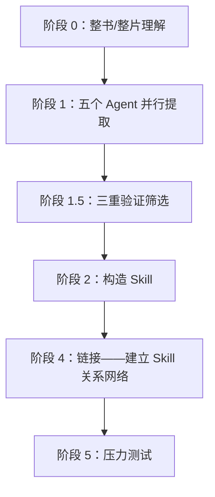
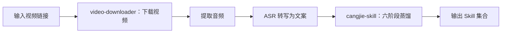

# 第 22 章 打造 Skill：将书和视频蒸馏为可执行 Skill

除了把自己的 SOP 沉淀为 Skill，还有一个更简单的办法：用 [cangjie-skill](https://github.com/kangarooking/cangjie-skill)（仓颉 skill，v1 蒸馏书，v2 增加视频蒸馏）把知识蒸馏成 Skill。


本章回答两个问题：如何将书本和视频中的方法论转化为 Agent 可自动调用的 Skill，以及这与 RAG 检索的本质差别在哪里。

## 问题起点：知识读了但用不起来

AI 在训练时已经摄入了大量经典著作，但在实际问答中往往输出"正确的废话"——每个字都对，但缺乏针对特定问题的可落地步骤。这不是幻觉问题，而是**调用机制问题**：AI 知道书里有什么，但不知道该在什么场景下主动调出哪个框架。

人类读者面临同样的问题：读完一本书，笔记做了、金句划了，两周后遇到真实问题，那些方法论却抓不住——知识在记忆里，但激活路径不清晰。知识精馏要解决的，就是这个"学了用不上"的问题。

## 知识精馏的定义

**知识精馏（Knowledge Distillation for Skills）**：从书本或视频中，提取出具有独立触发条件和执行步骤的原子化知识单元（Skill），使 Agent 在遇到对应场景时能够自动激活并给出可落地的行动路径。

化学中的精馏按沸点把混合物分离成纯净组分；知识精馏按"框架 / 原则 / 案例 / 反例 / 术语"五个维度把知识分离，只把真正有用的提纯成可执行 Skill。

知识精馏**不是**：摘要（压缩原文）、读书笔记（结构化原文）、RAG 索引（存储原文片段供检索）。它是将方法论转化为 Agent 能在真实场景下自动调用的执行单元。

## 六阶段蒸馏 SOP



以蒸馏《文案创作完全手册》为例：


### 阶段 0：整书 / 整片理解

不从摘取金句开始，而是先读清整本书的骨架：全书主旨、核心论证链、关键术语的定义和使用、作者自身的局限与盲点。这一步决定后续提取的质量上限——跳过它直接提取，容易把作者反对的观点当成他支持的方法论。

### 阶段 1：五个 Agent 并行提取

五个 Agent 同时从五个维度扫描全文，独立工作、互不干扰，避免单线阅读的视角遗漏：

| Agent | 提取目标 |
| --- | --- |
| 框架提取 | 作者构建的分析或决策框架 |
| 原则提取 | 可跨场景复用的行为原则 |
| 案例提取 | 正面案例和成功路径 |
| 反例提取 | 失败案例和反面教训 |
| 术语词典 | 专有术语及其定义 |


### 阶段 1.5：三重验证筛选

每个候选知识单元必须通过三关，未通过直接淘汰：

| 验证类型 | 检查内容 |
| --- | --- |
| 跨域验证 | 该方法论在书中至少两个独立场景出现过，不是孤证 |
| 预测力测试 | 能用它推导出书中没有直接讨论的问题吗 |
| 独特性检验 | 是不是任何人都能说出来的常识？常识不构成 Skill |

宁缺毋滥：一本书通常有 50–100 个候选单元，通过三重验证后只保留 10–25 个。


### 阶段 2：构造 Skill

核心是设计**触发条件**：什么场景下自动激活、激活后执行什么步骤、什么时候不该用（边界）、质量验证标准是什么。没有触发条件的 Skill，Agent 无法正确识别和调用——这是最难也最关键的一步。

### 阶段 4：链接

找出 Skill 之间的关系，形成知识网络：**依赖**（A 的执行需要 B 的输出）、**对比**（适用相似场景但方向相反）、**组合**（联合使用效果更好）。链接层让 Agent 遇到复杂问题时能选择一组 Skill，而不只是单个。

### 阶段 5：压力测试

- **诱饵测试**：故意给不该触发的场景，检验 Skill 能否忍住不激活——没有边界的 Skill 在错误场景调用反而帮倒忙；
- **执行验证**：给出真实问题，验证能否输出可落地的步骤而不是"正确的废话"。

## 蒸馏产物结构

```text
book-skill/
├── README.md               # 书目信息、蒸馏说明、适用场景
├── skills/
│   ├── skill-01.md         # 每个 Skill 独立文件
│   └── ...
├── index.md                # Skill 关系网络（链接层产物）
└── tests/
    └── skill-01-test.md    # 每个 Skill 的测试用例
```


每个 Skill 文件包含触发条件、执行步骤、输出格式、边界限制、测试用例，格式兼容 darwin-skill（自动 Skill 进化工具），蒸馏产物可以持续自动优化。


## 知识精馏 vs RAG

| 维度 | RAG | 知识精馏（Skill） |
| --- | --- | --- |
| 本质 | 检索——找出最相关的原文片段 | 提炼——从原文中提取可执行的方法论 |
| 使用前提 | 用户需要知道该问什么 | 用户描述问题，Skill 自动识别并激活 |
| 质量控制 | 无——任何内容都可以入库 | 三重验证过滤，宁缺毋滥 |
| 调用方式 | 被动等待查询 | 主动匹配场景并触发 |
| 知识形态 | 存储原文（记住知识） | 提纯为执行步骤（运用知识） |
| 边界控制 | 无 | 诱饵测试确保不乱激活 |

RAG 解决"知识管理"——让你能查到书里有什么；知识精馏解决"知识运用"——让 Agent 在对的时刻主动拿出对的框架。**当你不知道该问什么时，RAG 帮不了你。**

## 视频蒸馏工作流（v2 新增）

cangjie-skill v2 借助 [video-downloader skill](https://github.com/kangarooking/kangarooking-skills/tree/main/video-downloader) 增加了视频蒸馏：先完成"视频 → 文字"的转换，再进入六阶段 SOP。




- **视频下载**：yt-dlp 支持 YouTube、B 站等主流平台（视频号因平台限制暂不支持自动化）；
- **音频转写**：本地 Whisper 可用但长视频耗时（一小时视频约需 48 分钟），推荐 ASR API 批量处理；
- **多视频合并蒸馏**：同一主题的多个视频可合并蒸馏，Agent 自动去重和合并知识单元；
- **职责分离**：视频获取独立封装在 video-downloader，cangjie-skill 专注文本蒸馏，两者独立演进。

## 适用与不适用场景

| 类型 | 适合程度 | 说明 |
| --- | --- | --- |
| 方法论密度高的书 | ★★★★★ | 框架清晰，原则可提取，最适合 |
| 访谈 / 课程视频 | ★★★★☆ | 结构化程度较高，适合蒸馏 |
| 长视频 / 播客 | ★★★☆☆ | 可用，知识密度因内容而异 |
| 金句散文类书籍 | ★★☆☆☆ | 方法论少，产物质量有限 |
| 小说 / 叙事文学 | ★☆☆☆☆ | 缺乏可提取的方法论框架 |

蒸馏前最好读过或看过一遍原材料：需要在关键节点做判断（如三重验证的边界情况），读过之后蒸馏，吸收率显著更高。**蒸馏不是替代阅读，而是阅读后的知识结构化工具。**

## 资源消耗与模型选择

知识精馏是 Token 消耗密集型任务（全书理解 + 五路并行提取 + 多轮验证 + 压力测试）。参考量级：蒸馏一本普通书约 30–90 分钟、数万至十余万 Token；26 集课程视频（4 小时）约 1 小时。

模型选择：任务拆解和蒸馏协调用推理能力强的模型；并行提取和验证可用性价比高的模型；长上下文场景选原生支持长上下文的模型，避免截断导致蒸馏不完整。

## 常见误区

1. **"AI 训练过的书不需要再蒸馏"**——即使 AI 记得这本书，蒸馏的价值在于建立**触发条件**：什么场景该调出哪个框架，而不只是"知道书里有什么"。
2. **"蒸馏完就不需要看书了"**——没读过就蒸馏，会在关键判断节点缺乏背景，遗漏重点。
3. **"AI 给了建议就能直接执行"**——方向对不对、能不能执行，仍然需要人来判断。AI 给选项和分析，决策是人的责任。
4. **"Skill 覆盖越多越好"**——触发条件太宽会导致错误激活。宁可覆盖窄一点，也不要乱激活。

## 蒸馏结果示例

以吴恩达《给所有人的 AI 入门课》（2026 版，26 个视频，约 4 小时）为例：蒸馏耗时约 1 小时，产出 25 个 Skill，全部为时效性内容，蒸馏后可直接在对应场景被 Agent 调用。


## 总结：知识精馏在技能包体系中的位置

| 来源 | 适用场景 |
| --- | --- |
| 从业务流程提炼（SOP → Skill） | 企业内部操作规范、重复性业务流程 |
| 从书本 / 视频蒸馏（知识精馏） | 专家方法论、经典著作、高价值课程内容 |

两者产物格式一致，都是带触发条件的可执行 Skill，可以在同一个 Agent 框架下混合使用。同一本书不需要被每个人重复蒸馏——任何人蒸馏的成果都可以开源，其他人直接复用。
