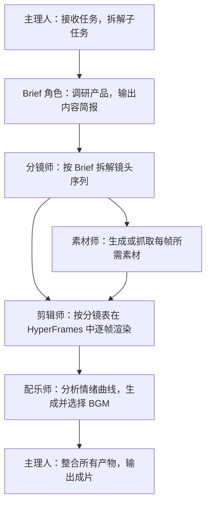

# 多 Agent 系统怎么设计？用一支产品宣传片专家团讲透分工与交接

你想让 AI 一次性干完一件大活，结果它东一榔头西一棒槌，质量还飘忽不定。你的问题往往不在模型，而在「没分工」。你别急着上多 Agent，先看这篇怎么拆。这篇用一个「产品宣传片专家团」的真实案例，回答多 Agent 系统的三个核心问题：怎么设计分工、怎么串联产物、什么时候才值得拆。


## 单 Agent 和多 Agent 的真正差别

你先看清这张表——多 Agent 贵在「分」，不在「多」：

| 维度 | 单 Agent | 多 Agent |
| --- | --- | --- |
| 上下文 | 所有信息在一个任务 | 角色只接收必要上下文 |
| 分工 | 一个执行体串行完成 | 多角色并行或接力 |
| 工具 | 同一组权限 | 可按角色隔离工具和权限 |
| 质量 | 自己生成、自己检查 | 可设置独立评审者 |
| 成本 | 较低 | 协调、模型和工具调用更多 |
| 风险 | 一处错误影响整体 | 错误可能在角色间传播 |

多 Agent 的价值来自**专业分工、并行、权限隔离或独立评审**，不来自角色数量。你拿这张表对一下：如果你现在的活一个人串行就能干完，那就别拆。


## 任务是否值得拆分

你手上的活，满足下面越多条，越适合上多 Agent：

- 至少两个子任务可以独立进行；
- 子任务需要不同方法、资料或工具；
- 输出可以定义清楚的交接格式；
- 并行能显著缩短等待；
- 有明确总负责人和最终验收；
- 预算允许多轮调用。

只改一封邮件、总结一份 PDF 或格式化一个表格，你不需要专家团。你照这六条卡一下，命中三条以上再拆。

## 案例：产品宣传片专家团

### 任务背景

HyperFrames 是 HeyGen 开源的视频渲染框架，核心特点是对 AI Agent 友好：Agent 可以自动生成基于 HTML 的视频帧并渲染输出。产品宣传片有相对固定的套路——无需口播和演员，主要由产品展示、概念字幕和 BGM 构成，适合 Agent 团队分工处理。你先知道 HyperFrames 是什么，再看成片怎么拆。


### 工序设计

你先看这张工序图，它把一支宣传片拆成了六道工序：



你看着这张图，每一道工序都有明确的交接物。

### 角色契约

你给每个角色定死「输入、输出、禁止动作」，它们才不会互相越界：

| 角色 | 输入 | 输出 | 禁止动作 |
| --- | --- | --- | --- |
| 主理人 | 用户任务描述、素材空间 | 任务拆解、状态追踪、成片 | 不跳过子任务验收直接交付 |
| Brief 角色 | 产品官网、介绍文档 | brief.md（定位、价值、用户） | 不直接写脚本 |
| 分镜师 | brief.md | 分镜表（时间码、画面、字幕、转场） | 不引入 Brief 未确认的信息 |
| 素材师 | 分镜表 | 产品截图、概念图、界面素材 | 不使用无版权来源素材 |
| 剪辑师 | 素材、分镜表 | 逐帧 MP4 片段 | 不改动分镜结构 |
| 配乐师 | 分镜表、情绪标注 | BGM 候选及推荐理由 | 不只输出一个选项 |

你照这张契约表定角色，越清楚越不容易乱。

### 专家团演示

你做产品宣传片前，先把相关素材放到工作空间内：

```text
我希望你做一个产品宣传片，具体的话，是宣传腾讯的 WorkBuddy 最新的专家团，
主打 OPC 场景。当前空间下我放了一些素材，成片风格可以偏 Apple 风格、
真实软件界面。整个过程全自动。
```


团长先把「做一支宣传片」拆成一串子任务：先搞清楚产品是什么、卖给谁、核心价值是什么；再决定叙事结构、镜头数量、节奏；然后分头做素材、剪辑、配乐。你派完活，剩下看团长怎么拆。

Brief 角色先开工，翻一遍官网和产品介绍，输出一份 brief：这是什么产品、目标用户是谁、最值得放进 60 秒的几个核心点。分镜师接着 brief 干活，把 60 秒拆成 7 个镜头，细到时间码、画面、文字、转场、动效和素材类型。素材师和剪辑师开始干活：一个生成/抓产品截图和概念图，另一个把素材按分镜表往 HyperFrames 里塞，逐镜头渲染 MP4。

最有意思的是配乐师：它不是简单写个「科技感 BGM」的 prompt 完事，而是先读分镜表，研究每个镜头的情绪曲线——哪里需要鼓点卡产品 reveal、哪里需要降下来做留白、哪里需要一个 hit point 推 CTA——然后才调用音乐模型生成候选。团长整合所有产物，再跑一道剪辑输出成片。


你在这里基本是甩手掌柜：派活、看关键节点、再拍板——分镜要不要这么排、BGM 喜不喜欢、字幕文案要不要改。

## 共享产物层

多个 Agent 不应各自维护一份「产品事实」，你建立单一产物路径，下游只读上游确认过的文件：

```text
project/
├── brief.md                  # 产品简报（Brief 角色产出，主理人确认）
├── storyboard.md             # 分镜表（分镜师产出，主理人确认）
├── assets/                   # 素材（素材师产出）
│   ├── screenshots/
│   └── concepts/
├── clips/                    # 逐帧片段（剪辑师产出）
├── bgm/                      # BGM 候选（配乐师产出）
└── output/final.mp4          # 成片（主理人整合）
```

你让产物层当唯一真相源，别让角色各存一份。你让下游角色只读取上游已确认的产物。角色之间不通过对话传递关键内容细节。

## 并行与串行

- **可以并行**：素材生成与剪辑准备、不同镜头段落的渲染；
- **必须串行**：Brief 确认后才写分镜、分镜确认后才生成素材、素材就绪后才剪辑、成片完成后才配乐合成。

你并行计划必须标明汇合点：素材和剪辑可以并行准备，但最终合成必须等待所有素材就位。你排并行时，先把汇合点标出来。

## 主理人的职责

主理人（制片人）是工作流控制器：解释用户任务并维护子任务状态；分发最小必要上下文；检查上游产物是否满足交接格式；决定并行、等待或重试；在关键节点请用户拍板；汇总所有产物执行最终合成；对成片做一致性检查。

你记住三个必须由人确认的点：Brief 确认（定位、用户、卖点是否准确）、分镜确认（叙事结构、镜头数量、节奏）、BGM 选择（情绪风格是否匹配调性）。Agent 负责生成和执行，不能替代你做品牌方向和风格判断。

## 从自建到预置专家团

| 维度 | 自建 Skills | 预置专家团 |
| --- | --- | --- |
| 适用人群 | 开发者，需要深度定制 | 一人公司，直接使用 |
| 上手门槛 | 高（需定义角色、调试流程） | 低（描述任务即可） |
| 灵活度 | 高（可修改任意环节） | 中（支持自定义模型接入） |
| 速度 | 取决于搭建时间 | 即开即用 |

你创建自己的专家团也很简单：专家 → 我的专家 → 创建专家，跳转到 WorkBuddy 对话框，按给定格式即可快速创建。你选自建还是预置，看你会不会写角色。


当前专家团覆盖的典型场景：

| 场景类别 | 代表专家团 |
| --- | --- |
| 内容创作 | 产品宣传片、爆款内容创作、全域分发 |
| 软件研发 | 软件开发、代码测试 |
| 商业分析 | 深度研究、投资分析、数据分析 |
| 业务支持 | SEO、销售、营销、财税合规、HR |
| 法律合规 | 中文法律 |


## 质量影响因素

- **Agent 底座模型**：指令跟随和推理能力直接影响分镜质量和任务拆解准确性；
- **图像生成模型**：影响产品截图的清晰度和概念图的视觉质量；
- **用户提供的素材**：你提前把素材放进空间，成片才贴得住真实产品，不至于让 Agent 拿通用素材凑数；
- **浏览器工具接入**：Agent 具备浏览器操作能力时可自动抓取官网截图和产品界面。

全自动方案适合快速出片；对品质要求高的场景，你建议以 Agent 产物为基础再做一轮人工二次剪辑。你素材越齐，成片越真。

## 失败传播控制

| 角色失败 | 降级方式 |
| --- | --- |
| Brief 角色无法获取产品信息 | 用户补充基础信息后重试 |
| 素材生成失败 | 使用用户预置素材或标记空缺位置 |
| 剪辑渲染超时 | 交付已完成的片段和分镜表 |
| BGM 生成失败 | 提供推荐 BGM 类型描述，由用户自选 |
| 主理人合成失败 | 交付各角色产物清单，由用户手动合成 |

你让降级交付必须说明缺失内容，不伪装成完整成果。你让降级说明缺了什么，别糊弄。

## 多 Agent 任务 Brief 模板

你照这个模板描述任务，专家团才知道怎么拆：

```text
目标：为 [产品名称] 制作一支 [时长] 的产品宣传片。
风格：[参考风格，如 Apple 风、极简风]。
素材：[素材空间路径或已提供的图片/视频]。
角色：主理人、Brief、分镜师、素材师、剪辑师、配乐师。
确认节点：Brief 完成后、分镜完成后、BGM 选择时，需用户确认后继续。
模型：Agent 模型 [指定]；图像生成模型 [指定]。
全自动/半自动：[说明是否需要中间节点人工介入]。
```

你照模板填，专家团才拆得动。

## 常见问题

**什么任务才值得拆成多 Agent？**
你满足这几条才值得：至少两个子任务能独立干、需要不同工具或资料、产物能定义清楚的交接格式、并行能省时间，还得有明确验收人。改封邮件、总结 PDF 这类小事，单 Agent 就够了。

**多 Agent 是不是角色越多越好？**
不是。价值来自分工、并行、权限隔离和独立评审，跟数量无关。你角色堆太多，协调成本和出错面反而更大。

**哪些节点必须你亲自确认？**
三处：Brief 确认（定位、用户、卖点准不准）、分镜确认（结构和节奏）、BGM 选择（情绪风格）。Agent 能生成能执行，但品牌方向得你拍板。

**共享产物层是干嘛的？**
你建一条单一产物路径，下游角色只读上游已确认的文件，不在对话里传关键细节。这样某个角色改了，其他人不会拿到过期版本。

**专家团挂了怎么降级？**
按失败传播控制表来：Brief 拿不到信息就你补基础信息，素材生成失败就标空缺或用你预置素材，剪辑超时就交已完成的片段。降级必须说清缺了什么，不冒充完整成果。
