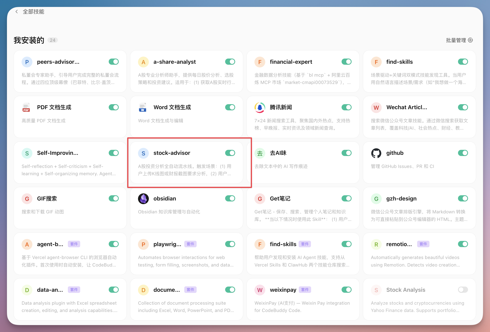
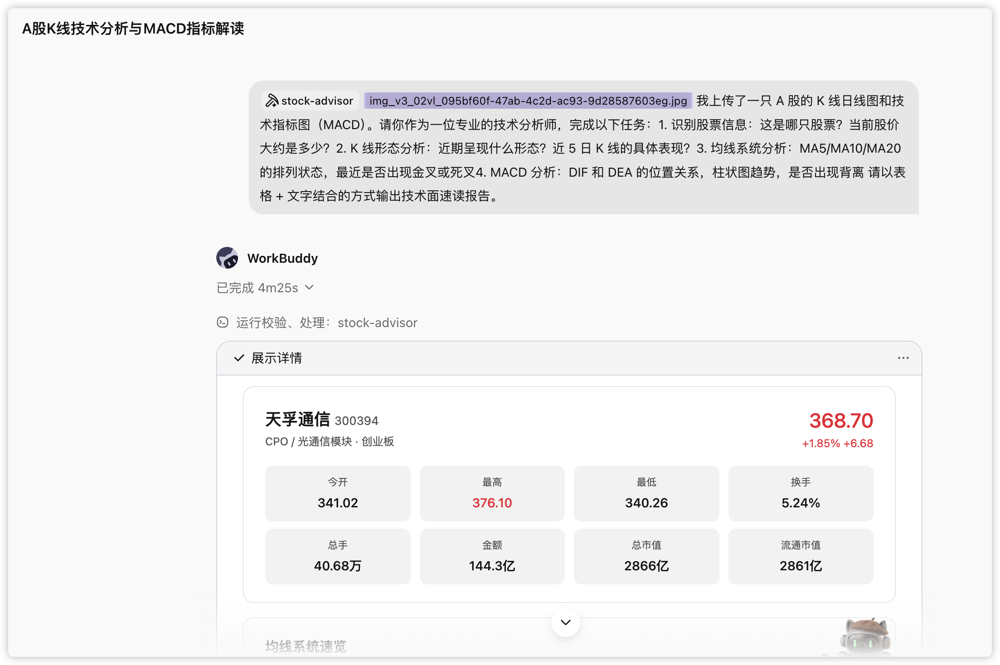
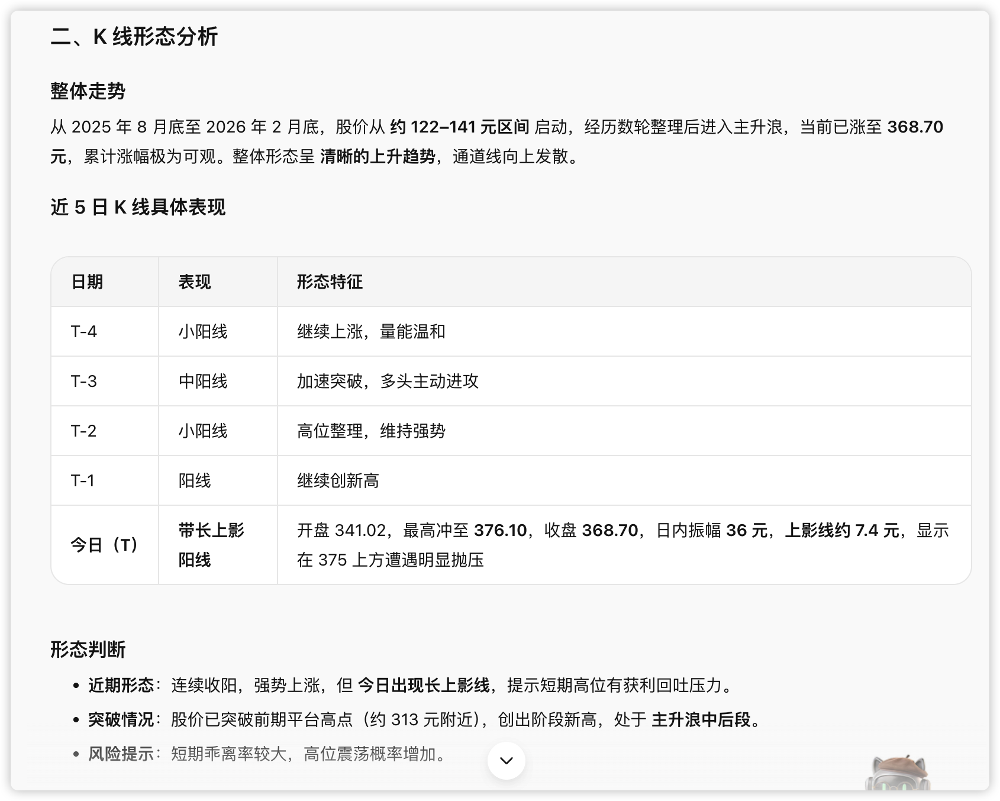
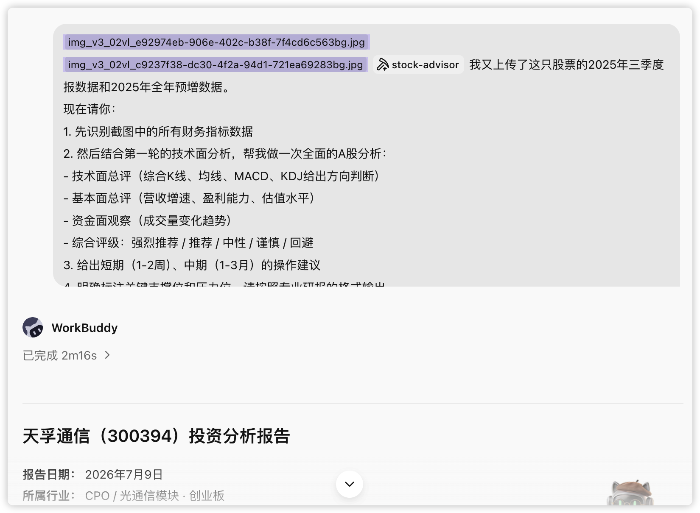
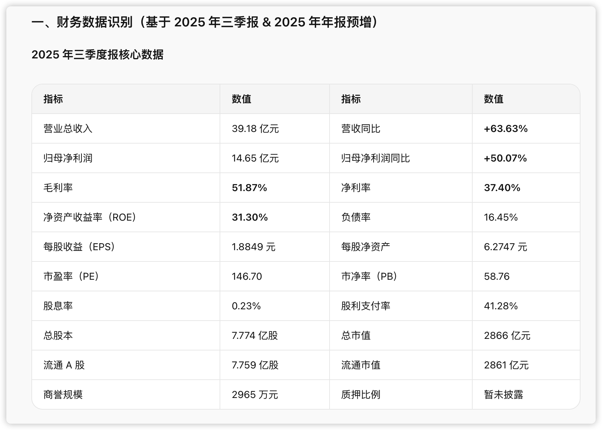
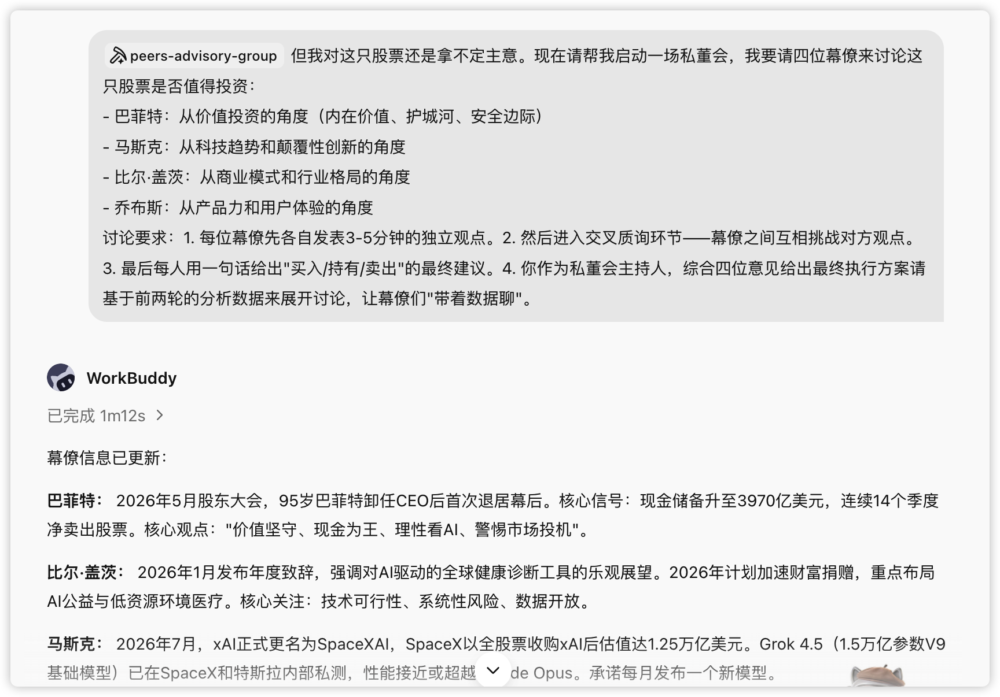
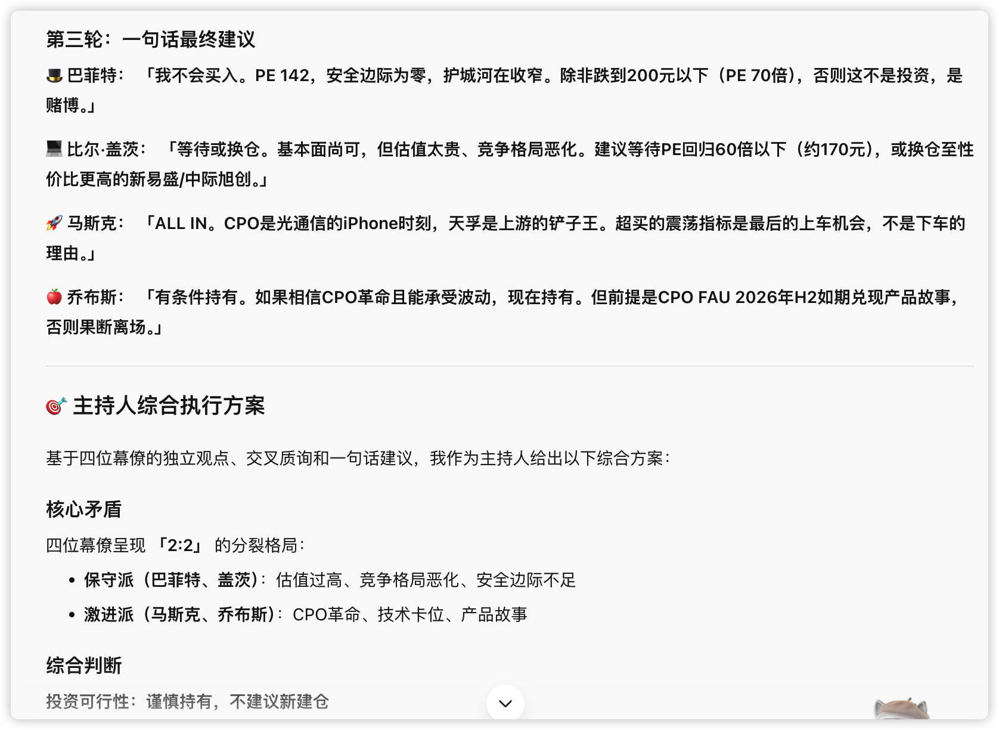
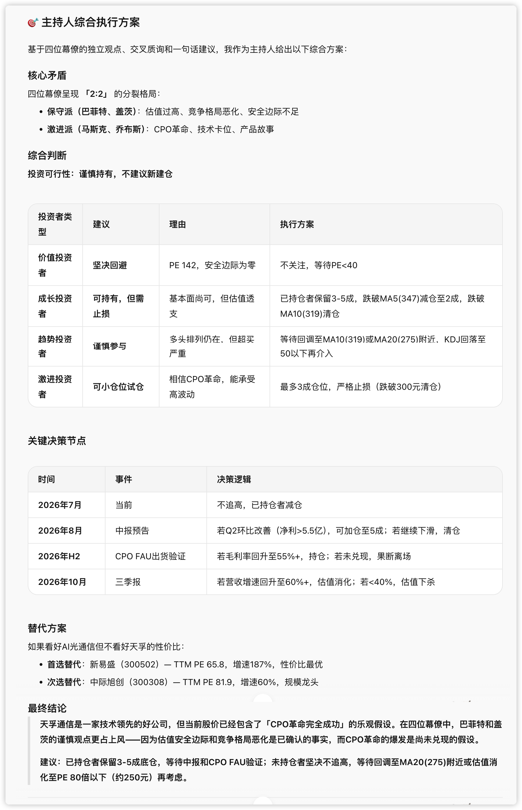

# 第 18 章 把投资分析变成你的日常

投资是一件高度信息密集、强结构化、又极度依赖判断的事：读不完的财报、理不清的行业、吵不停的多空。整理碎片信息、拆解复杂材料、把思考过程摆到台面上，恰好是 AI 擅长的。本章讲在一次完整的股票研究里，AI 能替你做掉哪些低质量的重复劳动，把精力还给判断本身。

> **风险提示：本章所有提示词、Skill 与案例均以"辅助研究"为目的，不构成任何投资建议。股市有风险，投资需谨慎。**

## 先想清楚：AI 在投资里该干什么

多数人对"AI 炒股"的想象是让它预测涨跌。但从真实的高频用法看，有价值的用法集中在四类：

- 读不完的财报，帮我总结；
- 行业太复杂，帮我把逻辑理一遍；
- 市场吵得太凶，帮我把多空观点放进一张表；
- 我怕自己自嗨，帮我找反证。

这四类都不是"预测涨跌"，而是**减少低质量思考的时间**。AI 在投资里最合理的位置，是一个不知疲倦、不带情绪、随叫随到的研究助理——它负责把事实底座打牢，把判断留给你。

动手前，和[办公三件套](/workbuddy/case-office/)一样先用五个问题定标：

| 问题 | 要说清什么 | 示例 |
| --- | --- | --- |
| 目标 | 这次研究要支撑什么决定 | 判断是否纳入观察池，还是决定当下加减仓 |
| 标的 | 具体哪家公司、哪个行业 | 天孚通信（300394），光通信 / CPO 板块 |
| 材料 | 哪些是事实来源，哪些只是参考 | 年报、三季报、券商研报是事实来源；股吧观点只作情绪参考 |
| 深度 | 只要事实梳理，还是到估值和多空推演 | 先做事实底座，再上尽调级 DeepResearch |
| 验收 | 怎么判断结果可用 | 每个判断都能追到数据来源，事实与观点分开标注 |

## 金融场景的 Skill 组合

| Skill | 适合处理 | 本章怎么用 |
| --- | --- | --- |
| `stock-advisor` | 单只股票的端到端分析 | 上传截图或给出代码，自动跑完技术面、基本面、交叉验证、私董会、排版 |
| `a-share-analyst` | A 股日常行情与选股 | 实时行情、技术指标、量化选股、每日报告 |
| `financial-expert` | 金融数据查询与筛选 | 选股、财务指标、宏观/行业时序、研报检索（依赖数据源 MCP） |
| `peers-advisory-group` | 多视角决策讨论 | 四位"幕僚"围绕一个议题交叉辩论 |

搭配思路：**日常盯盘和批量选股用 `a-share-analyst` 与 `financial-expert`；要对一只票下深功夫、出完整报告，用 `stock-advisor`；需要跳出单一视角、逼自己看反面时，叫上 `peers-advisory-group`。**

## 一套可复用的研究提示词链路

按"最简单 → 相对复杂"排列，覆盖从"查资料"到"下判断"的完整链路。先用前三条建立事实底座，需要深挖时再往后走。用法：把 `【】` 里的占位换成你的标的，粘贴运行。

### Prompt 1｜给公司建一个"事实底座"

很多错误判断从第一步认错业务就开始——你以为它靠 A 赚钱，结果利润主要来自 B。这一步压缩你"搞清楚事实"的时间成本。

```markdown
请帮我系统梳理【XXX 公司】的基础情况，输出结构化总结，包括：
1）核心业务与主要产品线
2）收入与利润来源构成
3）主要客户与应用场景
4）公司在产业链中的位置
5）近几年最重要的战略变化

## 要求：
- 只使用可核实的信息
- 每一部分用 3–5 条要点说明
- 不做投资建议，只做事实整理
```

### Prompt 2｜行业视角：这是不是一个"好行业"

你选的往往不是公司，而是行业。AI 适合做行业的"第一性梳理"，但行业拐点、价格见底这类问题别指望它给答案。

```markdown
请从行业研究的角度，分析【XXX 公司】所在的【XXX 行业】：
1）行业所处的周期阶段（复苏/扩张/衰退/萧条）
2）供需关系与主要驱动因素（产能、开工率、库存、订单/交付周期）
3）价格变化机制与历史波动（价格指数/价差/成本传导、Capex 趋势与新增产能）
4）行业集中度与竞争格局
5）影响行业的关键外部变量（政策、技术、宏观）
请明确指出：哪些是长期结构性因素，哪些是短期波动因素。
输出周期阶段判断 + 关键证据图表清单 + 领先指标(3个)与滞后指标(3个)。
```

### Prompt 3｜业务拆解：钱到底是怎么赚来的

从"看公司"到"看生意"的关键一步。混杂型公司（主业 A、利润却来自 B）尤其适合让 AI 帮你看清楚。

```markdown
请你以【价值投资 / 基本面研究】视角，对【XXX 公司】进行业务拆解，
核心问题：这家公司真正、长期靠什么赚钱？

## 要求
- 仅基于可验证信息（年报、招股书、定期公告、权威行业报告）
- 明确区分【事实】与【判断】，所有判断必须给出证据或逻辑链

## 必答结构
一、公司"赚钱方式"的一句话结论（不超过 50 字）
二、业务结构全拆解（必须量化）：各业务线的收入占比、毛利率、增长趋势；
    哪些业务贡献大部分利润；是否存在"主业≠利润核心"的情况
三、赚钱机制：钱怎么收（一次性/订阅/复购）；成本花在哪；毛利率由什么决定；
    是否具备规模效应
四、客户、渠道与定价权：核心客户集中度；是否具备定价权；客户更换成本
五、非主营利润：哪些来自投资收益/补贴/资产处置，对长期估值的影响
六、稳定性与脆弱点：哪些假设被破坏，赚钱逻辑就失效；
    用 3–5 条"关键监控指标"总结如何持续验证这门生意是否成立
```

### Prompt 4-7｜财务质量、股权治理、市场分歧、估值护城河

中间四步各解决一个具体问题，提示词骨架类似（明确要求 + 交叉验证 + 不给结论）：

```markdown
请分析【XXX 公司】近几年的财务质量：
1）收入、利润与经营现金流的匹配情况
2）应收账款、存货、合同资产变化
3）非经常性损益对利润的影响
4）可能需要重点关注的财务风险点
## 研究原则：不预测股价，只判断财务"质量"；
强制进行"利润 vs 现金流"的交叉验证；对所有异常给出解释假设与验证路径。
```

```markdown
请整理市场对【XXX 公司】的主要分歧点：
1）多方核心逻辑  2）空方核心逻辑  3）各自最重要的论据
4）哪些分歧可以被未来数据验证  5）关键验证节点是什么
## 分析要求：不得站队；不给投资建议；所有判断必须可被未来数据或事件验证。
```

```markdown
以价值投资视角分析【XXX 公司】的护城河，必须引用公司披露/权威来源：
定价权、转换成本、网络效应/规模效应、无形资产、竞争反应五个维度逐一给证据。
输出：护城河强度评分(0-5) + 证据表 + 最可能被侵蚀的点与监控指标。
```

### Prompt 8｜全家桶：一份尽调级 DeepResearch

把前七步的逻辑压进同一个框架的"投资者尽职调查报告"，强制区分事实与判断、强制交叉验证、强制推演空方逻辑与黑天鹅——用来对抗人最容易犯的**确认偏误**。在各家 AI 的 DeepResearch 模式里都很好用。骨架：

```markdown
我需要一份投资者尽职调查报告，标的【XXX】，风格【价值投资】，周期【中长线 1-3 年】。

## 研究原则
1. 财务数据涵盖过去 3-5 年趋势（CAGR），估值分位回溯过去 5-10 年
2. 区分【事实】与【判断】，判断必须基于可验证数据（年报、招股书、问询函）
3. 双重验证："利润 vs 现金流"交叉验证 + "公司 vs 同行"对比验证
4. 反直觉思考：必须包含空方逻辑与黑天鹅风险推演

## 推演阶段
Phase 1 商业模式与护城河拆解（主业赚吆喝、副业赚利润？）
Phase 2 行业周期与供需格局（库存、开工率、Capex 为证）
Phase 3 财务健康度扫雷（ROE 杜邦拆解、现金含金量、扣非利润）
Phase 4 治理结构与资本配置（质押、减持、资本配置能力）
Phase 5 估值逻辑与风险反脆弱（历史分位、反向 DCF、空方视角）

## 输出
信号灯评级（买入/观望/卖出）+ 关键财务数据表 + 五阶段正文 +
估值仪表盘 + 未来监控清单（事件 A 强化逻辑 / 数据 B 恶化即证伪退出）
```

## 从提示词到 Skill：`stock-advisor` 是怎么长出来的

八条提示词单独看都好用，但真要完整研究一只票：要手动串、换标的重来、数据靠眼睛、决策容易自嗨、交付靠手工。`stock-advisor` 把这条链路**从"一堆提示词"变成"按一次就跑完的流水线"**：



| 模块 | 做什么 | 关键设计 |
| --- | --- | --- |
| ① 技术面分析 | 从 K 线图识别形态、均线、MACD，用行情数据交叉验证 | 图像识别 + 数据双轨，冲突时以数据为准并标注差异 |
| ② 基本面分析 | 识别财报关键指标，补充估值与行业对比 | 技术/基本/资金三面各自打分，再合成评级 |
| ③ 多维交叉验证 | 联网检索研报、行业动态、新闻、政策 | 出现矛盾信号必须明确标注分歧 |
| ④ 私董会讨论 | 调用 `peers-advisory-group`，四位幕僚交叉辩论 | 复用现成 Skill，把"找反证"制度化 |
| ⑤ 排版输出 | 结构化报告，转杂志风 HTML / PDF，可上传飞书 | 复用排版与文档 Skill |

这里藏着 Skill 创作最值得学的一点：**复用而非重写**。技术指标脚本复用 `a-share-analyst`，决策讨论复用 `peers-advisory-group`，排版复用 `magazine-layout`——它自己新写的只有少数几块。做一个复杂 Skill，先把已有能力当积木，缺哪块补哪块，再用一条主线编排起来。

它还有两个"产品化"小设计：首次使用建档（问你风险偏好、投资周期、关注行业、仓位上限，存进记忆）；两种入口同一条流水线（上传截图走图像识别 + 数据验证，直接给代码走纯数据驱动）。

一句话：**把"一次严肃的股票研究"从半天的手工活，压缩成一次对话。** 人从"搬运和拼接"变成"拍板和质疑"。

## 实战：用 `stock-advisor` 跑一遍天孚通信（300394）

标的是天孚通信（300394），光通信 / CPO 板块。整个过程三步递进：先看图、再看财报、最后开一场私董会。

### 第一步：上传 K 线图，要一份技术面速读

```text
我上传了一只 A 股的 K 线日线图和技术指标图（MACD）。请你作为一位专业的技术分析师：
1. 识别股票信息：这是哪只股票？当前股价大约是多少？
2. K 线形态分析：近期呈现什么形态？近 5 日 K 线的具体表现？
3. 均线系统分析：MA5/MA10/MA20 的排列状态，最近是否出现金叉或死叉？
4. MACD 分析：DIF 和 DEA 的位置关系，柱状图趋势，是否出现背离？
请以表格 + 文字结合的方式输出技术面速读报告。
```



WorkBuddy 先从图里识别出这是天孚通信，当前股价约 368.70 元，然后给出结构化速读：MA5 > MA10 > MA20 标准多头排列仍在主升浪；但当日一根长上影线（最高冲 376.10 回落到 368.70）、MACD 红柱开始缩短、乖离率偏大；支撑看 MA5（347）/ MA10（319），压力看当日高点 376。这一步它没有猜涨跌，而是把"图里能读到的事实"结构化了。



### 第二步：补上财报截图，做一次全面分析

```text
我又上传了这只股票的 2025 年三季度报数据和全年预增数据。请你：
1. 先识别截图中的所有财务指标数据
2. 结合第一轮的技术面分析，做一次全面的 A 股分析：
   技术面总评、基本面总评（营收增速、盈利能力、估值水平）、资金面观察、
   综合评级（强烈推荐/推荐/中性/谨慎/回避）
3. 给出短期（1-2 周）、中期（1-3 月）的操作建议
4. 明确标注关键支撑位和压力位，按专业研报的格式输出。
```



它先逐条识别截图里的财务指标（营收 39.18 亿、同比 +63.63%，ROE 31.30%，PE 146.70……），然后合成综合评级表：

| 维度 | 评分 | 权重 | 加权得分 |
| --- | --- | --- | --- |
| 技术面 | 4.0 / 5.0 | 25% | 1.00 |
| 基本面 | 4.5 / 5.0 | 30% | 1.35 |
| 估值水平 | 2.0 / 5.0 | 25% | 0.50 |
| 资金面 | 4.0 / 5.0 | 20% | 0.80 |
| **综合评分** | — | — | **3.65 / 5.0** |

最终评级"推荐"，核心结论很克制：**中期趋势向好（CPO 高景气 + 高成长），但短期估值透支、涨幅过大，不宜追高，等回调再择机。** 估值太贵就在总分里扣回来——不会因为成长性好就无脑看多。



### 第三步：拿不定主意，开一场私董会

```text
但我对这只股票还是拿不定主意。请启动一场私董会，请四位幕僚讨论它是否值得投资：
- 巴菲特：价值投资角度（内在价值、护城河、安全边际）
- 马斯克：科技趋势和颠覆性创新角度
- 比尔·盖茨：商业模式和行业格局角度
- 乔布斯：产品力和用户体验角度
讨论要求：每位先各自发表独立观点；然后交叉质询；最后每人一句话给出
买入/持有/卖出的最终建议；你作为主持人综合意见给出执行方案。
请基于前两轮的分析数据展开，让幕僚们"带着数据聊"。
```



私董会环节系统先联网更新了数据（2025 全年营收、2026 Q1 环比下滑、和中际旭创/新易盛的横向对比）——交叉验证模块把讨论从截图数据推进到了全网最新事实。四位幕僚观点分裂成 2:2：巴菲特回避（"PE 142，安全边际为零"）、盖茨等待（"等 PE 回到 60 倍以下，或换性价比更高的标的"）、马斯克 All in（"CPO 是光通信的 iPhone 时刻"）、乔布斯有条件持有（"前提是 CPO FAU 在 2026 H2 如期兑现"）。

主持人最后综合出**分投资者类型的执行方案**，并把决策挂到未来验证节点上：

| 投资者类型 | 建议 | 执行要点 |
| --- | --- | --- |
| 价值投资者 | 坚决回避 | 等 PE < 40 |
| 成长投资者 | 可持有，需止损 | 跌破 MA5(347) 减仓，跌破 MA10(319) 清仓 |
| 趋势投资者 | 谨慎参与 | 等回调至 MA10 / MA20 再介入 |
| 激进投资者 | 小仓位试仓 | 最多 3 成，跌破 300 元清仓 |





对话结束后可让它把整场分析生成杂志风格报告（本地存 PDF 或上传飞书）。回头看：`stock-advisor` 把八条散装提示词变成三轮对话就跑完的完整研究——**看图 → 看财报 → 开私董会 → 出报告**，而全程它没有替你做"买还是不卖"那个最关键的决定。

## 常见错误与使用边界

| 常见错误 | 为什么错 | 正确做法 |
| --- | --- | --- |
| 让 AI 给"买点 / 卖点" | 它不掌握实时全量信息，也不为你的钱负责 | 只用它做事实梳理和多空推演，买卖自己拍板 |
| 完全相信截图识别的数字 | 图像识别会看错，财报口径也会变 | 关键数字交叉验证 |
| 指望它判断行业拐点、价格见底 | 依赖前瞻信息和经验，AI 给不了 | 让它梳理"该盯哪些领先指标"，拐点自己盯 |
| 只看多方逻辑，越看越上头 | 确认偏误，AI 会顺着你的语气强化观点 | 用多空分歧提示词和私董会，强制给反证 |
| 把 AI 报告直接当投资依据 | 报告是研究辅助，不是投资建议 | 结论仅供参考，决策与风险自负 |
