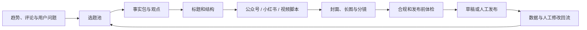

# 第 20 章 自媒体不只是靠努力，而是一条增长闭环

## 内容没人看？往往不是因为你不够努力

一个人做自媒体，最浪费时间的事就是一上来把内容打磨到满分：写得很深，资料查得很全，结构改了三遍，结果发出去阅读量个位数。起号前期真正要先解决的，不是"写得够不够好"，而是"有没有人愿意点进来"。

## 工作流全景



Skill 的作用是补上其中一个环节，不是接管账号判断。下面用几个具体工作现场说明。

## 场景一：每天刷热点，仍然不知道账号该写什么

热榜告诉你"大家正在看什么"，却不告诉你"这个账号为什么值得写"。只跟热点容易同质化，只凭感觉又难判断用户是否真的关心。

可用 Skill：[公众号热门文章查询](https://skillhub.cn/skills/gzh-explosive-content-detector)、[小红书爆款笔记查询](https://skillhub.cn/skills/xhs-hotnotes)、[小红书评论洞察](https://skillhub.cn/skills/xhs-comment-insights)、[灵感捕手](https://skillhub.cn/skills/inspiration-hunter-skill)。

```text
围绕"AI 办公自动化"建立本周选题池，不直接写文章。
分别收集公众号与小红书近 30 天的高互动内容，记录标题、发布日期、
核心承诺、内容结构、互动信号和原链接。
再从评论中提取：重复问题、反对意见、失败经历和用户原话。
结合我的账号定位：面向非技术职场人，强调真实流程和结果验收。
输出 12 个候选选题，每个包含：目标读者、真实问题、已有内容缺口、
我能提供的新证据、适合平台、制作成本和时效性。
不要把阅读量高直接解释成选题一定适合我。
```


WorkBuddy 先生成跨平台样本表，再把评论聚成问题簇，最后把"热度、账号匹配、新增价值、证据充足度、制作成本"分别评分，交付一张可以人工删选的选题看板。


### 还要会找"低粉爆款"

起号要找低粉爆款去**抄选题**（抄选题，不是原封不动抄内容）。推荐 [viral-topic](https://github.com/kangarooking/kangarooking-skills/tree/main/viral-topic) skill：获取各平台近期指定领域的低粉爆款内容，比如"公众号最近 7 天的 AI 领域低粉爆款文章"，也支持 X 和 YouTube。


## 场景二：想要爆款标题，但不想标题党

"给我 20 个爆款标题"很容易得到数字、悬念和夸张承诺，却没有一个标题能准确兑现正文。**标题不是独立文案，它是读者与正文之间的一份承诺。**

可用 Skill：[公众号标题生成与评分](https://skillhub.cn/skills/gzh-official-account-title-generator)、[小红书爆款笔记自动生成器](https://skillhub.cn/skills/redbook-writer)、[短视频钩子方案生成](https://skillhub.cn/skills/bozo-video-gz)；公众号起标题还可以试试 [viral-title](https://github.com/kangarooking/kangarooking-skills/tree/main/viral-title)。

```text
读取 approved-article.md，只根据正文已经出现的事实生成标题。
分别生成：公众号标题 8 个、小红书标题 8 个、短视频开场钩子 5 个。
每个候选都输出：
1. 面向谁；2. 承诺什么；3. 正文哪一段能够兑现；
4. 采用的问题/结果/清单/案例/反常识角度；
5. 可信度、具体性、平台适配和夸大风险评分。
删除无法证明的数字、绝对化承诺、虚假稀缺和与正文不一致的结论。
不要自动选择最终标题，先让我确认内容承诺。
```


**验收方法**：把标题单独给一个不了解正文的人看，请他写出"我预计点进去会得到什么"，再与正文核对——预期与实际不一致，标题分数再高也不能用。A/B 测试一次只改变一个主要变量，否则数据无法解释。

## 场景三：公众号封面每次从空白画布开始

直接说"做一张高级感封面"，通常得到与正文无关的装饰图、错误文字或失真的 Logo。

```text
为文章《收藏不是知识管理，能再次用起来才是》制作公众号封面 brief。
目标读者：知识工作者；核心信息：从收藏走向可复用知识流。
品牌色：#1677FF、白、黑；禁止紫色渐变、夸张科技光效和虚构产品界面。
先输出 3 个构图方向，每个包含：主体、层级、封面文案、色彩、留白、
大小封面裁切风险和正文对应段落。我确认后再生成图片。
生成后检查：文字是否准确、Logo 是否变形、主体是否被小封面裁掉。
不要直接上传公众号。
```


## 场景四：小红书不只是"把长文切成九张图"

公众号文章改小红书，常见做法是截短段落、加表情符号、铺到九张卡片上——结果信息很多，但封面没有钩子，第二页没有承接，最后一页没有行动。正确的工作流：

1. 从长文提取不带平台语气的事实包；
2. 选择一个核心问题，删除与它无关的支线；
3. 设计"封面承诺 → 问题共鸣 → 方法 → 示例 → 误区 → 清单"的滑动节奏；
4. 先输出逐页线框和字数，再生成图片；
5. 在真实手机宽度检查字号、断行、边距；
6. 标题、正文、标签和图片逐一核对数字与专有名词。

```text
把 approved-article.md 改造成 8 页小红书图文，不新增事实。
第 1 页只表达一个承诺；第 2 页写读者正在经历的问题；
第 3-6 页每页只讲一个动作并给一个例子；第 7 页写常见误区；
第 8 页给可保存的检查清单。
先返回逐页文案、视觉层级和预计字数，我确认后再调用封面与长图 Skill。
```


## 场景五：一段长文怎样变成可拍的短视频

"改成 60 秒口播"通常只是把文章压缩成更快的朗读稿，没有镜头、节奏、证据画面和停顿。

```text
把这篇文章改造成 60 秒真人口播，目标是让第一次使用 WorkBuddy 的人
理解"为什么任务简报比一句模糊需求更重要"。
输出时间轴表格：时长、景别、画面、口播、屏幕文字、素材来源、转场。
前 3 秒必须提出真实问题，不夸大收益；20 秒前展示一次产品过程证据；
结尾给一个可以立即尝试的指令，不做虚假互动承诺。
同时列出必须实拍、可用产品截图、可由 AI 生成的画面，禁止伪造用户反馈。
```


## 场景六：发布前，别让自动化越过责任边界

可用 Skill：[公众号违禁词检测](https://skillhub.cn/skills/gzh-prohibited-word)、[公众号排版](https://skillhub.cn/skills/md-to-wechat)、[文章去 AI 味工具](https://skillhub.cn/skills/unclecheng-reduce-ai-perception-v2)。

```text
检查本次公众号文章是否有违禁词，如有请标记出来，并对每个违禁词给出修改建议。
检查整体内容的 AI 味，并降低 AI 味，最后把文章排版。
```

发布链建议停在草稿箱：事实检查 → 引用与版权 → 品牌与合规 → 链接检查 → 手机预览 → 人工确认账号 → 发布。自动点赞、批量私信、刷评论、绕过平台风控，不属于推荐的效率场景。

## 场景七：发布后不复盘，下一篇仍从零开始

复盘的核心是把 AI 初稿和人工修改后的终稿对比，让 Skill 自动进化，下一次它写得离你的期望更近。可用[公众号写作自我迭代](https://skillhub.cn/skills/skill-article-evolution)或小红书运营副驾，把人工修改和数据写回风格库：

```text
读取本期内容数据、发布版本和人工修改记录，生成复盘。
先陈述数据事实，再列出最多 3 个可验证假设，不把相关性写成因果。
把表现按选题、标题、封面、开头、结构、发布时间和渠道拆开。
为下轮设计 2 个单变量实验，并说明成功指标和停止条件。
将长期有效的修改规则写入 style-guide.md；一次性热点不要写入永久规则。
```


## 一套够用的自媒体 Skill 栈

| 层级 | 先装什么 | 何时再增加 |
| --- | --- | --- |
| 入门 | 热门内容查询、标题评分、图片生成 | 已能稳定完成一篇内容 |
| 稳定 | 评论洞察、封面、排版草稿、违禁词检测 | 已明确账号定位和审核人 |
| 多平台 | 小红书卡片、短视频脚本、平台适配 | 已有统一事实包 |
| 进阶 | 数据回流、风格迭代、定时选题雷达 | 人工流程已连续跑通 4 周 |
