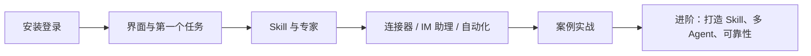

# WorkBuddy 是什么、怎么学？五组路线带你从安装用到自己搭系统

你点进这一页，大概已经装好了 WorkBuddy，或者正犹豫「这东西到底能帮我干啥」。一句话先给你定心：它是腾讯推出的全场景职场 AI 智能体工作台——你只要把目标说清，它就在这台电脑上自己规划步骤、读写文件，交回 PPT、表格分析、文档、调研报告这些能接着用的成果。它和聊天机器人的差别一句话就能说透：不是只「回答问题」，是把活干完。

本板块按「上手 → 扩展 → 案例 → 进阶 → 速查」五组组织，从安装一路带到你搭起自己的 AI 工作系统。你不用从头读到尾，照着下面的路线挑需要的看就行。

## 学习路线

你先把这张图扫一眼，心里有个全貌：从装好登录，到学 Skill 和专家，再到接连接器、跑案例、最后进阶自己造 Skill 和多 Agent。

### 上手篇：先把 WorkBuddy 用起来

| 章节 | 你会得到什么 |
| --- | --- |
| [初识 WorkBuddy](/workbuddy/01-intro/) | 它能做什么、和聊天式 AI 的区别 |
| [下载、安装、登录与更新](/workbuddy/02-install/) | 装好并登录客户端 |
| [主界面、任务与工作区](/workbuddy/03-interface/) | 看懂界面，建立第一个工作区 |
| [快速完成第一个任务](/workbuddy/04-first-task/) | 从一句话到一份交付物 |
| [加载一个真正用得上的 Skill](/workbuddy/05-skills/) | 让 AI 带上“标准做法”干活 |

### 扩展篇：把能力接进来

| 章节 | 你会得到什么 |
| --- | --- |
| [专家和专家团](/workbuddy/06-experts/) | 让 AI 带上“岗位技能”干活 |
| [使用连接器](/workbuddy/07-connectors/) | 打通外部服务与数据源 |
| [接入小程序与 IM 助理](/workbuddy/08-im-assistant/) | 微信 / 飞书 / 钉钉里直接派活 |
| [接入外部 API](/workbuddy/09-external-api/) | 用自己的 LLM API 或本地模型 |
| [自动化任务](/workbuddy/10-automation/) | 定时任务，让 AI 自动干活 |
| [课外阅读：看懂 AI 工作系统](/workbuddy/11-ai-work-system/) | LLM / Agent / Skill / MCP 一章讲透 |

### 案例篇：从一项任务到一支 AI 团队

| 章节 | 你会得到什么 |
| --- | --- |
| [办公三件套：Word、Excel、PPT](/workbuddy/case-office/) | 提示词 + Skill 组合的完整打法 |
| [知识管理：收藏要能用起来](/workbuddy/case-knowledge/) | WPS / ima / Obsidian / 微信收藏的分工 |
| [把投资分析变成日常](/workbuddy/case-investment/) | 八条研究提示词 + stock-advisor 流水线 |
| [一句话召唤 AI 视频团队](/workbuddy/case-video-team/) | 视频生成 + 爆款拆解两支专家团 |
| [自媒体增长闭环](/workbuddy/case-self-media/) | 选题 → 标题 → 封面 → 发布 → 复盘 |

### 进阶篇：把案例变成自己的工作系统

| 章节 | 你会得到什么 |
| --- | --- |
| [打造 Skill：知识蒸馏](/workbuddy/adv-build-skill/) | 把书和视频蒸馏成可执行 Skill |
| [多 Agent 系统设计](/workbuddy/adv-multi-agent/) | 分工、交接格式、何时值得拆分 |
| [自动化工作流的可靠性](/workbuddy/adv-automation-reliability/) | 状态机、幂等、降级、告警 |

### 速查区

| 章节 | 你会得到什么 |
| --- | --- |
| [常用指令模板](/workbuddy/ref-prompt-templates/) | 12 个拿来即用的任务模板 |
| [场景速查表](/workbuddy/ref-scenarios/) | 按人群和场景的词典式索引 |
| [WorkBuddy 皮肤工坊](/workbuddy/skins/) | 12 款主题皮肤下载 + 自制皮肤教程 |

## 适合谁

你属于下面哪一类，都能从这里找到起点：

- **职场新手**：想用 AI 处理 Word/Excel/PPT、文件整理、资讯汇总等日常琐事
- **效率玩家**：想搭一套“人机协作”的自动化工作流
- **团队负责人**：想了解多 Agent 协作与团队落地方式

## 常见问题

**我完全没接触过这类工具，从哪篇开始？**
你直接按上手篇的顺序走：先安装登录，再看主界面和第一个任务，然后装一个真正用得上的 Skill。前面五篇走完，基本就能独立派活了。

**WorkBuddy 和聊天机器人到底差在哪？**
聊天机器人给你一段答案，然后活还是你的；WorkBuddy 会在你本地读写文件、自己规划步骤，交回一份能继续编辑的成果。区别就在「它把活干完」。

**我是团队负责人，该重点看什么？**
你先看案例篇感受完整打法，再进进阶篇的多 Agent 系统设计和自动化可靠性——这两篇讲的就是团队怎么协作、定时任务怎么跑稳。

**速查区是给谁用的？**
给你这种「不想通读、只想马上找到对应功能」的人。你按人群和场景一查，就能跳到该去的章节，不用从头翻。
