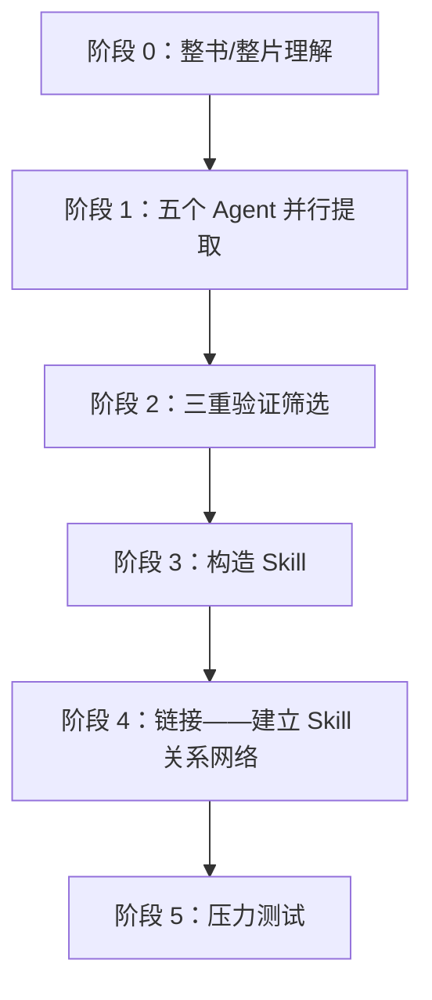

# 一本書讀完就忘？用倉頡 Skill 把書裡的真方法蒸餾成能反覆呼叫的技能

你買書容易，讀完也不難，難的是真遇到問題時，明明記得書裡講過類似方法，翻遍筆記卻找不到該從哪一步開始。你如果一本書只留下摘要和幾句金句，它很快就會沉進筆記裡。這篇講怎麼用「倉頡 Skill」把書裡的框架和判斷方法，整理成可以反覆呼叫的步驟。

> 場景：買書容易讀完也不難，難的是真遇到問題時，明明記得書裡講過類似方法，翻遍筆記卻找不到該從哪一步開始。如果一本書只能留下摘要和幾句金句，它很快就會沉進筆記裡。

## 倉頡 Skill 蒸餾的是什麼

你想讓書真正能用起來，普通摘要追求更短，倉頡 Skill 追求以後還能用。它先理解全書，再從框架、原則、案例、反例和術語五個方向提取候選內容；你拿到的候選內容還要經過三項檢查：

1. 書中是否有至少兩處獨立內容支援它；
2. 它能否幫助回答書中沒有直接討論的新問題；
3. 它是否提供了超出常識的獨特方法。

通過檢查的方法會被寫成原子 Skill：說明什麼情況下呼叫、需要什麼輸入、怎樣執行、什麼時候不適用，還配上測試題檢查它會不會在錯誤場景中亂觸發。你一輪完整蒸餾通常會留下全書概覽、Skill 索引、術語表、精華長文、多個原子 Skill、測試題和測試結果——原始候選與淘汰原因也保留，方便你回看。



## 安裝與蒸餾

你最簡單的方式：直接告訴豆包工作「自己安裝這個 Skill」，或到技能市場搜尋新增。

你跑蒸餾時，先為這本書建一個獨立專案或工作資料夾，把原始材料和產物放在一起；你第一次只處理一本書。方法論密度高、案例較多、能指導行動的書更適合蒸餾；小說、散文和金句集更適合做閱讀地圖。你電子書優先準備 Markdown 或 TXT，普通 PDF 也可以直接交給它（掃描版要先確認 OCR 是否準確）：

```text
請使用倉頡 Skill 蒸餾這本書，把書中的方法論整理成一組可以在真實任務中呼叫的 Skill。
```

你實測蒸餾《王川寶典》得到 7 個原子 Skill。這個篩選過程也提醒你：蒸餾質量不能用 Skill 數量衡量——書裡有內容，不等於每一段都值得變成工具。

## 把蒸餾後的知識用起來

你安裝完成後，不必先背下全部 Skill 名稱。你直接把真實問題、背景材料和期望結果交給豆包工作，並要求它在開始前說明將呼叫哪些方法：

```text
用當下空間中的王川寶典 Skill 回答我：
我現在並沒有多少錢，但是我很看好 AI 的發展和具身智慧的發展。
我需要去投資嗎？如果要投資，應該怎麼投？以什麼策略去做？
```

你實測它按蒸餾出的知識給出三層策略：投自己（每天固定時間學 AI 相關技能、每週用 AI 做一個可複用資產、把思考公開寫出去）；小額金融配置只用閒錢（定一個「虧光也不影響生活」的上限、用寬基 ETF 替代個股、不加槓桿、拒絕以短期盈虧為導向）；戰略耐心（現在不重注但長期在場，能說清標的「靠什麼壟斷」時才考慮加大倉位）。

## 知識庫怎樣配合

你知識庫擅長儲存原文和找回相關段落，Skill 擅長在合適的問題出現時執行一套方法。你需要核對作者原話、資料和上下文時回到原書或知識庫；需要分析、判斷和行動時呼叫 Skill。你把兩者放在同一個專案裡，來源和方法可以互相校驗。

無論蒸餾得多完整，你最終判斷仍由人負責——投資、醫療、法律一類高風險內容尤其如此。Skill 可以補檢查項和反例，不能替代專業意見、事實核驗和人的責任。

## 知識精餾 vs RAG

| 維度 | RAG | 知識精餾（Skill） |
| --- | --- | --- |
| 本質 | 檢索——找出最相關的原文片段 | 提煉——從原文提取可執行的方法論 |
| 使用前提 | 使用者需要知道該問什麼 | 使用者描述問題，Skill 自動識別並啟用 |
| 質量控制 | 無——任何內容都可以入庫 | 三重驗證過濾，寧缺毋濫 |
| 呼叫方式 | 被動等待查詢 | 主動匹配場景並觸發 |
| 知識形態 | 儲存原文（記住知識） | 提純為執行步驟（運用知識） |
| 邊界控制 | 無 | 誘餌測試確保不亂啟用 |
| 資源消耗 | 較重（需維護向量索引） | 較輕（Skill 檔案即可） |

你用 RAG 解決「知識管理」問題——讓你能查到書裡有什麼；用知識精餾解決「知識運用」問題——讓 Agent 在對的時刻主動拿出對的框架。你不知道該問什麼時，RAG 幫不了你；Skill 不需要你記得書裡有哪些方法論。

這與 Andrej Karpathy 提出的 LLM Wiki 思路（原始資料索引成目錄 → LLM 編譯成 Wiki → 對 Wiki 做 Q&A → 結果回填增強）在前半程一致：先讓 AI 深度閱讀、結構化整理、建立索引。你差別在最後幾步：LLM Wiki 的產物是 Wiki 條目、使用者主動查詢；知識精餾的產物是可執行的 Skill 集合、Agent 識別場景後主動啟用。兩種方案不互斥，但目標不同。

---

同類場景：[用一個精美的個人網站包裝你自己 →](/zh-tw/doubaowork/case-personal-site)

## 常見問題

**蒸餾出來的 Skill 越多越好嗎？**
不是。你實測蒸餾《王川寶典》得到 7 個原子 Skill，但質量不靠數量——書裡有內容，不等於每一段都值得變成工具。

**我不會寫 Skill 也能用嗎？**
能。你安裝完成後，直接把真實問題和材料交給豆包工作，讓它先說明會呼叫哪些方法，再回答。

**蒸餾要準備什麼格式的書？**
你電子書優先準備 Markdown 或 TXT，普通 PDF 也可以。掃描版要先確認 OCR 是否準確，否則提取會出錯。

**RAG 和知識精餾該選哪個？**
你查書裡有什麼用 RAG；你讓 Agent 主動用方法用知識精餾。你不知道該問什麼時，RAG 幫不了，Skill 反而能主動啟用。

**高風險內容能全交給 Skill 嗎？**
不能。你最終判斷仍由人負責，投資、醫療、法律尤其如此。Skill 補檢查項和反例，不替代專業意見和人的責任。
