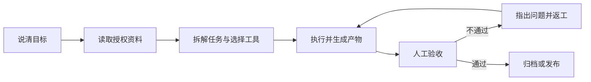

# 第 1 章 初識 WorkBuddy：它是幹活的，不是聊天的

先說人話版定義：WorkBuddy 是騰訊推出的全場景職場 AI 智慧體工作臺，面向 HR、行政、運營、銷售、研發這些每天要跟檔案、表格、報告打交道的人。

它和你在網頁裡聊過的 AI 有個根本區別：聊天 AI 是「你問它答」，答完活還是你自己幹；WorkBuddy 是你說一句「分析這個資料夾裡的銷售資料，做成簡報 PPT」，它在你的本地電腦上自己規劃步驟、讀檔案、做分析、出成果。你從「提問的人」變成「派活和驗收的人」。

## 從「回答問題」到「交付結果」

具體一點。獲得你授權之後，WorkBuddy 能直接讀取和處理本地檔案，接這些活：

- 批次檔案處理、檔案生成、表格分析、PPT 製作
- 多模態內容創作、行業調研、本地知識庫構建

任務更復雜時，它自己拆解步驟，派多個智慧體（Agents）並行幹——你在不同工具、檔案、任務之間來回切換的時間，就是它省下來的時間。

整個過程你不用一個個手動上傳檔案，也不用一步步教它「接下來該幹什麼」。一個任務的完整流轉長這樣：

注意「人工驗收」那一步：驗收永遠是你。它負責幹，你負責查，這套分工從第一個任務開始就要養成。

## 三個核心能力

**聽得懂人話。** 一句自然語言把需求說清就行，不用學什麼命令格式。

能自己想怎麼幹。 拿到任務先規劃執行步驟，而不是等你一步步喂。

**真能操作你的電腦。** 讀寫檔案、交付成果，落在本機。

為了幹好不同型別的活，它還提供幾樣擴充套件：多模型切換（混元 / DeepSeek / GLM / Kimi / MiniMax 等），按任務選合適的；MCP Server 和 Skills 技能包，擴充套件工具箱和專業能力。這些詞第一次看著陌生沒關係，後面的[技能](/zh-tw/workbuddy/05-skills/)、[連接器](/zh-tw/workbuddy/07-connectors/)章節會一個個拆開講。

## 它會不會把我電腦搞壞

第一次把電腦交給 AI，你肯定會想這個問題。WorkBuddy 針對本地檔案操作、終端執行這類高危場景，配了高危指令攔截和權限控制機制；實際使用中還有資料夾級授權——它只能碰你授權過的目錄。即便如此，處理真實業務資料之前，建議先拿演練目錄練手。

## 新手常見問題

**要會程式設計嗎？**
不用。它就是給非程式設計師做的，全程自然語言。

和網頁版聊天 AI 的區別，一句話說清？
聊天 AI 交付「文字回答」，WorkBuddy 交付「工作成果」——PPT、表格、報告，能接著用、接著改的那種。

**免費嗎？**
裝好就能用，跑任務消耗積分，不同模型的積分消耗不同，任務介面裡能看到、也能換。

**我這種崗位用得上嗎？**
HR、行政、運營、銷售、研發都有對應場景。判斷方法很樸素：你的活裡有沒有「讀一堆材料、產出一份東西」的環節。

---

下一步：把它裝上——[下載、安裝、登入與更新 →](/zh-tw/workbuddy/02-install/)
