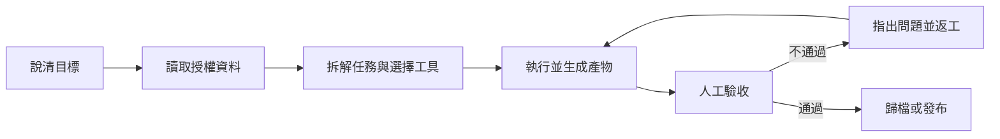

# 第 1 章 初識 WorkBuddy

**WorkBuddy** 是騰訊最新推出的全場景職場 AI 智能體工作台，

面向 人力資源、行政、營運、銷售、研發等不同職場角色，是一款能夠像真正同事一樣思考、執行任務並交付結果的 AI 辦公應用。

## 從「回答問題」到「交付結果」

與傳統 AI 助手不同，WorkBuddy 不只是陪用戶聊天、回答問題或者給出建議。

用戶只需要用一句自然語言描述需求，它就可以理解任務目標，在本機電腦中自主規劃執行步驟，並完成複雜的多模態任務。

在獲得用戶授權後，WorkBuddy 可以讀取和處理本機檔案，自動完成批次檔案處理、文件生成、表格分析、PPT 製作、多模態內容創作、行業調研、本機知識庫構建等工作。

對於更加複雜的任務，它還可以自主拆解步驟，並透過多個智能體（Agents）並行，減少人工在不同工具、檔案和任務之間反覆切換的成本。

例如，用戶可以直接告訴 WorkBuddy，分析這個資料夾中的銷售資料，並生成一份彙報 PPT。

WorkBuddy 會自主讀取相關檔案，理解資料內容，完成分析和總結，並生成最終可以查看和修改的工作成果。

整個過程中，用戶不需要手動上傳每一個檔案，也不需要一步一步告訴 AI 下一步應該做什麼。

WorkBuddy 面向的是完整的工作任務。

它的核心能力可以概括為三點，**聽得懂人話，能夠自主思考規劃，也真的能夠操作電腦交付成果。**

為了完成不同類型的任務，WorkBuddy 還提供了多模型切換（混元/DeepSeek/GLM/Kimi/MiniMax 等）、MCP Server、Skills 技能包等能力。

用戶可以根據不同任務選擇合適的模型，也可以透過 MCP 和 Skills 擴展 WorkBuddy 的工具和專業能力。

同時，針對本機檔案操作、終端執行等場景，WorkBuddy 還提供高危指令攔截和權限控制機制，降低 AI 自主執行過程中的風險。

想對 workbuddy 打分，可以去[观猹](https://watcha.cn/)，寫出你對 workbuddy 的真實評價～

