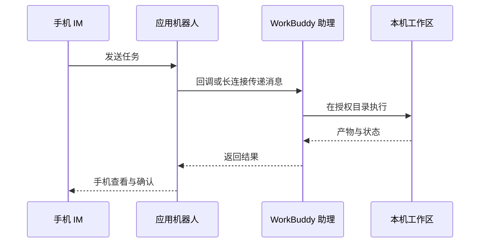

# WorkBuddy 能裝進微信和手機嗎？接上 IM 助理隨時遠端派活

你裝好了 WorkBuddy 客戶端，可人一離開工位，電腦一鎖屏，活就派不出去了。你想在地鐵上讓它在家裡那臺電腦上跑個分析，或者直接在微信裡丟一句「幫我建明天的會」，不用再開電腦。這一章就是把 WorkBuddy 從「坐在電腦前才能用」變成「手機上隨時派活」：小程式讓你遠端檢視與排程，IM 助理讓你在微信、飛書、釘釘裡直接下任務。

## 小程式的兩種模式

| 模式 | 任務在哪裡執行 | 是否依賴電腦線上 | 適合任務 |
| --- | --- | --- | --- |
| 本機模式 | 已連線的電腦 | 是 | 本地檔案、本地 Skill、已有工作區 |
| 雲端模式 | 隔離的雲端環境 | 否 | 調研、寫作、臨時分析、並行任務 |

首次使用：你通過官方入口開啟 WorkBuddy 小程式並登入，你檢視當前處於本機還是雲端模式；本機模式下確認目標電腦線上且連線正確。

## IM 助理的工作鏈路

你發一條訊息過去，背後鏈路是這樣的：

## 接入微信助理：掃碼繫結即可

你按這五步來：

1. 開啟 WorkBuddy，在左側「助理」欄點齒輪，進入「助理設定」；

2. 找到「微信助理整合」，點「配置」；

3. 等待繫結二維碼生成，用手機微信掃碼；

4. 卡片顯示「已繫結」後，先發一條只讀測試指令；

5. 要換微信賬號時，先解綁當前賬號，再重新掃碼。

五步走完，你在微信裡就能直接給 WorkBuddy 下任務了。

> 二維碼有時效限制。停留在「繫結中」、二維碼過期或掃碼失敗時，你關閉配置視窗後重新進入，必要時重啟 WorkBuddy 重新生成二維碼。

## 接入飛書

你走飛書的話，步驟比微信多些，你照著走：

1. 走 WorkBuddy → 設定 → 助理設定 → 選擇飛書；

2. 在飛書開放平臺建立企業自建應用；

3. 為應用新增機器人能力；

4. 按 WorkBuddy 當前頁面要求開通最小權限；

5. 在「憑證與基礎資訊」拿到 App ID 和 App Secret；

6. 把憑證填回 WorkBuddy，生成或複製回撥資訊；

7. 在飛書配置事件訂閱與回撥，新增接收訊息、卡片互動等事件；

8. 建立版本併發布應用，然後在飛書內向機器人發一條只讀測試任務。

## 接入釘釘

1. 你用企業管理員賬號登入釘釘開發者後臺，進「應用開發」，建立應用；

2. 為應用新增機器人能力，填機器人名稱、描述和頭像並確認釋出；

3. 開通所需權限；

4. 獲取應用憑證，填回 WorkBuddy。優先在測試組織或測試群完成驗證。

## 新手常見問題

**小程式本機模式和雲端模式怎麼選？**
你手頭的活要用本地檔案、本地 Skill 或已有工作區，就選本機模式，但它依賴那臺電腦線上。你做調研、寫作、臨時分析這類不挑機器的活，選雲端模式，斷網離開電腦也能跑。

**微信助理繫結失敗、二維碼過期怎麼辦？**
二維碼有時效。你停留在「繫結中」、過期或掃碼失敗時，關掉配置視窗重新進，必要時重啟 WorkBuddy 重新生成二維碼。你繫結後先發一條只讀測試指令，確認它只讀取不亂動。

**飛書、釘釘接入為什麼比微信麻煩？**
微信是掃碼繫結，幾步就好。飛書和釘釘要在開放平臺建應用、配權限和回撥，步驟多，但換來的是公司賬號體系下的穩定接入。你按頁面引導一步步填，優先在測試群驗證。

**IM 助理能直接替我發訊息嗎？**
能，但要看你授權了什麼。它只在授權範圍內動作——建會議、讀檔案、回訊息。第一次用，你先在小事上試，確認它只幹了你吩咐的，再放開更多權限。

---
下一步：讓任務定時自動跑——[WorkBuddy 自動化任務 →](/zh-tw/workbuddy/10-automation/)

> 繫結 IM 助理後，配合[自動化任務](/zh-tw/workbuddy/10-automation/)可以把「定時跑 + 推送到 IM」串成一條線。
